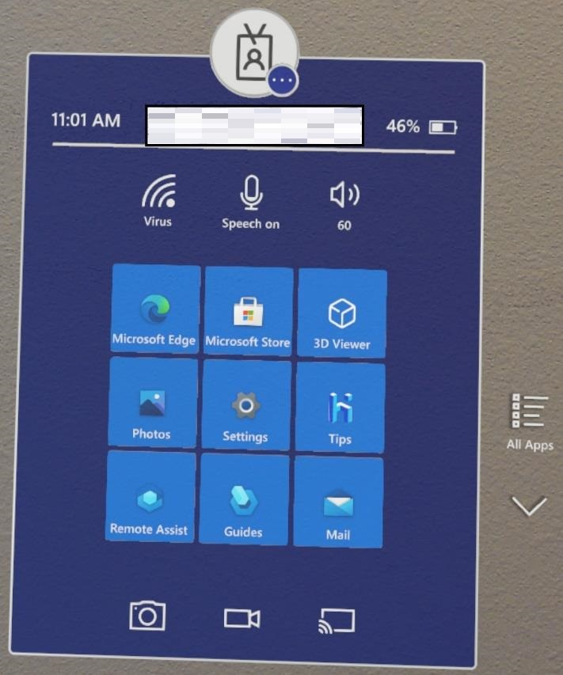
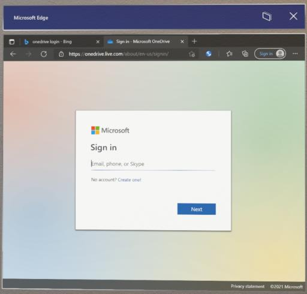
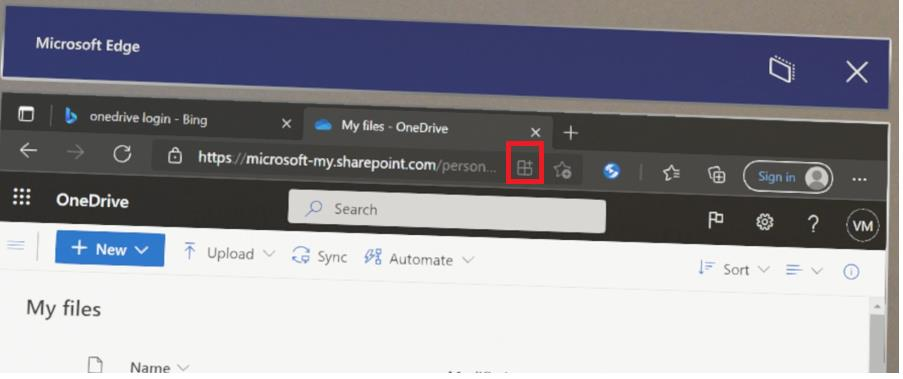
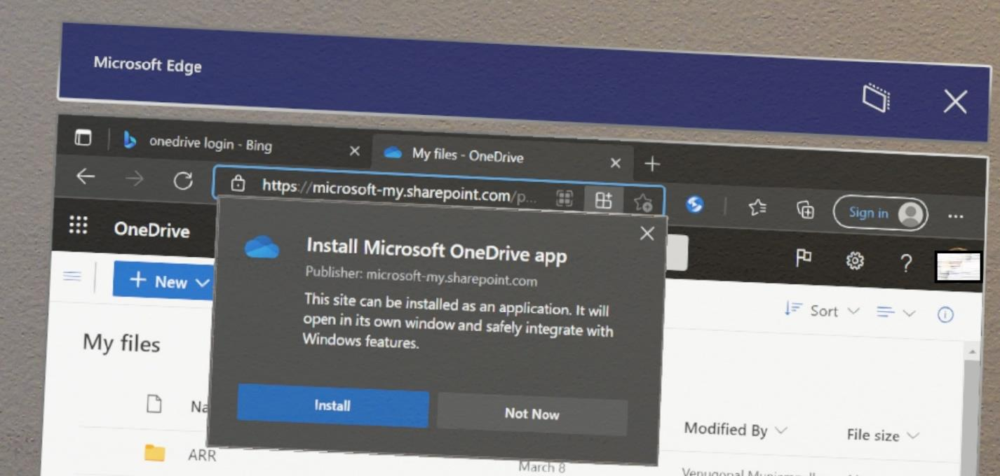
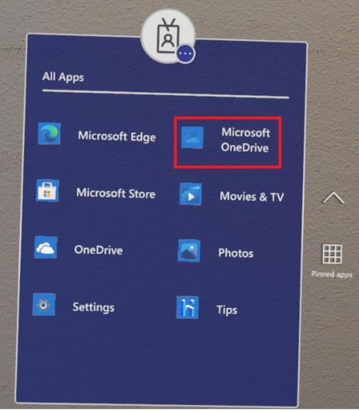
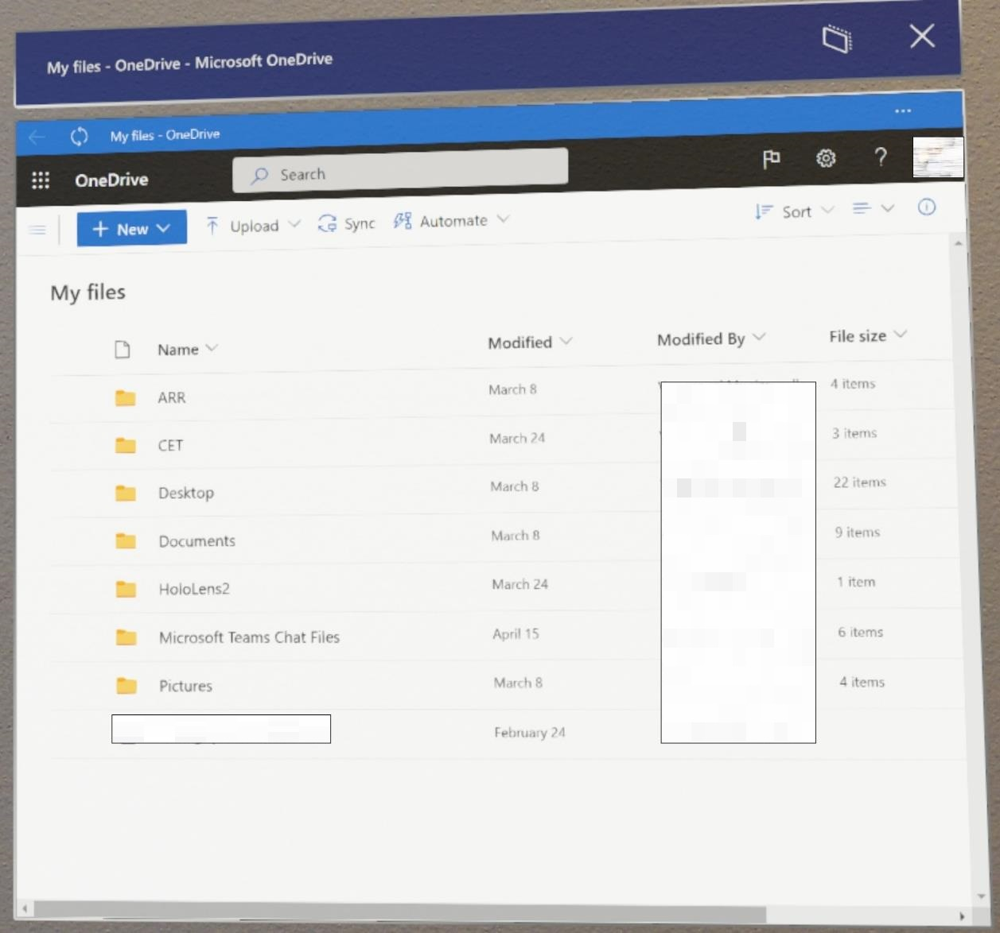

# Find, install, and uninstall applications from the Microsoft Store

The Microsoft Store is your go-to source for apps and games that work with HoloLens. When you go to the Store on your HoloLens, any apps you see there will run on it.

Apps on HoloLens use either 2D view or holographic view. Apps that use 2D view look like windows and can be positioned all around you. Apps that use holographic view surround you and become the only app you see.

HoloLens supports many existing applications from the Microsoft Store, and new apps built specifically for HoloLens.  This article focuses on holographic applications from the Microsoft Store.

To learn more about installing and running custom apps, read [Custom holographic applications](holographic-custom-apps.md).

## Find apps

Open the Microsoft Store from the **Start** menu. Then browse for apps and games. You can use [voice commands](hololens-cortana.md) to search by saying "Search", once the search window opens say "Start dictating" and then when prompted begin saying your search terms.

> [!NOTE]
> The System Requirements for HoloLens devices are based on the architecture of the app build. If an app build for HoloLens (1st gen) has not been updated with to a newer UWP in the store to include the ARM architecture package, then it will not be available for HoloLens 2 devices. Likewise, if a HoloLens 2 app does not include the x86 architecture package, it will not be available for HoloLens (1st gen) devices. HoloLens device architectures:
>
> - x86 = HoloLens (1st gen)
> - ARM = HoloLens 2

> [!NOTE]
> On January 12, 2021 the following apps will reach End of Support on HoloLens devices. We encourage you to use the following link on your device to use the web version of the app.

| App        | Link                                          |
|------------|-----------------------------------------------|
| Excel mobile      | [https://office.live.com/start/Excel.aspx](https://office.live.com/start/Excel.aspx)      |
| Word mobile       | [https://office.live.com/start/Word.aspx](https://office.live.com/start/Word.aspx)       |
| PowerPoint mobile | [https://office.live.com/start/PowerPoint.aspx](https://office.live.com/start/PowerPoint.aspx) |

> [!NOTE]
> The OneDrive app is not currently supported for Azure AD accounts on HoloLens. We recommend downloading the Microsoft OneDrive PWA app. [Follow these steps to download the app.]

## Install apps

To download apps, you'll need to be signed in with a Microsoft account. Some apps are free and can be downloaded right away. For apps that require a purchase, you must be signed in to the Store with your Microsoft account and have a valid payment method.

> [!NOTE]
> The account you use on Microsoft Store does not have to be the same as the account you are signed in with. If you are using a Work or School account on your HoloLens then you may need to sign in with your personal account in the Store App to make a purchase.

> [!TIP]
> To set up a payment method, go to [account.microsoft.com](https://account.microsoft.com/) and select **Payment & billing** > **Payment options** > **Add a payment option**.

1. To open the [**Start** menu](holographic-home.md), perform a [Start gesture](/hololens/hololens2-basic-usage#start-gesture) or [bloom](hololens1-basic-usage.md) gesture on HoloLens (1st gen).

1. Select the Microsoft Store app. After the Store app opens:
   1. Use the search bar to look for applications.
   1. Select essential apps or apps made specifically for HoloLens from one of the curated categories.
   1. On the top right of the Store app, select the **"..."** button and then select **My Library** to view any previously purchased apps.

1. Select **Get** or **Install** on the application's page (a purchase may be required).

### Install Microsoft OneDrive PWA App

Pre-Requisites: User has already joined the HoloLens 2 device to their work tenant.

1. Open start menu and launch Edge browser.

    

1. On your HoloLens go to [https://onedrive.live.com/about/signin](https://onedrive.live.com/about/signin) and enter your Work account credentials

    

1. Once you have successfully logged into your OneDrive web portal, wait for 30 to 60 secs for PWA download button to show up

    

1. Select the PWA download button and install the app

    

1. Close the Edge browser and from the Start menu, select the **All Apps** button and launch the OneDrive PWA App labeled **Microsoft OneDrive**

    

> [!NOTE]
> The “Microsoft OneDrive” is the PWA app where as “OneDrive” is the older UWP.

1. You'll then be able to see your OneDrive files.

    

See also: [Enabling automatic uploads to OneDrive for business](hololens-release-notes.md#onedrive-for-work-or-school-camera-roll-upload)

## Update Apps

To update an app you installed from the Microsoft Store, you can update the app from the Microsoft Store app. For apps installed for the Microsoft Store for Business, you can also update those apps from the Microsoft Store for Business.

1. To open the [**Start** menu](holographic-home.md), perform a [Start gesture](/hololens/hololens2-basic-usage#start-gesture) or [bloom](hololens1-basic-usage.md) gesture on HoloLens (1st gen).

1. Select the Store app.

1. Look to the top right of the Store app.

1. Select the **"..."** or “See more” button.

   > [!div class="mx-imgBorder"]
   > 

1. Select **Downloads and updates**.
    1. If your device has previously identified updates, there may be a down arrow and a number that represents pending updates.

1. Select **Get updates**. Your device will now search for updates and set them to download and install.

   > [!div class="mx-imgBorder"]
   > 

> [!NOTE]
> If the apps on your device were distributed by your organization they can be updated through the same commercial app management methods. If this applies to your situation, read more via our [overview of commercial app deployment.](app-deploy-overview.md)
>
> If you would like to update a custom app that has been sideloaded or deployed, you will need to use the same method with the updated version of your app. To learn more about installing and running custom apps, read [custom holographic applications](holographic-custom-apps.md).

### Automatic app updates

Automatic updates apply to Microsoft Store or Microsoft Store for Business apps, and they can be updated automatically only if they have been installed directly from the Store. If installed from Intune, IT can push updates down from MDM by syncing with the Microsoft Store for Business for the latest available version for the app.

> [!NOTE]
> For apps sourced from the Microsoft Store for Business, you must authenticate with the same tenant that is associated with the Microsoft Store for Business catalog used on the device.

#### How automatic updates work

Automatic app updates are scheduled to occur daily (approximately every 24 hours) subject to network availability. Keep your device either active or plugged into AC to receive updates.

The update process is broken down into phases:  Scan -> Download -> Stage -> Reboot -> Install. Even if updates are downloaded during active daily usage, the process will not resume until the app being updated is no longer in use.

> [!TIP]
> If possible, charge your device overnight while it is connected to the corporate network. If updates can be downloaded and installed overnight, they are less likely to interrupt active device usage.

#### How IT administrators can control automatic updates

IT administrators can control automatic app updates through the [ApplicationManagement/AllowAppStoreAutoUpdate](/windows/client-management/mdm/policy-csp-applicationmanagement.md#applicationmanagement-allowappstoreautoupdate) policy. This policy allows them to enable or disable automatic app updates completely, but it does not control when updates occur.

As of [21H2](hololens-release-notes.md#windows-holographic-version-21h1), IT administrators can also use the [ScheduleForceRestartForUpdateFailures](/windows/client-management/mdm/policy-csp-applicationmanagement.md#applicationmanagement-scheduleforcerestartforupdatefailures) policy to control when apps that were in use, but could not be updated in previous attempts, should be forcibly restarted.

## Uninstall apps

There are three ways to uninstall applications. You can uninstall applications through the Microsoft Store, Start menu or from Settings.

> [!WARNING]
> You can not uninstall a system app or the Microsoft Store itself.

> [!IMPORTANT]
> If your HoloLens 2 has multiple users, you must be logged in as the user who installed the app to uninstall it.

### Uninstall from the Microsoft Store

Open the Microsoft Store from the **Start** menu, and then browse for the application you want to uninstall.  On the Store page, each installed application has an **Uninstall** button.

### Uninstall from the Start menu

On the **Start** menu or in the **All apps** list, browse to the app. Select and hold until the menu appears, then select **Uninstall**.

### Uninstall from Settings

On the **Start** menu, select **Settings > Apps.** Find the app from the list, select it and then click **Uninstall**.

If you are unable to uninstall an app, please file [feedback](/hololens/hololens-feedback) using the Feedback Hub.
