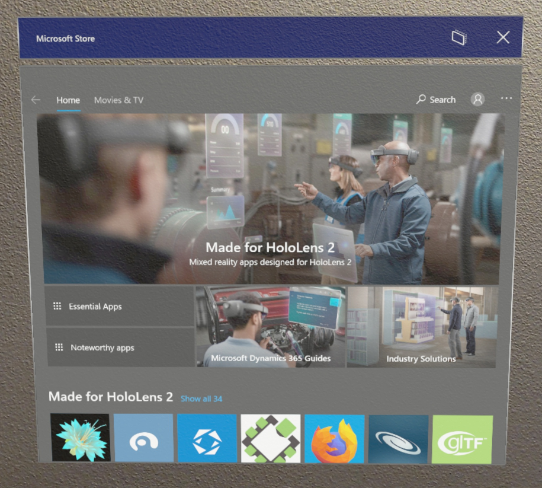
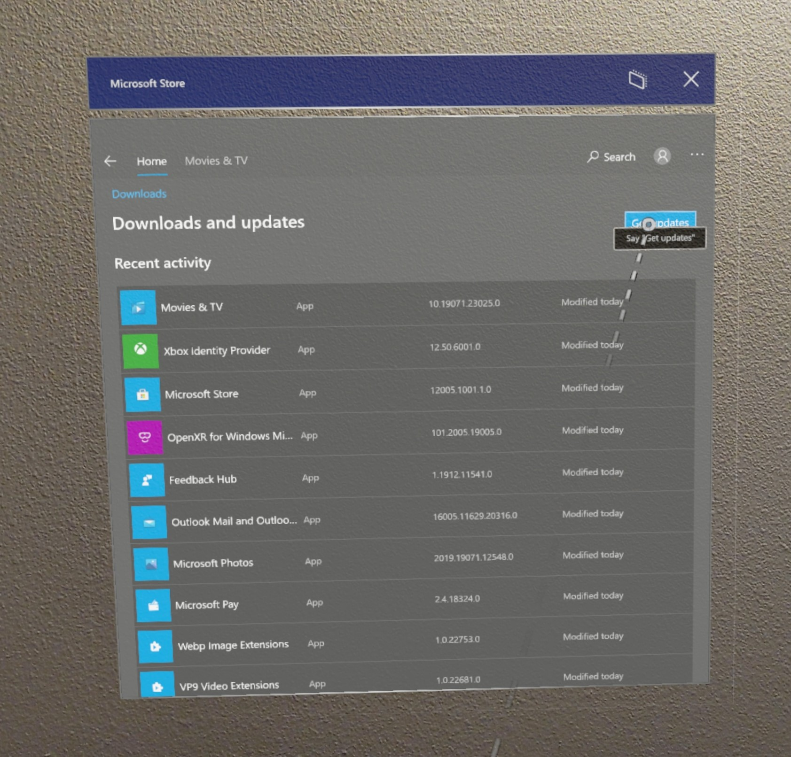

# Find, install, and uninstall applications from the Microsoft Store

The Microsoft Store is your go-to source for apps and games that work with HoloLens. When you go to the Store on your HoloLens, any apps you see there will run on it.

Apps on HoloLens use either 2D view or holographic view. Apps that use 2D view look like windows and can be positioned all around you. Apps that use holographic view surround you and become the only app you see.

HoloLens supports many existing applications from the Microsoft Store, as well as new apps built specifically for HoloLens.  This article focuses on holographic applications from the Microsoft Store.

To learn more about installing and running custom apps, read [Custom holographic applications](holographic-custom-apps.md).

## Find apps

Open the Microsoft Store from the **Start** menu. Then browse for apps and games. You can use [voice commands](hololens-cortana.md) to search by saying "Search", once the search window opens say "Start dictating" and then when prompted begin saying your search terms.

> [!NOTE]
> The System Requirements for HoloLens devices are based on the architecture of the app build. If an app build for HoloLens (1st gen) has not been updated with to a newer UWP in the store to include the ARM architecture package, then it will not be available for HoloLens 2 devices. Likewise, if a HoloLens 2 app does not include the x86 architecture package, it will not be available for HoloLens (1st gen) devices. HoloLens device architectures:
> - x86 = HoloLens (1st gen)
> - ARM = HoloLens 2

> [!NOTE]
> On January 12, 2021 the following apps will reach End of Support on HoloLens devices. We encourage you to use the following link on your device to use the web version of the app.

| App        | Link                                          |
|------------|-----------------------------------------------|
| Excel mobile      | https://office.live.com/start/Excel.aspx      |
| Word mobile       | https://office.live.com/start/Word.aspx       |
| PowerPoint mobile | https://office.live.com/start/PowerPoint.aspx |

## Install apps

To download apps, you'll need to be signed in with a Microsoft account. Some apps are free and can be downloaded right away. Apps that require a purchase require you to be signed in to the Store with your Microsoft account and have a valid payment method.
> [!NOTE]
> The account you use on Microsoft Store does not have to be the same as the account you are signed in with. If you are using a Work or School account on your HoloLens then you may need to sign in with your personal account in the Store App to make a purchase.

To set up a payment method, go to [account.microsoft.com](https://account.microsoft.com/) and select **Payment & billing** > **Payment options** > **Add a payment option**.

1. To open the [**Start** menu](holographic-home.md), perform a [Start gesture](https://docs.microsoft.com/hololens/hololens2-basic-usage#start-gesture) or [bloom](hololens1-basic-usage.md) gesture on HoloLens (1st gen).
1. Select the Microsoft Store app. Once the Store app opens:
   1. Use the search bar to look for any desired applications. 
   1. Select essential apps or apps made specifically for HoloLens from one of the curated categories.
   1. On the top right of the Store app, select the **"..."** button and then select **My Library** to view any previously purchased apps.
1. Select **Get** or **Install** on the application's page (a purchase may be required).

## Update Apps
To update an app you have installed from the Microsoft Store app you can also update the same app from the Microsoft Store app. This also applies to apps installed for Microsoft Store for Business. 
1. To open the [**Start** menu](holographic-home.md), perform a [Start gesture](https://docs.microsoft.com/hololens/hololens2-basic-usage#start-gesture) or [bloom](hololens1-basic-usage.md) gesture on HoloLens (1st gen).
1. Select the Store app.
1. Look to the top right of the Store app. 
1. Select the **"..."** or “See more” button.

   > [!div class="mx-imgBorder"]
   > 

1. Select **Downloads and updates**.
    1. If your device has previously identified updates you may see a down arrow and a number, this represents pending updates.
1. Select **Get updates**. Your device will now search for updates and set them to download and install. 
 
   > [!div class="mx-imgBorder"]
   > 

> [!NOTE]
> If the apps on your device were distrubted by your organization they can be updated through the same commercial app management methods. If this applies to your situation, read more via our [overview of commercial app deployment.](app-deploy-overview.md)
>
> If you would like to update a custom app that has been sideloaded or deployed, you will need to use the same method with the updated version of your app. To learn more about installing and running custom apps, read [custom holographic applications](holographic-custom-apps.md).

## Uninstall apps

There are two ways to uninstall applications.  You can uninstall applications through the Microsoft Store or Start menu.

### Uninstall from the Start menu

On the **Start** menu or in the **All apps** list, browse to the app. Select and hold until the menu appears, then select **Uninstall**.

### Uninstall from the Microsoft Store

Open the Microsoft Store from the **Start** menu, and then browse for the application you'd like to uninstall.  On the Store page, each application that you have installed has an **Uninstall** button.
