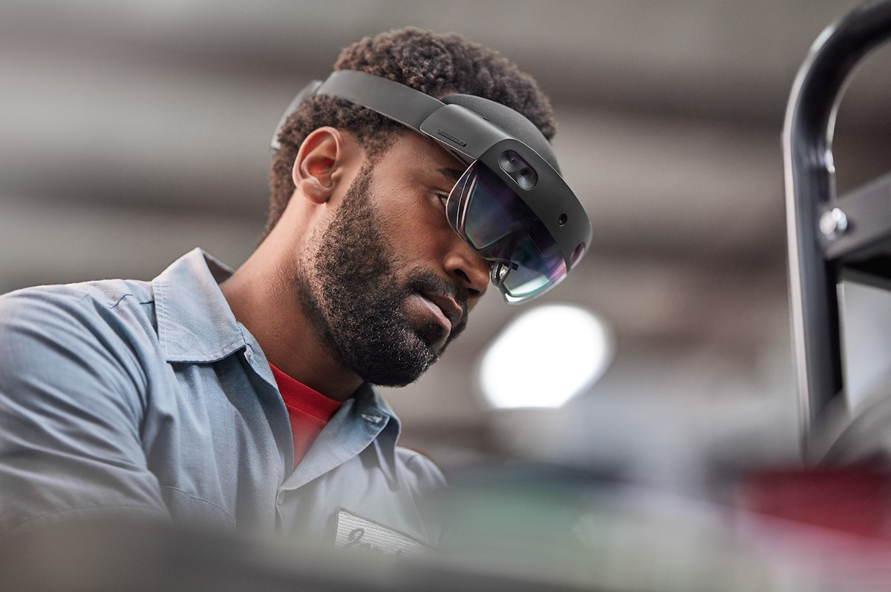
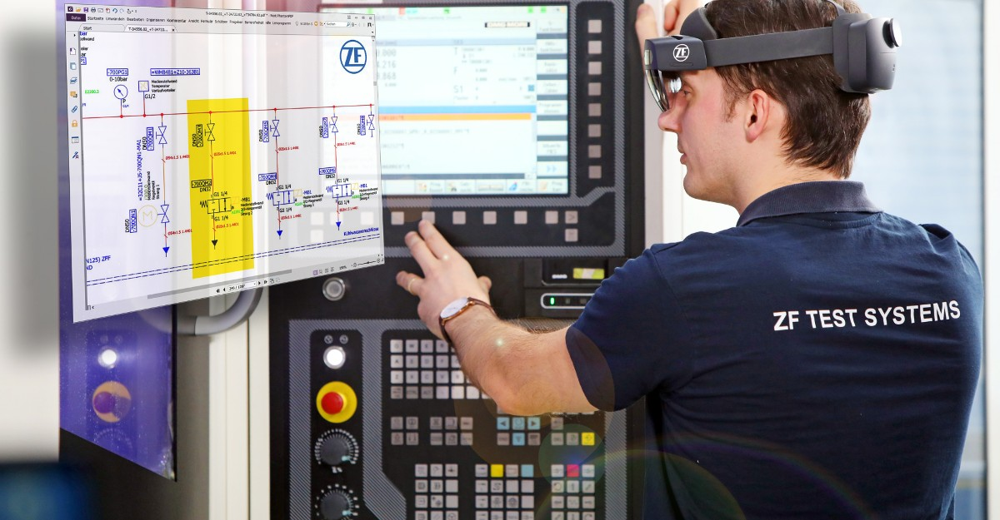
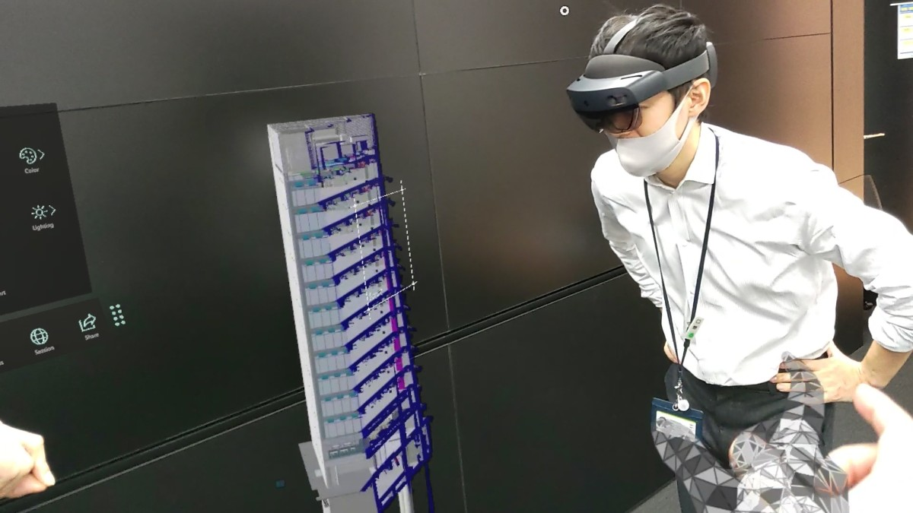
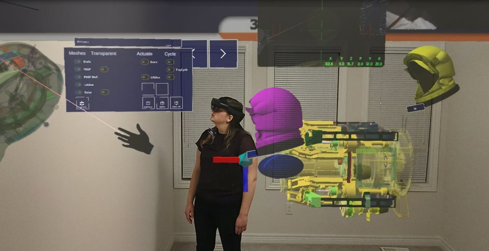

# HoloLens 2 capabilities and solutions

## Why HoloLens?

Thanks to HoloLens 2 and Mixed Reality applications, now workers can collaborate without boundaries, act with precision, and increase productivity.

Collaborate without boundaries and act with precision to increase employee productivity with mixed reality applications on HoloLens 2. Stay engaged heads-up, hands free longer and more comfortably with built-in voice commands, eye tracking, and world-anchoring for continuous focus on safely completing tasks without errors. Connect with remote colleagues in real-time and work together across an extensive holographic canvas overlayed in your physical environment to quickly resolve issues at the point of work. Realize return on investment (ROI) right out of the box with a robust ecosystem of applications that are supported with the security, reliability, and scalability of Microsoft.  

We hope this article inspires you to think of all the ways in which mixed reality (MR) will benefit your business.

> [!NOTE]
> Take advantage of a limited time Microsoft Ignite HoloLens 2 promotion that includes 15% off on HoloLens 2. [Learn more](buy.md)

## HoloLens 2 capabilities

What makes the HoloLens 2 so powerful?

| Feature | Description |
|---------|-------------|
| World-anchoring | Anchored holograms stay precisely in place. HoloLens 2 understands your workspace. So, digital content persists over time – anchored to objects or surfaces where you work. |
| Hand tracking | Touch, grasp, and move holograms in ways that feel natural. HoloLens 2 adapts to your hands for a newfound satisfaction in your interactions. |
| Eye tracking | Enjoy a new level of context and human understanding. HoloLens 2 understands precisely where you’re looking, so it can understand your intent and adapt the holograms to your eyes in real time. |
| Voice enabled | Built-in voice commands allow you to quickly navigate and operate HoloLens 2 when your hands are occupied with a task. |
| Ergonomic | HoloLens 2 is lightweight (3.28 kg) that includes a dial-in fit system to support extended use. |
| Large FoV | Expand your holographic canvas with high resolution, large field-of-view displays. |
| Untethered | Move freely, with no wires or external packs to get your way on the job. |
| Azure-powered | Stream high-fidelity 3D content that can be anchored to a location and/or object that persists across users with Azure mixed reality services.
| Mixed reality capture | Document an experience as a photo or a video to share with others in real time. |
| Windows Hello for Business | Iris-based biometric authentication gets you quickly and securely into the flow of work. |
| Windows Autopilot | Set up and pre-configure services for HoloLens 2 so they're ready to use right out of the box across distributed worksites. |
| OS Updates | Keep secure with monthly servicing updates and take advantage of new productivity and manageability capabilities in bi-annual releases. |
| Easily Manage devices | Manage multiple HoloLens 2 devices simultaneously using solutions like Microsoft Intune, VMware Workspace One, MobileIron, and many more. |
| Operate in regulated environments | HoloLens 2 has an extensive device portfolio that supports highly regulated environments including environments designated ISO Class 5.0 and UL Class I, Division 2. |

[!INCLUDE [solutions](includes/hlsolutions.md)]

## How HoloLens 2 is transforming industries

:::row:::
    :::column:::
        
    :::column-end:::
    :::column span="2":::
        ### [Eaton’s Vehicle Group uses Dynamics 365 mixed reality to drive savings, efficiencies.](https://customers.microsoft.com/en-us/story/1406696349549504197-eaton-vehicle-group-dynamics-365-mixed-reality)
        "When you describe a problem, imagine that we are speaking different languages. When you explain it, someone on the other side may not understand precisely what's happening, but when you show it in real time with the HoloLens, people understand."   - Alexandre M. Moraes: Plant Manager at Eaton.
    :::column-end:::
:::row-end:::

---

:::row:::
    :::column:::
        
    :::column-end:::
    :::column span="2":::
        ### [Sheba Medical Center uses Microsoft’s HoloLens for ventilators training.](https://customers.microsoft.com/en-us/story/1388628932382960935-sheba-health-provider-azure-en-israel)
        The staff at Sheba Medical Center used HoloLens to train nurses and other support personnel on the use of ventilator machines that were being deployed by the hundreds during the COVID-19 pandemic.
    :::column-end:::
:::row-end:::

---

:::row:::
    :::column:::
        
    :::column-end:::
    :::column span="2":::
        ### [ZF builds agile facility at Gray Court with Microsoft 365, improves operational equipment efficiency.](https://customers.microsoft.com/en-us/story/1341470537472393895-zfgroup-gray-court-chapter-automotive-microsoft365)
        For ZF Group, Microsoft 365 helps its employees to share knowledge, troubleshoot, and communicate in real time. 
    :::column-end:::
:::row-end:::

---

:::row:::
    :::column:::
        
    :::column-end:::
    :::column span="2":::
        ### [Tokyu Construction improves engineering precision and increases productivity with Azure Remote Rendering on HoloLens 2.](https://customers.microsoft.com/en-us/story/1333933369626897988-tokyu-construction-manufacturing-azure-holo-lens-2)
        Unless you’re a trained architectural engineer, it can be challenging to look at a 2D blueprint and visualize what a building will actually look like in 3D. 
    :::column-end:::
:::row-end:::

---

:::row:::
    :::column:::
        
    :::column-end:::
    :::column span="2":::
        ### [MDA takes mixed reality into orbit with HoloLens 2.](https://customers.microsoft.com/en-us/story/1377057233739728271-mda-manufacturing-hololens-canada)
        MDA uses immersive mixed reality experiences to help engineers visualize designs, accelerate diagnostic issues, and train astronauts and ground controllers.
    :::column-end:::
:::row-end:::
 

---

## Managing HoloLens 2 in your organization

HoloLens 2 includes features that make it easier for organizations to manage and use HoloLens devices. Some features are included with the device while others can be enabled by [Mobile Device Management (MDM) for HoloLens](hololens-mdm-configure.md)  or through [Provisioning Packages](hololens-provisioning.md) using [Windows Configuration Designer](app-deploy-provisioning-package.md#setup).

| I want to... | Solution | Description |  
|---------| ------------|------------|
Manage how my end users sign in | [**Identity**](hololens-identity.md) | HoloLens 2 supports several kinds of user identities - Azure Active Directory (AAD), Microsoft Account (MSA), and local accounts.  |
| Encrypt user data | [**Data security**](security-encryption-data-protection.md) | BitLocker data encryption is enabled on HoloLens 2 to provide the same level of security protection as any other Windows device. | 
Manage HoloLens devices in my organization | [**Mobile Device Management**](hololens-mdm-configure.md) | Manage settings, select apps to install and set security configurations tailored to your organization's need on multiple HoloLens 2 devices from a central location. | 
|Minimize setup time for new users and devices | [**Autopilot**](hololens2-autopilot.md) | Configure the out-of-box experience (OOBE) in Microsoft Endpoint Manager and enable end users to prepare devices for business use with little to no interaction. |  
| Control OS updates for my devices | [**Windows Update for Business**](hololens-updates.md#managing-updates-by-using-windows-update-for-business) | Windows Update for Business provides controlled operating system updates to devices and support for the long-term servicing channel. |  
| Allow specific and LOB apps to be downloaded |[**Application Management**](app-deploy-overview.md) | Choose how to distribute and control apps for selected groups of HoloLens 2 users. | 
| Show or hide specific apps on your start menu |[**Kiosk mode**](hololens-kiosk.md) | Configure HoloLens 2 to function as a fixed-purpose device for use in app demos or dedicated business apps. 
| Secure my environment by locking down apps | [**WDAC**](windows-defender-application-control-wdac.md) | Windows Defender Application Control (WDAC) blocks apps and processes from being launched by the device user.
| Manage device security with rules for apps and processes | [**Policies (CSPs)**](hololens-csp-policy-overview.md) | IT Admins can define and implement policy settings using an existing list of supported Policy CSPs on HoloLens 2. |  
| Manage how a device connects to the internet | [**Network and Connectivity**](hololens-certificates-network.md) | Use certificate-based authentication to access Wi-Fi, VPNs, or internal resources. | 
| Share the device with multiple users | [**Auto-Customized Display**](hololens-calibration.md#auto-eye-position-support) | HoloLens 2 displays are automatically adjusted with Auto Eye Position (AEP), eliminating the need to run a manual calibration process when the device is [shared between users](hololens-multiple-users.md). |

Learn about [Licensing Requirements](hololens-licenses-requirements.md) for the above solutions.

## Next Steps
> [!div class="nextstepaction"]
> [Explore HoloLens 2 options](hololens2-options.md)

> [!div class="nextstepaction"]
>[Planning HoloLens 2 deployment](hololens-requirements.md) 