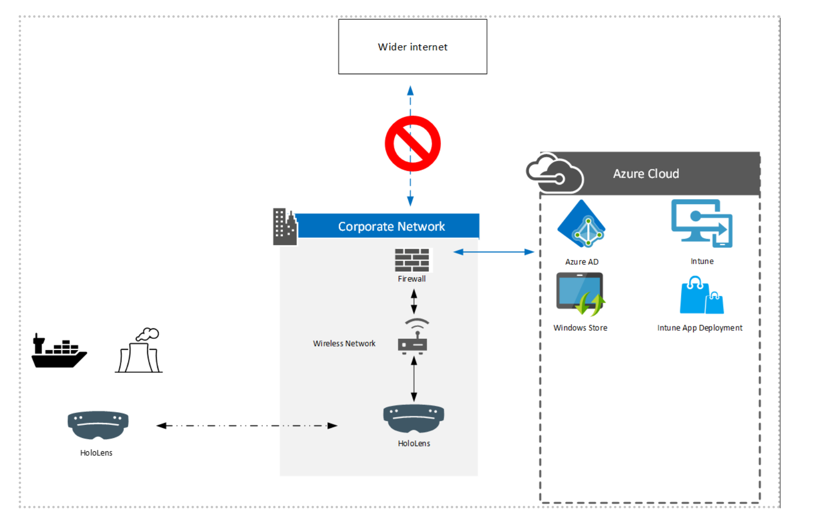

# Common Scenarios – Near Offline or Isolated Environments for HoloLens 2

## Overview

This guide provides guidance for deploying HoloLens 2 in areas where networking is restricted, either for secure environments or using the device in areas where networking cannot be assured such as power plants, ships, or other areas.

This scenario is designed to deliver the best user and administrator experience. This scenario allows for the use of Azure AD, Intune, Windows updates and multiple user support with IRIS sign-in, whilst meeting the needs of organizations who have additional security or networking challenges.

> [!NOTE]
> This scenario describes one possible approach. We expect each organization deploying in this scenario will have unique requirements, which can be mapped into this solution as required.

## Prepare

The cloud functionality of this guide matches the requirements for the [Cloud Connected Scenario](hololens2-cloud-connected-prepare.md). The following decisions will need to be made with reference to both your infrastructure and security teams.

### Determine level of cloud connectivity required

This guide assumes the following services are being used:

1. Azure AD for user sign in and authentication
1. Azure AD Multi-Factor Authentication and Windows Hello for Business
1. Autopilot for device deployment
1. Intune for Device Management
1. Windows Update for Device Updates

> [!NOTE]
> If these services are already used within your organization, then your security team may be able to reuse any security assessments already completed.

### Determine level of network connection during usage

Consider whether or not devices will be connected to a network during usage:

- If devices are able to be connected, then more services can be used such as D365 Remote Assist or D365 Guides.
- LOB applications can be developed to use local data storage either on device, or on a server contained within the organizations network.

### Governance processes for User Enrollment and Updates

- Users will need to make their initial sign into the device when connected to the network. After setting up their PIN and IRIS, they can sign in offline.
- Devices should be reconnected at a regular schedule (once a month) to enable any MDM policy changes and Windows updates to be completed.

### Network Configurations

Detailed network configurations are out of the scope of this article, and will vary depending on unique configuration needs.

- Firewalls should support URL based filtering, as IP filtering may be difficult to manage.
- Proxy Servers, with or without SSL inspection can be utilized, either in transparent mode or configured on the device.
- Devices will need to be able to access the relevant endpoints listed in the tables below.

> [!NOTE]
> It is likely that during initial configuration, a network engineer will need to validate the endpoints are accessible.

> [!IMPORTANT]
> [Deployment Guide – Corporate connected HoloLens 2 with Dynamics 365 Guides - Prepare | Microsoft Docs](hololens2-corp-connected-prepare.md)

## Configure

The key configuration elements relate to the network restrictions. Following our Connected HoloLens 2 [Deployment Guide – Cloud connected HoloLens 2 deployment at scale with Remote Assist - Configure | Microsoft Docs](hololens2-cloud-connected-configure.md) will allow for most cloud configurations to be completed.

The key [endpoints](hololens-offline.md) to enable access on your network are:

|Group                                  |   Purpose                                              |
|---------------------------------------|--------------------------------------------------------|
|Near Offline Setup                     |   Initial OOBE                                         |
|Azure AD MFA                           |   MFA Requests (Optional if not using Azure MFA)       |
|Intune and MDM Configurations          |   Intune Enrollment (Optional if not using Intune)      |
|Certificates                           |   Check Microsoft Certificate Status                   |
|Device Metadata                        |   Device Information                                   |
|Diagnostic Data                        |   Sending Telemetry to Microsoft (Strongly Recommended)|
|Licensing                              |   Validate software licensing                          |
|Network Connection Status Indicator    |   Used to confirm whether the device has network access|
|Windows Defender                       |   Used to update Windows Defender Information          |
|Windows Update                         |   Used for Windows Update                              |
|Settings                               |   Used in the Settings Application                     |

> [!TIP]
> These are the key endpoints to utilize Autopilot, complete OOBE and allow an AAD User to sign in with Windows Hello for Business. Your organization may require other endpoints to allow for the desired functionality. 

## Deploy and maintain
Deployment and Maintenance steps are identical to the Cloud connected guide.

> [!div class="nextstepaction"]
> [Cloud connected deployment - Deploy](hololens2-cloud-connected-deploy.md)
