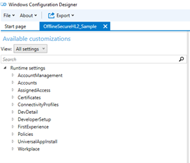
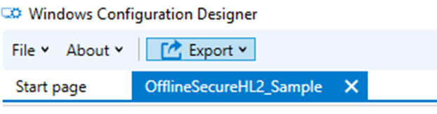
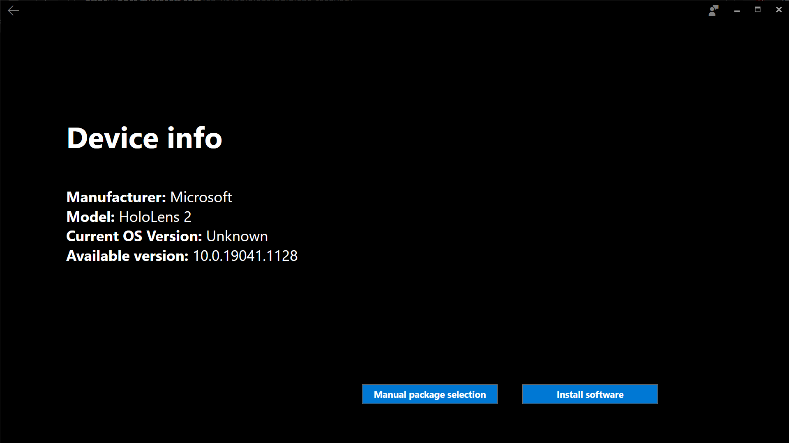
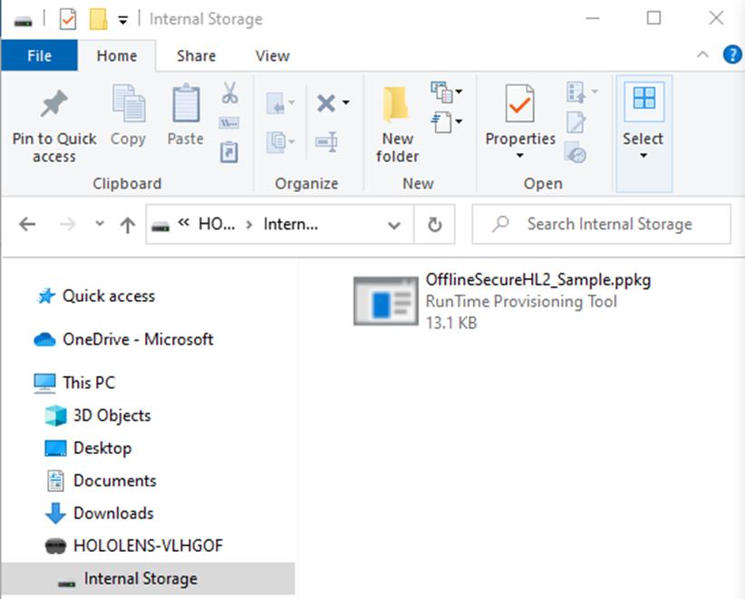

# Common Scenarios – Offline Secure HoloLens 2

## Overview

This guide provides guidance for applying a sample Provisioning Package that will lock down a HoloLens 2 for use in secure environments with the following restrictions:

-	Disable WiFi.
-	Disable BlueTooth.
-	Disable Microphones.
-	Prevents adding or removing provisioning packages.
-	No user can enable any of the above restricted components.

## Prepare

Windows 10 PC Setup
1. [Download the latest HoloLens 2 OS file](https://aka.ms/hololens2download) directly to a PC. 
   1. Support for this configuration is included in Build 19041.1117 and above.
1. Download/Install the Advanced Recovery Companion(ARC) tool [from the Microsoft Store](https://www.microsoft.com/store/productId/9P74Z35SFRS8) to your PC
1. Download/Install the latest [Windows Configuration Designer (WCD)](https://www.microsoft.com/p/windows-configuration-designer/9nblggh4tx22?activetab=pivot:overviewtab) tool from the Microsoft Store to your PC.
1. [Download the OfflineSecureHL2_Sample folder with the project files](https://aka.ms/HoloLensDocs-SecureOfflineSample) to build the PPKG.
1. Prepare your offline [Line of Business application for PPKG deployment](app-deploy-provisioning-package.md). 

## Configure

Build a Secure Configuration Provisioning Package

1. Launch the WCD tool on your PC.
1. Select **File -> Open project**.
  1. Navigate to the location of the previously saved OfflineSecureHL2_Sample folder, and select: OfflineSecureHL2_Sample.icdproj.xml
1. The project should open and you should now have a list of Available Customizations:

   > [!div class="mx-imgBorder"]
   > 

Configurations set in this provisioning package:

|     Item                                                |     Setting                       |     Description                                                                                                                    |
|---------------------------------------------------------|-----------------------------------|------------------------------------------------------------------------------------------------------------------------------------|
|     Accounts / Users                                    |     Local User Name & Password    |     For these offline devices, a single user name and password will need to be set and shared by all users of the device.          |
|     First Experience / HoloLens / SkipCalibration       |     True                          |     Skips calibration during initial device setup only                                                                             |
|     First Experience / HoloLens / SkipTraining          |     True                          |     Skips device training during initial device setup                                                                              |
|     First Experience / HoloLens / WiFi                  |     True                          |     Skips Wi-Fi config during initial device setup                                                                                 |
|     Policies/Connectivity/AllowBluetooth                |     No                            |     Disables Bluetooth                                                                                                             |
|     Policies/Experience/AllowCortana                    |     No                            |     Disables Cortana (to eliminate potential problems since the microphones are disabled)                                          |
|     Policies/MixedReality/MicrophoneDisabled            |     Yes                           |     Disables Microphone                                                                                                            |
|     Policies/Privacy/LetAppsAccessLocation              |     Force deny                    |     Prevents Apps from trying to access Location data (to eliminate potential problems since the Location tracking is disabled)    |
|     Policies/Privacy/LetAppsAccessMicrophone            |     Force deny                    |     Prevents Apps from trying to access Microphones (to eliminate potential problems since the Microphones are disabled)           |
|     Policies/Security/AllowAddProvisioningPackage       |     No                            |     Prevents anyone from adding provisioning packages that might attempt to override locked down policies.                         |
|     Policies/Security/AllowRemoveProvisioningPackage    |     No                            |     Prevents anyone from removing this locked down provisioning package.                                                           |
|     Policies/System/AllowLocation                       |     No                            |     Prevents the device from trying to track location data.                                                                        |
|     Policies/WiFi/AllowWiFi                             |     No                            |     Disables Wi-Fi                                                                                                                 |

4. Under Runtime Settings, Select **Accounts / Users / UserName: Holo / Password**
    - Note the password and reset if desired.
5. Navigate to UniversalAppInstall / UserContextApp and [configure the LOB app](app-deploy-provisioning-package.md) you will be deploying to these devices.

   > [!div class="mx-imgBorder"]
   > 

6. Once complete, select the “Export” button and follow all prompts until your provisioning package is created.

   > [!div class="mx-imgBorder"]
   > 

## Deploy

1. Connect the HL2 to your Windows 10 PC via USB cable.
1. Launch the ARC tool and select **HoloLens 2**

   

1. On the next screen select **Manual package selection**.

   

1. Navigate to the previously downloaded .ffu file, and select **Open**.
1. At the Warning page select **Continue**.

   

1. Wait for the ARC tool to complete the HoloLens 2 OS install.
1. Once the device completes the install and boots back up, from your PC navigate to File Explorer and copy the previously saved PPKG file over to the device folder.

   > [!div class="mx-imgBorder"]
   > 

1. On the HoloLens 2, press the following button combo to run the Provisioning Package: Tap **Volume Down** and **Power Button** at the same time.
1. You will be prompted to apply the Provisioning Package, select **Confirm**
1. Once the provisioning package completes select **OK**.
1. You should then be prompted to sign into the device with the shared local account and password.

## Maintain

With this configuration, it is recommended to restart the process above and reflash the device with the ARC tool and apply a new PPKG to make any updates to the OS and/or application(s).
