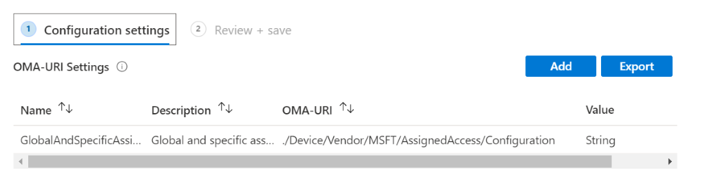

# Global Assigned Access – Kiosk

This feature configures Hololens 2 device for multiple app kiosk mode which is applicable at system level, has no affinity with any identity on the system and applies to everyone who signs into the device. 

> [!NOTE]
> This feature is currently only avalible in Windows Insider builds. If you would like to try this feature before it is generally avalible in HoloLens releases please read more about [Windows Insider](hololens-insider.md) builds.
 
## How to use this in Intune? 

> [!NOTE]
> Please be aware of the areas marked with "<!-". These areas will require you to make modifications based on your preferences. 

1.	Create a custom OMA URI device configuration profile as follows and apply it to HoloLens device group: 

    URI value: .Device/Vendor/MSFT/AssignedAccess/Configuration
   
    > [!div class="mx-imgBorder"]
    > 

2.	For value, update and paste following content: 

    :::code language="xml" source="samples/global-assigned-access.xml" highlight="12-13,23":::

## How to use this in Windows Configuration Designer? 
 
1.	Update and save XML blob mentioned above as XML file. 

2.	Follow the steps in [Use a provisioning package to set up a single-app or multi-app kiosk](https://docs.microsoft.com/hololens/hololens-kiosk#use-a-provisioning-package-to-set-up-a-single-app-or-multi-app-kiosk), specifically the section "Prov. package, step 2 – Add the kiosk configuration XML file to a provisioning package" and refer to the XML file that was saved in the previous step. 

## Can I create a configuration where global applies to everyone and separate configuration applies to 1 AAD account or AAD group? 

Yes, please refer to the example XML blob below. Global Assigned Access profile is applied on Hololens when a specific one for the signed in user is not found, so it is default kiosk mode configuration for signed-in user. 
Here is an example of XML blob to be used: 

> [!NOTE]
> Please be aware of the highlighted areas marked with `<!-`. These areas will require you to make modifications based on your preferences. 

 :::code language="xml" source="samples/exclude-one-aad-user-or-group.xml" highlight="8,11,17":::

## Excluding DeviceOwners from Global Assigned Access Profile

This feature allows a user who is considered “[Device owner](security-adminless-os.md)" on Hololens to be excluded from Global Assigned Access. In order to take advantage of this feature, in the XML blob for multiple-app kiosk configuration, ensure highlighted lines are added: 

 :::code language="xml" source="samples/exclude-device-owners-from-global.xml" highlight="6,16-18":::
 
