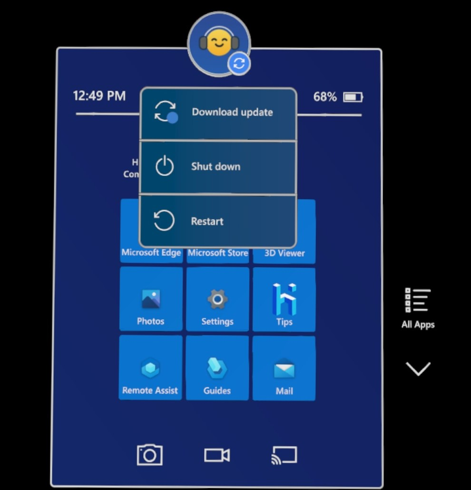

# Insider preview for Microsoft HoloLens

Welcome to the latest Insider Preview builds for HoloLens! It's simple to [get started](hololens-insider.md#start-receiving-insider-builds) and provide valuable feedback for our next major operating system update for HoloLens.

We recommend that for organizations that have moved, or are moving towards a scale production deployment, that a subset of test devices is kept on Insider builds to validate that new features and new builds work as expected.

## Windows Insider Release Notes

Looking for a new feature but don't see it? Check out the [release notes](hololens-release-notes.md) as many of our new features have been released as part of the main builds.

> [!NOTE]
> In order to receive these features on your devices they will need to be in the [Dev channel](#start-receiving-insider-builds).

> [!IMPORTANT]
> This next update is on a newer code base than what is currently generally available. Once you update a device to it, you won't be able to have your device update to our monthly releases until they catch up with the same codebase. Although if need be, you can still flash your device to go back.

| Feature   | Description  | User or Scenario | Available in build |
|-----------|--------------|------------------|---|
| [Reboot CSP enabled and related changes](#reboot-csp-enabled-and-related-changes) | Weekly schedules reboots (and other options) supported on HoloLens. | IT Admin | 10.0.22621.1051 |
| [Update available notification](#update-available-notification) | Shows user that update is available when looking at the start menu. | End User | 10.0.22621.1051 |
| [Autopilot reset experience](#autopilot-reset-experience) | Improvements in Autopilot reset experience, to enable users to reset HoloLens 2 and restart Autopilot without requiring manual flashing.| IT Admin  | 10.0.22621.1008 |
| [Biometrics disclosure screen](#biometrics-disclosure-screen) | Displays information to all new users on what the device uses. | All | 10.0.22621.1008 |
| [Clean up users on device](#clean-up-users-on-device) | New policies to manage when to clear out users on the device, to prevent hitting the maximum limit.  | IT Admin  | 10.0.22621.1008 |
| [Fixes improvements](#fixes-improvements)  | Fixes and improvements for HoloLens.  | All   | 10.0.22621.1006 |

✔️ If you need to delete users from your HoloLens automatically then check out how to [manage users on device](#clean-up-users-on-device). <br>
✔️ If you'd like your HoloLens devices to automatically [reboot on a schedule](#reboot-csp-enabled-and-related-changes) set this policy.

### Reboot CSP enabled and related changes

In addition to scheduling single daily reboots [Reboot CSP](/windows/client-management/mdm/reboot-csp), now also supports weekly reboots.

#### How to use this in Intune?

1. Create a custom OMA URI device configuration profile as follows and apply it to HoloLens device group:


2. For OMA-URI field specify either of following as desired:

```
./Device/Vendor/MSFT/Reboot/Schedule/Single
./Device/Vendor/MSFT/Reboot/Schedule/DailyRecurrent
./Device/Vendor/MSFT/Reboot/Schedule/WeeklyRecurrent
```

3. For data type field choose “String”.
1. For value field, enter a date value indicating starting date, e.g., 2023-01-06T10:35:00. Setting DailyRecurrent will schedule reboots starting at given date and time every day. Similarly setting WeeklyRecurrent will schedule reboots starting at given date and time every 7 days.

> [!NOTE]
> Setting both DailyRecurrent and WeeklyRecurrent configurations on same device is not supported.
>
> Setting Reboot CSP through “Settings catalog” will be supported soon, until then please refer to using custom OMA-URI.
>
> Actual time of the reboot will be around 2 minutes later than the time set in the configuration. E.G. If you specify 10:00, the reboot will occur at 10:02. This is expected and intentional, this delay is present for operations preserving state and communication.  

### Update available notification

Having devices up to date is important. With this new update you'll now be able to see on your device when an update is available to download. This is in addition to the previous feature to see when updates are ready to install. Similar to desktop devices, when an update is available you'll see a blue update circle, this icon on HoloLens is located near your user icon. Selecting your user icon will open the user context menu, and from here you'll be able to select **Download update**. This will launch the Settings app and take you directly to the updates page where it will display the available update which you can download.



### Autopilot reset experience

In certain Autopilot failure scenarios on HoloLens 2, if "Allow users to reset device if installation error occurs." setting in ESP configuration is set to "Yes", "Reset device" button will be displayed on HoloLens 2. If "Reset device" button is selected by the user, HoloLens 2 will automatically reboot, reset operating system and OOBE experience after delay of approximately 1 minute. This improvement will enable users to begin Autopilot experience again without requiring a manual flash of HoloLens 2 devices.

### Biometrics disclosure screen

We've added changed one of our OOBE screens to show information on device usage of head, hand, and eye usage to users before they go through calibration. This screen isn't skipped when configuring a device to skip calibration, so all new users on a device will see it.

:::image type="content" alt-text="This is a screenshot of the Biometrics OOBE window." source="images/biometrics-oobe-notification.jpg":::

### Clean up users on device

Organizations with scaled deployments of HoloLens 2 devices may encounter the 64-user limit on the device, which will prevent additional users from being able to use the device. To address this situation, we've added controls allow the least recently used users to be deleted from the device at controlled intervals (something you have may have used on Desktop). This can also be useful for other reasons, which include increased security be removing least recently used accounts, or speeding up the Iris scanning processes on the sign-in screen (fewer users to match means a faster comparison.) We've enabled new methods to control when to clean up least recently used users.

There are three triggers that can delete users:

- On a regular schedule determined by you.
- At storage threshold percentage determined by you.
- Delete the oldest user when you add more than your custom maximum number of users.

Here's how to get started:

1. Enable the process: **UserProfileManagement/EnableProfileManager**
    1. Bool value, set to **True**
1. Set the inactivity threshold: **UserProfileManagement/ProfileInactivityThreshold**
    1. This is the number of days until a user is deleted.
        - Default value is 30.
1. Set when to delete users based on free space on device **UserProfileManagement/StorageCapacityStartDeletion**
    1. This determines at what percentage of free space left on the device that it'll start deleting users.
        - Default value is 25%.
        - Pair with StorageCapacityStopDeletion, to determine when to stop deleting profiles based on free storage percent.
1. Turn on the deletion policy **UserProfileManagement/DeletionPolicy**, and set it to **2**, which deletes for both threshold and inactive users.

If Profile Management is enabled then the oldest user will automatically be deleted when it has reached its maximum number of users and trying to add another.

To learn more about these policies, visit [AccountManagement CSP](/windows/client-management/mdm/accountmanagement-csp).

### Fixes improvements

- It will be possible to issue an app uninstall command in the device context using EnterpriseModernAppManagement CSP.
- Added the ability to uninstall apps in the device context.

## Start receiving Insider builds

1. If you haven’t updated recently, please reboot your device to update state and get the latest build.
   1. The “Reboot device” voice command works well.
   1. You can also choose the restart button in Settings/Windows Insider Program.
1. On a HoloLens 2 device go to **Settings** > **Update & Security** > **Windows Insider Program** and select **Get started**.
1. Link the account you used to register as a Windows Insider.

> [!TIP]
> Once you enroll a device into Insider builds it is highly suggested you keep a set of test devices enrolled in Insider builds. This allows your organization to more easily validate builds as they come out. This makes for an easier experience and helps incase your normal production devices are blocked from insider builds.

> [!NOTE]
> In order to enroll your device in Insider builds, you'll need to enable optional telemetry. If you have not done this already, open the Settings app and select **Privacy** > **Diagnostics & feedback** and then select **Optional diagnostics data**.

Windows insider is now moving to Channels. The **Fast** ring will become the **Dev Channel**, the **Slow** ring will become the **Beta Channel**, and the **Release Preview** ring will become the **Release Preview Channel**. Here’s what that mapping looks like:


For more information, see [Introducing Windows Insider Channels](https://blogs.windows.com/windowsexperience/2020/06/15/introducing-windows-insider-channels) on Windows Blogs.
Then, select **Active development of Windows**, choose whether you'd like to receive **Dev Channel** or **Beta Channel** builds, and review the program terms.
Select **Confirm > Restart Now** to finish up. After your device has rebooted, go to **Settings > Update & Security > Check for updates** to get the latest build.

### Update error 0x80070490 work-around

If you encounter an update error 0x80070490 when updating on the Dev or Beta channel, try the following short-term work-around. It involves moving your insider channel, picking up the update and then moving your Insider channel back.

#### Stage one - Release Preview

1. Settings, Update & Security, Windows Insider Program, select **Release Preview Channel**.

2. Settings, Update & Security, Windows Update, **Check for updates**. After the update, continue on to Stage two.

#### Stage two - Dev Channel

1. Settings, Update & Security, Windows Insider Program, select **Dev Channel**.

2. Settings, Update & Security, Windows Update, **Check for updates**.

## FFU download and flash directions

To test with a flight signed `.ffu`, you first have to flight unlock your device prior to flashing the flight signed ffu.

1. On PC:
    1. Download `.ffu` to your PC from [https://aka.ms/hololenspreviewdownload](https://aka.ms/hololenspreviewdownload).

    1. Install ARC (Advanced Recovery Companion) from the Microsoft Store: [https://www.microsoft.com/store/productId/9P74Z35SFRS8](https://www.microsoft.com/store/productId/9P74Z35SFRS8).

1. On HoloLens - Flight Unlock: Open **Settings** > **Update & Security** > **Windows Insider Program** then sign up, reboot device.

1. Flash FFU - Now you can flash the flight signed FFU using ARC.

### Provide feedback and report issues

Please use [the Feedback Hub app](hololens-feedback.md) on your HoloLens to provide feedback and report issues. Using Feedback Hub ensures that all necessary diagnostics information is included to help our engineers quickly debug and resolve the problem.  Issues with the Chinese and Japanese version of HoloLens should be reported the same way.

> [!NOTE]
> Be sure to accept the prompt that asks whether you'd like Feedback Hub to access your Documents folder (select **Yes** when prompted).

## Note for developers

You're welcome and encouraged to try developing your applications using Insider builds of HoloLens.  Check out the [HoloLens Developer Documentation](https://developer.microsoft.com/windows/mixed-reality/development) to get started. Those same instructions work with Insider builds of HoloLens.  You can use the same builds of Unity and Visual Studio that you're already using for HoloLens development.

## Stop receiving Insider builds

If you no longer want to receive Insider builds of Windows Holographic, you can opt out when your HoloLens is running a production build, or you can [recover your device](hololens-recovery.md) using the Advanced Recovery Companion to recover your device to a non-Insider version of Windows Holographic.

> [!CAUTION]
> There is a known issue in which users who un-enroll from Insider Preview builds after manually reinstalling a fresh preview build would experience a blue screen. Afterwards they must manually recover their device. For full details on if you would be impacted or not, please view more on this [Known Issue](hololens-troubleshooting.md#blue-screen-after-unenrolling-from-insider-preview-on-a-device-flashed-with-an-insider-build).

To verify that your HoloLens is running a production build:

1. Go to **Settings > System > About**, and find the build number.

1. [See the release notes for production build numbers](hololens-release-notes.md).

To opt out of Insider builds:

1. On a HoloLens running a production build, go to **Settings > Update & Security > Windows Insider Program**, and select **Stop Insider builds**.

1. Follow the instructions to opt out your device.
