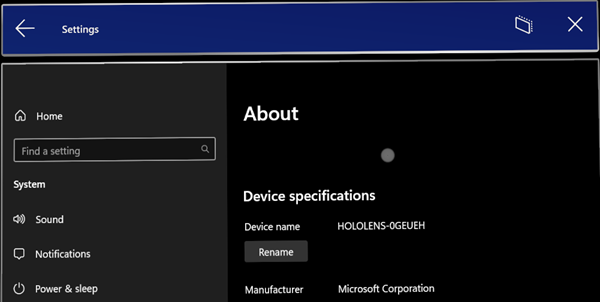

# Insider preview for Microsoft HoloLens

Welcome to the latest Insider Preview builds for HoloLens! [Get started](#start-receiving-insider-builds) and provide valuable feedback on HoloLens for our next major operating system update.

> [!TIP]
>
> Organizations that have moved, or are moving toward, production deployment at scale should keep a subset of test devices on Insider builds to validate new features and builds.

## Windows Insider release notes

Looking for a new feature but don't see it? We released many new features as part of the main builds. Check out the [release notes](hololens-release-notes.md) if you think a feature might be missing.

> [!NOTE]
> Only devices in the [Dev channel](#start-receiving-insider-builds) receive these Insider build features.

> [!IMPORTANT]
>
> This next update is on a newer codebase than what currently is available in the main builds. After you update a device to this build, your device won't update to our monthly releases until those releases catch up to the newer codebase. If necessary, you can still flash your device to go back to the general release.

| Feature   | Description  | User or scenario | Available in build |
|-----------|--------------|---|---|
|[App-Exclusive Mode is now available](#app-exclusive-mode-now-available)| The "App-Exclusive" mode allows applications to run in a fresh environment, free from degradation in tracking accuracy. | Developer | 10.0.22621.1217|
|[Rename HoloLens 2 device](#rename-hololens-2-device)| HoloLens 2 devices can now be renamed from the Settings app. | All| 10.0.22621.1217 |
|[Start Menu gesture settings in MDM](#start-menu-gesture-settings-in-mdm)| A new policy is available to configure start menu gesture settings. | IT Admin | 10.0.22621.1217|
|[Policies to block USB Peripherals on HoloLens 2](#policies-to-block-usb-peripherals)| HoloLens 2 devices can now be locked down to prevent the use of USB peripherals. | IT Admin| 10.0.22621.1217|
|[Domain name suggested during sign-in](#domain-suggested-during-signin)| During sign-in, the domain name will be auto-populated to save time.| All | 10.0.22621.1217|
|[New policy for Windows Hello Provisioning behavior](#windows-hello-behavior-with-fido2-policy) | This new policy can be used to control Windows Hello provisioning behavior for users signed in with FIDO2 security keys.| IT Admin| 10.0.22621.1212 |
|[New policy for Sign-in app default screen](#signin-app-default-screen-policy) | This new policy can be used to control the default screen shown when the Sign-in app launches to show Other User.| IT Admin| 10.0.22621.1212 |
|[Hand tracking improvements](#hand-tracking-improvements) | Hand tracking is now more reliable when aiming at the floor. | All | 10.0.22621.1205 |
|[Font and IME improvements](#font-and-ime-improvements) | Several simplified Chinese fonts and the Microsoft Pinyin Input Method Editor (IME) now support GB18030-2022. | All | 10.0.22621.1205 |
|[Support for NFC readers](#support-for-nfc-readers) | Users can now login to their devices using their security badge with an NFC reader. | All | 10.0.22621.1205 |
|[Fixes improvements](#fixes-and-improvements)  | Additional fixes and improvements for HoloLens. | All   | 10.0.22621.1205 |

### App-Exclusive Mode now available

HoloLens constantly builds an internal representation of the physical environment, called "Device Shared" tracking mode, to maintain hologram stability and positions across sessions. However, environmental changes can cause inaccuracies in tracking over time, which is problematic for applications with high accuracy requirements. To address this, a new "App-Exclusive" tracking mode has been introduced with a set of APIs (exposed through Microsoft OpenXR's plugin for Unity as of August 9th). The "App-Exclusive" mode allows applications to run in a fresh environment, free from degradation in tracking accuracy and issues an "app-exclusive session token" for resuming the application's specific map in future sessions. 

Two limitations of the "App-Exclusive" mode are that only one such mode can exist at a time, erasing previous data, and the disk storage is limited to one-third of "Device Shared" mode. However, the smaller limit is still sufficient for most applications. 

The target scenario for "App-Exclusive" mode is applications with high accuracy requirements and task-oriented workflows. Examples include precise hologram alignment with real-world objects and 3D model editing without persistence needs. 

To use the new tracking mode APIs, a Fall 2023 HoloLens OS update is required. Earlier versions do not support the "App-Exclusive" mode.

### Rename HoloLens 2 device

HoloLens 2 devices can now be renamed by going to the About page of the Settings app. Users or IT Admins can choose the “Rename” button and follow the prompts to create a new name for their device.  A combination of letters, hyphens and numbers can be used.  

A confirmation screen will be displayed when the device has been successfully renamed.

The device will need to be rebooted for the renaming change to take effect.

### Start menu gesture settings in MDM

IT Admins can now control Start Menu gesture settings on managed HoloLens 2 devices through MDM via a new set of Start Menu gesture policies.

#### EnableStartMenuWristTap

This policy controls if the Start menu can be opened by tapping the start icon on the wrist.  It is managed via [custom OMA-URI](/mem/intune/configuration/custom-settings-windows-10) policy:

- URI value: ./Vendor/MSFT/Policy/Config/MixedReality/EnableStartMenuWristTap

| Policy | Description | Configurations |
| -------- | -------- | -------- |
| MixedReality/EnableStartMenuWristTap | Allows the Start menu to be opened with a wrist tap | 0 (Disabled), 1 (Enabled, default)

#### RequireStartIconVisible

This policy controls whether it is required that the user looks at the Start icon when it is tapped in order to open the Start menu.  It is managed via [custom OMA-URI](/mem/intune/configuration/custom-settings-windows-10) policy:

- URI value: ./Vendor/MSFT/Policy/Config/MixedReality/RequireStartIconVisible

| Policy | Description | Configurations |
| -------- | -------- | -------- |
| MixedReality/RequireStartIconVisible | Controls whether the user looks at the Start icon to open the Start menu | 0 (Disabled, default), 1 (Enabled)

#### RequireStartIconHold

This policy controls whether it is required that the Start icon is pressed for two seconds to open the Start menu.  It is managed via [custom OMA-URI](/mem/intune/configuration/custom-settings-windows-10) policy:

- URI value: ./Vendor/MSFT/Policy/Config/MixedReality/RequireStartIconHold

| Policy | Description | Configurations |
| -------- | -------- | -------- |
| MixedReality/RequireStartIconHold | Controls whether the Start icon is pressed for two second to open the Start menu | 0 (Disabled, default), 1 (Enabled)

#### EnableStartMenuSingleHandGesture

This policy controls whether the Start menu can be opened by pinching the thumb and index finger while looking at the Start icon on the wrist.  It is managed via [custom OMA-URI](/mem/intune/configuration/custom-settings-windows-10) policy:

- URI value: ./Vendor/MSFT/Policy/Config/MixedReality/EnableStartMenuSingleHandGesture

| Policy | Description | Configurations |
| -------- | -------- | -------- |
| MixedReality/EnableStartMenuSingleHandGesture | Controls whether the Start menu can be opened by pinching the thumb and index finger while looking at the Start icon | 0 (Disabled), 1 (Enabled, default)

#### EnableStartMenuVoiceCommand

This policy controls whether using voice commands can be used to open the Start menu.  It is managed via [custom OMA-URI](/mem/intune/configuration/custom-settings-windows-10) policy:

- URI value: ./Vendor/MSFT/Policy/Config/MixedReality/EnableStartMenuVoiceCommand

| Policy | Description | Configurations |
| -------- | -------- | -------- |
| MixedReality/EnableStartMenuVoiceCommand | Controls whether voice commands can be used to open the Start menu | 0 (Disabled), 1 (Enabled, default)

### Policies to block USB peripherals

You may want to lock down your HoloLens 2 devices to prevent the use of USB Ethernet dongles or USB Flash drives.  Several DeviceInstall MDM policies have been enabled in this update to allow IT Admins to configurate device driver installation policies.  In order to take effect, the policies must be applied prior to connecting the USB Peripherals.  It is recommended that these policies be configured either after the device is reset or on a clean, reflashed device.

#### DeviceInstall_Removable_Deny

This policy allows you to prevent HoloLens 2 from installing removable devices.  It is managed via [custom OMA-URI](/mem/intune/configuration/custom-settings-windows-10) policy:

- URI value: ./Device/Vendor/MSFT/Policy/Config/ADMX_DeviceInstallation/DeviceInstall_Removable_Deny

| Policy | Data Type| Value|
| -------- | -------- | -------- |
| Config/ADMX_DeviceInstallation/DeviceInstall_Removable_Deny | String | '<enabled/><data id="DenyRemovableDevices" value="1"/>'

Please refer to [DeviceInstall_Removable_Deny](/windows/client-management/mdm/policy-csp-admx-deviceinstallation#deviceinstall_removable_deny) for details.

#### EnableInstallationPolicyLayering

This policy changes the evaluation order in which Allow and Prevent policy settings are applied when more than one install policy setting is applicable for a given device. Enable this policy setting to ensure that devices listed in the AllowInstallationOfMatchingDeviceIDs policy are allowed to install even if the DeviceInstall_Removable_Deny policy is enabled. It is managed via [custom OMA-URI](/mem/intune/configuration/custom-settings-windows-10) policy: 

- URI value: ./Device/Vendor/MSFT/Policy/Config/DeviceInstallation/EnableInstallationPolicyLayering

| Policy | Data Type| Value|
| -------- | -------- | -------- |
| Config/DeviceInstallation/EnableInstallationPolicyLayering | String | '<enabled/><data id="AllowDenyLayered" value="1"/>'

Please refer to [EnableInstallationPolicyLayering](/windows/client-management/mdm/policy-csp-deviceinstallation#enableinstallationpolicylayering) for details.

#### AllowInstallationOfMatchingDeviceIDs

This policy specifies a list of Plug and Play hardware IDs and compatible IDs for devices that HoloLens 2 is allowed to install. This policy is intended to be used only when the EnableInstallationPolicyLayering policy setting is enabled.  It is managed via [custom OMA-URI](/mem/intune/configuration/custom-settings-windows-10) policy: 

- URI value: ./Device/Vendor/MSFT/Policy/Config/DeviceInstallation/AllowInstallationOfMatchingDeviceIDs

| Policy | Data Type| Value|
| -------- | -------- | -------- |
| Config/DeviceInstallation/AllowInstallationOfMatchingDeviceIDs | String | '<enabled/><data id="DeviceInstall_IDs_Allow_List" value="your_allowed_device_ids"/>'

Please refer to [AllowInstallationOfMatchingDeviceIDs](/windows/client-management/mdm/policy-csp-deviceinstallation#allowinstallationofmatchingdeviceids) for details.

### Domain suggested during signin

During the sign-in process, if PreferredAadTenantDomainName MDM policy is set on HoloLens 2, the tenant domain name will be suggested to the user to speed up the login process and save time.  Users will still have the option to type in a different tenant domain name if desired.

### Windows Hello behavior with FIDO2 policy

To simplify user account setup, users sign-in to their HoloLens 2 with FIDO2 security keys are no longer required to go through Iris and PIN enrollment during OOBE. To support users requiring Iris and/or PIN as alternative sign-in options to FIDO2 security keys, a new policy, EnableWindowsHelloProvisioningForSecurityKeys, has been added to the PassportForWork CSP to control Windows Hello Provisioning behavior. If this policy is enabled on HoloLens 2, the device will start Iris and PIN enrollments after new users sign-in to their devices with FIDO2 security keys.  It is managed via [custom OMA-URI](/mem/intune/configuration/custom-settings-windows-10) policy:  

- URI value: ./Device/Vendor/MSFT/PassportForWork/{TenantId}/Policies/EnableWindowsHelloProvisioningForSecurityKeys   

| Policy | Data Type| Value|
| -------- | -------- | -------- |
| MSFT/PassportForWork/{TenantId}/Policies/EnableWindowsHelloProvisioningForSecurityKeys | bool| False (default), True

### Signin app default screen policy 

In environments where devices are shared between multiple people and not everyone has enrolled in Iris sign-in, it may be preferable to always show the Other User screen so a user picking up the device can quickly start the sign-in process. For example, in an environment where everyone uses their FIDO2 security keys to sign in, it would be preferable to start on the Other User screen instead of having to find the correct user first.

To help with this scenario, we added a new MDM policy: PreferLogonAsOtherUser. When this policy is enabled, the HoloLens Sign-in app will show the Other User screen by default when the app starts. 

- URI value: ./Device/Vendor/MSFT/Policy/Config/MixedReality/PreferLogonAsOtherUser  

| Policy | Data Type| Value|
| -------- | -------- | -------- |
| Config/MixedReality/PreferLogonAsOtherUser   | Int | 0 (Disabled, default), 1 (Enabled)

### Hand tracking improvements 

Hand tracking system has been improved so that tracking is more reliable when aiming down at objects on the floor.

### Font and IME improvements

This update improves several simplified Chinese fonts and the Microsoft Pinyin Input Method Editor (IME) to support GB18030-2022. You can enter and display characters from conformance level 1 or 2 using the additions to Microsoft Yahei, Simsun, and Dengxian. This update now supports Unicode Extensions E and F in the Simsun Ext-B font. This meets the requirements for level 3.  These improvements are in-line with what has been released to the Windows 11 Build Release Preview Channel.  More details can be found on the [Windows Insiders blog](https://blogs.windows.com/windows-insider/2023/06/20/releasing-windows-11-build-22621-1926-to-the-release-preview-channel/).

### Support for NFC readers

The next Insider Preview flight for HoloLens will include the ability for users to take advantage of NFC Readers.  Using a USB-C NFC reader, the HoloLens 2 device can be integrated with NFC FIDO2 cards as supported by Azure AD. For users in clean room environments, or where ID Badges contain FIDO technology, this can enable a “Tap & PIN” experience for HoloLens Sign on.  This feature enables a faster sign-in experience for users.

#### USB NFC reader support

USB-CCID (Chip Card Interface Device) compatible NFC FIDO2 readers with USB base class ‘0B’ and subclass ‘00’ are supported. Please refer to [Microsoft Class Drivers for USB CCID Smart Cards](/previous-versions/windows/hardware/design/dn653571(v=vs.85)) for details on Microsoft class driver for USB CCID devices.  To determine if your NFC reader is compatible with HoloLens, you may either refer to the documentation provided by the reader's manufacturer, or use the Device Manager on your PC, as follows:

1.	Plug in the USB NFC reader to a Windows PC.
2.	In Device Manager, locate the reader device and right click on it and select Properties.
3.	In Details tab, select "Compatible Ids" properties and check if "USB\Class_0b&SubClass_00" is in the list.

Whether you sign into a device you have used before or a new device, please follow these steps to sign in with an NFC reader:

1.	From the “Other User” screen, enter the FIDO Key / Tap the NFC Key against the reader.
2.	Enter the FIDO PIN.
3.	Press the button on the FIDO Key / Tap the NFC Key against the reader again.
4.	The Device logs in.

      a.	Note:  if the user is new to the device, the Single Biometric Disclosure Screen will be displayed.
5.	Start Menu then appears.

### Fixes and improvements

- Fixed an issue where specific pages were not showing / hiding correctly in PageVisibility MDM policy (Windows 11 builds only).
- Fixed an issue where swipe to type on the virtual keyboard was not working correctly (Windows 11 builds only).
- Fixed an issue where the "Reset" button was not showing in the case of an Autopilot failure that occurred before reading the ESP configuration.
- Minor updates were made to the virtual keyboard, including optimization of the keyboard suggestions that are presented to users and improved audio feedback while typing.
- Prior to this update, users were often unclear when dictation from the virtual keyboard was available.  Users now see a spinning icon while dictation is being initiated and the dictation tip to begin speaking is only displayed once dictation is available.

## Start receiving Insider builds

This section explains the steps to prepare devices and then the steps to receive Insider builds.
> [!TIP]
>
> Once you enroll a device into Insider builds, we strongly recommend that your organization keeps a set of test devices enrolled, too. With a set of test devices, your organization can validate builds more easily as they come out. Timely and efficient validation creates an easier experience and helps if your normal production devices are blocked from Insider builds.

> [!NOTE]
>
> Windows Insider is moving to Channels. The **Fast** ring will become the **Dev Channel**, the **Slow** ring will become the **Beta Channel**, and the **Release Preview** ring will become the **Release Preview Channel**. Here’s how that mapping looks:
>
> :::image type="content" alt-text="Screenshot of the Windows Insider Channels explanation." source="./images/WindowsInsiderChannels.png":::
>
> For more information, see [Introducing Windows Insider Channels](https://blogs.windows.com/windowsexperience/2020/06/15/introducing-windows-insider-channels) on[ Windows Blogs](https://blogs.windows.com/).

### Prerequisites

These steps explain what to do before you sign up for Insider builds. 

1. Enable telemetry. Normally optional, telemetry is required to enroll your device in Insider builds.

   1. In the **Settings app** > **Privacy** > **Diagnostics & feedback** > **Optional diagnostics data**.

   1. **Enable** telemetry.

1. Get the latest build. Reboot your device using one of two methods:
     - Use the voice command "Reboot device."
     - Choose the restart button in Settings.

### Access the Windows Insider Program and check for updates

1. On a HoloLens 2 device, go to **Settings** > **Update & Security** > **Windows Insider Program** > **Get started**.

1. Link to the account you used to register as a Windows Insider.

1. Select **Active development of Windows**.

1. Choose whether you'd like to receive **Dev Channel** or **Beta Channel** builds.

1. Review and accept the program terms.

1. Select **Confirm** > **Restart Now**. Your device will reboot.

1. Go to **Settings** > **Update & Security** > **Check for updates** to get the latest build.

### Update error 0x80070490 workaround

If you encounter update error 0x80070490 when updating on the Dev or Beta channel, try the following short-term workaround. It involves moving your Insider channel, picking up the update, and then moving your Insider channel back.

#### Stage one - Release Preview

1. Select **Settings** > **Update & Security** > **Windows Insider Program** > **Release Preview Channel**.

1. Select **Settings** > **Update & Security** > **Windows Update** > **Check for updates**.

1. Accept any available update. After the update, continue to Stage two.

#### Stage two - Dev Channel

1. Select **Settings** > **Update & Security** > **Windows Insider Program** > **Dev Channel**.

1. Select **Settings** > **Update & Security** > **Windows Update** > **Check for updates**.

1. Accept any available update.

## FFU download and flash directions

1. To test with a flight signed `.ffu`, flight unlock your device prior to flashing the flight signed FFU:

   - On a PC:
      1. Download `.ffu` to your PC from [https://aka.ms/hololenspreviewdownload](https://aka.ms/hololenspreviewdownload).
      1. Install [ARC (Advanced Recovery Companion) from the Microsoft Store](https://www.microsoft.com/store/productId/9P74Z35SFRS8): [https://www.microsoft.com/store/productId/9P74Z35SFRS8](https://www.microsoft.com/store/productId/9P74Z35SFRS8).

   - On HoloLens:
      1. Open **Settings** > **Update & Security** > **Windows Insider Program**.
      1. Sign up.
      1. Reboot the device.

1. Flash FFU. Now you can flash the flight signed FFU using ARC.

## Provide feedback and report issues

Use [the Feedback Hub app](hololens-feedback.md) on your HoloLens to provide feedback and report issues. Feedback Hub helps you include the necessary diagnostics information to help our engineers quickly debug and resolve any problem. Report issues with the Chinese and Japanese versions of HoloLens the same way.

> [!NOTE]
>
> Be sure to select **Yes** when a prompt asks whether you'd like Feedback Hub to access your documents folder.

## Note for developers

You're welcome and encouraged to try developing your applications using Insider builds of HoloLens. Check out the [HoloLens Developer Documentation](https://developer.microsoft.com/windows/mixed-reality/development) to get started. Those instructions also work with Insider builds for HoloLens. Use the same builds for Unity and Visual Studio that you're already using for HoloLens development.

## Stop receiving Insider builds

If you no longer want to receive Insider builds of Windows Holographic, you have two options:

- Opt out on a HoloLens running a production build:
   1. Go to **Settings** > **Update & Security** > **Windows Insider Program** > **Stop Insider builds**.
   1. Follow the instructions to opt out your device.

- Use the ARC to [recover your device](hololens-recovery.md) to a non-Insider version of Windows Holographic.

> [!CAUTION]
>
> A known issue causes users who un-enroll from the Windows Insider program, and then manually install a fresh Insider preview build, to experience a blue screen. Afterward, the user must recover the device manually. Learn more about this [Known Issue](hololens-troubleshooting.md#blue-screen-after-unenrolling-from-insider-preview-on-a-device-flashed-with-an-insider-build).
>
> To verify that your HoloLens is running a production build:
>
> 1. Locate the build number through **Settings** > **System** > **About**.
> 1. [Check the build number against the release notes for production build numbers](hololens-release-notes.md).

