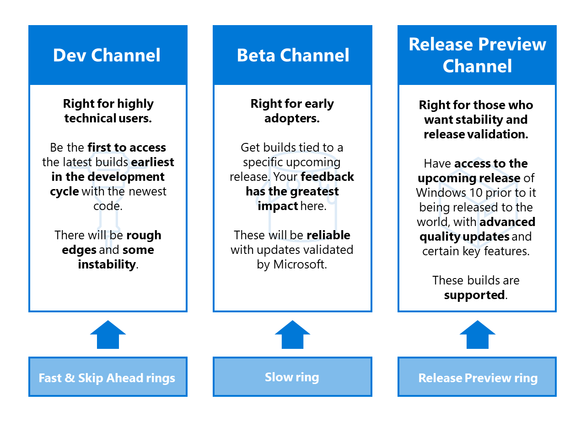
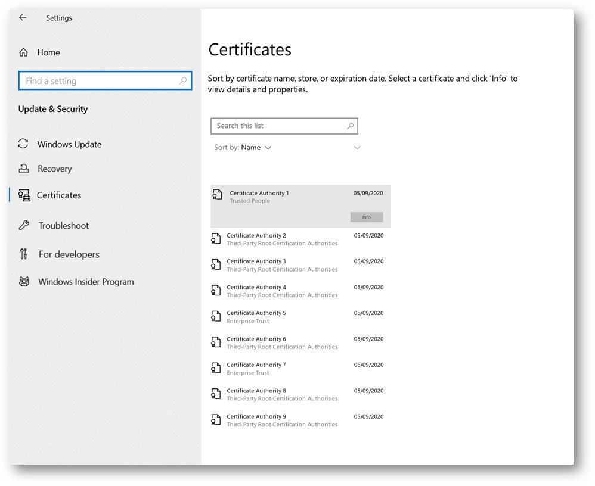
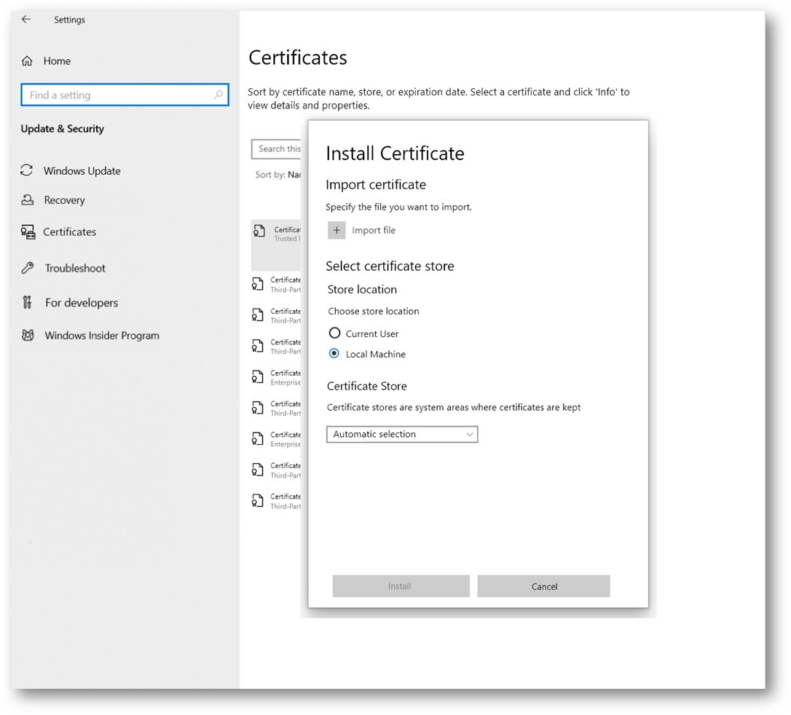
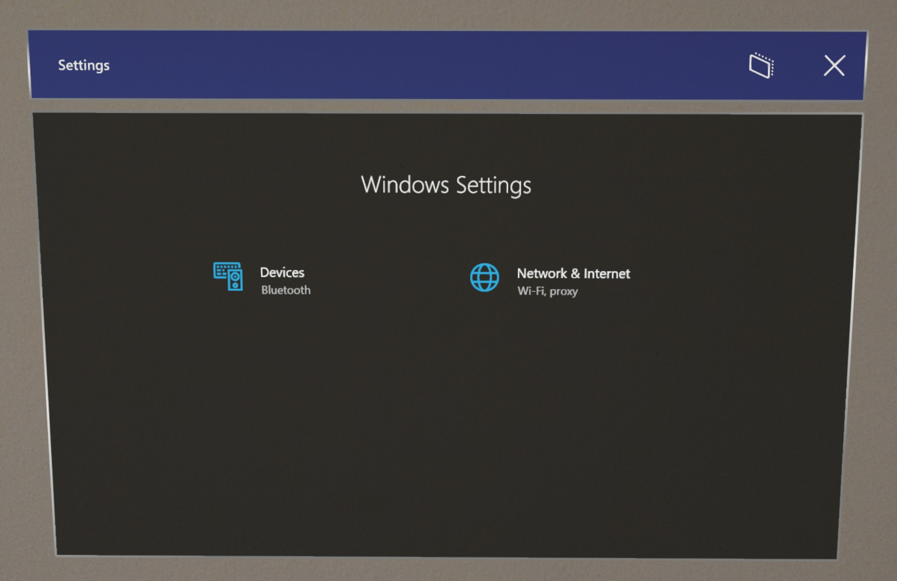
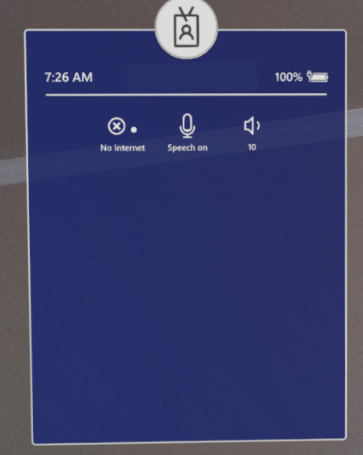

# Insider preview for Microsoft HoloLens

Welcome to the latest Insider Preview builds for HoloLens!  It's simple to get started and provide valuable feedback for our next major operating system update for HoloLens.

Windows insider is now moving to Channels. The **Fast** ring will become the **Dev Channel**, the **Slow** ring will become the **Beta Channel**, and the **Release Preview** ring will become the **Release Preview Channel**. Here is what that mapping looks like:



For more information, see [Introducing Windows Insider Channels](https://blogs.windows.com/windowsexperience/2020/06/15/introducing-windows-insider-channels) on Windows Blogs.

## Windows Insider Release Notes

If you are looking for a feature that is no longer listed here, then it is now generally available. Please review the [release notes](hololens-release-notes.md) to see what build has the feature(s) you are excited for. Make sure to [update your HoloLens](hololens-update-hololens.md) to get all the latest features.

We'll be updating this page with new features again as we release them to Windows Insider builds.

| Feature                                              | Description                                                                                   | Available in insider builds |
|------------------------------------------------------|-----------------------------------------------------------------------------------------------|-----------------------------|
| Auto Eye Position Support                            | Actively finds eye positions and enables accurate hologram positioning.                       | 19041.1339+                 |
| Certificate Viewer                                   | View user and device certificates in the Settings app.                                        | 19041.1346+                 |
| Install and Remove Certificates                      | Users can install and remove certificates using the Certificate Viewer.                       | 19041.1361+                 |
| Auto launch provisioning from USB                    | OOBE Automaticly detects provisioning packages on USB drives.                                 | 19041.1361+                 |
| Auto confirm provisioning packages in OOBE           | Automatically apply provisioning packages in OOBE.                                            | 19041.1361+                 |
| Wi-Fi connection and using Autopilot                 | Use autopilot from device Wi-Fi without need for ethernet adapter.                            | 19041.1364+                 |
| HoloLens Policies                                    | New policies for mixed reality devices.                                                       | 19041.1349+                 |
| Cache AAD Group membership for offline Kiosk         | Policy for how many days AAD group membership cache is allowed to be used for Kiosk mode.     | 19041.1356+                 |
| New device restriction policies for HoloLens 2       | Device management policies enabled newly enabled for HoloLens 2.                              | 19041.1349+                 |
| New power policies for HoloLens 2                    | Newly supported policies for power timeout settings.                                          | 19041.1349+                 |
| Update Policies                                      | Newly enabled policies allowing control of updates.                                           | 19041.1352+                 |
| Enabled Settings page visibility for HoloLens 2      | Policy to pick which pages are seen in Settings app.                                          | 19041.1349+                 |
| Global Assigned Access                               | Configure HoloLens 2 device for multiple app kiosk mode which is applicable at system level.  | 19041.1356+                 |
| Auto launch an app in multi-app kiosk                | Sets an application to launch automatically when signing into into a multiple-app kiosk mode. | 19041.1346+                 |
| Visitor Auto logon for Kiosks                        | Enables the auto logon on Visitor accounts to be used for Kiosk modes.                        | 19041.1361+                 |
| Kiosk mode behavior changes for handling of failures | Changes in how Kiosk mode failure is now handled.                                             | 19041.1356+                 |
| Improvements and fixes in the update                 | Additional fixes in the update.                                                               | 19041.1361+                 |

### Auto Eye Position Support

In HoloLens 2, eye positions enable accurate hologram positioning, comfortable viewing experience and improved display quality. Eye positions are computed as part of the eye tracking result. However, this requires each user to go through eye tracking calibration, even when the experience does not require eye gaze input.

**Auto Eye Position (AEP)** enables these scenarios with an interaction-free way to compute eye positions for the user.  Auto Eye Position starts working in the background automatically from the moment the user puts the device on. If the user does not have a prior eye tracking calibration, Auto Eye position will start providing the user's eye positions to the display system after a small processing time. This processing time typically is between 20 - 60 seconds. The user data is not persisted on the device and hence this process is repeated if the user takes off and puts the device back on or if the device reboots or wakes up from sleep.  

There are a few system behavior changes with Auto Eye Position feature when an uncalibrated user puts on the device. An uncalibrated user refers to someone who has not gone through the eye tracking calibration process on the device previously.

|     Active Application                           |     Current Behavior                                   |     Behavior from Windows Insider   build 19041.1339+                                                      |
|--------------------------------------------------|--------------------------------------------------------|------------------------------------------------------------------------------------------------------------|
|     Non-gaze enabled app or Holographic Shell    |     Eye tracking calibration prompt is displayed.    |     No prompt is displayed.                                                                                |
|     Gaze enabled app                             |     Eye tracking calibration prompt is displayed.    |     Eye tracking calibration prompt is   displayed only when the application accesses eye gaze stream.     |

 If the user transitions from a non-gaze enabled application to one that accesses the gaze data, the calibration prompt will be displayed. There will be no changed to Out Of Box Experience flow. 
 
For experiences that require eye gaze data or very precise hologram positioning, we recommend uncalibrated users to run eye tracking calibration from the eye tracking calibration prompt or by launching the Settings app from the start menu, and then selecting **System > Calibration > Eye Calibration > Run eye calibration**.

**Known issues**
 - We're investigating an issue where the eye tracker driver host process could crash when running under heavy memory load. The eye tracking driver host process should auto recover.

### Certificate Viewer

In Windows Insider build 19041.1346+ we are adding a Certificate Viewer in the HoloLens 2 Settings app. Certificate installation currently supports .cer and .crt files. Device Owners can install certificates in Local Machine and Current User;  all other users can only install into Current User. Users can only remove certificates installed directly from the Settings UI. If a certificate has been installed through other means, it must be also be removed by the same mechanism.

-	**Auditing:** Ability to validate that a certificate is deployed correctly or to confirm that it was removed appropriately. 
-	**Diagnosis:** When issues arise, validating that the appropriate certificates exist on the device saves time and helps with troubleshooting. 
-	**Validation:** Verifying that the certificate serves the intended purpose and is functional, can save significant time, particularly in commercial environments before deploying certificates at larger scale.

To view certificates, go to **Settings > Update & Security > Certificates**.



### Install and Remove Certificates
Starting in Windows Insider release 19041.1361+ you can install and remove certificates directly on HoloLens 2, through the Settings app. Certificate installation currently supports .cer and .crt files. Device Owners can install certificates in Local Machine and Current User;  all other users can only install into Current User. Users can only remove certificates installed directly from the Settings UI. If a certificate has been installed through other means, it must be also be removed by the same mechanism.

#### To install a certificate using the certificate viewer: 
1. Navigate to **Settings App** -> **Update and Security** -> **Certificates**, and select **Install a Certificate**. 
1. Select a .cer file from the File Picker experience.
1. Select Local Machine (or where you have your certificate.)
1. Select **Root** as the Certificate Store (or which store you’re like to place your certificate.) 
1. Click **Install**.

Certificate should now be installed on the device.

#### To remove a certificate using the certificate viewer: 
1. Navigate to **Settings App** -> **Update and Security** -> **Certificates**.
1. Search for the certificate by name in the search box.
1. Select the certificate.
1. Click **Remove**
1. Select Yes when prompted, and when asked for confirmation.



#### Known Issues 
We are investigating an issue where during the installation flow, after selecting a certificate from File Picker, the installation dialog UI doesn’t show the selected certificate file although it has been selected. Once you select the file, you can proceed with the installation even if you don’t see the file appearing in the dialog. 

### Auto-launch provisioning from USB
Before this build users had to launch the provisioning screen manually during OOBE to provision using a button combination. Now users can skip the button combination, by using a Provisioning Package on a USB storage drive. 

1. Plug in the USB drive with the provisioning package during OOBE’s first interactable moment
1. When the device is ready to be provisioned it will automatically open the prompt with the provisioning page. 
    1. If a USB drive is left plugged in while the device is booting then OOBE will enumerate existing USB storage device, as well as watch for additional ones being plugged in.

For more information about applying provisioning packages during OOBE please continue reading [here](hololens-provisioning.md#apply-a-provisioning-package-to-hololens-during-setup).

### Auto-confirm provisioning packages in OOBE
When the provisioning main screen comes up, OOBE will count down 10 seconds before automatically starting applying all provisioning packages. Users can still confirm or cancel within this 10 seconds after verifying the packages they expected.

### Automatic provisioning without using UI
By combining the auto-launch of provisioning from USB devices and the auto-confirmation of provisioning packages, a user can provision HoloLens 2 devices automatically without using the device's UI or even wearing the device. You may continue to use the same USB drive and provisioning package for multiple devices. This is useful for deploying multiple devices at once in the same area. 

1. [Create a Provisioning Package](hololens-provisioning.md) using [Windows Configuration Designer](https://www.microsoft.com/store/productId/9NBLGGH4TX22). 
1. Copy the package to a USB storage drive.
1. [Flash your HoloLens 2](hololens-insider.md#ffu-download-and-flash-directions) to [19041.1361 or newer build](https://aka.ms/hololens2previewdownload). 
1. When [Advanced Recovery Companion](https://www.microsoft.com/store/productId/9P74Z35SFRS8) has completed flashing your device unplug your USB-C cable. 
1. Plug in your USB drive to the device.
1. When the HoloLens 2 device boots into OOBE it will automatically detect the provisioning package on the USB drive and launch the provisioning page.
1. After 10 seconds the device will automatically apply the provisioning package. 

Your device is now configured and will display the Provisioning Successful screen.

### Wi-Fi connection and using Autopilot
Now during OOBE, once you connect HoloLens 2 with Wifi, OOBE will check for an autopilot profile for the device. If one is found it will be used to complete rest of the AAD join and enrollment flow. In other words, using ethernet to USB C or wifi to USB C adapter is not a requirement anymore, however they continue to work if provided at beginning of OOBE. Learn more about [Autopilot for HoloLens 2 devices](hololens2-autopilot.md).

### HoloLens Policies
New mixed reality policies have been created for HoloLens 2 devices on builds 19041.1349+. New controllable settings include: setting brightness, setting volume, disabling audio recording in mixed reality captures, setting when diagnostics can be collected, and AAD group membership cache.  

| New HoloLens policy                                | Description                                                                               | Notes                                                                |
|----------------------------------------------------|-------------------------------------------------------------------------------------------|----------------------------------------------------------------------|
| MixedReality\BrightnessButtonDisabled              | Allows brightness buttons to be disabled so pressing it does not change brightness.       | 1 Yes, 0 No (default)                                                |
| MixedReality\VolumeButtonDisabled                  | Allows volume buttons to be disabled so pressing it does not change volume.               | 1 Yes, 0 No (default)                                                |
| MixedReality\MicrophoneDisabled                    | Disables microphone so no audio recording is possible on HoloLens 2.                      | 1 Yes, 0 No (default)                                                |
| MixedReality\FallbackDiagnostics                   | Controls behavior of when diagnostic logs can be collected.                               | 0 Disabled, 1 Enabled for Device Owners, 2 Enabled for all (Default) |
| MixedReality\HeadTrackingMode                      | Reserved for future use.                                                                  |                                                                      |
| MixedReality\AADGroupMembershipCacheValidityInDays | Controls how many days AAD group membership cache is used for Kiosk targeting AAD groups. | See below.                                                           |

### Cache AAD Group membership for offline Kiosk

This policy controls for how many days, AAD group membership cache is allowed to be used for Assigned Access configurations targeting AAD groups for signed in user. Once this policy value is set to value greater than 0 only then cache is used otherwise not.  

Name: AADGroupMembershipCacheValidityInDays 
URI value: ./Vendor/MSFT/Policy/Config/MixedReality/AADGroupMembershipCacheValidityInDays

Min - 0 days  
Max - 60 days 

Steps to use this policy correctly: 
1. Create a device configuration profile for kiosk targeting AAD groups and assign it to HoloLens device(s). 
1. Create a custom OMA URI based device configuration which sets this policy value to desired number of days (> 0) and assign it to HoloLens device(s). 
    1. The URI value should be entered in OMA-URI text box as ./Vendor/MSFT/Policy/Config/MixedReality/AADGroupMembershipCacheValidityInDays
    1. The value can be between min / max allowed.
1. Enroll HoloLens devices and verify both configurations get applied to the device. 
1. Let AAD user 1 sign-in when internet is available, once user signs-in and AAD group membership is confirmed successfully, cache will be created. 
1. Now AAD user 1 can take HoloLens offline and use it for kiosk mode as long as policy value allows for X number of days. 
1. Steps 4 and 5 can be repeated for any other AAD user N. Key point here is that any AAD user must sign-in to device using Internet so at least once we can determine that they are member of AAD group to which Kiosk configuration is targeted. 
 
> [!NOTE]
> Until step 4 is performed for a AAD user will experience failure behavior mentioned below in “disconnected” environments. 

### New device restriction policies for HoloLens 2
Newly enabled policies that allow for more management options of HoloLens 2 devices. 
- [AllowAddProvisioningPackage](https://docs.microsoft.com/windows/client-management/mdm/policy-csp-security#security-allowaddprovisioningpackage)
- [AllowRemoveProvisioningPackage](https://docs.microsoft.com/windows/client-management/mdm/policy-csp-security#security-allowremoveprovisioningpackage) 
- [ConfigureTimeZone](https://docs.microsoft.com/windows/client-management/mdm/policy-csp-timelanguagesettings#timelanguagesettings-configuretimezone)
- [RemoteLock](https://docs.microsoft.com/windows/client-management/mdm/remotelock-csp)

### New power policies for Hololens 2
These newly added policies allow admins to control power states, such as idle timeout. To read more about each individual policy please click the link for that policy.

|     Policy documentation link                |     Notes                                                                                                                                       |
|----------------------------------------------|-------------------------------------------------------------------------------------------------------------------------------------------------|
|     [DisplayOffTimeoutOnBattery](https://docs.microsoft.com/windows/client-management/mdm/policy-csp-power#power-displayofftimeoutonbattery)               |     Example value to use in   Windows Configuration Designer, i.e.,  `<enabled/><data   id="EnterVideoDCPowerDownTimeOut" value="100"/>`     |
|     [DisplayOffTimeoutPluggedIn](https://docs.microsoft.com/windows/client-management/mdm/policy-csp-power#power-displayofftimeoutpluggedin)               |     Example value to use in   Windows Configuration Designer, i.e.,  `<enabled/><data   id="EnterVideoACPowerDownTimeOut" value="100"/>`     |
|     [EnergySaverBatteryThresholdOnBattery](https://docs.microsoft.com/windows/client-management/mdm/policy-csp-power#power-energysaverbatterythresholdonbattery)     |  Example value to use in Windows Configuration Designer,   i.e., 100                                                                             |
|     [EnergySaverBatteryThresholdPluggedIn](https://docs.microsoft.com/windows/client-management/mdm/policy-csp-power#power-energysaverbatterythresholdpluggedin)     |     Example value to use in Windows Configuration   Designer, i.e., 100                                                                          |
|     [StandbyTimeoutOnBattery](https://docs.microsoft.com/windows/client-management/mdm/policy-csp-power#power-standbytimeoutonbattery)                  |     Example value to use in   Windows Configuration Designer, i.e.,   `<enabled/><data   id="EnterDCStandbyTimeOut" value="100"/>`          |
|     [StandbyTimeoutPluggedIn](https://docs.microsoft.com/windows/client-management/mdm/policy-csp-power#power-standbytimeoutpluggedin)                  |     Example value to use in   Windows Configuration Designer, i.e.,  `<enabled/><data   id="EnterACStandbyTimeOut" value="100"/>`           |

### Newly enabled Update policies for HoloLens
These update policies are now enabled on HoloLens 2 devices:
-	[Update/ActiveHoursEnd](https://docs.microsoft.com/windows/client-management/mdm/policy-csp-update#update-activehoursend)
-	[Update/ActiveHoursMaxRange](https://docs.microsoft.com/windows/client-management/mdm/policy-csp-update#update-activehoursmaxrange)
-	[Update/ActiveHoursStart](https://docs.microsoft.com/windows/client-management/mdm/policy-csp-update#update-activehoursstart)
-	[Update/SetDisablePauseUXAccess](https://docs.microsoft.com/windows/client-management/mdm/policy-csp-update#update-setdisablepauseuxaccess)

### Enabled Settings page visibility for HoloLens 2
We’ve now enabled a policy that allows IT Admins to either prevent specific pages in the System Settings app from being visible or accessible, or to do so for all pages except those specified. To learn how to fully customize this feature click the link below.
 
- [PageVisibilityList](https://docs.microsoft.com/windows/client-management/mdm/policy-csp-settings#settings-pagevisibilitylist)
 


### Global Assigned Access – Kiosk Mode
This new feature allows an IT Admin to configure a HoloLens 2 device for multiple app kiosk mode which is applicable at system level, has no affinity with any identity on the system and applies to everyone who signs into the device. Read about this new feature in detail [here](hololens-global-assigned-access-kiosk.md).

### Automatic launch of an application in multiple-app kiosk mode 
Applies only to multiple-app kiosk mode and only 1 app can be designated to auto-launch using highlighted attribute below in Assigned Access configuration. 

Application is automatically launched when user signs-in. 

```xml
<AllowedApps>                     
    <!—TODO: Add AUMIDs of apps you want to be shown here, e.g. <App AppUserModelId="Microsoft.MicrosoftEdge_8wekyb3d8bbwe!MicrosoftEdge" rs5:AutoLaunch="true"/> --> 
```

### Visitor Auto logon for Kiosks
This new feature enables the auto logon on Visitor accounts to be used for Kiosk modes. 

For a non-AAD configuration, to configure a device for visitor autologon:
1.	Create a provisioning package that:
    1.	Configures **Runtime settings/AssignedAccess** to allow Visitor accounts.
    1.	Optionally enrolls the device in MDM **(Runtime settings/Workplace/Enrollments)** so that it can be managed later.
    1.	Do not create a local account
1.	[Apply the provisioning package](hololens-provisioning.md).

For an AAD configuration, users can achieve something similar to this today without this change. AAD joined devices configured for kiosk mode can sign in a Visitor account with a single button tap from the sign in screen. Once signed in to the visitor account, the device will not prompt for sign in again until the Visitor is explicitly signed out from the start menu or the device is restarted.

### Kiosk mode behavior changes for handling of failures

Earlier on encountering failures in applying kiosk mode, HoloLens used to show up all applications in start menu. Starting in this Windows Insider build, in case of failures, no apps will be shown in the start menu as below: 



### Improvements and fixes in the update:
- Updated policy to disable enumeration of USB functions through MDM for NCM for AllowUsbConnection.
- More screens in OOBE  are now in dark mode.
- Learn more content should point to the latest Privacy Statement online.
- Addressed and issue where users could not provision VPN profiles through provisioning packages.

## Start receiving Insider builds

On a HoloLens 2 device go to **Settings** > **Update & Security** > **Windows Insider Program** and select **Get started**. Link the account you used to register as a Windows Insider.

Then, select **Active development of Windows**, choose whether you'd like to receive **Dev Channel** or **Beta Channel** builds, and review the program terms.

Select **Confirm > Restart Now** to finish up. After your device has rebooted, go to **Settings > Update & Security > Check for updates** to get the latest build.

## FFU download and flash directions
To test with a flight signed ffu, you first have to flight unlock your device prior to flashing the flight signed ffu.
1. On PC:

    1. Download ffu to your PC from [https://aka.ms/hololenspreviewdownload](https://aka.ms/hololenspreviewdownload).
    
    1. Install ARC (Advanced Recovery Companion) from the Microsoft Store: [https://www.microsoft.com/store/productId/9P74Z35SFRS8](https://www.microsoft.com/store/productId/9P74Z35SFRS8)
    
1. On HoloLens - Flight Unlock: Open **Settings** > **Update & Security** > **Windows Insider Program** then sign up, reboot device.

1. Flash FFU - Now you can flash the flight signed FFU using ARC.

## Provide feedback and report issues

Please use [the Feedback Hub app](hololens-feedback.md) on your HoloLens to provide feedback and report issues. Using Feedback Hub ensures that all necessary diagnostics information is included to help our engineers quickly debug and resolve the problem.  Issues with the Chinese and Japanese version of HoloLens should be reported the same way.

> [!NOTE]
> Be sure to accept the prompt that asks whether you'd like Feedback Hub to access your Documents folder (select **Yes** when prompted).

## Note for developers

You are welcome and encouraged to try developing your applications using Insider builds of HoloLens.  Check out the [HoloLens Developer Documentation](https://developer.microsoft.com/windows/mixed-reality/development) to get started. Those same instructions work with Insider builds of HoloLens.  You can use the same builds of Unity and Visual Studio that you're already using for HoloLens development.

## Stop receiving Insider builds

If you no longer want to receive Insider builds of Windows Holographic, you can opt out when your HoloLens is running a production build, or you can [recover your device](hololens-recovery.md) using the Advanced Recovery Companion to recover your device to a non-Insider version of Windows Holographic.

> [!CAUTION]
> There is a known issue in which users who un-enroll from Insider Preview builds after manually reinstalling a fresh preview build would experience a blue screen. Afterwards they must manually recover their device. For full details on if you would be impacted or not, please view more on this [Known Issue](https://docs.microsoft.com/hololens/hololens-known-issues?source=docs#blue-screen-is-shown-after-unenrolling-from-insider-preview-builds-on-a-device-reflashed-with-a-insider-build).

To verify that your HoloLens is running a production build:

1. Go to **Settings > System > About**, and find the build number.

1. [See the release notes for production build numbers](hololens-release-notes.md).

To opt out of Insider builds:

1. On a HoloLens running a production build, go to **Settings > Update & Security > Windows Insider Program**, and select **Stop Insider builds**.

1. Follow the instructions to opt out your device.
