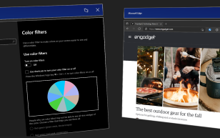
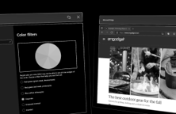
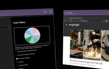
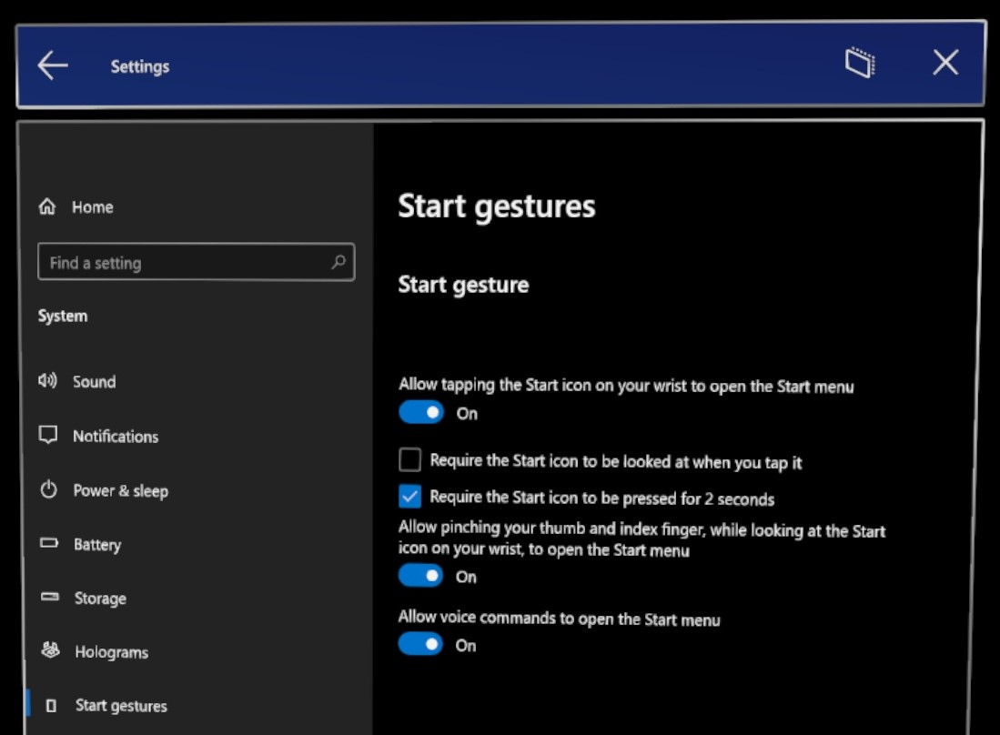

# Insider preview for Microsoft HoloLens

Welcome to the latest Insider Preview builds for HoloLens! It's simple to [get started](hololens-insider.md#start-receiving-insider-builds) and provide valuable feedback for our next major operating system update for HoloLens.

## Windows Insider Release Notes

What's new and on the horizon for HoloLens? Check out these new updates coming to HoloLens!

| Feature | Description | Target Audience | Available in Build |
|---------|-------------|-----------------|--------------------|
| Colorblind mode        | Applies filters that adjust the displayed colors for colorblind users.      | End users        | 20348.1463       |
| Start gestures settings        | Custom limitations for how the start menu can be opened.            | End users        | 20348.1468       |

### Colorblind mode

Added in Insider build 20348.1463

Colorblind mode is useful a great feature that makes HoloLens more accessible. The new colorblind mode can be found in the Settings app under **Settings** -> **Ease of Access** -> **Color filters**. Several new filters are available. Here's a visual example of some of the available filters.

| Off | Greyscale | Tritanopia |
|-----|-----------|------------|
|    |          |           |

### Start gestures settings

Added in Insider build 20348.1468

The team has implemented a solution for those who don't want the start menu popping up while doing tasks while looking at their hands, such as surgery and using apps like Remote Assist. Of course, this can also help in other scenarios.

Open the **Start menu** and select the **Settings** app -> **System** -> **Start gestures**.

Start gesture options:

- Allow tapping the Star icon on your wrist to open the Start menu - *default*: On
  - Require the Start icon to be looked at when you tap it - *default*: Unchecked
  - Require the Start icon to be pressed for 2 seconds - *default*: Unchecked
- Allow pinching your thumb and index finger, while looking at the Start icon on your wrist, to open the Start menu - *default*: On
- Allow voice commands to open the Start menu - *default*: On

If you find yourself wondering how to use your voice to open and close the Start menu:

- "Go to Start"  to bring up the Start menu
- "Close" while looking at it to close

### Fixes and improvements

- Improvements to Moving Platform Mode when detecting the down direction.
- Fixed an issue around update dialogs.
- Updated inbox Microsoft Edge browser version.
- Fixed an issue where toggling optional diagnostic data didn't persist the chosen setting in telemetry settings page after a reboot.

### Known Issue - Some users may encounter an update failure with Insider build 20346.1466

If a user has taken an update to one of the Insider flight, 20346.1466, and it doesn’t appear to be finishing the boot, a clean reflash may be required to move forward again. To see if you have encountered this:

1. Reboot – Hold down the power until the LED’s step down.
1. Power up.
1. Confirm you see the Windows flag at the beginning of the boot and it goes black shortly after that.
1. Connect your HoloLens2 to your PC with USB and run Advanced Recovery companion.
1. Select the HoloLens.
1. If the version says you are running the 20346.1466 build, you likely hit this issue.

#### Who does this tend to affect

Users who have been using their device without flashing it since [Windows Holographic, version 2004](hololens-release-notes.md#windows-holographic-version-2004).

#### Users who are typically unaffected

Users who have flash their device, or unboxed their device, and started using it since [Windows Holographic, version 21H1](hololens-release-notes.md#windows-holographic-version-21h1).

#### Workaround

- [Reflash your device.](hololens-recovery.md#clean-reflash-the-device)

## Start receiving Insider builds

> [!NOTE]
> If you haven’t updated recently, please reboot your device to update state and get the latest build.
>
> - The “Reboot device” voice command works well.
> - You can also choose the restart button in Settings/Windows Insider Program.
>
> We had a bug on the back-end that you may have encountered and this will get you back on track.

On a HoloLens 2 device go to **Settings** > **Update & Security** > **Windows Insider Program** and select **Get started**. Link the account you used to register as a Windows Insider.

> [!NOTE]
> In order to enroll your device in Insider builds, you'll need to enable optional telemetry. If you have not done this already, open the Settings app and select **Privacy** > **Diagnostics & feedback** and then select **Optional diagnostics data**.

Windows insider is now moving to Channels. The **Fast** ring will become the **Dev Channel**, the **Slow** ring will become the **Beta Channel**, and the **Release Preview** ring will become the **Release Preview Channel**. Here is what that mapping looks like:

For more information, see [Introducing Windows Insider Channels](https://blogs.windows.com/windowsexperience/2020/06/15/introducing-windows-insider-channels) on Windows Blogs.
Then, select **Active development of Windows**, choose whether you'd like to receive **Dev Channel** or **Beta Channel** builds, and review the program terms.
Select **Confirm > Restart Now** to finish up. After your device has rebooted, go to **Settings > Update & Security > Check for updates** to get the latest build.

### Update error 0x80070490 work-around

If you encounter an update error 0x80070490 when updating on the Dev or Beta channel, try the following short-term work-around. It involves moving your insider channel, picking up the update and then moving your Insider channel back.

#### Stage one - Release Preview

1. Settings, Update & Security, Windows Insider Program, select **Release Preview Channel**.

2. Settings, Update & Security, Windows Update, **Check for updates**. After the update, continue on to Stage two.

#### Stage two - Dev Channel

1. Settings, Update & Security, Windows Insider Program, select **Dev Channel**.

2. Settings, Update & Security, Windows Update, **Check for updates**.

## FFU download and flash directions

To test with a flight signed ffu, you first have to flight unlock your device prior to flashing the flight signed ffu.

1. On PC:
    1. Download ffu to your PC from [https://aka.ms/hololenspreviewdownload](https://aka.ms/hololenspreviewdownload).

    1. Install ARC (Advanced Recovery Companion) from the Microsoft Store: [https://www.microsoft.com/store/productId/9P74Z35SFRS8](https://www.microsoft.com/store/productId/9P74Z35SFRS8).

1. On HoloLens - Flight Unlock: Open **Settings** > **Update & Security** > **Windows Insider Program** then sign up, reboot device.

1. Flash FFU - Now you can flash the flight signed FFU using ARC.

### Provide feedback and report issues

Please use [the Feedback Hub app](hololens-feedback.md) on your HoloLens to provide feedback and report issues. Using Feedback Hub ensures that all necessary diagnostics information is included to help our engineers quickly debug and resolve the problem.  Issues with the Chinese and Japanese version of HoloLens should be reported the same way.

> [!NOTE]
> Be sure to accept the prompt that asks whether you'd like Feedback Hub to access your Documents folder (select **Yes** when prompted).

## Note for developers

You are welcome and encouraged to try developing your applications using Insider builds of HoloLens.  Check out the [HoloLens Developer Documentation](https://developer.microsoft.com/windows/mixed-reality/development) to get started. Those same instructions work with Insider builds of HoloLens.  You can use the same builds of Unity and Visual Studio that you're already using for HoloLens development.

## Stop receiving Insider builds

If you no longer want to receive Insider builds of Windows Holographic, you can opt out when your HoloLens is running a production build, or you can [recover your device](hololens-recovery.md) using the Advanced Recovery Companion to recover your device to a non-Insider version of Windows Holographic.

> [!CAUTION]
> There is a known issue in which users who un-enroll from Insider Preview builds after manually reinstalling a fresh preview build would experience a blue screen. Afterwards they must manually recover their device. For full details on if you would be impacted or not, please view more on this [Known Issue](hololens-troubleshooting.md#blue-screen-after-unenrolling-from-insider-preview-on-a-device-flashed-with-an-insider-build).

To verify that your HoloLens is running a production build:

1. Go to **Settings > System > About**, and find the build number.

1. [See the release notes for production build numbers](hololens-release-notes.md).

To opt out of Insider builds:

1. On a HoloLens running a production build, go to **Settings > Update & Security > Windows Insider Program**, and select **Stop Insider builds**.

1. Follow the instructions to opt out your device.
