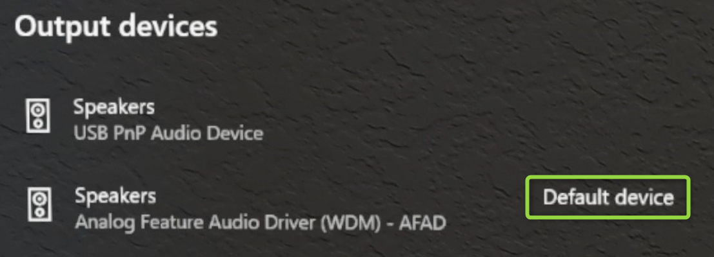

# Insider preview for Microsoft HoloLens

Welcome to the latest Insider Preview builds for HoloLens! It's simple to [get started](hololens-insider.md#start-receiving-insider-builds) and provide valuable feedback for our next major operating system update for HoloLens.

## Windows Insider Release Notes

We are excited to start flighting new features to Windows Insiders again. We will be flighting to the Dev Channel for the latest updates. Get excited and ready to mix these updates into your reality.

| Feature Name                                              | Short description                                                                      | Available in build |
|-----------------------------------------------------------|----------------------------------------------------------------------------------------|--------------------|
| [New Microsoft Edge](#introducing-the-new-microsoft-edge) | The new, Chromium-based Microsoft Edge is now available for HoloLens 2                         | 20279.1006 |
| [New Settings app](#new-settings-app)                     | The legacy Settings app is being replaced by an updated version with new features and settings | 20279.1006 |
| [Default app picker](#default-app-picker)                 | Choose which app should launch for each file or link type                                      | 20279.1006 |
| [Office web app](#office-web-app)                         | A shortcut to the Office web app is now listed in "All apps"                                   | 20279.1006 |
| [Swipe to type](#swipe-to-type)                           | Use the tip of your finger to "swipe" words on the holographic keyboard                        | 20279.1006 |
| [USB-C External Microphone Support](#usb-c-external-microphone-support) | Use USB-C microphones for apps and / or Remote Assist.| 20279.1006 |

### Introducing the new Microsoft Edge

The new Microsoft Edge [adopts the Chromium open source project](https://blogs.windows.com/windowsexperience/2018/12/06/microsoft-edge-making-the-web-better-through-more-open-source-collaboration/) to create better compatibility for customers and less fragmentation of the web for web developers.

With this Insider preview, the new Microsoft Edge is available to HoloLens 2 customers for the first time! While the new Microsoft Edge will eventually replace legacy Microsoft Edge on HoloLens 2, both browsers are currently available to Insiders. Please share feedback and bugs with our team via [Feedback Hub](hololens-feedback.md) or the **Send Feedback** feature in the new Microsoft Edge.

#### Launching the new Microsoft Edge

There are two versions of Microsoft Edge available to Insiders: the new Microsoft Edge (represented by a blue and green swirl icon) and the legacy Microsoft Edge (represented by the white "e" icon). The new Microsoft Edge is pinned to the Start menu and will automatically launch when you activate a web link. If you would like to revert to using legacy Microsoft Edge as your default web browser, see the instructions below for [resetting default apps](#default-app-picker).

> [!NOTE]
> When you first launch the new Microsoft Edge on HoloLens 2, your settings and data will be imported from legacy Microsoft Edge. If you continue to use legacy Microsoft Edge after launching the new Microsoft Edge, that new data will not be synced from legacy Microsoft Edge to the new Microsoft Edge.

#### Configuring policy settings for the new Microsoft Edge

The new Microsoft Edge offers IT Pros a much broader set of browser policies on HoloLens 2 than were previously available with legacy Microsoft Edge.

Here are some helpful resources for learning more about managing policy settings for the new Microsoft Edge:

- [Microsoft Edge Enterprise documentation](https://docs.microsoft.com/deployedge/)
- [Configure Microsoft Edge policy settings with Microsoft Intune](https://docs.microsoft.com/deployedge/configure-edge-with-intune)
- [Google Chrome to Microsoft Edge policy mapping](https://docs.microsoft.com/deployedge/microsoft-edge-policy-map-chrome-to-newedge)
- [Microsoft Edge Legacy to Microsoft Edge policy mapping](https://docs.microsoft.com/deployedge/microsoft-edge-policy-map-legacy-to-newedge)

> [!IMPORTANT]
> Because of the volume of browser policies supported by the new Microsoft Edge, our team is unable to guarantee that each new policy works on HoloLens 2. However, we've tested and confirmed that the new Microsoft Edge equivalent of each legacy Microsoft Edge policy previously supported on HoloLens 2 work as expected. See [Microsoft Edge Legacy to Microsoft Edge policy mapping](https://docs.microsoft.com/deployedge/microsoft-edge-policy-map-legacy-to-newedge) to find the new Microsoft Edge equivalent of each legacy Microsoft Edge browser policy you were using with HoloLens 2.
>
> There are at least two new Microsoft Edge policies that we know *will not* work with HoloLens 2:
> - EnterpriseModeSiteList
> - EnterpriseSiteListServiceURL

#### What to expect from the new Microsoft Edge on HoloLens 2

Because the new Microsoft Edge is a native Win32 app with a new UWP adapter layer allowing it to run on UWP-only devices like HoloLens 2, some features may not be immediately available. We'll be supporting new scenarios and features over the coming months, so please check this space for up-to-date information.

**Scenarios and features expected to work:**
- First-run experience, sign-in to profile, and sync
- Websites should render and behave as expected
- Most browser functionality (Favorites, History, etc.) should work as expected
- Dark mode
- Installing web apps to the device
- Installing extensions (please let us know if you use any extensions that don't work properly on HoloLens 2)
- Viewing and marking up a PDF
- Spatial sound from a single browser window
- Automatic and manual updating of the browser
- Saving a PDF from the Print menu (using "Save to PDF" option)

**Scenarios and features coming soon:**
- WebXR and 360 Viewer extension
- Content restoration to correct window when browsing across multiple windows placed in your environment
- Spatial sound for multiple windows with simultaneous audio streams
- Joining a Microsoft Teams call via the browser with video, mixed reality capture, or screen-sharing (joining calls with audio works well)
- "See it, say it"
- Printing

**Top known browser issues:**
- Resetting your device will remove the new Microsoft Edge
- The magnifier preview in the holographic keyboard shows incorrect content

### New Settings app

With this release, we're introducing a new version of the Settings app. The new Settings app includes new features, like the ability to search for particular settings from the Settings homepage using keywords or the setting's name. The new Settings app also includes new and expanded settings for HoloLens 2 in the following areas: input/output audio devices, individual app volume, power and sleep, Ethernet adapter, Ease of Access, airplane mode, and default apps.

> [!NOTE]
> Because the new Settings app is distinct from the legacy Settings app, any Settings windows you previously placed around your environment will be removed upon update.

**Known issues**
- Previously placed Settings windows will be removed (see note above)
- Visiting the Notifications page may crash the Settings app (investigating)
- The Ethernet page currently doesn't show up (to be fixed soon)
- Battery usage for the new Microsoft Edge may not be accurate, due to its nature as a Win32 desktop application supported by a UWP adapter layer (no fix anticipated soon)

### Default app picker

When you activate a hyperlink or open a file type with more than one installed app which supports it, you will see a new window open prompting you to select which installed app should handle the file or link type. In this window you can also choose to have the selected app handle the file or link type "Once" or "Always." 

If you choose "Always" but later want to change which app handles a particular file or link type, you can reset your saved defaults in **Settings > Apps**. Scroll to the bottom of the page and select the **Clear** button under "Default apps for file types" and/or "Default apps for link types." Unlike the similar setting on desktop PCs, you can't reset individual file type defaults.

### Office web app

The Office web app has been added to the "All apps" list in the Start menu. This web app can also be pinned to Start or uninstalled. Because this is a web app, its functionality matches exactly what you'd experience by visiting https://www.office.com. Office web app functionality is only available when your HoloLens 2 has an active internet connection.

### Swipe to type

Some customers find it faster to "type" on virtual keyboards by swiping the shape of the word they intend to type, and we're previewing this feature for the holographic keyboard. You can swipe one word at a time by passing the tip of your finger through the plane of the holographic keyboard, swiping the shape of the word, and then withdrawing the tip of your finger from the plane of the keyboard. You can swipe follow-up words without needing to press the spacebar by removing your finger from the keyboard between words. You will know the feature is working if you see a swipe trail following your finger's movement on the keyboard.

Please note, this feature can be tricky to use and master because of the nature of a holographic keyboard where you don't feel resistance against your finger (unlike a mobile phone display). We are evaluating this feature for public release, so your feedback is important; whether you find the feature useful or you have constructive feedback, please let us know via [Feedback Hub](hololens-feedback.md).

### USB-C External Microphone Support

Users can now select USB-C connected external microphones using the **Sound** settings panel. This allows users to use their own microphone connected but USB in recording and apps. USB-C microphones are easy to enabled and use.

Open the **Settings** app and select **System** -> **Sound**.

> [!IMPORTANT]
> To use external microphones with **Remote Assist**, users will need to click the “Manage sound devices” hyperlink.
>
> Then use the drop-down to set the external microphone as either **Default** or **Communications Default.** Choosing **Default** means that the external microphone will be used everywhere.
>
> Choosing **Communications Default** means that the external microphone will be used in Remote Assist and other communications apps, but the HoloLens Mic Array may still be used for other tasks.

 

#### What about Bluetooth microphone support?

Unfortunately Bluetooth microphones are still not currently supported on HoloLens 2.

#### Troubleshooting USB-C microphones

Be aware that some USB-C microphones incorrectly report themselves as both a microphone *and* a speaker. This is a problem with the microphone and not with HoloLens. When plugging one of these microphones into HoloLens, sound may be lost. Fortunately there is a simple fix.  

In **Settings** -> **System** -> **Sound**, explicitly set the built-in speakers **(Analog Feature Audio Driver)** as the **Default device**. HoloLens should remember this setting even if the microphone is removed and reconnected later.

## Start receiving Insider builds

> [!NOTE]
> If you haven’t updated recently, please reboot your device to update state and get the latest build.
> -	The “Reboot device” voice command works well. 
> -	You can also choose the restart button in Settings/Windows Insider Program.
>
> We had a bug on the back-end that you may have encountered and this will get you back on track.

On a HoloLens 2 device go to **Settings** > **Update & Security** > **Windows Insider Program** and select **Get started**. Link the account you used to register as a Windows Insider.

Windows insider is now moving to Channels. The **Fast** ring will become the **Dev Channel**, the **Slow** ring will become the **Beta Channel**, and the **Release Preview** ring will become the **Release Preview Channel**. Here is what that mapping looks like:

For more information, see [Introducing Windows Insider Channels](https://blogs.windows.com/windowsexperience/2020/06/15/introducing-windows-insider-channels) on Windows Blogs.

Then, select **Active development of Windows**, choose whether you'd like to receive **Dev Channel** or **Beta Channel** builds, and review the program terms.

Select **Confirm > Restart Now** to finish up. After your device has rebooted, go to **Settings > Update & Security > Check for updates** to get the latest build.

## FFU download and flash directions
To test with a flight signed ffu, you first have to flight unlock your device prior to flashing the flight signed ffu.
1. On PC:

    1. Download ffu to your PC from [https://aka.ms/hololenspreviewdownload](https://aka.ms/hololenspreviewdownload).
    
    1. Install ARC (Advanced Recovery Companion) from the Microsoft Store: [https://www.microsoft.com/store/productId/9P74Z35SFRS8](https://www.microsoft.com/store/productId/9P74Z35SFRS8)
    
1. On HoloLens - Flight Unlock: Open **Settings** > **Update & Security** > **Windows Insider Program** then sign up, reboot device.

1. Flash FFU - Now you can flash the flight signed FFU using ARC.

## Provide feedback and report issues

Please use [the Feedback Hub app](hololens-feedback.md) on your HoloLens to provide feedback and report issues. Using Feedback Hub ensures that all necessary diagnostics information is included to help our engineers quickly debug and resolve the problem.  Issues with the Chinese and Japanese version of HoloLens should be reported the same way.

> [!NOTE]
> Be sure to accept the prompt that asks whether you'd like Feedback Hub to access your Documents folder (select **Yes** when prompted).

## Note for developers

You are welcome and encouraged to try developing your applications using Insider builds of HoloLens.  Check out the [HoloLens Developer Documentation](https://developer.microsoft.com/windows/mixed-reality/development) to get started. Those same instructions work with Insider builds of HoloLens.  You can use the same builds of Unity and Visual Studio that you're already using for HoloLens development.

## Stop receiving Insider builds

If you no longer want to receive Insider builds of Windows Holographic, you can opt out when your HoloLens is running a production build, or you can [recover your device](hololens-recovery.md) using the Advanced Recovery Companion to recover your device to a non-Insider version of Windows Holographic.

> [!CAUTION]
> There is a known issue in which users who un-enroll from Insider Preview builds after manually reinstalling a fresh preview build would experience a blue screen. Afterwards they must manually recover their device. For full details on if you would be impacted or not, please view more on this [Known Issue](https://docs.microsoft.com/hololens/hololens-known-issues?source=docs#blue-screen-is-shown-after-unenrolling-from-insider-preview-builds-on-a-device-reflashed-with-a-insider-build).

To verify that your HoloLens is running a production build:

1. Go to **Settings > System > About**, and find the build number.

1. [See the release notes for production build numbers](hololens-release-notes.md).

To opt out of Insider builds:

1. On a HoloLens running a production build, go to **Settings > Update & Security > Windows Insider Program**, and select **Stop Insider builds**.

1. Follow the instructions to opt out your device.
