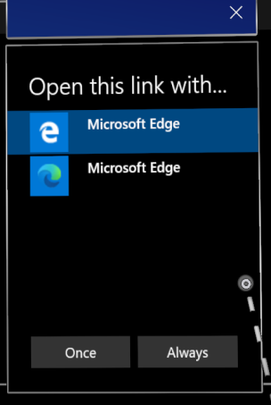
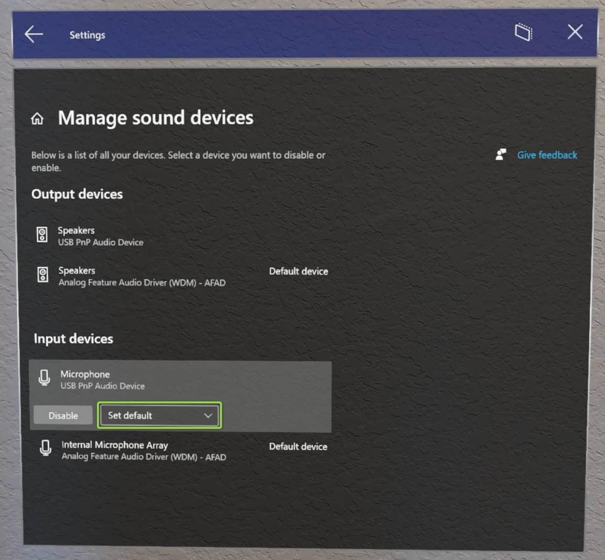

# Insider preview for Microsoft HoloLens

Welcome to the latest Insider Preview builds for HoloLens! It's simple to [get started](hololens-insider.md#start-receiving-insider-builds) and provide valuable feedback for our next major operating system update for HoloLens.

## Windows Insider Release Notes

We're excited to start flighting new features to Windows Insiders again. New builds will be flighting to the Dev Channel for the latest updates. We will continue to update this page as we add more features and updates to our Windows Insider builds.  Get excited and ready to mix these updates into your reality.

> [!IMPORTANT]
> If you were previously using either the Settings app or Microsoft Edge app in a Kiosk, we have replaced these apps with new apps which use a different App ID. We highly encourage you to read [New AUMIDs for new apps in Kiosk mode](#use-the-new-settings-and-edge-apps-in-kiosk-modes) below. This will ensure you either continue to have the Settings app in your Kiosk, or include the new Microsoft Edge app.

 

| Feature Name                                              | Short description                                                                      | Available in build |
|-----------------------------------------------------------|----------------------------------------------------------------------------------------|--------------------|
| [New Microsoft Edge](#introducing-the-new-microsoft-edge) | The new, Chromium-based Microsoft Edge is now available for HoloLens 2                         | 20279.1006 |
| [WebXR and 360 Viewer](#webxr-and-360-viewer)             | Try immersive web experiences and 360 video playback                                           | 20289.1000 |
| [New Settings app](#new-settings-app)                     | The legacy Settings app is being replaced by an updated version with new features and settings | 20279.1006 |
| [Display color calibration](#display-color-calibration)   | Select an alternative color profile for your HoloLens 2 display                                | 20293.1000 |
| [Default app picker](#default-app-picker)                 | Choose which app should launch for each file or link type                                      | 20279.1006 |
| [Per app volume control](#per-app-volume-control) |  Control app level volume independently from system volume | 20293.1000 |
| [Office web app](#office-web-app)                         | A shortcut to the Office web app is now listed in "All apps"                                   | 20279.1006 |
| [Swipe to type](#swipe-to-type)                           | Use the tip of your finger to "swipe" words on the holographic keyboard                        | 20279.1006 |
| [Power menu from Start](#power-menu-from-start) | On Start Menu, restart and shut down HoloLens device | 20293.1000 |
| [USB-C External Microphone Support](#usb-c-external-microphone-support) | Use USB-C microphones for apps and / or Remote Assist.| 20279.1006 |
| [Visitor Auto-logon for Kiosks](#visitor-auto-logon-for-kiosks)                          | Enables the auto-logon on Visitor accounts to be used for Kiosk modes.                         | 20279.1006                 |
| [New AUMIDs for new apps in Kiosk mode](#use-the-new-settings-and-edge-apps-in-kiosk-modes) | AUMIDs for new Settings and Edge apps | 20279.1006 |
| [New SettingsURIs for Page Settings Visibility](hololens-insider.md#new-settingsuris-for-page-settings-visibility) | 20+ new SettingsURIs for Settings/PageVisibilityList policy | 20289.1000 |
| [Improved Kiosk mode failure handing](#kiosk-mode-behavior-changes-for-handling-of-failures) | Kiosk mode looks for Global Assigned Access before empty start menu. | 20279.1006 |
| [Configure Fallback Diagnostics](#configuring-fallback-diagnostics-via-settings-app) | Setting Fallback Diagnostic Behavior in Settings App | 20279.1006 |
| [Share things with nearby devices](#share-things-with-nearby-devices) | Share files or URLs from a HoloLens to a PC | 20279.1006 |
| [New OS Update troubleshooter](#new-os-update-troubleshooter) | New troubleshooter in Settings for OS updates | 20279.1006 |
| [Delivery Optimization Preview](#delivery-optimization-preview) | Reduce bandwidth consumption for downloads from multiple HoloLens devices | 20301.1000 |
| [Improvements and fixes in the update](#improvements-and-fixes-in-the-update) | Additional fixes in the update. | 20279.1006 |

### Introducing the new Microsoft Edge

The new Microsoft Edge [adopts the Chromium open source project](https://blogs.windows.com/windowsexperience/2018/12/06/microsoft-edge-making-the-web-better-through-more-open-source-collaboration/) to create better compatibility for customers and less fragmentation of the web for web developers.

With this Insider preview, the new Microsoft Edge is available to HoloLens 2 customers for the first time! While the new Microsoft Edge will eventually replace legacy Microsoft Edge on HoloLens 2, both browsers are currently available to Insiders. Please share feedback and bugs with our team via the **Send Feedback** feature in the new Microsoft Edge or via [Feedback Hub](hololens-feedback.md).

#### Launching the new Microsoft Edge

There are two versions of Microsoft Edge available to Insiders: the new Microsoft Edge  (represented by a blue and green swirl icon) and legacy Microsoft Edge (represented by the white "e" icon). The new Microsoft Edge is pinned to the Start menu and will automatically launch when you activate a web link. If you would like to revert to using legacy Microsoft Edge as your default web browser, see the instructions below for [resetting default apps](#default-app-picker).

> [!NOTE]
> When you first launch the new Microsoft Edge on HoloLens 2, your settings and data will be imported from legacy Microsoft Edge. If you continue to use legacy Microsoft Edge after launching the new Microsoft Edge, that new data will not be synced from legacy Microsoft Edge to the new Microsoft Edge.

#### Configuring policy settings for the new Microsoft Edge

The new Microsoft Edge offers IT admins a much broader set of browser policies on HoloLens 2 than were previously available with legacy Microsoft Edge.

Here are some helpful resources for learning more about managing policy settings for the new Microsoft Edge:

- [Configure Microsoft Edge policy settings with Microsoft Intune](https://docs.microsoft.com/deployedge/configure-edge-with-intune)
- [Microsoft Edge Legacy to Microsoft Edge policy mapping](https://docs.microsoft.com/deployedge/microsoft-edge-policy-map-legacy-to-newedge)
- [Google Chrome to Microsoft Edge policy mapping](https://docs.microsoft.com/deployedge/microsoft-edge-policy-map-chrome-to-newedge)
- Full [Microsoft Edge Enterprise documentation](https://docs.microsoft.com/deployedge/)

> [!IMPORTANT]
> Because of the volume of browser policies supported by the new Microsoft Edge, our team is unable to guarantee that each new policy works on HoloLens 2. However, we've tested and confirmed than the new Microsoft Edge equivalent of each legacy Microsoft Edge policy previously supported on HoloLens 2 work as expected. See [Microsoft Edge Legacy to Microsoft Edge policy mapping](https://docs.microsoft.com/deployedge/microsoft-edge-policy-map-legacy-to-newedge) to find the new Microsoft Edge equivalent of each legacy Microsoft Edge browser policy you were using with HoloLens 2.
>
> There are at least two new Microsoft Edge policies that we know *will not* work with HoloLens 2:
> - EnterpriseModeSiteList
> - EnterpriseSiteListServiceURL

#### What to expect from the new Microsoft Edge on HoloLens 2

Because the new Microsoft Edge is a native Win32 app with a new UWP adapter layer allowing it to run on UWP-only devices like HoloLens 2, some features may not be immediately available. We'll be supporting new scenarios and features over the coming months, so check this space for up-to-date information.

**Scenarios and features expected to work:**
- First-run experience, sign in to profile, and sync
- Websites should render and behave as expected
- Most browser functionality (Favorites, History, etc.) should work as expected
- Dark mode
- Installing web apps to the device
- Installing extensions (please let us know if you use any extensions that don't work properly on HoloLens 2)
- Viewing and marking up a PDF
- Spatial sound from a single browser window
- Automatic and manual updating of the browser
- Saving a PDF from the Print menu (using "Save to PDF" option)

**Scenarios and features coming soon:**
- WebXR and 360 Viewer extension
- Content restoration to correct window when browsing across multiple windows placed in your environment

**Scenarios and features not expected to work:**
- Spatial sound from multiple windows with simultaneous audio streams
- "See it, say it"
- Printing

**Top known browser issues:**
- Resetting your device will remove the new Microsoft Edge
- The magnifier preview in the holographic keyboard shows incorrect content

#### Microsoft Edge Insider channels

The Microsoft Edge team makes three preview channels available to the Edge Insider community: Beta, Dev, and Canary. Installing a preview channel doesn't uninstall the released version of Microsoft Edge on your HoloLens 2, and you can install more than one at the same time. 

Visit the [Microsoft Edge Insider homepage](https://www.microsoftedgeinsider.com) to learn more about the Edge Insider community. To learn more about the different Edge Insider channels and get started, visit the [Edge Insider download page](https://www.microsoftedgeinsider.com/download).

There are a couple methods available for installing Microsoft Edge Insider channels to HoloLens 2:

**Direct install on device (currently only available to unmanaged devices)**
  1. On your HoloLens 2, visit the [Edge Insider download page](https://www.microsoftedgeinsider.com/download).
  1. Select the **Download for HoloLens 2** button for the Edge Insider channel you wish to install.
  1. Launch the downloaded .msix file from the Edge download queue or from your device's "Downloads" folder (using File Explorer).
  1. [App installer](app-deploy-app-installer.md) will launch.
  1. Select the **Install** button.
  1. After successful install, you'll find Microsoft Edge Beta, Dev, or Canary as a separate entry in the **All apps** list of the Start menu.

**Install via PC with Windows Device Portal (requires [developer mode](https://docs.microsoft.com/windows/mixed-reality/develop/platform-capabilities-and-apis/using-the-windows-device-portal#setting-up-hololens-to-use-windows-device-portal) to be enabled on HoloLens 2)**
  1. On your PC, visit the [Edge Insider download page](https://www.microsoftedgeinsider.com/download).
  1. Select the **drop-down arrow button** next to the "Download for Windows 10" button for the Edge Insider channel you wish to install.
  1. Select **HoloLens 2** in the drop-down menu.
  1. Save the .msix file to the "Downloads" folder of your PC (or another folder you can easily find).
  1. Use [Windows Device Portal](https://docs.microsoft.com/windows/mixed-reality/develop/platform-capabilities-and-apis/using-the-windows-device-portal#installing-an-app) on your PC to install the downloaded .msix file on HoloLens 2.
  1. After successful install, you'll find Microsoft Edge Beta, Dev, or Canary as a separate entry in the **All apps** list of the Start menu.

> [!NOTE]
> During this Windows Insider preview for HoloLens 2, the version of Microsoft Edge on your device may be higher than those available in some (or all) of the Microsoft Edge Insider channels. This is to ensure new features and fixes specifically targeting the web browser on HoloLens 2 are getting to our Windows Insiders as quickly as possible. Shortly after the public release of the next Windows update, the Microsoft Edge Insider channel builds will surpass, and stay ahead of, the version of Microsoft Edge on your HoloLens 2.

### WebXR and 360 Viewer

*Added in Windows Insider build 20289.1000*

The new Microsoft Edge includes support for WebXR, which is the new standard for creating immersive web experiences (replacing WebVR). Many immersive web experiences were designed with VR in mind (they replace your field of view with a virtual environment), but these experiences are also supported by HoloLens 2. The WebXR standard also enables augmented and mixed reality immersive web experiences that use your physical environment. As developers spend more time with WebXR, we anticipate new augmented and mixed reality immersive experiences will arrive for HoloLens 2 customers to try!

The 360 Viewer extension is built on WebXR and automatically installs alongside the new Microsoft Edge on HoloLens 2. This web extension gives you the ability to immerse yourself in 360-degree videos. YouTube offers the largest selection of 360 videos, so we encourage you to start there.

#### How to use WebXR

1. Navigate to a website with WebXR support.
1. Select the **Enter VR** button on the website. The location and visual representation of this button may vary per website, but it may look similar to:

    

1. The first time you try to launch a WebXR experience on a specific domain, the browser will ask for consent to enter an immersive view, select **Allow**.
1. Use [HoloLens 2 gestures](hololens2-basic-usage.md#the-hand-tracking-frame) to manipulate the experience.
1. If the experience doesn't have an **Exit** button, use the [Start gesture](hololens2-basic-usage.md#start-gesture) to return home.

**Recommended WebXR samples**
- 360 Viewer (see next section)
- [XR Dinosaurs](https://www.xrdinosaurs.com/)
- [Barista Express](https://constructarca.de/game/barista-express/)
- [WebXR Paint](https://threejs.org/examples/webxr_vr_paint.html)

#### How to use 360 Viewer

1. Navigate to a 360-degree video on YouTube.
1. In the video frame, select the mixed reality headset button:

    

1. The first time you try to launch 360 Viewer on a specific domain, the browser will ask for consent to enter an immersive view. Select **Allow**.
1. [Air tap](hololens2-basic-usage.md#select-using-air-tap) to bring up the playback controls. Use [hand rays and air tap](hololens2-basic-usage.md#select-using-air-tap) to play/pause, skip forward/back, turn captions on/off, or stop the experience (which exits the immersive view). The playback controls will disappear after a few seconds of inactivity.

#### Top WebXR and 360 Viewer known issues
- In WebXR experiences, holograms may shift or tilt when you tilt your head or move around your environment.
- Depending on the complexity of the WebXR experience, the framerate may drop or stutter.
- Articulated hand joints are not yet available in WebXR.
- When exiting a WebXR or 360 Viewer experience, it may take 30 seconds or more for holograms in the mixed reality home to reappear.
- 360 videos from websites other than YouTube may not work as expected.
- If 360 videos don't enter immersive view (or the mixed reality headset button doesn't appear), try refreshing the page.
- Captions are not yet visible in 360 Viewer on HoloLens 2.
- Pausing a video in 360 Viewer stops the video from rendering (but selecting the play button correctly resumes playback).
- The "next video" button in 360 Viewer does not currently work.
- You can play 2D videos in an immersive "theater" mode, but the framerate will be less than 30 fps.

#### Providing feedback on WebXR and 360 Viewer

Please share feedback and bugs with our team via the **Send Feedback** feature in the new Microsoft Edge.

### New Settings app

With this release, we're introducing a new version of the Settings app. The new Settings app includes new features and expanded settings for HoloLens 2 in the following areas: Sound, Power & sleep, Network & Internet, Apps, Accounts, Ease of Access, and more.

> [!NOTE]
> Because the new Settings app is distinct from the legacy Settings app, any Settings windows you previously placed around your environment will be removed upon update.

**New features and settings**
- Settings search: search for settings from the Settings homepage using keywords or the setting's name.
- System > Sound:
  - Input and output audio devices: independently choose your input and output audio devices (for example, listen to audio via Bluetooth headphones or use a USB-C microphone for audio input).
    > [!NOTE]
    > Bluetooth microphones are not supported by HoloLens 2.
  - App volume: independently adjust the volume of each app. See [per app volume control](#per-app-volume-control).
- System > Power & sleep: choose when the device should go to sleep after a period of inactivity.
- System > Battery: manually enable battery saver mode or set a battery threshold at which point battery saver mode turns on automatically.
- Devices > USB: you can disable USB connections by default.
- Network & Internet:
  - USB-C Ethernet adapters will now appear in Network & Internet.
  - USB-C Ethernet adapter settings are now available, including its IP address.
  - You can now enable airplane mode on HoloLens 2.
- Apps: you can reset the default apps used for file and link types. For more information see [Default app picker](#default-app-picker).
- Accounts > Other users: device owners can add users, upgrade standard users to device owners, downgrade device owners to standard users, and remove users.
- Ease of Access: change text size and some visual effects.

**Known issues**
- Previously placed Settings windows will be removed (see note above).
- The Ethernet page shows a virtual Ethernet device ("UsbNcm") at all times (investigating). This virtual Ethernet device will also show up on the Network page of device setup, but can be ignored (investigating).
- You can no longer rename your device with the Settings app (IT admins can use provisioning packages or MDM to rename devices).
- Battery usage for the new Microsoft Edge may not be accurate, due to its nature as a Win32 desktop application supported by a UWP adapter layer (no fix anticipated soon).

### Display color calibration

*Added in Windows Insider build 20293.1000*

With this new setting, you can select an alternative color profile for your HoloLens 2 display. This may help colors appear more accurate, especially at lower display brightness levels. Display color calibration can be found in the Settings app, on the System > Calibration page.

> [!NOTE]
> Because this setting saves a new color profile to your display firmware, it is a per-device setting (and not unique to each user account).

#### How to use display color calibration

1. Launch the **Settings** app and navigate to **System > Calibration**.
1. Under **Display color calibration**, select the **Run display color calibration** button.
1. The display color calibration experience will launch and encourage you to make sure your visor is in the correct position.
1. After you proceed through the instruction dialog boxes, your display will automatically be dimmed to 30% brightness.
    > [!TIP]
    > If you're having trouble seeing the dimmed scene in your environment, you can manually adjust the brightness level of HoloLens 2 using the brightness buttons on the left side of the device.
1. Select buttons 1-6 to instantly try out each color profile, and find one that looks the best to your eyes (this usually means the profile that helps the scene appear most neutral, with the grayscale pattern and skin tones looking as expected.)

    
    
1. When you're happy with the selected profile, select the **Save & Exit** button
1. If you prefer not to make changes, select the **Cancel & Exit** button and your changes will be reverted

> [!TIP]
> Here are some helpful tips to keep in mind while using the display color calibration setting:
> - You can re-run display color calibration from Settings whenever you'd like
> - If anyone on the device has previously used the setting to change color profiles, the date/time of the most recent change will be reflected on the Settings page
> - When you re-run display color calibration, the color profile that was previously saved will be highlighted and Profile 0 will not appear (as Profile 0 represents the display's original color profile)
> - If you want to revert to the display's original color profile, you can do so from the Settings page (see [how to reset color profile](#how-to-reset-color-profile))

#### How to reset color profile

If you're unhappy with the custom color profile saved to your HoloLens 2, you can restore the device's original color profile:
1. Launch the **Settings** app and navigate to **System > Calibration**.
1. Under **Display color calibration**, select the **Reset to default color profile** button.
1. When the dialog box opens, select **Restart** if you're ready to restart HoloLens 2 and apply your changes.

#### Top display color calibration known issues

- On the Settings page, the status string that tells you when the color profile was last changed will be out of date until you reload that page of Settings 
    - Workaround: Select another Settings page and then re-select the Calibration page.
- If your HoloLens 2 goes to sleep while running display color calibration, it will later resume into the mixed reality home and your display brightness level will still be dimmed.
- You may need to try pressing the brightness buttons on the left side of your device up/down a few times before they work as expected.

### Default app picker

When you activate a hyperlink or open a file type with more than one installed app, which supports it, you will see a new window open prompting you to select which installed app should handle the file or link type. In this window, you can also choose to have the selected app handle the file or link type "Once" or "Always."

If you choose "Always" but later want to change which app handles a particular file or link type, you can reset your saved defaults in **Settings > Apps**. Scroll to the bottom of the page and select the **Clear** button under "Default apps for file types" and/or "Default apps for link types." Unlike the similar setting on desktop PCs, you can't reset individual file type defaults.

### Per app volume control

Now in this Windows Insider build users can manually adjust the volume level of each app. This allows for users to better focus on the apps that they need to, or better hear when using multiple apps. Such as needing to turn down volume of one app while calling another person for remote assistance in another.

To set the volume of an individual app navigate to **Settings** -> **System** -> **Sound**, and under Advanced sound options select **App volume and device preferences**.

 

### Office web app

The Office web app has been added to the "All apps" list in the Start menu. This web app can also be pinned to Start or uninstalled. Because this is a web app, its functionality matches exactly what you'd experience by visiting https://www.office.com. Office web app functionality is only available when your HoloLens 2 has an active internet connection.

### Swipe to type

Some customers find it faster to "type" on virtual keyboards by swiping the shape of the word they intend to type, and we're previewing this feature for the holographic keyboard. You can swipe one word at a time by passing the tip of your finger through the plane of the holographic keyboard, swiping the shape of the word, and then withdrawing the tip of your finger from the plane of the keyboard. You can swipe follow up words without needing to press the space bar by removing your finger from the keyboard between words. You will know the feature is working if you see a swipe trail following your finger's movement on the keyboard.

Please note, this feature can be tricky to use and master because of the nature of a holographic keyboard where you don't feel resistance against your finger (unlike a mobile phone display). We are evaluating this feature for public release, so your feedback is important; whether you find the feature useful or you have constructive feedback, please let us know via [Feedback Hub](hololens-feedback.md).

### Power menu from Start

A new menu that allows the user to sign out, shut down and restart the device. An indicator in the HoloLens Start screen that shows when a system update is available.

#### How to use

1. Open the HoloLens Start screen using the [Start gesture](hololens2-basic-usage.md#start-gesture) or saying "Go to Start"
1. Notice the ellipsis icon (...) next to the user profile picture:

 

3. Select the user profile picture using your hands or the voice command "Power"
4. A menu appears with options to Sign out, Restart or Shut down the device:

 

5. Select the menu options to sign out, restart or shut down your HoloLens. The Sign out option might not be available, if the device is set up for a [single Microsoft Account (MSA) or local account](hololens-identity.md).
6. Dismiss the menu by touching anywhere else or closing the Start menu with the Start gesture.

#### Update indicator

When an update is available, the ellipsis icon will light up to indicate that a restart will install the update
The menu options also change to reflect the presence of the update.

 

### USB-C External Microphone Support

> [!IMPORTANT]
> Plugging in **a USB mic will not automatically set it as the input device**. When plugging in a set of USB-C headphones users will observe that the headphone's audio will automatically be redirected to the headphones, but the HoloLens OS prioritizes the internal microphone array above any other input device. **In order to use a USB-C microphone follow the steps below.**

Users can select USB-C connected external microphones using the **Sound** settings panel. USB-C microphones can be used for calling, recording, etc.

Open the **Settings** app and select **System** -> **Sound**.

> [!IMPORTANT]
> To use external microphones with **Remote Assist**, users will need to click the “Manage sound devices” hyperlink.
>
> Then use the drop-down to set the external microphone as either **Default** or **Communications Default.** Choosing **Default** means that the external microphone will be used everywhere.
>
> Choosing **Communications Default** means that the external microphone will be used in Remote Assist and other communications apps, but the HoloLens mic array may still be used for other tasks.

 

#### What about Bluetooth microphone support?

Unfortunately Bluetooth microphones are still not currently supported on HoloLens 2.

#### Troubleshooting USB-C microphones

Be aware that some USB-C microphones incorrectly report themselves as both a microphone *and* a speaker. This is a problem with the microphone and not with HoloLens. When plugging one of these microphones into HoloLens, sound may be lost. Fortunately there is a simple fix.  

In **Settings** -> **System** -> **Sound**, explicitly set the built-in speakers **(Analog Feature Audio Driver)** as the **Default device**. HoloLens should remember this setting even if the microphone is removed and reconnected later.

### Visitor Auto logon for Kiosks

This new feature enables the auto logon on Visitor accounts to be used for Kiosk modes.

For a non-AAD configuration, to configure a device for visitor auto-logon:

1. Create a provisioning package that:
    1. Configures **Runtime settings/AssignedAccess** to allow Visitor accounts.
    1. Optionally enrolls the device in MDM **(Runtime settings/Workplace/Enrollments)** so that it can be managed later.
    1. Do not create a local account
1. [Apply the provisioning package](hololens-provisioning.md).

For an AAD configuration, users can achieve something similar to this today without this change. AAD joined devices configured for kiosk mode can sign in a Visitor account with a single button tap from the sign in screen. Once signed in to the visitor account, the device will not prompt for sign in again until the Visitor is explicitly signed out from the start menu or the device is restarted.

Visitor Auto logon can be managed via [custom OMA-URI](https://docs.microsoft.com/mem/intune/configuration/custom-settings-windows-10) policy:

- URI value: ./Device/Vendor/MSFT/MixedReality/VisitorAutoLogon

| Policy  | Description   | Configurations  |
|---|---|---|
| MixedReality/VisitorAutoLogon  | Allows for a Visitor to Auto logon to a Kiosk   | 1 (Yes), 0 (No, default.)  |

### Use the new Settings and Edge apps in Kiosk modes

When including apps in [Kiosks](hololens-kiosk.md), an IT Admin often adds the app to the Kiosk but using it's App User Model ID (AUMID). Because both the Settings app and Microsoft Edge app are considered new apps and different than the older apps Kiosks that use AUMIDs for those apps will need to be updated to use the new AUMID.

When modifying a Kiosk to include the new apps, we recommend adding in the new AUMID as well as leaving the old one. This will create an easy transition when users update the OS and won't need to receive new policies to keep using the Kiosk as intended.

| App                    | AUMID                                                  |
|------------------------|--------------------------------------------------------|
| Old Settings App       | HolographicSystemSettings_cw5n1h2txyewy!App            |
| New Settings App       | BAEAEF15-9BAB-47FC-800B-ACECAD2AE94B_cw5n1h2txyewy!App |
| Old Microsoft Edge app | Microsoft.MicrosoftEdge_8wekyb3d8bbwe!MicrosoftEdge    |
| New Microsoft Edge app | Microsoft.MicrosoftEdge.Stable_8wekyb3d8bbwe!MSEDGE    |

### New SettingsURIs for Page Settings Visibility

In [Windows Holographic, version 20H2](hololens-release-notes.md#windows-holographic-version-20h2) we added the [Settings/PageVisibilityList policy](https://docs.microsoft.com/windows/client-management/mdm/policy-csp-settings#settings-pagevisibilitylist) to restrict the pages seen within the Settings app. PageVisibilityList is a policy that allows IT Admins to either prevent specific pages in the System Settings app from being visible or accessible, or to do so for all pages except those specified.

If you visit [Page Settings Visibility](settings-uri-list.md), you can find instructions to use this CSP and the list of URIs available in previous releases.

In Windows Insider builds we are expanding upon the list of list of available Settings URIs, which IT Admins can manage. Some of these URIs are for newly available areas within the new Settings app. If you are using Settings/PageVisibilityList policy, review the following list and adjust your allowed or blocked pages as needed.

> [!NOTE]
> **Deprecated: ms-settings:network-proxy**
>
> One settings page is deprecated in these newer builds. The old **Network & Internet** > **Proxy** page is no longer available as a global setting. The new per-connection proxy settings can be found under **Network & Internet** > **Wi-Fi** > **Properties** or **Network & Internet** > **Ethernet** > **Properties**.

 

| Settings page                                        | URI                                              |
|------------------------------------------------------|--------------------------------------------------|
| Apps > Apps & features                               | `ms-settings:appsfeatures`                         |
| Apps > Apps & features > Advanced options          | `ms-settings:appsfeatures-app`                     |
| Apps > Offline maps                                  | `ms-settings:maps`                                 |
| Apps > Offline maps > Download maps                  | `ms-settings:maps-downloadmaps`                    |
| Devices > Mouse                                      | `ms-settings:mouse`                                |
| Devices > USB                                        | `ms-settings:usb`                                  |
| Network & Internet > Airplane mode                   | `ms-settings:network-airplanemode`                 |
| Privacy > General                                    | `ms-settings:privacy-general`                      |
| Privacy > Ink & typing personalization             | `ms-settings:privacy-speechtyping`                 |
| Privacy > Motion                                     | `ms-settings:privacy-motion`                       |
| Privacy > Screenshot borders                         | `ms-settings:privacy-graphicsCaptureWithoutBorder` |
| Privacy > Screenshots and apps                       | `ms-settings:privacy-graphicsCaptureProgrammatic`  |
| System > Battery                                     | `ms-settings:batterysaver`                         |
| System > Battery                                     | `ms-settings:batterysaver-settings`                |
| System > Sound                                       | `ms-settings:sound`                                |
| System > Sound > App volume and device preferences | `ms-settings:apps-volume`                          |
| System > Sound > Manage sound   devices              | `ms-settings:sound-devices`                        |
| System > Storage > Configure Storage Sense         | `ms-settings:storagepolicies`                      |
| Time & Language > Date & time                        | `ms-settings:dateandtime`                          |
| Time & Language > Keyboard                           | `ms-settings:keyboard`                             |
| Time & Language > Language                           | `ms-settings:language`                             |
| Time & Language > Language                           | `ms-settings:regionlanguage-languageoptions`       |
| Update & Security > Reset & recovery               | `ms-settings:reset`                                |

#### Updated URIs

Previously the following two URIs would not take a user directly to the pages indicated but only blocked the main updates page. The following items have been updated to direct to their pages:

- `ms-settings:windowsupdate-options`
- `ms-settings:windowsupdate-restartoptions`

### Kiosk mode behavior changes for handling of failures

In older builds, if a device had a kiosk configuration, which is a combination of both global assigned access and AAD group member assigned access, if determining AAD group membership failed, the user would see “[nothing shown in start](https://docs.microsoft.com/hololens/hololens-kiosk#kiosk-mode-behavior-changes-for-handling-of-failures)” menu.

Starting in Windows Insider release, the kiosk experience will fallback to global kiosk configuration (if present) in case of failures during AAD group kiosk mode.

### Configuring Fallback Diagnostics via Settings app

Now in Settings App, a user can configure the behavior of [Fallback Diagnostics](hololens-diagnostic-logs.md). In the Settings app navigate to **Privacy** -> **Troubleshooting** page to configure this setting.

> [!NOTE]
> If there is MDM policy configured for the device, user will not be able to override that behavior.  

### Share things with nearby devices

Share things with near by Windows 10 devices, including both PCs and other HoloLens 2 devices running HoloLens Insider builds 20279.1006+. You can try it out in **Settings** -> **System** -> **Shared Experiences** to share files or URLs from a HoloLens to a PC. For more details read more about how to [Share things with nearby devices in Windows 10](https://support.microsoft.com/windows/share-things-with-nearby-devices-in-windows-10-0efbfe40-e3e2-581b-13f4-1a0e9936c2d9).

This feature can be managed via [Connectivity/AllowConnectedDevices](https://docs.microsoft.com/windows/client-management/mdm/policy-csp-connectivity#connectivity-allowconnecteddevices).

### New OS Update troubleshooter

In addition to the previous troubleshooters within the Settings app, a new troubleshooter has been added with the addition of the new Settings app for OS Updates. Navigate to **Settings** -> **Update &amp; Security** -> **Troubleshoot** -> **Windows Update** and select **Start**. This allows you to collect traces while reproducing your issue with OS Updates to assist better in troubleshooting with your IT or support.

### Delivery Optimization Preview

With this HoloLens Insider update, Windows Holographic for Business enables an early preview for delivery optimization settings to reduce bandwidth consumption for downloads from multiple HoloLens devices. A fuller description of this functionality along with the recommended network configuration is available [here](https://docs.microsoft.com/windows/deployment/update/waas-delivery-optimization).

The following settings are enabled as part of the management surface and [can be configured from Intune](https://docs.microsoft.com/mem/intune/configuration/delivery-optimization-settings):

- [DOCacheHost](https://docs.microsoft.com/windows/client-management/mdm/policy-csp-deliveryoptimization#deliveryoptimization-docachehost)
- [DOCacheHostSource](https://docs.microsoft.com/windows/client-management/mdm/policy-csp-deliveryoptimization#deliveryoptimization-docachehostsource)
- [DODelayCacheServerFallbackBackground](https://docs.microsoft.com/windows/client-management/mdm/policy-csp-deliveryoptimization#deliveryoptimization-dodelaycacheserverfallbackbackground)
- [DODelayCacheServerFallbackForeground](https://docs.microsoft.com/windows/client-management/mdm/policy-csp-deliveryoptimization#deliveryoptimization-dodelaycacheserverfallbackforeground)
- [DODownloadMode](https://docs.microsoft.com/windows/client-management/mdm/policy-csp-deliveryoptimization#deliveryoptimization-dodownloadmode)
- [DOMaxBackgroundDownloadBandwidth](https://docs.microsoft.com/windows/client-management/mdm/policy-csp-deliveryoptimization#deliveryoptimization-domaxbackgrounddownloadbandwidth)
- [DOMaxForegroundDownloadBandwidth](https://docs.microsoft.com/windows/client-management/mdm/policy-csp-deliveryoptimization#deliveryoptimization-domaxforegrounddownloadbandwidth)
- [DOPercentageMaxBackgroundBandwidth](https://docs.microsoft.com/windows/client-management/mdm/policy-csp-deliveryoptimization#deliveryoptimization-dopercentagemaxbackgroundbandwidth)
- [DOPercentageMaxForegroundBandwidth](https://docs.microsoft.com/windows/client-management/mdm/policy-csp-deliveryoptimization#deliveryoptimization-dopercentagemaxforegroundbandwidth)
- [DOSetHoursToLimitForegroundDownloadBandwidth](https://docs.microsoft.com/windows/client-management/mdm/policy-csp-deliveryoptimization#deliveryoptimization-dosethourstolimitforegrounddownloadbandwidth)
- [DOSetHoursToLimitBackgroundDownloadBandwidth](https://docs.microsoft.com/windows/client-management/mdm/policy-csp-deliveryoptimization#deliveryoptimization-dosethourstolimitbackgrounddownloadbandwidth)

A few caveats about this preview offering:

- HoloLens support is limited in this preview to OS updates only.
- Windows Holographic for Business only supports HTTP download modes and downloads from a [Microsoft Connected Cache endpoint](https://docs.microsoft.com/en-us/mem/configmgr/core/plan-design/hierarchy/microsoft-connected-cache); peer-to-peer download modes and group assignments are not supported for HoloLens devices at this time.
- HoloLens does not support deployment or delivery optimization for Windows Server Update Services endpoints.
- Troubleshooting will require either diagnostics on the Connected Cache server or collecting a trace on HoloLens on HoloLens via **Settings** -> **Update & Security** ->  **Troubleshooting** ->  **Windows Update**.

### Improvements and fixes in the update:

- [Offline diagnostics](hololens-diagnostic-logs.md#offline-diagnostics) will also include additional device information for serial number and OS version.

## Start receiving Insider builds

> [!NOTE]
> If you haven’t updated recently, please reboot your device to update state and get the latest build.
> -	The “Reboot device” voice command works well. 
> -	You can also choose the restart button in Settings/Windows Insider Program.
>
> We had a bug on the back-end that you may have encountered and this will get you back on track.

On a HoloLens 2 device go to **Settings** > **Update & Security** > **Windows Insider Program** and select **Get started**. Link the account you used to register as a Windows Insider.

Windows insider is now moving to Channels. The **Fast** ring will become the **Dev Channel**, the **Slow** ring will become the **Beta Channel**, and the **Release Preview** ring will become the **Release Preview Channel**. Here is what that mapping looks like:

For more information, see [Introducing Windows Insider Channels](https://blogs.windows.com/windowsexperience/2020/06/15/introducing-windows-insider-channels) on Windows Blogs.

Then, select **Active development of Windows**, choose whether you'd like to receive **Dev Channel** or **Beta Channel** builds, and review the program terms.

Select **Confirm > Restart Now** to finish up. After your device has rebooted, go to **Settings > Update & Security > Check for updates** to get the latest build.

### Update error 0x80070490 work-around
If you encounter an update error 0x80070490 when updating on the Dev or Beta channel, try the following short-term work around. It involves moving your insider channel, picking up the update and then moving your Insider channel back.

#### Stage one - Release Preview
1.	Settings, Update & Security, Windows Insider Program, select **Release Preview Channel**.
2.	Settings, Update & Security, Windows Update, **Check for updates**. After the update, continue on to Stage two.

#### Stage two - Dev Channel
1. Settings, Update & Security, Windows Insider Program, select **Dev Channel**.
2. Settings, Update & Security, Windows Update, **Check for updates**.

## FFU download and flash directions
To test with a flight signed ffu, you first have to flight unlock your device prior to flashing the flight signed ffu.
1. On PC:

    1. Download ffu to your PC from [https://aka.ms/hololenspreviewdownload](https://aka.ms/hololenspreviewdownload).
    
    1. Install ARC (Advanced Recovery Companion) from the Microsoft Store: [https://www.microsoft.com/store/productId/9P74Z35SFRS8](https://www.microsoft.com/store/productId/9P74Z35SFRS8).
    
1. On HoloLens - Flight Unlock: Open **Settings** > **Update & Security** > **Windows Insider Program** then sign up, reboot device.

1. Flash FFU - Now you can flash the flight signed FFU using ARC.

## Provide feedback and report issues

Please use [the Feedback Hub app](hololens-feedback.md) on your HoloLens to provide feedback and report issues. Using Feedback Hub ensures that all necessary diagnostics information is included to help our engineers quickly debug and resolve the problem.  Issues with the Chinese and Japanese version of HoloLens should be reported the same way.

> [!NOTE]
> Be sure to accept the prompt that asks whether you'd like Feedback Hub to access your Documents folder (select **Yes** when prompted).

## Note for developers

You are welcome and encouraged to try developing your applications using Insider builds of HoloLens.  Check out the [HoloLens Developer Documentation](https://developer.microsoft.com/windows/mixed-reality/development) to get started. Those same instructions work with Insider builds of HoloLens.  You can use the same builds of Unity and Visual Studio that you're already using for HoloLens development.

## Stop receiving Insider builds

If you no longer want to receive Insider builds of Windows Holographic, you can opt out when your HoloLens is running a production build, or you can [recover your device](hololens-recovery.md) using the Advanced Recovery Companion to recover your device to a non-Insider version of Windows Holographic.

> [!CAUTION]
> There is a known issue in which users who un-enroll from Insider Preview builds after manually reinstalling a fresh preview build would experience a blue screen. Afterwards they must manually recover their device. For full details on if you would be impacted or not, please view more on this [Known Issue](https://docs.microsoft.com/hololens/hololens-known-issues?source=docs#blue-screen-is-shown-after-unenrolling-from-insider-preview-builds-on-a-device-reflashed-with-a-insider-build).

To verify that your HoloLens is running a production build:

1. Go to **Settings > System > About**, and find the build number.

1. [See the release notes for production build numbers](hololens-release-notes.md).

To opt out of Insider builds:

1. On a HoloLens running a production build, go to **Settings > Update & Security > Windows Insider Program**, and select **Stop Insider builds**.

1. Follow the instructions to opt out your device.
