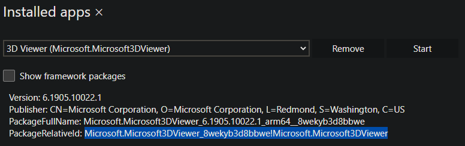

# HoloLens Kiosk reference information

This page contains helpful information for setting up your HoloLens device's kiosk mode. These references include AUMIDs for inbox apps and locating yours, and several XML samples for Kiosk mode, that are just a few edits away from being ready to use for several different scenarios. For information on setting up a Kiosk, read the [set up a Kiosk page.](hololens-kiosk.md)

## HoloLens Application User Model IDs (AUMIDs)  

For general information about how to choose kiosk apps, see [Guidelines for choosing an app for assigned access (kiosk mode)](/windows/configuration/guidelines-for-assigned-access-app).

If you use a Mobile Device Management (MDM) system or a provisioning package to configure kiosk mode, you use the [AssignedAccess Configuration Service Provider (CSP)](/windows/client-management/mdm/assignedaccess-csp) to specify applications. The CSP uses [Application User Model IDs (AUMIDs)](/windows/configuration/find-the-application-user-model-id-of-an-installed-app) to identify applications. The following table lists the AUMIDs of some in-box applications and others that you can use in a multi-app kiosk.

|App Name |AUMID |
| --- | --- |
|3D Viewer |Microsoft.Microsoft3DViewer\_8wekyb3d8bbwe\!Microsoft.Microsoft3DViewer |
|Calendar |microsoft.windowscommunicationsapps\_8wekyb3d8bbwe\!microsoft.windowslive.calendar |
|Camera1, 2 |HoloCamera\_cw5n1h2txyewy\!HoloCamera |
|Cortana3 |Microsoft.549981C3F5F10\_8wekyb3d8bbwe\!App |
|Device Picker on HoloLens (1st gen) |HoloDevicesFlow\_cw5n1h2txyewy\!HoloDevicesFlow |
|Device Picker on HoloLens 2 |Microsoft.Windows.DevicesFlowHost\_cw5n1h2txyewy\!Microsoft.Windows.DevicesFlowHost |
|Dynamics 365 Guides |Microsoft.Dynamics365.Guides\_8wekyb3d8bbwe\!MicrosoftGuides |
|Dynamics 365 Remote Assist |Microsoft.MicrosoftRemoteAssist\_8wekyb3d8bbwe\!Microsoft.RemoteAssist |
|Feedback&nbsp;Hub |Microsoft.WindowsFeedbackHub\_8wekyb3d8bbwe\!App |
|File Explorer |c5e2524a-ea46-4f67-841f-6a9465d9d515_cw5n1h2txyewy!App |
|Mail |microsoft.windowscommunicationsapps_8wekyb3d8bbwe!microsoft.windowslive.mail |
|Mesh |Microsoft.Fenix2020_8wekyb3d8bbwe!App |
|Old Microsoft Edge |Microsoft.MicrosoftEdge_8wekyb3d8bbwe!MicrosoftEdge |
|New Microsoft Edge |Microsoft.MicrosoftEdge.Stable_8wekyb3d8bbwe!MSEDGE |
|Microsoft Store |Microsoft.WindowsStore_8wekyb3d8bbwe!App |
|Miracast4 | &nbsp; |
|Movies & TV |Microsoft.ZuneVideo\_8wekyb3d8bbwe\!Microsoft.ZuneVideo |
|OneDrive |microsoft.microsoftskydrive\_8wekyb3d8bbwe\!App |
|Photos |Microsoft.Windows.Photos\_8wekyb3d8bbwe\!App |
|Old Settings |HolographicSystemSettings_cw5n1h2txyewy!App |
|New Settings |BAEAEF15-9BAB-47FC-800B-ACECAD2AE94B_cw5n1h2txyewy!App |
|Tips |Microsoft.HoloLensTips\_8wekyb3d8bbwe\!HoloLensTips |

> 1 To enable photo or video capture, you have to enable the Camera app as a kiosk app.  
> 2 When you enable the Camera app, be aware of the following conditions:
> - The Quick Actions menu includes the Photo and Video buttons.
> - You should also enable an app (such as Photos, Mail, or OneDrive) that can interact with or retrieve pictures.  
>  
> 3 Even if you do not enable Cortana as a kiosk app, built-in voice commands are enabled. However, commands that are related to disabled features have no effect.  
> 4 You cannot enable Miracast directly. To enable Miracast as a kiosk app enable the Camera app and the Device Picker app.

In addition, the Mixed Reality Home isn't able to be set as a kiosk app.

Return to [Supported scenarios for kiosk mode based on identity type](hololens-kiosk.md#supported-scenarios-for-kiosk-mode-based-on-identity-type)

### Find the AUMID of an app

If you have your own app you'd like to include in your kiosk, then there's a method for finding the AUMID of that app that's installed on a device. You'll only need to find the AUMID once as it will be the same for each of your devices.

> [!TIP]
> You can reserve a spot for your app in your Kiosk before the app is installed on the device. Once the app is installed it'll show on your Kiosk's menu. This works equally for LOB installed apps or PWA apps.

> [!NOTE]
> This method involves turning on Developer Mode and Device Portal. We do not recommend enabling these for your production devices, so only use this method on one device to search for your AUMID.

1. [Enable Developer and Device Portal](/windows/mixed-reality/develop/advanced-concepts/using-the-windows-device-portal).
1. Connect to your device via Device Portal.
1. Expand **Views** and Select **Apps**.
1. In the Installed Apps section of the page in the top right, there will be a drop-down, select it to expand the list of all your apps on the device. Then select the app you're interested in adding to your kiosk.
1. Locate the **PackageRelativeId** and copy the value shown. This is the AUMID value to use in your kiosk configuration.

## Kiosk XML Code Samples

1. [Multiple app global assigned access profile](#multiple-app-global-assigned-access-profile)
1. [Multiple app global assigned access profile excluding device owners](#multiple-app-global-assigned-access-profile-excluding-device-owners)
1. [Multiple app assigned access profile for a local account or Azure AD user account](#multiple-app-assigned-access-profile-for-a-local-account-or-azure-ad-user-account)
1. [Multiple app assigned access profiles for two Azure AD users or more](#multiple-app-assigned-access-profiles-for-two-azure-ad-users-or-more)
1. [Multiple app assigned access profile for one Azure AD group](#multiple-app-assigned-access-profile-for-one-azure-ad-group)
1. [Multiple app assigned access profile for two Azure AD groups or more](#multiple-app-assigned-access-profile-for-two-azure-ad-groups-or-more)
1. [Multiple app assigned access profile for one Azure AD account and one Azure AD group](#multiple-app-assigned-access-profile-for-one-azure-ad-account-and-one-azure-ad-group)
1. [Multiple app assigned access profile for visitors](#multiple-app-assigned-access-profile-for-visitors)

> [!NOTE]
> Replace TODO actions as per your requirements.

### Multiple app global assigned access profile

:::code language="xml" source="samples/kiosk-sample-global-multiapp-for-everyone.xml" highlight="18-20":::

[Back to list](#kiosk-xml-code-samples)  
Return to [Supported scenarios for kiosk mode based on identity type](hololens-kiosk.md#supported-scenarios-for-kiosk-mode-based-on-identity-type)

### Multiple app global assigned access profile excluding device owners

:::code language="xml" source="samples/kiosk-sample-global-multiapp-for-everyone-excluding-device-owners.xml" highlight="18-20":::

[Back to list](#kiosk-xml-code-samples)  
Return to [Supported scenarios for kiosk mode based on identity type](hololens-kiosk.md#supported-scenarios-for-kiosk-mode-based-on-identity-type)

### Multiple app assigned access profile for a local account or Azure AD user account

:::code language="xml" source="samples/kiosk-sample-multi-app-local-or-aad-user.xml" highlight="18-20,51,55":::

[Back to list](#kiosk-xml-code-samples)  
Return to [Supported scenarios for kiosk mode based on identity type](hololens-kiosk.md#supported-scenarios-for-kiosk-mode-based-on-identity-type)

### Multiple app assigned access profiles for two Azure AD users or more

:::code language="xml" source="samples/kiosk-sample-multi-app-two-aad-users-or-more.xml" highlight="22-24,52,53,80,88":::

[Back to list](#kiosk-xml-code-samples)  
Return to [Supported scenarios for kiosk mode based on identity type](hololens-kiosk.md#supported-scenarios-for-kiosk-mode-based-on-identity-type)

### Multiple app assigned access profile for one Azure AD group

:::code language="xml" source="samples/kiosk-sample-multi-app-one-aad-group.xml" highlight="28":::

[Back to list](#kiosk-xml-code-samples)  
Return to [Supported scenarios for kiosk mode based on identity type](hololens-kiosk.md#supported-scenarios-for-kiosk-mode-based-on-identity-type)

### Multiple app assigned access profile for two Azure AD groups or more

:::code language="xml" source="samples/kiosk-sample-multi-app-two-aad-groups-or-more.xml" highlight="22-24,52,53,83,94":::

[Back to list](#kiosk-xml-code-samples)  
Return to [Supported scenarios for kiosk mode based on identity type](hololens-kiosk.md#supported-scenarios-for-kiosk-mode-based-on-identity-type)

### Multiple app assigned access profile for one Azure AD account and one Azure AD group

:::code language="xml" source="samples/kiosk-sample-multi-app-for-aad-user-and-aad-group.xml" highlight="22-24,52,53,80,91":::

[Back to list](#kiosk-xml-code-samples)  
Return to [Supported scenarios for kiosk mode based on identity type](hololens-kiosk.md#supported-scenarios-for-kiosk-mode-based-on-identity-type)

### Multiple app assigned access profile for visitors

:::code language="xml" source="samples/kiosk-sample-multi-app-visitor-user.xml" highlight="18-20":::

[Back to list](#kiosk-xml-code-samples)  
Return to [Supported scenarios for kiosk mode based on identity type](hololens-kiosk.md#supported-scenarios-for-kiosk-mode-based-on-identity-type)
