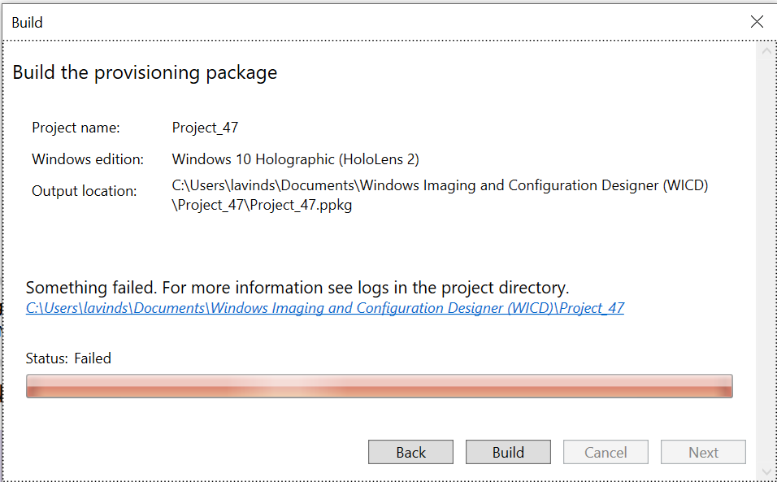

# Set up HoloLens as a kiosk

## What is Kiosk mode?

Kiosk mode is a feature where you can control which applications are shown in start menu when a user signs-in to HoloLens. There are 2 supported scenarios:

1. **Single app kiosk mode** – No start menu is displayed, and a single app is launched automatically, when user signs in.   *Example uses*: A device that runs only a Dynamics 365 Guide for new employees. A device that runs only a custom app.
2. **Multiple app kiosk mode** – Start menu shows only those applications, which were set in kiosk configuration for that user, when that user signs in. An app can be chosen to automatically launch if desired.   *Example uses*: A device that runs both Guides and Remote Assistance for a range of employees. A device that runs a custom app, and allows the Settings app to change Wi-fi and settings per environment changes.

    

## Description of kiosk mode experience when a user signs-in

The following table lists the feature capabilities in the different kiosk modes.

| &nbsp; |Start menu |Quick Actions menu |Camera and video |Miracast |Cortana |Built-in voice commands |
| --- | --- | --- | --- | --- | --- | --- |
|Single-app kiosk |Disabled |Disabled |Disabled |Disabled   |Disabled |Enabled1 |
|Multi-app kiosk |Enabled |Enabled2 |Available2 |Available2 |Available2, 3  |Enabled1 |

> 1 Voice commands that relate to disabled features do not function.  
> 2 For more information about how to configure these features, see [HoloLens AUMIDs for apps](hololens-kiosk-reference.md#hololens-aumids).  
> 3 Even if Cortana is disabled, the built-in voice commands are enabled.

## Key general considerations before configuring kiosk mode

1. Kind of user account - HoloLens supports Azure Active Directory (AAD) accounts, Microsoft Accounts (MSA) and Local accounts. Additionally, temporarily created accounts called guests / visitors are also supported (only for AAD join devices). Learn more at [Manage user identity and sign-in for HoloLens](hololens-identity.md).
2. Target users of kiosk mode – Whether it is everyone, a single user, certain users, or users who are member of AAD group(s), etc.
3. For multiple app kiosk mode, determining application(s) to show on start menu. For each application, its [Application User Model ID (AUMID)](hololens-kiosk-reference.md#hololens-aumids) will be needed.
4. Whether kiosk mode will be applied to HoloLens via either runtime provisioning packages or Mobile Device Management (MDM) server.

## Key technical considerations for Kiosk mode for HoloLens

Applies only if you are planning to use runtime provisioning packages or creating kiosk configurations manually yourself. Kiosk mode configuration uses a hierarchical structure based on XML:

- An assigned access profile defines which applications are displayed in start menu in kiosk mode. You can define multiple profiles in same XML structure, which can be referenced later.
- An assigned access configuration references a profile and target user(s) of that profile, for example, a specific user, or AAD group or visitor, etc. You can define multiple configurations in same XML structure depending on complexity of your usage scenarios (see supported scenarios section below).
- To learn more, refer to [AssignedAccess CSP](/windows/client-management/mdm/assignedaccess-csp).
- [XML Sample HoloLens Kiosks](hololens-kiosk-reference.md#kiosk-xml-code-samples)

## Security considerations

Kiosk mode determines which apps are available when a user signs in to the device. However, kiosk mode is not a security method. Kiosk mode only controls what applications are shown on start menu or are automatically launched on user sign-in. You can combine kiosk mode with options mentioned below if there are specific security related needs:

- When Settings app is configured to show in kiosk mode and you want to control which pages are shown in Settings app, refer to [Page Settings Visibility](settings-uri-list.md)
- When you want to control access to certain hardware capabilities, for example, camera, Bluetooth, etc. for certain apps, etc. refer to [Policies in Policy CSP supported by HoloLens 2 - Windows Client Management](/windows/client-management/mdm/policies-in-policy-csp-supported-by-hololens2). You can review our [Common device restrictions](hololens-common-device-restrictions.md) for ideas.
- Kiosk does not stop an "allowed" app from opening another app that is not allowed. In order to block apps or processes from opening, use [Windows Defender Application Control (WDAC) CSP](/windows/client-management/mdm/applicationcontrol-csp) to create appropriate policies. When you want to completely block launching of certain apps / processes on HoloLens, refer to [Use Windows Defender Application Control on HoloLens 2 devices in Microsoft Intune - Azure](/mem/intune/configuration/custom-profile-hololens)

## Supported scenarios for kiosk mode based on identity type

### For users who sign-in as either Local account or MSA

| **Desired kiosk experience** | **Recommended solution** | **Remarks** |
| --- | --- | --- |
| Every user who signs in gets kiosk experience. | [Configure multiple app Global Assigned Access profile](hololens-kiosk-reference.md#multiple-app-global-assigned-access-profile) | &nbsp; |
| Specific user who signs in gets kiosk experience. | [Configure single or multiple app assigned access profile (as required) specifying name of specific user.](hololens-kiosk-reference.md#multiple-app-assigned-access-profile-for-a-local-account-or-aad-user-account) | For single app kiosk mode, only local user account or MSA account is supported on HoloLens.   For multiple app kiosk mode, only MSA account or AAD account is supported on HoloLens. |

### For users who sign-in as AAD account

| **Desired kiosk experience** | **Recommended solution** | **Remarks** |
| --- | --- | --- |
| Every user who signs in gets kiosk experience. | [Configure multiple app Global Assigned Access profile](hololens-kiosk-reference.md#multiple-app-global-assigned-access-profile) | &nbsp; |
| Every user who signs in gets kiosk experience except certain users. | [Configure multiple app Global Assigned Access profile by excluding certain users (who must be device owners)](hololens-kiosk-reference.md#multiple-app-global-assigned-access-profile-excluding-device-owners). | &nbsp; |
| Every AAD user gets separate kiosk experience specific for that user. | [Configure assigned access configuration for each user specifying their AAD account name.](hololens-kiosk-reference.md#multiple-app-assigned-access-profiles-for-2-aad-users-or-more) | &nbsp; |
| Users in different AAD groups experience kiosk mode that is for their group only. | [Configure assigned access configuration for each desired AAD group.](hololens-kiosk-reference.md#multiple-app-assigned-access-profile-for-2-aad-groups-or-more) | • When a user signs-in and HoloLens is connected with Internet, if that user is found to be a member of AAD group for which kiosk configuration exists, user gets to experience kiosk for that AAD group.   • [If there is no internet available when user sign-in, then user will experience HoloLens failure mode behavior.](hololens-kiosk-reference.md#kiosk-mode-behavior-changes-for-handling-of-failures)   • If internet availability is not guaranteed when user signs-in and AAD group based kiosk needs to be used, [consider using AADGroupMembershipCacheValidityInDayspolicy](hololens-release-notes.md#cache-azure-ad-group-membership-for-offline-kiosk). |
| Users who need to use HoloLens for temporary purposes get kiosk experience. | [Configure assigned access configuration for visitors](hololens-kiosk-reference.md#multiple-app-assigned-access-profile-for-visitors) | • Temporary user account is automatically created by HoloLens on sign-in and is removed when temporary user signs out.   • Consider enabling [visitor auto-login policy](hololens-kiosk-reference.md#enable-visitor-autologon). |

## Steps in configuring kiosk mode for HoloLens

Kiosk mode can be deployed for your organization's device via two methods. Kiosks configured through Microsoft Intune can be automatically deployed to the device, and provisioning packages can be applied to devices manually.

Here are the following ways to configure, select the tab matching the process you'd like to use.

1. [Microsoft Intune single app kiosk template](hololens-kiosk.md?tabs=uisak#steps-in-configuring-kiosk-mode-for-hololens)
1. [Microsoft Intune multi app kiosk template](hololens-kiosk.md?tabs=uimak#steps-in-configuring-kiosk-mode-for-hololens)
1. [Microsoft Intune custom template](hololens-kiosk.md?tabs=intunecustom#steps-in-configuring-kiosk-mode-for-hololens)
1. [Runtime provisioning - Multi app](hololens-kiosk.md?tabs=ppkgmak#steps-in-configuring-kiosk-mode-for-hololens)
1. [Runtime provisioning - Single app](hololens-kiosk.md?tabs=ppkgsak#steps-in-configuring-kiosk-mode-for-hololens)

[!INCLUDE]

## FAQ and Release Notes

### Global Assigned Access – Kiosk

This feature configures HoloLens 2 device for multiple app kiosk mode, which is applicable at system level, has no affinity with any identity on the system and applies to everyone who signs into the device. This feature is available on [20H2 builds or newer.](hololens-release-notes.md#windows-holographic-version-20h2)

### Cache Azure AD Group membership for offline Kiosk

- More secure Kiosk mode by eliminating available apps on Kiosk mode failures.
- Enabled Offline Kiosks to be used with Azure AD groups for up to 60 days.

[MixedReality/AADGroupMembershipCacheValidityInDays](/windows/client-management/mdm/policy-csp-mixedreality#mixedreality-aadgroupmembershipcachevalidityindays)

Steps to use this policy correctly:

1. Create a device configuration profile for kiosk targeting Azure AD groups and assign it to HoloLens device(s).
1. Create a custom OMA URI based device configuration that sets this policy value to desired number of days (> 0) and assign it to HoloLens device(s).
    1. The URI value should be entered in OMA-URI text box as ./Vendor/MSFT/Policy/Config/MixedReality/AADGroupMembershipCacheValidityInDays
    1. The value can be between min / max allowed.
1. Enroll HoloLens devices and verify both configurations get applied to the device.
1. Let Azure AD user 1 sign-in when internet is available, once user signs-in and Azure AD group membership is confirmed successfully, cache will be created.
1. Now Azure AD user 1 can take HoloLens offline and use it for kiosk mode as long as policy value allows for X number of days.
1. Steps 4 and 5 can be repeated for any other Azure AD user N. Key point here is that any Azure AD user must sign-in to device using Internet so at least once we can determine that they are member of Azure AD group to which Kiosk configuration is targeted.

> [!NOTE]
> Until step 4 is performed for a Azure AD user will experience failure behavior mentioned in “disconnected” environments.

### Enable Visitor Autologon

On builds [Windows Holographic, version 21H1](hololens-release-notes.md#windows-holographic-version-21h1) and onwards:

- AAD and Non-ADD configurations both support visitor accounts being autologon enabled for Kiosk modes.

#### Non-AAD configuration

1. Create a provisioning package that:
    1. Configures Runtime settings/AssignedAccess to allow Visitor accounts.
    1. Optionally enrolls the device in MDM (Runtime settings/Workplace/Enrollments) so that it can be managed later.
    1. Do not create a local account
2. [Apply the provisioning package](hololens-provisioning.md).

#### AAD configuration

AAD joined devices configured for kiosk mode can sign in a Visitor account with a single button tap from the sign-in screen. Once signed in to the visitor account, the device will not prompt for sign-in again until the Visitor is explicitly signed out from the start menu or the device is restarted.

Visitor Auto logon can be managed via [custom OMA-URI policy](/mem/intune/configuration/custom-settings-windows-10):

- URI value: ./Device/Vendor/MSFT/MixedReality/VisitorAutoLogon

| Policy | Description | Configurations |
| --------------------------- | ------------- | -------------------- |
| MixedReality/VisitorAutoLogon | Allows for a Visitor to Auto logon to a Kiosk. | 1 (Yes), 0 (No, default.) |

## Tips for Kiosk

If you need to install additional apps to your Kiosk, you can install additional apps from the Microsoft store or by side loading more easily if you have an account that does not use Kiosk. Can also assign [required apps via MDM](/mem/intune/apps/apps-deploy#assign-an-app) to install automatically.

- To help protect devices that run in kiosk mode, consider adding device management policies that turn off features such as USB connectivity. Additionally, check your update ring settings to make sure that automatic updates do not occur during business hours.
- Do not include Classic Windows applications (Win32). HoloLens does not support these applications.
- S mode isn't supported on Windows Holographic for Business.

### Kiosk and HoloLens (1st gen)

Kiosk mode is available only if the device has Windows Holographic for Business. All HoloLens 2 devices ship with Windows Holographic for Business and there are no other editions. Every HoloLens 2 device is able to run Kiosk mode out of the box.

HoloLens (1st gen) devices need to be upgraded both in terms of OS build and OS edition. Here is more information on updating a HoloLens (1st gen) to [Windows Holographic for Business](hololens1-upgrade-enterprise.md) edition. To update a HoloLens (1st gen) device to use kiosk mode, you must first make sure that the device runs Windows 10, version 1803, or a later version. If you have used the Windows Device Recovery Tool to recover your HoloLens (1st gen) device to its default build, or if you have installed the most recent updates, your device is ready to configure.

### Device Portal method

Set up the HoloLens device to use the Windows Device Portal](https://developer.microsoft.com/windows/mixed-reality/using_the_windows_device_portal#setting_up_hololens_to_use_windows_device_portal). The Device Portal is a web server on your HoloLens that you can connect to from a web browser on your PC.

 > [!CAUTION]
 > When you set up HoloLens to use the Device Portal, you have to enable Developer Mode on the device. Developer Mode on a device that has Windows Holographic for Business enables you to side-load apps. However, this setting creates a risk that a user can install apps that have not been certified by the Microsoft Store. Administrators can block the ability to enable Developer Mode by using the **ApplicationManagement/AllowDeveloper Unlock** setting in the [Policy CSP](/windows/client-management/mdm/policy-configuration-service-provider). [Learn more about Developer Mode.](/windows/uwp/get-started/enable-your-device-for-development#developer-mode)

Kiosk Mode can be set via Device Portal’s REST API by doing a POST to /api/holographic/kioskmode/settings with one required query string parameter (“kioskModeEnabled” with a value of “true” or “false”) and one optional parameter (“startupApp” with a value of a package name). Keep in mind that Device Portal is intended for developers only and should not be enabled on non-developer devices. The REST API is subject to change in future updates/releases.

## Troubleshooting

### Kiosk mode behavior changes for handling of failures

When encountering failures in applying kiosk mode, the following behavior appears:

- Prior to Windows Holographic, version 20H2 - HoloLens will show all applications in the Start menu.
- Windows Holographic, version 20H2 - if a device has a kiosk configuration, which is a combination of both global assigned access and AAD group member assigned access, if determining AAD group membership fails, the user will see “nothing shown in start” menu.

- Starting with [Windows Holographic, version 21H1](hololens-release-notes.md#windows-holographic-version-21h1), Kiosk mode looks for Global Assigned Access before showing an empty start menu. The kiosk experience will fall back to a global kiosk configuration (if present) if there are failures during AAD group kiosk mode.

### Issue – Application is not showing up in tiles for multiple-app kiosk mode

**Symptoms**

App is configured in kiosk mode but it is not showing up in start menu.

**Troubleshooting steps** 

Verify that AUMID of app is correctly specified and it does not contain versions. Refer to [this page](/hololens/hololens-kiosk#plan-the-kiosk-deployment) for examples.

### Issue - Building a package with kiosk mode failed

**Symptoms**

A dialog like below is shown.

<kbd>
    
</kbd>

**Troubleshooting steps**

1. Click on the hyper-link shown as in the dialog above.
1. Open ICD.log in a text editor and its contents should indicate the error.

### Issue – Provisioning package built successfully but failed to apply.

**Symptoms**

Error is shown when applying the provisioning package on Hololens

**Troubleshooting steps**

1. Browse to the folder where Windows Configuration Designer project for runtime provisioning package exists.
1. Open ICD.log and ensure that there are no errors in the log while building the provisioning package. Some errors are not showing during build but are still logged in ICD.log

### Issue – Multiple app assigned access to AAD group does not work

**Symptoms**

On AAD user sign-in, device does not go into kiosk mode

**Troubleshooting steps**

Confirm with customer in Assigned Access configuration XML that GUID of AAD group of which signed-in user is a member of is used and not the GUID of the AAD user.Confirm with customer that in Intune portal that AAD user is indeed shown as member of targeted AAD group.