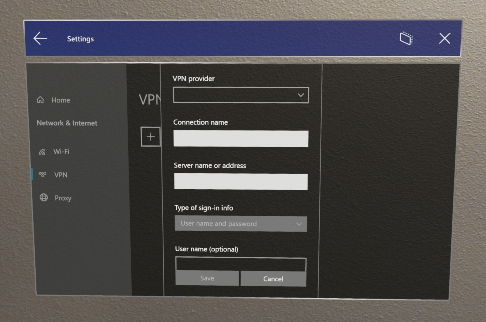

# Connect HoloLens to a network

To do most things on your HoloLens, you have to be connected to a network. This guide will help you:

- Connect to a network using Wi-Fi or (for HoloLens 2 only) Ethernet over USB-C
- Disable and re-enable Wi-Fi

Read more about [using HoloLens offline](hololens-offline.md).

## Connecting for the first time

The first time you use your HoloLens, you'll be guided through connecting to a Wi-Fi network. If you have trouble connecting to Wi-Fi during setup, make sure that your network is either an open, password-protected network or a captive portal network. Make sure that the network doesn't require you to use a certificate to connect. After setup, you can connect to other types of Wi-Fi networks.

On HoloLens 2 devices a user may also [use a USB-C to Ethernet adapter](hololens-connect-devices.md#hololens-2-connect-usb-c-devices) to connect directly to Wi-Fi to help assist in setting up the device. Once the device has been set up a user may continue to user the adapter or they may disconnect the device from the adapter and [connect to wi-fi after set up](hololens-network.md#connecting-to-wi-fi-after-setup). 

## Connecting to Wi-Fi after setup

1. Preform the **Start gesture** and select **Settings**. The Settings app will be auto-placed in front of you.
1. Select **Network & Internet** > **Wi-Fi**. Make sure Wi-Fi is turned on. If you don't see your network, scroll down the list.
1. Select a network, then select **Connect**.
1. If you are prompted for a network password type it and then select **Next**.

HoloLens contains a 802.11ac-capable, 2x2 Wi-Fi radio. Connecting HoloLens to a Wi-Fi network is similar to connecting a Windows 10 Desktop or Mobile device to a Wi-Fi network.


You can also confirm you are connected to a Wi-Fi network by checking the Wi-Fi status in the **Start** menu:

1. Open the **Start** menu.
1. Look at the top left of the **Start** menu for Wi-Fi status. The state of Wi-Fi and the SSID of the connected network will be shown.

## Troubleshooting your connection to Wi-Fi

If you experience problems connecting to Wi-Fi, see [I can't connect to Wi-Fi](./hololens-faq.md#i-cant-connect-to-wi-fi).

When you sign into an enterprise or organizational account on the device, it may also apply Mobile Device Management (MDM) policy, if the policy is configured by your IT administrator.

## VPN
A VPN connection can help provide a more secure connection and access to your company's network and the Internet. HoloLens 2 supports built-in VPN client and Universal Windows Platform (UWP) VPN plug-in. 

Supported Built-in VPN protocols:
- IKEv2
- L2TP
- PPTP

If certificate is used for authentication for built-in VPN client, the required client certificate needs to be added to user certificate store. To find if a 3rd party VPN plug-in supports HoloLens 2, go to Store to locate VPN app and check if HoloLens is listed as a supported device and in the System Requirement page the app supports ARM or ARM64 architecture. HoloLens only supports Universal Windows Platform applications for 3rd party VPN.

 VPN can be managed by MDM via [Settings/AllowVPN](https://docs.microsoft.com/windows/client-management/mdm/policy-csp-settings#settings-allowvpn), and set via  [Vpnv2-csp policy](https://docs.microsoft.com/windows/client-management/mdm/vpnv2-csp).

Learn more about [how to configure VPN](https://support.microsoft.com/help/20510/windows-10-connect-to-vpn) with [these guides](https://docs.microsoft.com/windows/security/identity-protection/vpn/vpn-guide).  

### VPN via UI

VPN is not enabled by default but can be enabled manually by opening **Settings** app and navigating to  **Network & Internet -> VPN**.



### VPN set via Provisioning Package

1. Launch Windows Configuration Designer.
1. Click **Provision HoloLens devices**, then select target device and **Next**.
1. Enter package name and path.
1. Click **Switch to advanced editor**.
1. Open **Runtime settings** -> **ConnectivityProfiles** -> **VPN** -> **VPNSettings**.
1. Configure VPNProfileName
1. Select ProfileType: **Native** or **Third Party**.
    1. For Native profile, select **NativeProtocolType**, then configure server, routing policy, authentication type and other settings.
    1. For "Third Party" profile, configure server URL, VPN plug-in App package family name (only 3 predefined) and custom configurations.
1. Export your package.
1. Connect your HoloLens and copy the .ppkg file to the device. 
1. On HoloLens, apply the VPN .ppkg by opening the Start menu and selecting **Settings** -> **Account** -> **Access work or school** -> **Add or remove provisioning package** -> Select your VPN package.


### Setting up VPN via Intune
Just follow the Intune documents here:
[Create VPN profiles to connect to VPN servers in Intune](https://docs.microsoft.com/mem/intune/configuration/vpn-settings-configure)
When following these steps please keep in mind that HoloLens devices supported Built-in VPN protocols. 

[Windows 10 and Windows Holographic device settings to add VPN connections using Intune](https://docs.microsoft.com/mem/intune/configuration/vpn-settings-windows-10)

When done please remember to [assign the profile](https://docs.microsoft.com/mem/intune/configuration/device-profile-assign).

### VPN via 3rd party MDM solutions
3rd party VPN connection example:
```xml
<!-- Configure VPN Server Name or Address (PhoneNumber=) [Comma Separated]-->
      <Add>
        <CmdID>10001</CmdID>
        <Item>
          <Target>
            <LocURI>./Vendor/MSFT/VPNv2/VPNProfileName/PluginProfile/ServerUrlList</LocURI>
          </Target>
          <Data>selfhost.corp.contoso.com</Data>
        </Item>
      </Add>

      <!-- Configure VPN Plugin AppX Package ID (ThirdPartyProfileInfo=) -->
      <Add>
        <CmdID>10002</CmdID>
        <Item>
          <Target>
            <LocURI>./Vendor/MSFT/VPNv2/VPNProfileName/PluginProfile/PluginPackageFamilyName</LocURI>
          </Target>
          <Data>TestVpnPluginApp-SL_8wekyb3d8bbwe</Data>
        </Item>
      </Add>

      <!-- Configure Microsoft's Custom XML (ThirdPartyProfileInfo=) -->
      <Add>
        <CmdID>10003</CmdID>
        <Item>
          <Target>
            <LocURI>./Vendor/MSFT/VPNv2/VPNProfileName/PluginProfile/CustomConfiguration</LocURI>
          </Target>          <Data><pluginschema><ipAddress>auto</ipAddress><port>443</port><networksettings><routes><includev4><route><address>172.10.10.0</address><prefix>24</prefix></route></includev4></routes><namespaces><namespace><space>.vpnbackend.com</space><dnsservers><server>172.10.10.11</server></dnsservers></namespace></namespaces></networksettings></pluginschema></Data>
        </Item>
      </Add>
```

Native IKEv2 VPN example:
```xml
      <Add>
        <CmdID>10001</CmdID>
        <Item>
          <Target>
            <LocURI>./Vendor/MSFT/VPNv2/VPNProfileName/NativeProfile/Servers</LocURI>
          </Target>
          <Data>Selfhost.corp.contoso.com</Data>
        </Item>
      </Add>

      <Add>
        <CmdID>10002</CmdID>
        <Item>
          <Target>
            <LocURI>./Vendor/MSFT/VPNv2/VPNProfileName/NativeProfile/RoutingPolicyType</LocURI>
          </Target>
          <Data>ForceTunnel</Data>
        </Item>
      </Add>

      <!-- Configure VPN Protocol Type (L2tp, Pptp, Ikev2) -->
      <Add>
        <CmdID>10003</CmdID>
        <Item>
          <Target>
            <LocURI>./Vendor/MSFT/VPNv2/VPNProfileName/NativeProfile/NativeProtocolType</LocURI>
          </Target>
          <Data>Ikev2</Data>
        </Item>
      </Add>

      <!-- Configure VPN User Method (Mschapv2, Eap) -->
      <Add>
        <CmdID>10004</CmdID>
        <Item>
          <Target>
            <LocURI>./Vendor/MSFT/VPNv2/VPNProfileName/NativeProfile/Authentication/UserMethod</LocURI>
          </Target>
          <Data>Eap</Data>
        </Item>
      </Add>

      <Add>
        <CmdID>10004</CmdID>
        <Item>
          <Target>
            <LocURI>./Vendor/MSFT/VPNv2/VPNProfileName/NativeProfile/Authentication/Eap/Configuration</LocURI>
          </Target>
          <Data>EAP_configuration_xml_content</Data>
        </Item>
      </Add>
```
## Disabling Wi-Fi on HoloLens (1st gen)

### Using the Settings app on HoloLens

1. Open the **Start** menu.
1. Select the **Settings** app from **Start** or from the **All Apps** list on the right of the **Start** menu. The **Settings** app will be auto-placed in front of you.
1. Select **Network & Internet**.
1. Select the Wi-Fi slider switch to move it to the **Off** position. This will turn off the RF components of the Wi-Fi radio and disable all Wi-Fi functionality on HoloLens.

    > [!WARNING]
    > When the Wi-Fi radio is disabled, HoloLens will not be able to automatically load your [spaces](hololens-spaces.md).

1. Move the slider switch to the **On** position to turn on the Wi-Fi radio and restore Wi-Fi functionality on Microsoft HoloLens. The selected Wi-Fi radio state (**On** or **Off**) will persist across reboots.

## Identifying the IP Address of your HoloLens on the Wi-Fi network

### By using the Settings app

1. Open the **Start** menu.
1. Select the **Settings** app from **Start** or from the **All Apps** list on the right of the **Start** menu. The **Settings** app will be auto-placed in front of you.
1. Select **Network & Internet**.
1. Scroll down to beneath the list of available Wi-Fi networks and select **Hardware properties**.

    

   The IP address appears next to **IPv4 address**.

### By using voice commands

Depending on your devices build you can either use built in voice commands or Cortana to display your IP address. On builds after [19041.1103](hololens-release-notes.md#windows-holographic-version-2004) speak "What's my IP address?" and it will be displayed. For earlier builds or HoloLens (1st gen) say "Hey Cortana, What's my IP address?" and Cortana will display and read out your IP address.

### By using Windows Device Portal

1. In a web browser on your PC, open the [device portal](/windows/mixed-reality/using-the-windows-device-portal.md#networking).
1. Navigate to the **Networking** section.  
   This section displays your IP address and other network information. By using this method, you can copy and paste of the IP address on your development PC.
