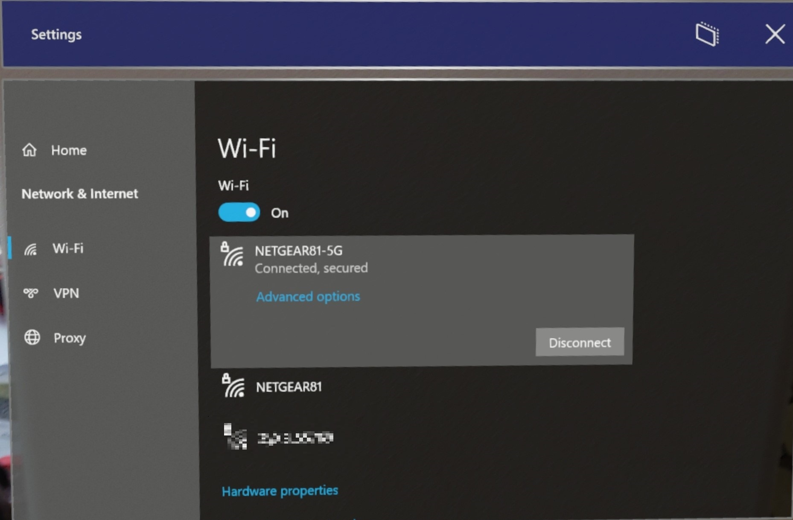

# Connect HoloLens to a network

To do most things on your HoloLens, you have to be connected to a network. HoloLens contains a 802.11ac-capable, 2x2 Wi-Fi radio and connecting it to a network is similar to connecting a Windows 10 Desktop or Mobile device to a Wi-Fi network. This guide will help you:

- Connect to a network using Wi-Fi, or for HoloLens 2 only, Wi-Fi Direct or Ethernet over USB-C
- Disable and re-enable Wi-Fi

Read more about [using HoloLens offline](hololens-offline.md).

## Connecting for the first time

The first time you use your HoloLens, you'll be guided through connecting to a Wi-Fi network. If you have trouble connecting to Wi-Fi during setup, make sure that your network is either an open, password-protected network or a captive portal network. Also, confirm that the network doesn't require you to use a certificate to connect. After setup, you can connect to other types of Wi-Fi networks.

On HoloLens 2 devices, a user may also [use a USB-C to Ethernet adapter](hololens-connect-devices.md#hololens-2-connect-usb-c-devices) to connect directly to Wi-Fi to help assist in setting up the device. Once the device has been set up a user may continue to use the adapter or they may disconnect the device from the adapter and [connect to wi-fi after set up](hololens-network.md#connecting-to-wi-fi-after-setup). 

## Connecting to Wi-Fi after setup

1. Preform the **Start gesture** and select **Settings**. The Settings app will be auto-placed in front of you.
1. Select **Network & Internet** > **Wi-Fi**. Make sure Wi-Fi is turned on. If you don't see your network, scroll down the list.
1. Select a network, then select **Connect**.
1. If you are prompted for a network password type it and then select **Next**.



To confirm you are connected to a Wi-Fi network, check the Wi-Fi status in the **Start** menu:

1. Open the **Start** menu.
1. Look at the top left of the **Start** menu for Wi-Fi status. The state of Wi-Fi and the SSID of the connected network will be shown.

> [!TIP]
> If Wi-Fi is not available, you can also [connect to Cellular and 5G networks](https://docs.microsoft.com/hololens/hololens-cellular).

> [!IMPORTANT]
> By design, users cannot fine tune the Wi-Fi roaming behavior of the HoloLens 2 - **the only way to refresh the Wi-Fi list is to toggle the Wi-Fi Off and On**. This prevents many issues, like where a device can remain "stuck" to an AP once it is out of range.

## Connect HoloLens to Enterprise Wi-Fi Network

Enterprise Wi-Fi profiles use Extensible Authentication Protocol (EAP) to authenticate Wi-Fi connections. HoloLens Enterprise Wi-Fi profile can be configured through MDM or provisioning package created by [Windows Configuration Designer](https://docs.microsoft.com/windows/configuration/provisioning-packages/provisioning-packages).

For Microsoft Intune managed device, refer to [Intune](https://docs.microsoft.com/mem/intune/configuration/wi-fi-settings-windows#enterprise-profile) for configuration instructions.

To create a Wi-Fi provisioning package in WCD, a pre-configured Wi-Fi profile .xml file is required. Here is a sample Wi-Fi profile for WPA2-Enterprise with EAP-TLS authentication:

``` xml
<?xml version="1.0"?> 
<WLANProfile xmlns="http://www.microsoft.com/networking/WLAN/profile/v1"> 
    <name>SampleEapTlsProfile</name> 
    <SSIDConfig> 
        <SSID> 
            <hex>53616d706c65</hex> 
            <name>Sample</name> 
        </SSID> 
        <nonBroadcast>true</nonBroadcast> 
    </SSIDConfig> 
    <connectionType>ESS</connectionType> 
    <connectionMode>auto</connectionMode> 
    <autoSwitch>false</autoSwitch> 
    <MSM> 
        <security> 
            <authEncryption> 
                <authentication>WPA2</authentication> 
                <encryption>AES</encryption> 
                <useOneX>true</useOneX> 
                <FIPSMode xmlns="http://www.microsoft.com/networking/WLAN/profile/v2">false</FIPSMode> 
            </authEncryption> 
            <PMKCacheMode>disabled</PMKCacheMode> 
            <OneX xmlns="http://www.microsoft.com/networking/OneX/v1"> 
                <authMode>machine</authMode> 
                <EAPConfig> 
                    <EapHostConfig xmlns="http://www.microsoft.com/provisioning/EapHostConfig"> 
                        <EapMethod> 
                            <Type xmlns="http://www.microsoft.com/provisioning/EapCommon">13</Type> 
                            <VendorId xmlns="http://www.microsoft.com/provisioning/EapCommon">0</VendorId> 
                            <VendorType xmlns="http://www.microsoft.com/provisioning/EapCommon">0</VendorType> 
                            <AuthorId xmlns="http://www.microsoft.com/provisioning/EapCommon">0</AuthorId> 
                        </EapMethod> 
                        <Config xmlns="http://www.microsoft.com/provisioning/EapHostConfig"> 
                            <Eap xmlns="http://www.microsoft.com/provisioning/BaseEapConnectionPropertiesV1"> 
                                <Type>13</Type> 
                                <EapType xmlns="http://www.microsoft.com/provisioning/EapTlsConnectionPropertiesV1"> 
                                    <CredentialsSource><CertificateStore><SimpleCertSelection>true</SimpleCertSelection> 
                                        </CertificateStore> 
                                    </CredentialsSource> 
                                    <ServerValidation> 
                                        <DisableUserPromptForServerValidation>false</DisableUserPromptForServerValidation> 
                                        <ServerNames></ServerNames> 
                                        <TrustedRootCA>00 01 02 03 04 05 06 07 08 09 0a 0b 0c 0d 0e 0f 10 11 12 13</TrustedRootCA> 
                                    </ServerValidation> 
                                    <DifferentUsername>false</DifferentUsername> 
                                    <PerformServerValidation xmlns="http://www.microsoft.com/provisioning/EapTlsConnectionPropertiesV2">true</PerformServerValidation> 
                                    <AcceptServerName xmlns="http://www.microsoft.com/provisioning/EapTlsConnectionPropertiesV2">false</AcceptServerName> 
                                </EapType> 
                            </Eap> 
                        </Config> 
                    </EapHostConfig> 
                </EAPConfig> 
            </OneX> 
        </security> 
    </MSM> 
</WLANProfile> 
```


Server root CA certificate and client certificate may need to be provisioned on the device depending on the EAP type.

Additional resources:

- WLANv1Profile Schema: [[MS-GPWL]: Wireless LAN Profile v1 Schema | Microsoft Docs](https://docs.microsoft.com/openspecs/windows_protocols/ms-gpwl/34054c93-cfcd-44df-89d8-5f2ba7532b67)
- EAP-TLS Schema: [[MS-GPWL]: Microsoft EAP TLS Schema | Microsoft Docs](https://docs.microsoft.com/openspecs/windows_protocols/ms-gpwl/9590925c-cba2-4ac5-b9a1-1e5292bb72cb)

Check our [Troubleshooting](hololens2-enterprise-troubleshooting#network.md) page if you are having problems connecting to your Wi-Fi.

## Configure Network Proxy

This section covers network proxy for HoloLens OS and Universal Windows Platform (UWP) Apps using Windows HTTP stack. Applications using non-Windows HTTP stack may have their own proxy configuration and handling. 

### Proxy Configurations 

- Proxy Auto-Config (PAC) script: a [PAC file](https://developer.mozilla.org/en-US/docs/Web/HTTP/Proxy_servers_and_tunneling/Proxy_Auto-Configuration_PAC_file) (opens a non-Microsoft site) contains a JavaScript function FindProxyForURL(url, host). 
- Static Proxy: in the form of Server:Port.  
- Web Proxy Auto-Discovery Protocol (WPAD): provide URL of proxy configuration file through DHCP or DNS. 

### Proxy Provisioning Methods 
There are three ways to provision proxies:

 

1.  **Settings UI:** 
    1. Per-user proxy (20H2 or earlier):
        1. Open the Start menu and select Settings.
        2. Select Network & Internet and then Proxy on the left menu.
        3. Scroll down to Manual proxy setup and toggle Use a proxy server to On.
        4. Enter the IP address of the proxy server.
        5. Enter the port number.
        6. Click Save.
      1. WiFi proxy (21H1 or higher):
          1. Open the Start menu and go to your Wi-Fi Network’s Properties page.
          1. Scroll down to Proxy
          1. Change to Manual Setup
          1. Enter the IP address of the proxy server.
          1. Enter the port number.
          1. Click Apply.
        
 2. **MDM** 
     1. Intune - Use these [steps](https://docs.microsoft.com/mem/intune/configuration/wi-fi-settings-windows#enterprise-profile) to configure proxy in Intune. You will need to scroll to the bottom of the section.
     1. Other 3rd party MDM solutions - Use a [WiFi CSP](https://docs.microsoft.com/windows/client-management/mdm/wifi-csp).

3. **PPKG** 
    1. Open Windows Configuration Designer
    1. Click on Advanced Provisioning, enter the name for your new Project and click Next.
    1. Select Windows Holographic (HoloLens 2) and click Next.
    1. Import your PPKG (optional) and click Finish.
    1. Expand Runtime Settings -> Connectivity Profiles -> WLAN -> WLAN Proxy.
    1. Enter the SSID of your Wi-Fi network and click Add.
    1. Select your Wi-Fi network in the left window and enter your desired customizations. The enabled customizations will show in bold on the left menu.
    1. Click Save and Exit.
    1. [Apply](https://docs.microsoft.com/hololens/hololens-provisioning#applyremove-a-provisioning-package-to-hololens-after-setup) the provisioning package to the HoloLens.

[CSPs](https://docs.microsoft.com/windows/configuration/provisioning-packages/how-it-pros-can-use-configuration-service-providers) are behind many of the management tasks and policies for Windows 10, both in Microsoft Intune and in non-Microsoft MDM service providers. You can also use [Windows Configuration Designer](https://docs.microsoft.com/windows/configuration/provisioning-packages/provisioning-install-icd) to create a [provisioning package](https://docs.microsoft.com/windows/configuration/provisioning-packages/provisioning-packages) and apply it to the HoloLens 2.
The most likely CSPs that will be applied to your HoloLens 2 are:

- [WiFi CSP](https://docs.microsoft.com/windows/client-management/mdm/wifi-csp): per-profile Wi-Fi proxy 

[Other CSPs supported in HoloLens devices](https://docs.microsoft.com/windows/client-management/mdm/configuration-service-provider-reference#hololens)


## VPN
A VPN connection can help provide a more secure connection and access to your company's network and the Internet. HoloLens 2 supports built-in VPN client and Universal Windows Platform (UWP) VPN plug-in. 

Supported Built-in VPN protocols:
- IKEv2
- L2TP
- PPTP

If certificate is used for authentication for built-in VPN client, the required client certificate needs to be added to user certificate store. To find if a 3rd party VPN plug-in supports HoloLens 2, go to Store to locate VPN app and check if HoloLens is listed as a supported device and in the System Requirement page the app supports ARM or ARM64 architecture. HoloLens only supports Universal Windows Platform applications for 3rd party VPN.

 VPN can be managed by MDM via [Settings/AllowVPN](https://docs.microsoft.com/windows/client-management/mdm/policy-csp-settings#settings-allowvpn), and set via  [Vpnv2-csp policy](https://docs.microsoft.com/windows/client-management/mdm/vpnv2-csp).

Learn more about [how to configure VPN](https://support.microsoft.com/help/20510/windows-10-connect-to-vpn) with [these guides](https://docs.microsoft.com/windows/security/identity-protection/vpn/vpn-guide).  

### VPN via UI

VPN is not enabled by default but can be enabled manually by opening **Settings** app and navigating to  **Network & Internet -> VPN**.
1. Select a VPN provider.
1. Create a connection name. 
1. Enter your server name or address.
1. Select the VPN type.
1. Select type of sign-in info. 
1. Optionally add user name and password.
1. Apply the VPN settings. 


### VPN set via Provisioning Package

> [!TIP] 
> In our Windows Holographic, version 20H2 we fixed a proxy configuration issue for VPN connection. Please consider upgrading devices to this build if you intend to use this flow.

1. Launch Windows Configuration Designer.
1. Click **Provision HoloLens devices**, then select target device and **Next**.
1. Enter package name and path.
1. Click **Switch to advanced editor**.
1. Open **Runtime settings** -> **ConnectivityProfiles** -> **VPN** -> **VPNSettings**.
1. Configure VPNProfileName
1. Select ProfileType: **Native** or **Third Party**.
    1. For Native profile, select **NativeProtocolType**, then configure server, routing policy, authentication type and other settings.
    1. For "Third Party" profile, configure server URL, VPN plug-in App package family name (only 3 predefined) and custom configurations.
1. Export your package.
1. Connect your HoloLens and copy the .ppkg file to the device. 
1. On HoloLens, apply the VPN .ppkg by opening the Start menu and selecting **Settings** -> **Account** -> **Access work or school** -> **Add or remove provisioning package** -> Select your VPN package.


### Setting up VPN via Intune
Just follow the Intune documents to get started. When following these steps please keep in mind the built-in VPN protocols that HoloLens devices support. 

[Create VPN profiles to connect to VPN servers in Intune](https://docs.microsoft.com/mem/intune/configuration/vpn-settings-configure).

[Windows 10 and Windows Holographic device settings to add VPN connections using Intune](https://docs.microsoft.com/mem/intune/configuration/vpn-settings-windows-10).

When done please remember to [assign the profile](https://docs.microsoft.com/mem/intune/configuration/device-profile-assign).

### VPN via 3rd party MDM solutions
3rd party VPN connection example:
```xml
<!-- Configure VPN Server Name or Address (PhoneNumber=) [Comma Separated]-->
      <Add>
        <CmdID>10001</CmdID>
        <Item>
          <Target>
            <LocURI>./Vendor/MSFT/VPNv2/VPNProfileName/PluginProfile/ServerUrlList</LocURI>
          </Target>
          <Data>selfhost.corp.contoso.com</Data>
        </Item>
      </Add>

      <!-- Configure VPN Plugin AppX Package ID (ThirdPartyProfileInfo=) -->
      <Add>
        <CmdID>10002</CmdID>
        <Item>
          <Target>
            <LocURI>./Vendor/MSFT/VPNv2/VPNProfileName/PluginProfile/PluginPackageFamilyName</LocURI>
          </Target>
          <Data>TestVpnPluginApp-SL_8wekyb3d8bbwe</Data>
        </Item>
      </Add>

      <!-- Configure Microsoft's Custom XML (ThirdPartyProfileInfo=) -->
      <Add>
        <CmdID>10003</CmdID>
        <Item>
          <Target>
            <LocURI>./Vendor/MSFT/VPNv2/VPNProfileName/PluginProfile/CustomConfiguration</LocURI>
          </Target>          <Data><pluginschema><ipAddress>auto</ipAddress><port>443</port><networksettings><routes><includev4><route><address>172.10.10.0</address><prefix>24</prefix></route></includev4></routes><namespaces><namespace><space>.vpnbackend.com</space><dnsservers><server>172.10.10.11</server></dnsservers></namespace></namespaces></networksettings></pluginschema></Data>
        </Item>
      </Add>
```

Native IKEv2 VPN example:
```xml
      <Add>
        <CmdID>10001</CmdID>
        <Item>
          <Target>
            <LocURI>./Vendor/MSFT/VPNv2/VPNProfileName/NativeProfile/Servers</LocURI>
          </Target>
          <Data>Selfhost.corp.contoso.com</Data>
        </Item>
      </Add>

      <Add>
        <CmdID>10002</CmdID>
        <Item>
          <Target>
            <LocURI>./Vendor/MSFT/VPNv2/VPNProfileName/NativeProfile/RoutingPolicyType</LocURI>
          </Target>
          <Data>ForceTunnel</Data>
        </Item>
      </Add>

      <!-- Configure VPN Protocol Type (L2tp, Pptp, Ikev2) -->
      <Add>
        <CmdID>10003</CmdID>
        <Item>
          <Target>
            <LocURI>./Vendor/MSFT/VPNv2/VPNProfileName/NativeProfile/NativeProtocolType</LocURI>
          </Target>
          <Data>Ikev2</Data>
        </Item>
      </Add>

      <!-- Configure VPN User Method (Mschapv2, Eap) -->
      <Add>
        <CmdID>10004</CmdID>
        <Item>
          <Target>
            <LocURI>./Vendor/MSFT/VPNv2/VPNProfileName/NativeProfile/Authentication/UserMethod</LocURI>
          </Target>
          <Data>Eap</Data>
        </Item>
      </Add>

      <Add>
        <CmdID>10004</CmdID>
        <Item>
          <Target>
            <LocURI>./Vendor/MSFT/VPNv2/VPNProfileName/NativeProfile/Authentication/Eap/Configuration</LocURI>
          </Target>
          <Data>EAP_configuration_xml_content</Data>
        </Item>
      </Add>
```
## Disabling Wi-Fi on HoloLens (1st gen)

### Using the Settings app on HoloLens

1. Open the **Start** menu.
1. Select the **Settings** app from **Start** or from the **All Apps** list on the right of the **Start** menu. The **Settings** app will be auto-placed in front of you.
1. Select **Network & Internet**.
1. Select the Wi-Fi slider switch to move it to the **Off** position. This will turn off the RF components of the Wi-Fi radio and disable all Wi-Fi functionality on HoloLens.

    > [!WARNING]
    > When the Wi-Fi radio is disabled, HoloLens will not be able to automatically load your [spaces](hololens-spaces.md).

1. Move the slider switch to the **On** position to turn on the Wi-Fi radio and restore Wi-Fi functionality on Microsoft HoloLens. The selected Wi-Fi radio state (**On** or **Off**) will persist across reboots.

## Identifying the IP Address of your HoloLens on the Wi-Fi network

### By using the Settings app

1. Open the **Start** menu.
1. Select the **Settings** app from **Start** or from the **All Apps** list on the right of the **Start** menu. The **Settings** app will be auto-placed in front of you.
1. Select **Network & Internet**.
1. Scroll down to beneath the list of available Wi-Fi networks and select **Hardware properties**.

    

   The IP address appears next to **IPv4 address**.

### By using voice commands

Depending on your devices build you can either use built in voice commands or Cortana to display your IP address. On builds after [19041.1103](hololens-release-notes.md#windows-holographic-version-2004) speak "What's my IP address?" and it will be displayed. For earlier builds or HoloLens (1st gen) say "Hey Cortana, What's my IP address?" and Cortana will display and read out your IP address.

### By using Windows Device Portal

1. In a web browser on your PC, open the [device portal](/windows/mixed-reality/using-the-windows-device-portal.md#networking).
1. Navigate to the **Networking** section.  
   This section displays your IP address and other network information. By using this method, you can copy and paste of the IP address on your development PC.

## Change IP Address to static address
### By using Settings
 
1. Open the **Start** menu.
1. Select the **Settings** app from **Start** or from the **All Apps** list on the right of the **Start** menu. The **Settings** app will be auto-placed in front of you.
1. Select **Network & Internet**.
1. Scroll down to beneath the list of available Wi-Fi networks and select **Hardware properties**.
1. In the **Edit IP settings** window, change the first field to **Manual**.
1. Input the desired IP configuration in the remaining fields and then click **Save**.

### By using Windows Device Portal

1. In a web browser on your PC, open the [device portal](/windows/mixed-reality/using-the-windows-device-portal.md#networking).
1. Navigate to the **Networking** section.
1. Select the **IPv4 Configuration** button.
1. Select **Use the following IP address** and input the desired TCP/IP configuration.
1. Select **Use the following DNS server addresses** and enter the Preferred and Alternate DNS server addresses, if needed.
1. Click **Save**. 
