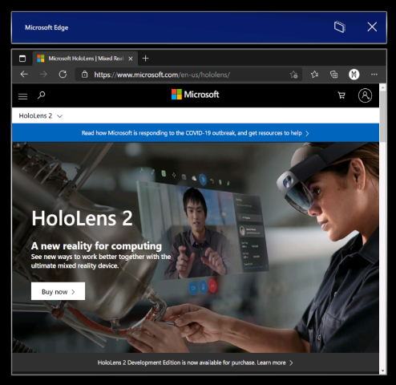

# Introducing the new Microsoft Edge


The new Microsoft Edge [adopts the Chromium open source project](https://blogs.windows.com/windowsexperience/2018/12/06/microsoft-edge-making-the-web-better-through-more-open-source-collaboration/) to create better compatibility for customers and less fragmentation of the web for web developers.

With [Windows Holographic, version 21H1](hololens-release-notes.md#windows-holographic-version-21h1), the new Microsoft Edge is available to HoloLens 2 customers for the first time! Please share feedback and bugs with our team via the **Send Feedback** feature in the new Microsoft Edge or via [Feedback Hub](hololens-feedback.md).

> [!IMPORTANT]
> This new Microsoft Edge automatically replaces legacy Microsoft Edge, which is [no longer supported](https://blogs.windows.com/msedgedev/2021/03/09/microsoft-edge-legacy-end-of-support/) in new releases.



## Launching the new Microsoft Edge

The new Microsoft Edge  (represented by a blue and green swirl icon) is pinned to the Start menu and will automatically launch when you activate a web link.

> [!NOTE]
> When you first launch the new Microsoft Edge on HoloLens 2, your settings and data will be imported from legacy Microsoft Edge.

## Configuring policy settings for the new Microsoft Edge

The new Microsoft Edge offers IT admins a much broader set of browser policies on HoloLens 2 than were previously available with legacy Microsoft Edge.

Here are some helpful resources for learning more about managing policy settings for the new Microsoft Edge:

- [Configure Microsoft Edge policy settings with Microsoft Intune](https://docs.microsoft.com/deployedge/configure-edge-with-intune)
- [Microsoft Edge Legacy to Microsoft Edge policy mapping](https://docs.microsoft.com/deployedge/microsoft-edge-policy-map-legacy-to-newedge)
- [Google Chrome to Microsoft Edge policy mapping](https://docs.microsoft.com/deployedge/microsoft-edge-policy-map-chrome-to-newedge)
- Full [Microsoft Edge Enterprise documentation](https://docs.microsoft.com/deployedge/)

> [!IMPORTANT]
> Because of the volume of browser policies supported by the new Microsoft Edge, our team is unable to guarantee that each new policy works on HoloLens 2. However, we've tested and confirmed than the new Microsoft Edge equivalent of each legacy Microsoft Edge policy previously supported on HoloLens 2 work as expected. See [Microsoft Edge Legacy to Microsoft Edge policy mapping](https://docs.microsoft.com/deployedge/microsoft-edge-policy-map-legacy-to-newedge) to find the new Microsoft Edge equivalent of each legacy Microsoft Edge browser policy you were using with HoloLens 2.
>
> There are at least two new Microsoft Edge policies that we know *will not* work with HoloLens 2:
> - EnterpriseModeSiteList
> - EnterpriseSiteListServiceURL

## What to expect from the new Microsoft Edge on HoloLens 2

Because the new Microsoft Edge is a native Win32 app with a new UWP adapter layer allowing it to run on UWP-only devices like HoloLens 2, some features may not be immediately available. We'll be supporting new scenarios and features over the coming months, so check this space for up-to-date information.

**Scenarios and features expected to work:**
- First-run experience, sign in to profile, and sync
- Websites should render and behave as expected
- Most browser functionality (Favorites, History, etc.) should work as expected
- Dark mode
- Installing web apps to the device
- Installing extensions (please let us know if you use any extensions that don't work properly on HoloLens 2)
- Viewing and marking up a PDF
- Spatial sound from a single browser window
- Automatic and manual updating of the browser
- Saving a PDF from the Print menu (using "Save to PDF" option)
- WebXR and 360 Viewer extension
- Content restoration to correct window, when browsing across multiple windows placed in your environment

**Scenarios and features not expected to work:**
- Spatial sound from multiple windows with simultaneous audio streams
- "See it, say it"
- Printing

**Top known browser issues:**
- The magnifier preview in the holographic keyboard has been disabled for the new Microsoft Edge. We hope to reenable this feature in a future update, once the magnification is working correctly.
- Audio may play from the wrong browser window if you have another browser window open and active. You can work around this issue by closing the other active window that isn't supposed to be playing audio.
- When playing audio from a browser window in "Follow me" mode, the audio will continue playing if you disable "Follow me" mode. You can work around this issue by stopping audio playback before disabling "Follow me" mode or by closing the window with the X button.
- Interacting with active Microsoft Edge windows may cause other 2D app windows to go inactive unexpectedly. You can reactivate these windows by interacting with them again.

## Microsoft Edge Insider channels

The Microsoft Edge team makes three preview channels available to the Edge Insider community: Beta, Dev, and Canary. Installing a preview channel doesn't uninstall the released version of Microsoft Edge on your HoloLens 2, and you can install more than one at the same time. 

Visit the [Microsoft Edge Insider homepage](https://www.microsoftedgeinsider.com) to learn more about the Edge Insider community. To learn more about the different Edge Insider channels and get started, visit the [Edge Insider download page](https://www.microsoftedgeinsider.com/download).

There are a couple methods available for installing Microsoft Edge Insider channels to HoloLens 2:

**Direct install on device (currently only available to unmanaged devices)**
  1. On your HoloLens 2, visit the [Edge Insider download page](https://www.microsoftedgeinsider.com/download).
  1. Select the **Download for HoloLens 2** button for the Edge Insider channel you wish to install.
  1. Launch the downloaded .msix file from the Edge download queue or from your device's "Downloads" folder (using File Explorer).
  1. [App installer](app-deploy-app-installer.md) will launch.
  1. Select the **Install** button.
  1. After successful install, you'll find Microsoft Edge Beta, Dev, or Canary as a separate entry in the **All apps** list of the Start menu.

**Install via PC with Windows Device Portal (requires [developer mode](https://docs.microsoft.com/windows/mixed-reality/develop/platform-capabilities-and-apis/using-the-windows-device-portal#setting-up-hololens-to-use-windows-device-portal) to be enabled on HoloLens 2)**
  1. On your PC, visit the [Edge Insider download page](https://www.microsoftedgeinsider.com/download).
  1. Select the **drop-down arrow button** next to the "Download for Windows 10" button for the Edge Insider channel you wish to install.
  1. Select **HoloLens 2** in the drop-down menu.
  1. Save the .msix file to the "Downloads" folder of your PC (or another folder you can easily find).
  1. Use [Windows Device Portal](https://docs.microsoft.com/windows/mixed-reality/develop/platform-capabilities-and-apis/using-the-windows-device-portal#installing-an-app) on your PC to install the downloaded .msix file on HoloLens 2.
  1. After successful install, you'll find Microsoft Edge Beta, Dev, or Canary as a separate entry in the **All apps** list of the Start menu.

## Using WDAC to block new Microsoft Edge

For IT Admins looking to update their [WDAC policy](windows-defender-application-control-wdac.md) to block the new Microsoft Edge app, you'll need to add the following to your policy.

``` <Deny ID="ID_DENY_D_3_0" FriendlyName="C:\Data\Programs FileRule" PackageVersion="65535.65535.65535.65535" FileName="msedge.exe" /> ```

## Managing endpoints for the new Microsoft Edge

Some environments may have network restrictions to account for as a consideration. To ensure a smooth experience with the new Edge please [enable these Microsoft endpoints.](https://docs.microsoft.com/deployedge/microsoft-edge-security-endpoints)

Read more about the currently available [endpoints for HoloLens](hololens-offline.md).

## Install web apps
 > [!Note]
> As of [Windows Holographic, version 21H1](hololens-release-notes.md#windows-holographic-version-21h1), the Office web app will no longer be pre-installed. 

You can use the new Edge to install web apps alongside Microsoft Store apps. For example, you can install the Microsoft Office web app to view and edit files hosted on SharePoint or OneDrive. To install the Office web app, visit https://www.office.com and select the **App Available** or **Install Office** button in the address bar. Select **Install** to confirm.
> [!IMPORTANT]
> Office web app functionality is only available when your HoloLens 2 has an active internet connection.

## WebXR and 360 Viewer


The new Microsoft Edge includes support for WebXR, which is the new standard for creating immersive web experiences (replacing WebVR). Many immersive web experiences were designed with VR in mind (they replace your field of view with a virtual environment), but these experiences are also supported by HoloLens 2. The WebXR standard also enables augmented and mixed reality immersive web experiences that use your physical environment. As developers spend more time with WebXR, we anticipate new augmented and mixed reality immersive experiences will arrive for HoloLens 2 customers to try!

The 360 Viewer extension is built on WebXR and automatically installs alongside the new Microsoft Edge on HoloLens 2. This web extension gives you the ability to immerse yourself in 360-degree videos. YouTube offers the largest selection of 360 videos, so we encourage you to start there.

### How to use WebXR

1. Navigate to a website with WebXR support.
1. Select the **Enter VR** button on the website. The location and visual representation of this button may vary per website, but it may look similar to:

    

1. The first time you try to launch a WebXR experience on a specific domain, the browser will ask for consent to enter an immersive view, select **Allow**.
1. Use [HoloLens 2 gestures](hololens2-basic-usage.md#the-hand-tracking-frame) to manipulate the experience.
1. If the experience doesn't have an **Exit** button, use the [Start gesture](hololens2-basic-usage.md#start-gesture) to return home.

**Recommended WebXR samples**
- 360 Viewer (see next section)
- [XR Dinosaurs](https://www.xrdinosaurs.com/)
- [Barista Express](https://constructarca.de/game/barista-express/)
- [WebXR Paint](https://threejs.org/examples/webxr_vr_paint.html)

### How to use 360 Viewer

1. Navigate to a 360-degree video on YouTube.
1. In the video frame, select the mixed reality headset button:

    

1. The first time you try to launch 360 Viewer on a specific domain, the browser will ask for consent to enter an immersive view. Select **Allow**.
1. [Air tap](hololens2-basic-usage.md#select-using-air-tap) to bring up the playback controls. Use [hand rays and air tap](hololens2-basic-usage.md#select-using-air-tap) to play/pause, skip forward/back, turn captions on/off, or stop the experience (which exits the immersive view). The playback controls will disappear after a few seconds of inactivity.

### Top WebXR and 360 Viewer known issues
- Depending on the complexity of the WebXR experience, the framerate may drop or stutter.
- Support for articulated hand joints in WebXR is not enabled by default. Developers can enable support via edge://flags by turning on "WebXR Hand Input."
- 360 videos from websites other than YouTube may not work as expected.

### Providing feedback on WebXR and 360 Viewer

Please share feedback and bugs with our team via the **Send Feedback** feature in the new Microsoft Edge.
