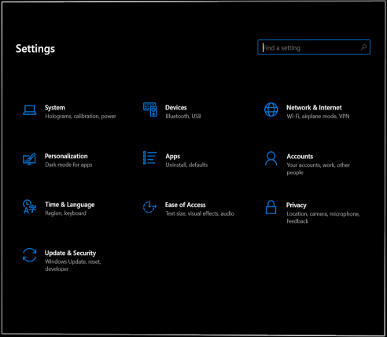

# New Settings app

With [Windows Holographic, version 21H1](hololens-release-notes.md#windows-holographic-version-21h1), we're introducing a new version of the Settings app. The new Settings app includes new features and expanded settings for HoloLens 2 in the following areas: Sound, Power & sleep, Network & Internet, Apps, Accounts, Ease of Access, and more.

> [!NOTE]
> Because the new Settings app is distinct from the legacy Settings app, any Settings windows you previously placed around your environment will be removed upon update.

**New features and settings**
- Settings search: search for settings from the Settings homepage using keywords or the setting's name.
- System > [Color calibration](hololens2-display.md#how-to-use-display-color-calibration)
    - Select an alternative color profile for your HoloLens 2 display.
- System > Sound:
  - Input and output audio devices: independently choose your input and output audio devices (for example, listen to audio via Bluetooth headphones or use a USB-C microphone for audio input).
    > [!NOTE]
    > Bluetooth microphones are not supported by HoloLens 2.
  - App volume: independently adjust the volume of each app. See [per app volume control](#per-app-volume-control).
- System > Power & sleep: choose when the device should go to sleep after a period of inactivity.
- System > Battery: manually enable battery saver mode or set a battery threshold at which point battery saver mode turns on automatically.
- Devices > USB: you can disable USB connections by default.
- Network & Internet:
  - USB-C Ethernet adapters will now appear in Network & Internet.
  - USB-C Ethernet adapter settings are now available, including its IP address.
  - You can now enable airplane mode on HoloLens 2.
- Apps: you can reset the default apps used for file and link types. For more information see [Default app picker](#default-app-picker).
- Accounts > Other users: device owners can add users, upgrade standard users to device owners, downgrade device owners to standard users, and remove users.
- Ease of Access: change text size and some visual effects.

**Known issues**
- Previously placed Settings windows will be removed (see note above).
- You can no longer rename your device with the Settings app. IT admins can rename devices by using the [Windows Autopilot for HoloLens 2](https://docs.microsoft.com/hololens/hololens2-autopilot) device name template or the MDM [DevDetail CSP](https://docs.microsoft.com/windows/client-management/mdm/devdetail-csp) Ext/Microsoft/DNSComputerName node.
- The Ethernet page shows a virtual Ethernet device ("UsbNcm") at all times.
- Battery usage for the new Microsoft Edge may not be accurate, due to its nature as a Win32 desktop application supported by a UWP adapter layer (no fix anticipated soon).

