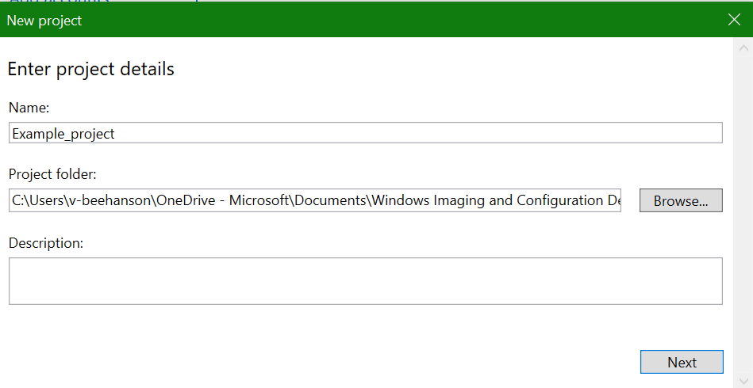

# Configure HoloLens by using a provisioning package

[Windows provisioning](/windows/configuration/provisioning-packages/provisioning-packages) makes it easy for IT administrators to configure end user devices without imaging. Windows Configuration Designer is a tool for configuring images and runtime settings that are then built into provisioning packages.

Some of the HoloLens configurations that you can apply in a provisioning package include the following:

- Upgrade HoloLens (1st gen) to [Windows Holographic for Business](hololens1-upgrade-enterprise.md)
- Set up a local account
- Set up a Wi-Fi connection
- Apply certificates to the device
- Enable Developer Mode
- Configure Kiosk mode by following our [detailed instructions](hololens-kiosk.md?tabs=ppkgmak#steps-in-configuring-kiosk-mode-for-hololens).

## Provisioning package HoloLens wizard

The HoloLens wizard helps you configure the following settings in a provisioning package:

- Upgrade HoloLens (1st gen) from Windows Holographic to the Enterprise edition, Windows Holographic for Business

    > [!NOTE]
    > These settings can only be applied to HoloLens (1st gen) if the provisioning package includes an edition upgrade license to Windows Holographic for Business, or if the device has [already been upgraded to Windows Holographic for Business](hololens1-upgrade-enterprise.md).

- Configure the HoloLens first experience (OOBE)
- Configure the Wi-Fi network
- Enroll the device in Azure Active Directory, or create a local account
- Add certificates
- Enable Developer Mode
- Configure kiosk mode by following our [detailed instructions](hololens-kiosk.md?tabs=ppkgmak#steps-in-configuring-kiosk-mode-for-hololens).

> [!WARNING]
> You must run Windows Configuration Designer on Windows 10 to configure Azure Active Directory enrollment using any of the wizards.

Provisioning packages can include management instructions and policies, custom network connections and policies, and more.

> [!TIP]
> Use the desktop wizard to create a package with the common settings, then switch to the advanced editor to add other settings, apps, and policies.

## Download Windows Configuration Manager

Download Windows Configuration Manager [from the Microsoft Store](https://www.microsoft.com/store/apps/9nblggh4tx22). It includes HoloLens 2 capabilities.

If you know you'll be using an offline PC, first download and install the [Windows Assessment and Deployment Kit (ADK) for Windows 10](https://developer.microsoft.com/windows/hardware/windows-assessment-deployment-kit), then select **Configuration Designer** from the **Select the features you want to install** dialog box. ADK does not include HoloLens 2 capabilities, so follow the [offline app installation instructions](hololens-recovery.md#download-arc-without-using-the-app-store) for Advanced Recovery Companion, then select **Make Windows Configuration Designer**.

## Create the provisioning package

1. Open Windows Configuration Designer (by default, %windir%\Program Files (x86)\Windows Kits\10\Assessment and Deployment Kit\Imaging and Configuration Designer\x86\ICD.exe).

   

1. Select **Provision HoloLens devices**, select your HoloLens device, and click **Next**.

1. Name your project and select **Finish**.

   

1. Read the instructions on the **Getting started** page and select **Next**. The pages for desktop provisioning walk you through the following steps.

   
  
> [!IMPORTANT]
> When you build a provisioning package, you may include sensitive information in the project files and in the provisioning package (.ppkg) file. Although you have the option to encrypt the .ppkg file, project files are not encrypted. You should store the project files in a secure location and delete the project files when they are no longer needed.

### Configure settings

#### 1. Set up device

<kbd>

</kbd>

Browse to and select the Enterprise license file to upgrade the HoloLens edition. You can also toggle **Yes** or **No** to hide parts of the first experience.

To set up the device without the need to connect to a Wi-Fi network, toggle **Skip Wi-Fi setup** to **On**, then select a region and timezone in which the device will be used.

#### 2. Set up network

<kbd>

</kbd>

In this section, you can enter the details of the Wi-Fi wireless network that the device should automatically connect to. To do this, select **On**, enter the SSID, the network type (**Open** or **WPA2-Personal**), and (if **WPA2-Personal**) the password for the wireless network.

#### 3. Add accounts

<kbd>

</kbd>

You can enroll the device in Azure Active Directory, or create a local account on the device. Before you use a Windows Configuration Designer wizard to configure bulk Azure AD enrollment, [set up Azure AD join in your organization](/azure/active-directory/devices/azureadjoin-plan#configure-your-device-settings) set up Azure AD join in your organization.

The **maximum number of devices per user** setting in your Azure AD tenant determines how many times the bulk token that you get in the wizard can be used. To enroll the device in Azure AD, select that option and enter a friendly name for the bulk token you will get using the wizard. Set an expiration date for the token (maximum is 30 days from the date you get the token). Select **Get bulk token**. In the **Let's get you signed in** window, enter an account that has permissions to join a device to Azure AD, and then the password. Select **Accept** to give Windows Configuration Designer the necessary permissions.

To create a local account, select that option and enter a user name and password.

#### 4. Add certificates

<kbd>

</kbd>

To provision the device with a certificate, click **Add a certificate**. Enter a name for the certificate, and then browse to and select the certificate to be used.

#### 5. Set up for developers

<kbd>

</kbd>

Toggle **Yes** or **No** to enable Developer Mode on the HoloLens. [Learn more about Developer Mode.](/windows/uwp/get-started/enable-your-device-for-development#developer-mode) While Developer Mode is not suggested for deployments at scale, once you have enabled Developer Mode you can also choose to set Device Portal login credentials.

#### 6. Finish

<kbd>

</kbd>

Do not set a password to protect your provisioning package. If the provisioning package is protected by a password, provisioning the HoloLens device will fail.

After you're done, select **Create**. It only takes a few seconds. When the package is built, the location where the package is stored is displayed as a hyperlink at the bottom of the page.

## Create a provisioning package for HoloLens by using advanced provisioning

   > [!NOTE]
   > To successfully apply a provisioning package that you create in **Advanced provisioning** to a HoloLens (1st gen), you do not need to include an edition upgrade license to Windows Holographic for Business. [See more on Windows Holographic for Business for HoloLens (1st gen)](hololens1-upgrade-enterprise.md).

1. On the Windows Configuration Designer start page, select **Advanced provisioning**.
1. In the **Enter project details** window, specify a name for your project and the location for your project. Optionally, enter a brief description to describe your project.

1. Select **Next**.

1. In the **Choose which settings to view and configure** window, select **Windows 10 Holographic**, and then select **Next**.

1. Select **Finish**.

1. Expand **Runtime settings** and customize the package by using any of the settings [described later in this article](#what-you-can-configure).

    > [!IMPORTANT]
    > (For Windows 10, version 1607 only) If you create a local account in the provisioning package, you must change the password using the **Settings** app every 42 days. If the password is not changed during that period, the account might be locked out and unable to sign in. If the user account is locked out, you must [perform a full device recovery](https://developer.microsoft.com/windows/mixed-reality/reset_or_recover_your_hololens#perform_a_full_device_recovery).

1. Select **File** -> **Save**.

1. Read the warning that project files may contain sensitive information, and select **OK**.

    > [!IMPORTANT]
    > When you build a provisioning package, you may include sensitive information in the project files and in the provisioning package (.ppkg) file. Although you have the option to encrypt the .ppkg file, project files are not encrypted. You should store the project files in a secure location and delete the project files when they are no longer needed.

1. Select **Export** -> **Provisioning package**.

1. Change **Owner** to **IT Admin**. This sets the precedence of this provisioning package higher than provisioning packages applied to this device from other sources. Select **Next**.

1. Set a value for **Package Version**.

    > [!TIP]
    > You can make changes to existing packages and change the version number to update previously applied packages.

1. On the **Select security details for the provisioning package**, select **Next**.

    > [!WARNING]
    > If you encrypt the provisioning package, provisioning the HoloLens device will fail.  

1. Select **Next** to specify the output location where you want the provisioning package to go once it's built. By default, Windows Configuration Designer uses the project folder as the output location.

    Optionally, you can select **Browse** to change the default output location.

1. Select **Next**.

1. Select **Build** to start building the package. The project information is displayed in the build page and the progress bar indicates the build status.

1. When the build completes, select **Finish**.

## Apply a provisioning package to HoloLens during setup

HoloLens 2 devices on Windows Holographic, version 2004 or build [19041.1103](hololens-release-notes.md#windows-holographic-version-2004) or later, may use a USB drive to apply a provisioning package. Simply copy the .ppkg file to the root of the USB drive. Provisioning packages will only be applied if they’re in the root of the USB drive. Multiple provisioning package present will be applied sequentially.

HoloLens 2 devices on [Windows Holographic version 20H2](hololens-release-notes.md#windows-holographic-version-20h2) or later have newer features to help streamline and simplify this process making it automatic. Please review the following sections:

- [Auto-launch provisioning from USB](hololens-provisioning.md#auto-launch-provisioning-from-usb)
- [Auto-confirm provisioning packages in OOBE](hololens-provisioning.md#auto-confirm-provisioning-packages-in-oobe)
- [Automatic provisioning without using UI](hololens-provisioning.md#automatic-provisioning-without-using-ui)

1. Use the USB cable to connect the device to a PC (or USB drive for HoloLens 2 as mentioned above), and then start the device. Do not continue past the **First interactable moment** page of OOBE.
    - On HoloLens (1st gen), this page contains a blue box.
    - On HoloLens 2, this page contains a hummingbird.

1. Briefly press and release the **Volume Down** and **Power** buttons simultaneously.

1. HoloLens shows up as a device in File Explorer on the PC.

1. In File Explorer, drag and drop the provisioning package (.ppkg) onto the device storage.

1. Briefly press and release the **Volume Down** and **Power** buttons simultaneously again while on the **First interactable moment** page of OOBE.

1. The device asks you if you trust the package and would like to apply it. Confirm that you trust the package.

1. You will see whether the package was applied successfully or not. If it failed, you can fix your package and try again. If it succeeded, proceed with OOBE.

> [!NOTE]
> If the device was purchased before August 2016, you will need to sign in to the device by using a Microsoft account, get the latest operating system update, and then reset the operating system in order to apply the provisioning package.

### Auto-launch provisioning from USB

These automated processes allow for less user interaction when USB Drives with Provisioning Packages are used during OOBE.

Before this release, users had to launch the provisioning screen manually during OOBE to provision using a button combination. Now they can skip the button combination by using a Provisioning Package on a USB storage drive.

1. Plug in the USB drive with the provisioning package during OOBE’s first interactable moment.
1. When the device is ready to be provisioned it will automatically open the prompt with the provisioning page.

> [!NOTE]
> If a USB drive is left plugged in while the device is booting, OOBE will enumerate existing USB storage device and watch for additional ones being plugged in.

Read up on [applying provisioning packages during OOBE](hololens-provisioning.md#apply-a-provisioning-package-to-hololens-during-setup).

### Auto-confirm provisioning packages in OOBE

These automated processes allow for less user interaction. When the Provisioning Package page is displayed it will automatically apply all packages listed.

When the provisioning main screen comes up, OOBE will count down 10 seconds before automatically starting applying all provisioning packages. Users can still confirm or cancel within this 10 seconds after verifying the packages they expected.

### Automatic provisioning without using UI

These combined automatic processes allow for reduced device interactions for provisioning.

By combining the auto-launch of provisioning from USB devices and the auto-confirmation of provisioning packages, a user can provision HoloLens 2 devices automatically without using the device's UI or even wearing the device. You may continue to use the same USB drive and provisioning package for multiple devices. This is useful for deploying multiple devices at once in the same area. 

1. [Create a Provisioning Package](hololens-provisioning.md) using [Windows Configuration Designer](https://www.microsoft.com/store/productId/9NBLGGH4TX22). 
1. Copy the package to a USB storage drive.
1. [Flash your HoloLens 2](hololens-insider.md#ffu-download-and-flash-directions) to [19041.1361 or newer build](https://aka.ms/hololens2previewdownload). 
1. When [Advanced Recovery Companion](https://www.microsoft.com/store/productId/9P74Z35SFRS8) has completed flashing your device unplug your USB-C cable. 
1. Plug in your USB drive to the device.
1. When the HoloLens 2 device boots into OOBE it will automatically detect the provisioning package on the USB drive and launch the provisioning page.
1. After 10 seconds the device will automatically apply the provisioning package. 

Your device is now configured and will display the Provisioning Successful screen.

## Apply/Remove a provisioning package to HoloLens after setup

> [!NOTE]
> These steps apply to all HoloLens 2 devices and HoloLens (1st gen) devices on Windows Holographic, version 1809 and above.

On your PC, follow these steps:
1. Create a provisioning package as described at [Create a provisioning package for HoloLens using the HoloLens wizard](hololens-provisioning.md).
1. Connect the HoloLens device to a PC by using a USB cable. HoloLens shows up as a device in File Explorer on the PC.
1. Drag and drop the provisioning package to the Documents folder on the HoloLens.

On your HoloLens, follow these steps:
1. Go to **Settings** > **Accounts** > **Access work or school**. 
1. In **Related Settings**, select **Add or remove a provisioning package**.
1. On the next page, select **Add a package** to launch the file picker and select your provisioning package. If the folder is empty, make sure you select **This Device** and select **Documents**.

After your package has been applied, it shows up in the list of **Installed packages**. To view the package details or to remove the package from the device, select the listed package.

## What you can configure

Provisioning packages make use of configuration service providers (CSPs). If you're not familiar with CSPs, see [Introduction to configuration service providers (CSPs) for IT pros](/windows/configuration/provisioning-packages/how-it-pros-can-use-configuration-service-providers).

In Windows Configuration Designer, when you create a provisioning package for Windows Holographic, the settings in **Available customizations** are based on [CSPs that are supported in Windows Holographic](/windows/client-management/mdm/configuration-service-provider-reference#csps-supported-in-hololens-devices). The following table describes settings that you might want to configure for HoloLens.

| Setting | Description |
| --- | --- |
| **Certificates** | Deploy a certificate to HoloLens.  |
| **ConnectivityProfiles** | Deploy a Wi-Fi profile to HoloLens.   |
| **EditionUpgrade** | [Upgrade to Windows Holographic for Business.](hololens1-upgrade-enterprise.md)  |
| **Policies** | Allow or prevent developer mode on HoloLens. [Policies supported by Windows Holographic for Business](/windows/client-management/mdm/policy-configuration-service-provider#hololenspolicies) |

## App install via Provisioning Package

Apps can be installed via provisioning packages on HoloLens 2 devices. This allows for an easily re-useable package you can use to help you distribute your apps. Read the full instructions for [deploying apps via Provisioning Packages](app-deploy-provisioning-package.md).  

> [!NOTE]
> HoloLens (1st gen) has limited support installing apps (**UniversalAppInstall**) by using a provisioning package. HoloLens (1st gen) devices only support installing an app via PPKG only during OOBE and only with user context installs.
