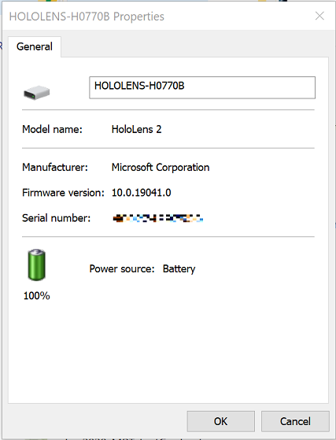
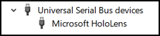
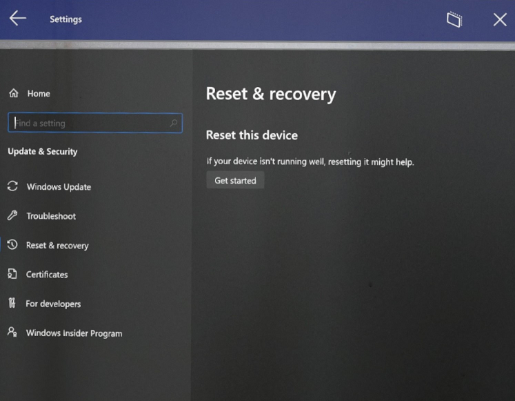

# Restart, reset, or recover HoloLens 2

>[!IMPORTANT]
> Before you start any troubleshooting procedure, make sure that your device is charged to **20 to 40 percent** of battery capacity, if possible. The [battery indicator lights](hololens2-setup.md#lights-that-indicate-the-battery-level) located under the power button are a quick way to verify the battery capacity without logging into the device.

Use the [charger and the USB Type-C cable](https://www.microsoft.com/en-us/p/microsoft-hololens-2-usb-c-charger-cable/8vj21f2z8pk5?rtc=1) that came with the HoloLens 2 as that is the best way to charge your device. The charger supplies 18W of power (9V at 2A). Using the wall charger supplied, HoloLens 2 devices can charge the battery to full in less than 65 minutes when the device is in standby. If those accessories aren't available, make sure the charger that's available can support at least 15W of power.

> [!NOTE]
> If possible, avoid using a PC to charge the device over USB, which is slow.

If the device is correctly booted and running, there are three ways to check the battery charge level:

- From the main menu of the HoloLens device UI.
- View the LED close to the power button (for a 40-percent charge, you should see at least two solid LEDs).
    - When the device is charging, the battery indicator lights up to indicate the current level of charge.  The last light will fade in and out to indicate active charging.
    - When your HoloLens is on, the battery indicator displays the battery level in five increments.
    - When only one of the five lights is on, the battery level is below 20 percent.
    - If the battery level is critically low and you try to turn on the device, one light will blink briefly, then go out.
- On your host PC, open **File Explorer** and look for your HoloLens 2 device on left side under **This PC**. Right-click the device, and select **Properties**. A dialog box will show the battery charge level.

   

If the device can't boot to the startup menu, note the LED appearance and device enumeration on the host PC. Then follow the [troubleshooting guide](hololens-troubleshooting.md). If the state of the device doesn't match any of the states listed in the troubleshooting guide, perform the [hard restart procedure](hololens-recovery.md#hard-restart-procedure) with the device connected to the power supply, not to your host PC. Wait at least one hour for the device to charge.

> [!NOTE]
> Let's start by defining terms.\
> "Restart" simply means turn the device off and on.\
> "Reset" means restore the device to defaults through the Settings UI to reinstall the current image.\
> "Reflash" means the device is connected to a PC, and a new image (optionally a different one) is to be installed.

## Restart the device

Under certain circumstances, you may have to manually restart the device without using the software UI. This may help you solve an issue you are encountering without having to reset/reflash your device.

### Standard restart procedure

1. Unplug the Type-C cable to disconnect the device from the power supply or the host PC.

2. Press and hold the **power** button for 15 seconds. All LEDs should be off.

3. Wait 2-3 seconds, and then short-press the **power** button. The LEDs close to the power button will light up, and the device will begin to start up.

4. Connect the device to the host PC, and then open Device Manager. (For Windows 10, press the **Windows** key and then the **X** key, and then select **Device Manager**.) Make sure the device enumerates correctly as *Microsoft HoloLens* as shown in the following image:

   

### Hard-restart procedure

If the standard reset procedure didn't work, use the hard-restart procedure:

1. Unplug the Type-C cable to disconnect the device from the power supply or the host PC.

1. Hold down the **volume down** + **power** buttons for 15 seconds. The device will automatically restart.

1. Connect the device to the host PC.

1. Open Device Manager (for Windows 10 press the **Windows** key and then the **X** key, and then select **Device Manager**). Make sure the device enumerates correctly as *Microsoft HoloLens* as shown in the following image:

   

## Reset the device

You can reset your device directly from your headset. Select **Settings**, then select **Update & Security > Reset & recovery > Reset this device**.

   

When you reset in this manner, all user accounts will be removed and all data will be erased.

## Clean-reflash the device

In extraordinary situations, you may have to "clean-flash" the HoloLens 2. Please note that clean-reflash isn’t expected to affect the following issues:

- [Display color uniformity](hololens2-display.md)
- Booting with sound but no display output
- [1-3-5-LED pattern](hololens2-setup.md#lights-to-indicate-problems)
- [Overheating](hololens-environment-considerations.md#temperature-and-regulatory-information) 
- OS crashes (which are distinct from application crashes)

There are two ways to reflash the device. For both, you must first [install Advanced Recovery Companion from the Windows Store](https://www.microsoft.com/store/productId/9P74Z35SFRS8).

>[!WARNING]
>If you reflash your device, all your personal data, apps, and settings will be erased, including TPM-reset information.

By default, Advanced Recovery Companion is set to download the most recent feature release build. To learn about the latest feature release, see [HoloLens 2 release notes](hololens-release-notes.md). To get the latest HoloLens 2 Full Flash Update (FFU) package to reflash your device via Advanced Recovery Companion, download the latest monthly HoloLens 2 image: [https://aka.ms/hololens2download](https://aka.ms/hololens2download). This version is the latest generally available build.

Before you start the reflash procedure, make sure the app is installed and running on your Windows 10 PC and ready to detect the device. Also ensure that your HoloLens is charged to a minimum of 40%.


### Normal flashing procedure

1. While the HoloLens device is running, connect it to the Windows 10 PC where you previously opened the Advanced Recovery Companion app.

   The device will be automatically detected, and the Advanced Recovery Companion app UI will start the update process:

   

1. Select the HoloLens 2 device in the Advanced Recovery Companion app UI, and follow the instructions to complete the reflash.

### Manual flashing mode procedure

You may need to put the device into recovery mode if:

- The HoloLens 2 doesn't start correctly
- Advanced Recovery Companion cannot detect the device
- You no longer know the password/PIN for a device that only has a single user

1. Unplug the Type-C cable to disconnect the device from the power supply or the host PC.

2. Press and hold the **power** button for 15 seconds. All LEDs should turn off.

3. While pressing the **volume up** button, press and release the **power** button to start the device. Wait 15 seconds, and then release the **volume up** button. Only the middle LED of the five LEDs will light up.

4. Connect the device to the host PC, and open Device Manager. (For Windows 10 press the **Windows** key, and then the **X** key, and then select **Device Manager**.) Make sure the device enumerates correctly as Microsoft HoloLens as shown in the following image:

   

   The device will be automatically detected, and the Advanced Recovery Companion app UI will start the update process:

   

6. Select the HoloLens 2 device in the Advanced Recovery Companion app UI, and then follow the instructions to complete the reflash.

## Wipe the device

You can [wipe your HoloLens 2 remotely](/mem/intune/remote-actions/devices-wipe#wiping-a-device) from the Intune company portal if you [can't access it to perform a reset](hololens2-enterprise-troubleshooting.md#cant-sign-in-to-a-previously-setup-hololens-device). If you choose the **Retain enrollment state and user account** checkbox before starting the **Wipe** action, you can retain the user data. 

For more information, see [Remove devices by using wipe, retire, or manually unenrolling the device](/mem/intune/remote-actions/devices-wipe).

> [!NOTE]
> Although the HoloLens device will be wiped successfully with this method, the device will not be removed from Intune. This anomaly is a known issue, and an easy [workaround](hololens-troubleshooting.md#remote-wipe-doesnt-remove-device-from-intune) will resolve it. 

## Troubleshoot Advanced Recovery Companion

1. Ensure your device is charged to 40% or more before attempting to flash.

1. Check your device is unlocked.

1. Check your device is plugged directly into the host PC, not a hub.

1. If your device is not showing as a HoloLens/HoloLens Recovery device under Universal Serial Bus Drivers, check:
    1. **Ports**, as a Qualcomm HS-USB device
    1. **Other Devices**, as a QUSB_BULK device - your host PC is missing the necessary drivers to detect your HoloLens. Right click and select Update Driver and search for drivers online or [check Optional Updates in your Windows Update settings](https://techcommunity.microsoft.com/t5/windows-it-pro-blog/improving-the-update-discoverability-experience/ba-p/1585674). After the driver is downloaded, ARC should be able to detect it.

1. If ARC does not detect your device, ensure that you can connect to your device via File Explorer on your PC. If you cannot;

    1. It is possible that your device may have USB policies that disable that connection. If so, try [Manual Flashing mode](hololens-recovery.md#manual-flashing-mode-procedure).
    2. If there are no policies, try a different USB cable.

1. Check that your device doesn't display a [1-3-5-LED pattern](hololens2-setup.md#lights-to-indicate-problems).

## Download ARC without using the app store

If the IT environment prevents the use of the Windows Store app or limits access to the retail store, the IT administrator can make this app available through an "offline" deployment path.

 >[!NOTE]
 > - IT administrators can also distribute this app through System Center Configuration Manager (SCCM) or Intune.
 > - This guide focuses on Advanced Recovery Companion, but the process can also be used for other "offline" apps.

Follow these steps to enable the deployment path:

1. Go to the [Microsoft Store for Business](https://businessstore.microsoft.com) and sign in using an Azure Active Directory identity.

1. Go to **Manage – Settings**. Turn on **Show offline apps** under **Shopping experience**.

1. Go to **shop for my group**, and search for [***Advanced Recovery Companion***](https://businessstore.microsoft.com/store/details/advanced-recovery-companion/9P74Z35SFRS8).

1. Change the **License Type** to ***offline***, and select **Manage**.

1. Under **Download the package for offline use**, select the second blue **Download** button. Make sure that the file extension is *.appxbundle*.

    - At this stage, if the Desktop PC has internet access, double-click the package to install the app.

    - If the destination PC has no internet connectivity, follow these steps:
       1. Select the unencoded license, and then select **Generate license**.
       2. Under **Required Frameworks**, select **Download**.
       3. Use DISM to apply the package with the dependency and license. From an administrator command prompt, run the following command:

          ```console
          C:\WINDOWS\system32>dism /online /Add-ProvisionedAppxPackage /PackagePath:"C:\ARCoffline\Microsoft.AdvancedRecoveryCompanion_1.19050.1301.0_neutral_~_8wekyb3d8bbwe.appxbundle" /DependencyPackagePath:"C:\ARCoffline\Microsoft.VCLibs.140.00.UWPDesktop_14.0.27629.0_x86__8wekyb3d8bbwe.appx" /LicensePath:"C:\ARCoffline\Microsoft.AdvancedRecoveryCompanion_8wekyb3d8bbwe_f72ce112-dd2e-d771-8827-9cbcbf89f8b5.xml" /Region:all
          ```
          > [!NOTE]
          > The version number in this code example may not match the currently available version. You may have also chosen a different download location than in the example. Make any changes to the command as needed.

> [!TIP]
> When you plan to use Advanced Recovery Companion to install an FFU offline, it may be useful to download your flash image. [**Download the current image for HoloLens 2**](https://aka.ms/hololens2download).

Other resources:

- [Distribute offline apps](/microsoft-store/distribute-offline-apps) 
- [DISM app package (.appx or .appxbundle) servicing command-line options](/windows-hardware/manufacture/desktop/dism-app-package--appx-or-appxbundle--servicing-command-line-options)
