# HoloLens 2 release notes

To ensure you have a productive experience with your HoloLens devices, we continue to release features, bug fixes, and security updates. On this page, you can see what’s new for HoloLens each month. To get the latest HoloLens 2 update, you can either [check for updates and manually update](hololens-update-hololens.md#check-for-updates-and-manually-update) or get the Full Flash Update (FFU) to [flash your device via Advanced Recovery Companion](hololens-recovery.md#clean-reflash-the-device). The [download](https://aka.ms/hololens2download) is kept up to date and provides the latest generally available build.

> [!NOTE]
> The recent Windows 11 announcement was focused on the PC version of Windows. We recently launched a [major OS update to HoloLens 2 in October 2021](#windows-holographic-version-21h2), and we are working on more upcoming releases based on customer feedback.

## About HoloLens releases

HoloLens 2 has had many updates over time. Sometimes our feature releases are on the same code base, and sometimes we move forward. This can be seen in the major version number of the builds. When an update shares the same code base, such as "2004" and "20H2", they also share the same major version number, which is 19041. In the next feature release we updated the code base, and the new major build number is 20346, so that's where the next feature release "21H1" version is.

> [!NOTE]
> When using a [deferral policy](hololens-updates.md#configure-an-update-deferral-policy) only a change in major build number is considered a feature update.

The Windows Holographic version name gives you an indication of the time when the release became available. The current naming convention is year/half. For example, version 21H1 became available in the first half of 2021. The "21" in the name indicates the year (2021) and "H1" indicates the first half of that year. Prior to that naming convention was based on year/month.

In between our feature updates, we also release fixes and improvements as well as security updates. These are always minor updates and never change the major build number.

To help provide clarity this release notes page will only provide information for the most current release version. If you’d like to learn about updates to down level versions (or view previous major feature releases) please refer to the table below.

| Major release   number | Feature release(s) name                  | Date         | Build number |
|------------------------|-------------------------------------|--------------|--------------|
| 20346                  | [Windows Holographic, version 21H1](#windows-holographic-version-21h1) <br> [Windows Holographic, version 21H2](#windows-holographic-version-21h2)   | May 2021 <br> October 2021   | 20346.1002 <br> 20348.1432   |
| 19041                  | [Windows Holographic, version 2004](hololens-release-notes-2004.md#windows-holographic-version-2004) <br> [Windows Holographic, version 20H2](hololens-release-notes-2004.md#windows-holographic-version-20h2)    | May 2020 <br> Nov 2020     | 19041.1103 <br> 19041.1128   |
| 18362                  | [Windows Holographic, version 1903](hololens-release-notes-1903.md#windows-holographic-version-1903---november-2019-update)   | Nov 2019     | 18362.1039   |

## Windows Holographic, version 21H2 - November 2021 Update

- Build 20348.1438

Improvements and fixes in the update:

- Fixed a known issue where [every time the power goes to 18 percent, the device suddenly shuts down automatically](hololens-troubleshooting.md#fixed---every-time-the-power-goes-to-18-percent-the-device-suddenly-shuts-down-automatically).
- Micro QR codes which were oriented at 45/135deg were not detected often enough or not detected at all. This issue is addressed and now they are detected reliably.
- Removed the HoloLens release identifier "Version" in Settings pages as it isn't uniquely descriptive to identity the OS version your device is running. To verify your build, you should use Build Number in **Settings** -> **System** -> **About** screen.

## Windows Holographic, version 21H2

- Build 20348.1432

Windows Holographic, version 21H2 is now available and brings a great set of new features to HoloLens 2 users and IT professionals. This one’s about the improved troubleshooting and device reports, some fixed bugs in kiosk mode and the certificate viewer, the expanded manageability surface and the increased update reliability. A new flagship feature of this feature update coming to HoloLens is our Moving Platform Mode. Check out all the new great features for HoloLens 2!

This latest release is a monthly update to version 21H1, but this time we are including new features, because of this the major build number will remain the same and Windows Update will indicate a monthly release to version 21H1 (build 20348). To ensure you've received 21H2, please verify the version number is 20348.1432 or higher. You can look at your Build Number in your **Settings** -> **System** -> **About** screen to confirm you are on the latest available build 20348.1432+.

To update to the latest release, open the Settings app, go to Update & Security, and tap Check for Updates. For more information on how to manage HoloLens updates, visit [Manage HoloLens updates.](hololens-updates.md)

| Feature                 | Description                | User or Scenario |
|-------------------------|----------------------------|--------------|
| [Moving Platform Mode](#moving-platform-mode) | Introduces Moving Platform Mode beta, which when configured, enables the use of HoloLens 2 on large marine vessels experiencing low-dynamic motion. | All |
| [PFX file support for Certificate Manager](#pfx-file-support-for-certificate-manager) | Add PFX certs via Settings UI | End User |
| [View advanced diagnostic report in Settings on HoloLens](#view-advanced-diagnostic-report-in-settings-on-hololens) | View MDM diagnostic logs on device | Troubleshooting |
| [Offline Diagnostics notifications](#offline-diagnostics-notifications) | Audiovisual feedback for log collection | Troubleshooting |
| [Low storage log collection improvements](#low-storage-log-collection-improvements) | Improvements to log collection scenarios during low storage situations. | Troubleshooting |
| [CSP changes for reporting HoloLens details](#csp-changes-for-reporting-hololens-details) | New CSPs to query data | IT Admins    |
| [Auto login policy controlled by CSP](#auto-login-policy-controlled-by-csp) | Used to log in an account automatically | IT Admins |
| [Improved update restart detection and notifications](#improved-update-restart-detection-and-notifications) | New enabled policies and UX for updates. | IT Admins |
| [Smart Retry for app updates](#smart-retry-for-app-updates) | Allows IT Admins to scheduled retries to update apps. | IT Admins |
| [Use only private store apps only for Microsoft Store](#use-only-private-store-apps-for-microsoft-store) | Configure the store app to show only apps from organization | IT Admin |
| [Use WDAC and LOB apps](#use-wdac-and-lob-apps) | Allows IT Admins to use their own apps and still use WDAC to block other apps. | IT Admins |
| [Fixes and improvements](#fixes-and-improvements) | Fixes and improvements for HoloLens. | All |

### IT Admin Feature Checklist

✔️ If you'd like to set a single Azure AD account to automatically log-in, [configure this new CSP.](#auto-login-policy-controlled-by-csp) <br>
✔️ If you'd like configure your apps to automatically attempt to update after failing to update, [set this new CSP for smart retry.](#smart-retry-for-app-updates) <br>
✔️ If you'd like to have more control over OS updates, check out these [newly enabled Update policies.](#improved-update-restart-detection-and-notifications) <br>
✔️ If you need to make your organization's apps available on the company store via the Microsoft Store, but want to only allow access to your organization's apps and not the full store, [set this policy.](#use-only-private-store-apps-for-microsoft-store) <br>
✔️ If you'd like to know the free storage space, SSID or BSSID of your HoloLens devices check out these [reporting CSPs.](#csp-changes-for-reporting-hololens-details) <br>
✔️ If you'd like to use WDAC to block apps or processes from launching, but also need to use your own line of bushiness apps, you can now [allow LOB in your WDAC policy](#use-wdac-and-lob-apps).

### Moving Platform Mode

As of [Windows Holographic, version 21H2](hololens-release-notes.md#windows-holographic-version-21h2) we have added beta support for tracking on low-dynamic motion moving platforms on HoloLens 2. After installing the build and enabling Moving Platform Mode, you will be able to use your HoloLens 2 in previously inaccessible environments, like large ships and large marine vessels. Currently, the feature is targeted at enabling these specific moving platforms only. While nothing prevents you from attempting to use the feature in other environments, the feature is focused on adding support for these environments first.

To learn more about what is supported and how to enable this new feature, [visit the moving platform page](hololens2-moving-platform.md).

#### Overview to try out Moving Platform Mode

1. [Enable developer mode and device portal](/windows/mixed-reality/develop/platform-capabilities-and-apis/using-the-windows-device-portal).
1. [Enable moving platform mode through Device portal](hololens2-moving-platform.md#enabling-moving-platform-mode).
1. Take your device to your large moving platform and observe how stable holograms are.

### PFX file support for Certificate Manager

Introduced in Windows Insider build 20348.1405. We’ve added support to the [Certificate Manager](certificate-manager.md) to now use .pfx certificates. When users navigate to **Settings** > **Update & Security** > **Certificates**, and select **Install a certificate** the UI now supports .pfx certificate file.
Users can import .pfx certificate, with private key, to user store or machine store.

#### Overview to try out PFX files in Certificate Manager

1. Prepare your PFX file.
1. Copy the file to your device via a USB-C cable.
1. Open the Settings app, and navigate to the [Certificate Manager](certificate-manager.md) and apply the certificate.

### View advanced diagnostic report in Settings on HoloLens

For managed devices when troubleshooting behavior, confirming that an expected policy configuration is applied is an important step. Previously to this new feature, this had to be done off device via MDM or near the device after exporting MDM diagnostic logs gathered via **Settings** -> **Accounts** > **Access work or school**, and select **Export your management logs** and viewed on a nearby PC.

Now the MDM Diagnostics can be viewed on device using the Edge browser. To more easily view the MDM Diagnostic report navigate to the Access work or school page, and select **View advanced diagnostic report**. This will generate and open the report in a new Edge window.

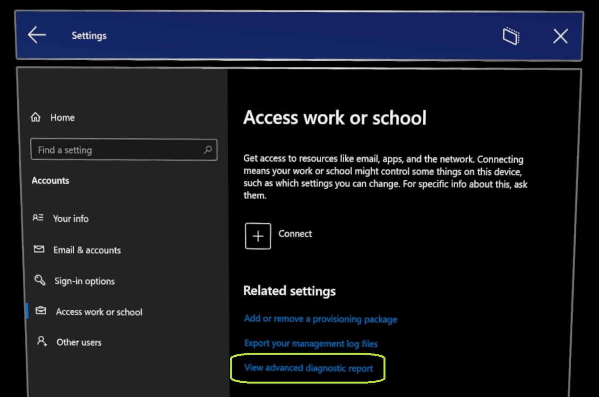

#### Overview to try out the advanced diagnostic report

1. Open the Settings app.
1. Navigate to the Accounts page, and click the new link **Export your management logs**.
1. View advanced information on your device's configurations.

### Offline Diagnostics notifications

This an update for an existing feature called [Offline Diagnostics](hololens-diagnostic-logs.md#offline-diagnostics). Previously, there was no clear indicator to users that they had triggered diagnostic collection or it had completed.
Now added in [Windows Holographic, version 21H2](hololens-release-notes.md#windows-holographic-version-21h2), there are two forms of audiovisual feedback for Offline Diagnostics. The first being toasts notifications displayed for both when collection starts and completes. These will be displayed when the user is logged in and has visuals.

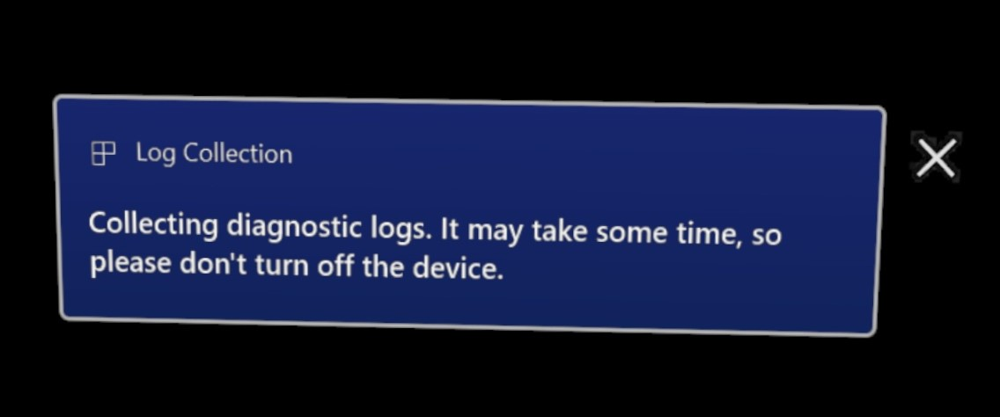

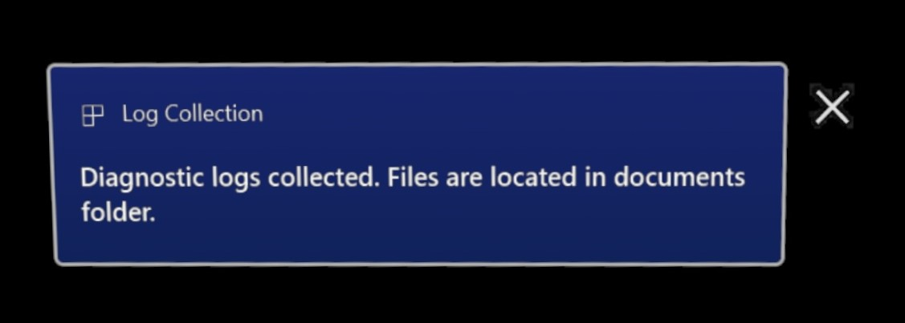

Because users often use Offline Diagnostics as a fallback log gathering mechanism for when they don’t have access to a display, can’t log-in or are still in OOBE there will also be an audio cue played when logs are gathered. This sound will be played in addition to the toast notification.

This new feature will be enabled when your device updates, and doesn’t need to be enabled or managed. In any event that this new feedback cannot be displayed or heard, Offline Diagnostics will still be generated.

We hope with this newer addition of audiovisual feedback it is easier to gather diagnostic data, and more quickly be able to troubleshoot your problems.

This information can be viewed later on the [diagnostic logs page](hololens-diagnostic-logs.md#offline-diagnostics).

#### Overview to try out the diagnostics notifications

1. Unlock your device and wear it.
1. Press the **Power** and **Volume down** button combination to gather [Offline Diagnostics](hololens-diagnostic-logs.md#offline-diagnostics).
1. View the toast notifications and hear audio cues for when your device starts and finishes collecting logs.

### Low storage log collection improvements

In scenarios where a device seems to be low on disk space when diagnostic logs are collected, an additional report named **StorageDiagnostics.zip** will be created. The threshold of low storage is determined automatically by Windows [storage sense](https://support.microsoft.com/office/use-onedrive-and-storage-sense-in-windows-10-to-manage-disk-space-de5faa9a-6108-4be1-87a6-d90688d08a48).

This information can be viewed later on the [diagnostic logs page](hololens-diagnostic-logs.md#offline-diagnostics).

#### Overview to try out the low storage improvements

1. Fill up your device's storage space.
1. Press the **Power** and **Volume down** button combination to gather [Offline Diagnostics](hololens-diagnostic-logs.md#offline-diagnostics).
1. Observe there is a new file in the collection of logs stored in the Documents folder of your HoloLens.

### CSP changes for reporting HoloLens details

The following CSPs have been updated with new ways to report information from your HoloLens devices.

#### DevDetail CSP - Free Storage

DevDetail CSP now also reports free storage space on HoloLens device. This should approximately match with the value shown in Settings App's Storage page. Following is the specific node containing this information.

- ./DevDetail/Ext/Microsoft/FreeStorage (GET operation only)

#### DeviceStatus CSP - SSID and BSSID

DeviceStatus CSP now also reports SSID and BSSID of Wi-Fi network with which HoloLens is actively connected. Following are the specific nodes containing this information.

- ./Vendor/MSFT/DeviceStatus/NetworkIdentifiers/*mac address of Wi-Fi adapter*/SSID
- ./Vendor/MSFT/DeviceStatus/NetworkIdentifiers/*mac address of Wi-Fi adapter*/BSSID

Example syncml blob (for MDM vendors) to query for NetworkIdentifiers

```xml
<SyncML>
<SyncBody>
	<Get>
        <CmdID>$CmdID$</CmdID>
        <Item>
            <Target>
            <LocURI>
                ./Vendor/MSFT/DeviceStatus/NetworkIdentifiers?list=StructData
			</LocURI>
            </Target>
        </Item>
    </Get>
    <Final/>
</SyncBody>
</SyncML>
```

### Auto login policy controlled by CSP

This new AutoLogonUser policy controls whether a user will be automatically logged on. Some customers want to set up devices that are tied to an identity but don't want any sign-in experience. Imagine picking up a device and using remote assist immediately. Or have a benefit of being able to rapidly  distribute HoloLens devices and enable their end users to expedite login.

When the policy is set to a non-empty value, it specifies the email address of the auto-logon user. The specified user must log on to the device at least once to enable auto-logon.

The OMA-URI of new policy `./Device/Vendor/MSFT/Policy/Config/MixedReality/AutoLogonUser`
String value

- User with the same email address will have auto logon enabled.

On a device where this policy is configured, the user specified in the policy will need to log on at least once. Subsequent reboots of the device after the first logon will have the specified user automatically logged on. Only a single auto-logon user is supported. Once enabled, the automatically logged on user will not be able to log out manually. To log on as a different user, the policy must first be disabled.

> [!NOTE]
>
> - Some events such as major OS updates may require the specified user to logon to the device again to resume auto-logon behavior.
> - Auto-logon is only supported for MSA and AAD users.

#### Overview to try auto-logon CSP

1. Configure the new CSP to a desired user [using a custom policy](/mem/intune/configuration/custom-settings-windows-10) : `./Device/Vendor/MSFT/Policy/Config/MixedReality/AutoLogonUser`
1. Apply the CSP to the device via [provisioning package](hololens-provisioning.md) or [MDM](hololens-mdm-configure.md).
1. Sign into the specified account.
1. Restart the device and observe the user is automatically logged in.

### Improved update restart detection and notifications

Between active hours and install time policies, it is possible to avoid rebooting HoloLens devices when they are in use. However, it would also delay the adoption of updates if reboots don’t occur to complete the installation of a required update. We’ve now added policies to allow IT to enforce deadlines and required reboots and ensure that the installation of an update is completed in a timely manner. Users can be notified prior to the reboot being initiated and they can delay the reboot in accordance with IT policy.

The following update policies were added:

- [Update/AutoRestartNotificationSchedule](/windows/client-management/mdm/policy-csp-update#update-autorestartnotificationschedule)
- [Update/AutoRestartRequiredNotificationDismissal](/windows/client-management/mdm/policy-csp-update#update-autorestartrequirednotificationdismissal)
- [Update/ConfigureDeadlineForFeatureUpdates](/windows/client-management/mdm/policy-csp-update#update-configuredeadlineforfeatureupdates)
- [Update/ConfigureDeadlineForQualityUpdates](/windows/client-management/mdm/policy-csp-update#update-configuredeadlineforqualityupdates)
- [Update/ConfigureDeadlineGracePeriod](/windows/client-management/mdm/policy-csp-update#update-configuredeadlinegraceperiod)
- [Update/ConfigureDeadlineNoAutoReboot](/windows/client-management/mdm/policy-csp-update#update-configuredeadlinenoautoreboot)
- [Update/ScheduleImminentRestartWarning](/windows/client-management/mdm/policy-csp-update#update-scheduleimminentrestartwarning)
- [Update/ScheduleRestartWarning](/windows/client-management/mdm/policy-csp-update#update-schedulerestartwarning)
- [Update/UpdateNotificationLevel](/windows/client-management/mdm/policy-csp-update#update-updatenotificationlevel)

#### Overview to try new update notifications

1. Configure one of the new update CSPs via [provisioning package](hololens-provisioning.md) or [MDM](hololens-mdm-configure.md) (see the link list above and pick one).
1. Use the device during the scheduled time.
1. Observe the user is notified about the update and the need to restart the device\*.

\* Your results may vary based on Update policies used.

### Smart Retry for app updates

Now enabled for HoloLens is a new policy that allows IT Admins to set a recurring or one time date to restart apps whose update failed due to the app being in use allowing the update to be applied. These can be set based on a few different triggers such as a scheduled time or sign-in. To learn more about how to use this policy please view [ApplicationManagement/ScheduleForceRestartForUpdateFailures](/windows/client-management/mdm/policy-csp-applicationmanagement#applicationmanagement-scheduleforcerestartforupdatefailures).

This information can be found later in the [app deployment store for business page](app-deploy-store-business.md).

#### Overview to try Smart Retry for app updates

1. Configure the new smart retry feature.
1. On a device that has not yet received your app and is correctly configured to, log in an online environment.
1. Make the device unable to download the app by means of turning it off or disconnecting it.
1. Have your device powered on and connected to the internet during your triggered time to retry the download.

### Use only private store apps for Microsoft Store

The RequirePrivateStoreOnly  policy has been enabled for HoloLens. This policy enables the Microsoft Store app to be configured to only show the private store configured for your organization via [Microsoft Store for Business](/microsoft-store/microsoft-store-for-business-overview). Limiting access to only the apps you’ve made available.

Learn more about [ApplicationManagement/RequirePrivateStoreOnly](/windows/client-management/mdm/policy-csp-applicationmanagement#applicationmanagement-requireprivatestoreonly)

This information can be found later in the [app deployment store for business page](app-deploy-store-business.md).

#### Overview to try only private store apps

1. Configure the new policy for your devices via [MDM](hololens-mdm-configure.md).
1. Log into a device that has the policy.
1. Open the Microsoft Store app and observe you can only see your organization's apps.

### Use WDAC and LOB apps

You can now use WDAC to block apps or processes from launching and continue to use your own line of bushiness apps. you can now allow them in your WDAC policy. Using this policy involves running an extra line of code in PowerShell when creating your WDAC policy. [Review the steps here.](/mem/intune/configuration/custom-profile-hololens)

#### Overview to try your own apps while using WDAC to block others

1. Gather the AUMIDs of your LOB app, and the apps you intend to block.
1. [Create a new WDAC policy](/mem/intune/configuration/custom-profile-hololens) following the new steps.
1. [Deploy the policy using MDM](hololens-mdm-configure.md) to your device.
1. Sign into the device and observe you can launch your app and block others.

### Fixes and improvements

#### For Developers

- Fixed a [known issue for Device Portal where there was no prompt downloading locked files](hololens-troubleshooting.md#fixed---downloading-locked-files-doesnt-error).
- Fixed a [known issue for Device Portal with file upload and download time outs](hololens-troubleshooting.md#fixed---device-portal-file-uploaddownload-times-out).
- Gamepad processing for 2D apps was disabled in Insider builds. By removing it, apps are now free to use the Gamepad APIs directly and have access to the whole set of controls and can be developed in mind to do more. Developers should use the Gamepad APIs to consume Gamepad input. Here is a sample for [Gamepad Class (Windows.Gaming.Input) - Windows UWP applications](/uwp/api/windows.gaming.input.gamepad?view=winrt-20348&preserve-view=true).
- Enabled an [Assigned Access API](/uwp/api/windows.system.userprofile.assignedaccesssettings?view=winrt-20348&preserve-view=true) so that apps can now determine if a HoloLens is running in a Kiosk mode for the user logged into the HoloLens.

#### For Enterprise

- Addresses issues around reporting compliance properties from HoloLens devices; a reboot may be required for the correct reporting to be triggered on Insider builds.  
- Updated the in-box version of Remote Assist that's installed on fresh flashes.
- Fixed an issue where after first user sign-in, OOBE was being terminated in scenarios where AAD group-based kiosk configurations were being used.
- Corrected an issue around displaying update notifications and dialog prompts for device restart.
- Fixed an issue where after device reboot, Xbox Controllers and other Bluetooth LE peripherals needed be paired again to connect.
- Fixed video encoder issue which could cause a short freeze of outbound video during a Remote Assist call. Wi-Fi driver and firmware changes to address “Fragment and Forge”  Wi-Fi vulnerabilities.
- Wi-Fi driver and firmware changes to address “Fragment and Forge”  Wi-Fi vulnerabilities.
- When using Moving Platform Mode (MPM), "Down" will be estimated by averaging gravity over a short time. This value replaces true gravity when in Moving Platform Mode.
- Fixed periodic wobble in holograms when in 3DoF mode, or during loss of tracking.
- Addresses an issue impacting updates to the 21H1/21H2 release from older releases.

## Windows Holographic, version 21H1 - September 2021 Update

- Build 20348.1018

Improvements and fixes in the update:

- Fixes to resolve issue where system time may jump unexpectedly.

## Windows Holographic, version 21H1 - August 2021 Update

- Build 20348.1014

Improvements and fixes in the update:

- Fixed an issue that prevented Xbox controllers from working in immersive applications with controller support.
- Improved diagnostics for device update failures.

## Windows Holographic, version 21H1 - July 2021 Update

- Build 20348.1010

Improvements and fixes in the update:

- Device Portal has enhanced methods of notifying the customer when File Explorer encounters issues opening locked files.
- File upload, download, rename and delete is now fixed when using https in all supported browsers.
- Fixed issue where Wi-Fi proxy can't be saved when Wi-Fi properties UI is launched from **Settings > Network & Internet > Status > Properties**.
- Addressed an issue around the removal of eSIM certificates across OS updates. This fix ensures that the eSIM certificates and related components are removed when updating to the 21H1 release.
- Corrected an issue impacting preinstalled apps across OS resets.
- Battery charging performance tuned to increase runtime when charging with increased CPU loading. While charging HoloLens 2 devices, if the device is detected to be running hot, the internal battery will charge more slowly to reduce heat. The positive tradeoff is that a device is less likely to shutdown due to thermal issues, with the impact is that the device runs longer. If the device is running cool, the charge rate is unaffected.

> [!NOTE]
> Due to a now resolved [known issue in our 21H1 build that was affecting Remote Assist users](hololens-troubleshooting.md#fixed---remote-assist-video-freezes-after-20-minutes), we temporally paused the offering of Windows Holographic, version 21H1 updates. We had also changed the default Advanced Recovery Companion (ARC) build to the [Windows Holographic, version 20H2 – June 2021 Update](hololens-release-notes-2004.md#windows-holographic-version-20h2--june-2021-update). The ARC build will now resume targeting the 21H1 build.

## Windows Holographic, version 21H1 - June 2021 Update

- Build 20348.1007

### OneDrive for work or school Camera Roll upload

We've added a new feature to the HoloLens 2 Settings app, which allows customers to automatically upload mixed reality photos and videos from the device's Pictures > Camera Roll folder to the corresponding OneDrive for work or school folder. This feature addresses a [feature gap within the OneDrive app](holographic-photos-and-videos.md#share-your-mixed-reality-photos-and-videos) on HoloLens 2, which only supports automatic Camera Roll upload to a customer's personal Microsoft account (and not their work or school account).

**How it works**

- Visit **Settings > System > Mixed Reality Camera** to enable "Camera upload."
- By setting this feature to the **On** position, any mixed reality photos or videos captured to your device will automatically be queued for upload to the Pictures > Camera Roll folder of your OneDrive for work or school account.
    >[!NOTE]
    >Photos and videos captured prior to enabling this feature *will not* be queued for upload and will still need to be manually uploaded.
- A status message on the Settings page will display the number of files pending upload (or read "OneDrive is up to date" when all pending files have been uploaded).
- If you're concerned about bandwidth or want to "pause" upload for any reason, you can switch the feature to the **Off** position. Temporarily disabling the feature ensures that the upload queue will continue to increase as you add new files to the Camera Roll folder, but files will not upload until you re-enable the feature.
- Newest files will upload first (last in, first out).
- If your OneDrive account has issues (for example, after your password changes) a **Fix now** button will appear on the Settings page.
- There is no maximum file size, but note that large files will take longer to upload (especially if your upload bandwidth is constrained). If you "pause" or turn off upload while a large file is being uploaded, the partial upload will be preserved. If upload is re-enabled within several hours of being "paused" or turned off, the upload will continue from where it left off. However, if upload is re-enabled after several hours, the large file's upload will restart from the beginning.

**Known issues and caveats**

- This setting has no built in throttling based on current bandwidth usage. If you need to maximize bandwidth for another scenario, turn off the setting manually. Upload will be paused but the feature will continue to monitor newly added files to Camera Roll. Re-enable upload when you're ready for it to continue.
- This feature must be enabled for each user account on the device, and it can only actively upload files for the user who is currently signed-in to the device.
- If you're taking photos or videos while watching the upload count on the Settings page in real-time, note that the pending file count may not change until the current file has completed uploading.
- Upload will pause if your device falls asleep or is powered off. To ensure your pending uploads complete, actively use the device until the Settings page reads "OneDrive is up to date" or adjust your **Power & sleep** settings.

### Added support for some telemetry policies

The following telemetry policies are now supported on the HoloLens 2:

- ConfigureTelemetryOptInSettingsUx
- DisableDeviceDelete
- AllowDeviceNameInDiagnosticData
- FeedbackHubAlwaysSaveDiagnosticsLocally

Both System\AllowTelemetry and System\ConfigureTelemetryOptInSettingsUx should be used together to have complete control on the Telemetry and behavior in the Settings app.

Improvements and fixes in the update:

- Fixes major video corruption with Color calibration.
- Addresses an issue where text might be truncated in the Power menu.
- Enables support for the RequirePrivateStoreOnly policy.

## Windows Holographic, version 21H1

- Build 20346.1002

This update contains features for two target audiences; features that can be used by anyone on a device by the End User, and new device management options that can be configured by IT Admins. The table below specifies the features that are relevant to each audience. If you are an IT Admin, please take a look at our [IT Admin - Update Checklist](#it-admin---update-checklist).
>[!IMPORTANT]
>In order to update to this build, HoloLens 2 device(s) must be currently running the February 2021 update (build 19041.1136) or newer. If you are not seeing this feature update available, please update your device first and try again.

>[!NOTE]
>Today, Microsoft HoloLens 2 supports monthly servicing updates (bug and security fixes) for the following releases:
>
>- Windows Holographic, version 20H2 (Build 19041.1128+)
>- Windows Holographic, version 2004 (Build 19041.1103+)
>- Windows Holographic, version 1903 (Build 18362+)
>
> With the introduction of Windows Holographic version 21H1, **we are discontinuing monthly servicing updates for Windows Holographic version 1903**. This enables us to focus on more recent releases and continue to deliver valuable improvements.

| Feature Name                                              | Short description                                                                      | Target Audience |
|-----------------------------------------------------------|----------------------------------------------------------------------------------------|--------------------|
| [New Microsoft Edge](#introducing-the-new-microsoft-edge)  | The new, Chromium-based Microsoft Edge is now available for HoloLens 2. | End User |
[WebXR and 360 Viewer](#webxr-and-360-viewer) | Try immersive web experiences and 360 video playback. | End User |
[New Settings app](#new-settings-app) | The legacy Settings app is being replaced by an updated version with new features and settings. | End User |
[Display color calibration](#display-color-calibration) | Select an alternative color profile for your HoloLens 2 display. | End User |
[Default app picker](#default-app-picker) | Choose which app should launch for each file or link type. | End User |
[Per app volume control](#per-app-volume-control) | Control app level volume independently from system volume. | End User |
[Install web apps](#install-web-apps) | Install web apps on HoloLens 2, like Microsoft Office, with the new Microsoft Edge browser. | End User |
[Swipe to type](#swipe-to-type) | Use the tip of your finger to "swipe" words on the holographic keyboard. | End User |
[Power menu from Start](#power-menu-from-start) | On Start Menu, restart and shut down HoloLens device. | End User |
[Multiple users listed on Sign in screen](#multiple-users-listed-on-sign-in-screen) | Display multiple user accounts on the Sign in screen. | End User |
[USB-C External Microphone Support](#usb-c-external-microphone-support) | Use USB-C microphones for apps and / or Remote Assist. | End User |
[Visitor Auto-logon for Kiosks](#visitor-auto-logon-for-kiosks) | Enables the auto-logon on Visitor accounts to be used for Kiosk modes. | IT Admin |
[New AUMIDs for new apps in Kiosk mode](#use-the-new-settings-and-edge-apps-in-kiosk-modes)  | AUMIDs for new Settings and Edge apps. | IT Admin |
[Improved Kiosk mode failure handing](#kiosk-mode-behavior-changes-for-handling-of-failures) | Kiosk mode looks for Global Assigned Access before empty start menu. | IT Admin |
[New SettingsURIs for Page Settings Visibility](#new-settings-uris-for-page-settings-visibility) | 20+ new SettingsURIs for Settings/PageVisibilityList policy. | IT Admin |
[Configure Fallback Diagnostics](#configuring-fallback-diagnostics-via-settings-app) | Setting Fallback Diagnostic Behavior in Settings App. | IT Admin |
[Share things with nearby devices](#share-things-with-nearby-devices) | Share files or URLs from a HoloLens to a PC. | All |
[New OS diagnostic traces](#new-os-diagnostic-traces) | New troubleshooter in Settings for OS updates. | IT Admin |
[Delivery Optimization Preview](#delivery-optimization-preview) | Reduce bandwidth consumption for downloads from multiple HoloLens devices. | IT Admin |

Check out related release notes:

- [Visit the HoloLens Emulator archive](/windows/mixed-reality/hololens-emulator-archive)
- [Dynamics 365 Remote Assist](/dynamics365/mixed-reality/remote-assist/version-history-remote-assist-hololens)
- [Dynamics 365 Guides](/dynamics365/mixed-reality/remote-assist/version-history-remote-assist-hololens)

### Introducing the new Microsoft Edge


The new Microsoft Edge [adopts the Chromium open source project](https://blogs.windows.com/windowsexperience/2018/12/06/microsoft-edge-making-the-web-better-through-more-open-source-collaboration/) to create better compatibility for customers and less fragmentation of the web for web developers.

> [!IMPORTANT]
> This new Microsoft Edge automatically replaces legacy Microsoft Edge, which is [no longer supported](https://blogs.windows.com/msedgedev/2021/03/09/microsoft-edge-legacy-end-of-support/) in new releases.

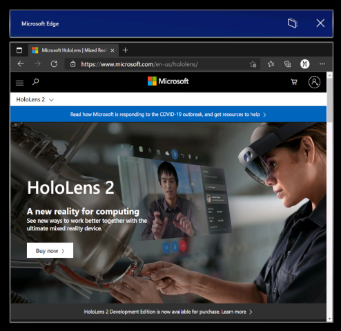

#### Launching the new Microsoft Edge

The new Microsoft Edge  (represented by a blue and green swirl icon) is pinned to the Start menu and will automatically launch when you activate a web link.

> [!NOTE]
> When you first launch the new Microsoft Edge on HoloLens 2, your settings and data will be imported from legacy Microsoft Edge. If you continue to use legacy Microsoft Edge after launching the new Microsoft Edge, that new data will not be synced from legacy Microsoft Edge to the new Microsoft Edge.

#### Configuring policy settings for the new Microsoft Edge

The new Microsoft Edge offers IT admins a much broader set of browser policies on HoloLens 2 than were previously available with legacy Microsoft Edge.

Here are some helpful resources for learning more about managing policy settings for the new Microsoft Edge:

- [Configure Microsoft Edge policy settings with Microsoft Intune](/deployedge/configure-edge-with-intune)
- [Microsoft Edge Legacy to Microsoft Edge policy mapping](/deployedge/microsoft-edge-policy-map-legacy-to-newedge)
- [Google Chrome to Microsoft Edge policy mapping](/deployedge/microsoft-edge-policy-map-chrome-to-newedge)
- Full [Microsoft Edge Enterprise documentation](/deployedge/)

> [!IMPORTANT]
> Because of the volume of browser policies supported by the new Microsoft Edge, our team is unable to guarantee that each new policy works on HoloLens 2. However, we've tested and confirmed than the new Microsoft Edge equivalent of each legacy Microsoft Edge policy previously supported on HoloLens 2 work as expected. See [Microsoft Edge Legacy to Microsoft Edge policy mapping](/deployedge/microsoft-edge-policy-map-legacy-to-newedge) to find the new Microsoft Edge equivalent of each legacy Microsoft Edge browser policy you were using with HoloLens 2.
>
> There are at least two new Microsoft Edge policies that we know *will not* work with HoloLens 2:
>
> - EnterpriseModeSiteList
> - EnterpriseSiteListServiceURL

#### What to expect from the new Microsoft Edge on HoloLens 2

Because the new Microsoft Edge is a native Win32 app with a new UWP adapter layer allowing it to run on UWP-only devices like HoloLens 2, some features may not be immediately available. We'll be supporting new scenarios and features over the coming months, so check this space for up-to-date information.

**Scenarios and features expected to work:**

- First-run experience, sign in to profile, and sync
- Websites should render and behave as expected
- Most browser functionality (Favorites, History, etc.) should work as expected
- Dark mode
- Installing web apps to the device
- Installing extensions (please let us know if you use any extensions that don't work properly on HoloLens 2)
- Viewing and marking up a PDF
- Spatial sound from a single browser window
- Automatic and manual updating of the browser
- Saving a PDF from the Print menu (using "Save to PDF" option)
- WebXR and 360 Viewer extension
- Content restoration to correct window, when browsing across multiple windows placed in your environment

**Scenarios and features not expected to work:**

- Spatial sound from multiple windows with simultaneous audio streams
- "See it, say it"
- Printing

**Top browser known issues:**

- The magnifier preview in the holographic keyboard has been disabled for the new Microsoft Edge. We hope to reenable this feature in a future update, once the magnification is working correctly.
- Audio may play from the wrong browser window if you have another browser window open and active. You can work around this issue by closing the other active window that isn't supposed to be playing audio.
- When playing audio from a browser window in ["Follow me" mode](hololens2-basic-usage.md#follow-me-stop-following), the audio will continue playing if you disable "Follow me" mode. You can work around this issue by stopping audio playback before disabling "Follow me" mode or by closing the window with the **X** button.
- Interacting with active Microsoft Edge windows may cause other 2D app windows to go inactive unexpectedly. You can reactivate these windows by interacting with them again.

#### Microsoft Edge Insider channels

The Microsoft Edge team makes three preview channels available to the Edge Insider community: Beta, Dev, and Canary. Installing a preview channel doesn't uninstall the released version of Microsoft Edge on your HoloLens 2, and you can install more than one at the same time.

Visit the [Microsoft Edge Insider homepage](https://www.microsoftedgeinsider.com) to learn more about the Edge Insider community. To learn more about the different Edge Insider channels and get started, visit the [Edge Insider download page](https://www.microsoftedgeinsider.com/download).

There are a couple methods available for installing Microsoft Edge Insider channels to HoloLens 2:

**Direct install on device (currently only available to unmanaged devices)**

  1. On your HoloLens 2, visit the [Edge Insider download page](https://www.microsoftedgeinsider.com/download).
  1. Select the **Download for HoloLens 2** button for the Edge Insider channel you wish to install.
  1. Launch the downloaded .msix file from the Edge download queue or from your device's "Downloads" folder (using File Explorer).
  1. [App installer](app-deploy-app-installer.md) will launch.
  1. Select the **Install** button.
  1. After successful install, you'll find Microsoft Edge Beta, Dev, or Canary as a separate entry in the **All apps** list of the Start menu.

**Install via PC with Windows Device Portal (requires [developer mode](/windows/mixed-reality/develop/platform-capabilities-and-apis/using-the-windows-device-portal#setting-up-hololens-to-use-windows-device-portal) to be enabled on HoloLens 2)**

  1. On your PC, visit the [Edge Insider download page](https://www.microsoftedgeinsider.com/download).
  1. Select the **drop-down arrow button** next to the "Download for Windows 10" button for the Edge Insider channel you wish to install.
  1. Select **HoloLens 2** in the drop-down menu.
  1. Save the .msix file to the "Downloads" folder of your PC (or another folder you can easily find).
  1. Use [Windows Device Portal](/windows/mixed-reality/develop/platform-capabilities-and-apis/using-the-windows-device-portal#installing-an-app) on your PC to install the downloaded .msix file on HoloLens 2.
  1. After successful install, you'll find Microsoft Edge Beta, Dev, or Canary as a separate entry in the **All apps** list of the Start menu.

#### Using WDAC to block new Microsoft Edge

For IT Admins looking to update their [WDAC policy](windows-defender-application-control-wdac.md) to block the new Microsoft Edge app, you'll need to add the following to your policy.

``` <Deny ID="ID_DENY_D_3_0" FriendlyName="C:\Data\Programs FileRule" PackageVersion="65535.65535.65535.65535" FileName="msedge.exe" /> ```

#### Managing endpoints for the new Microsoft Edge

Some environments may have network restrictions to account for as a consideration. To ensure a smooth experience with the new Edge please [enable these Microsoft endpoints.](/deployedge/microsoft-edge-security-endpoints)

Read more about the currently available [endpoints for HoloLens](hololens-offline.md).

### Install web apps

 > [!Note]
>As of [Windows Holographic, version 21H1](hololens-release-notes.md#windows-holographic-version-21h1), the Office web app will no longer be pre-installed.

You can use the new Edge to install web apps alongside Microsoft Store apps. For example, you can install the Microsoft Office web app to view and edit files hosted on SharePoint or OneDrive. To install the Office web app, visit https://www.office.com and select the **App Available** or **Install Office** button in the address bar. Select **Install** to confirm.

> [!IMPORTANT]
> Office web app functionality is only available when your HoloLens 2 has an active internet connection.

### WebXR and 360 Viewer

The new Microsoft Edge includes support for WebXR, which is the new standard for creating immersive web experiences (replacing WebVR). Many immersive web experiences were designed with VR in mind (they replace your field of view with a virtual environment), but these experiences are also supported by HoloLens 2. The WebXR standard also enables augmented and mixed reality immersive web experiences that use your physical environment. As developers spend more time with WebXR, we anticipate new augmented and mixed reality immersive experiences will arrive for HoloLens 2 customers to try!

The 360 Viewer extension is built on WebXR and automatically installs alongside the new Microsoft Edge on HoloLens 2. This web extension gives you the ability to immerse yourself in 360-degree videos. YouTube offers the largest selection of 360 videos, so we encourage you to start there.

#### How to use WebXR

1. Navigate to a website with WebXR support.
1. Select the **Enter VR** button on the website. The location and visual representation of this button may vary per website, but it may look similar to:

    

1. The first time you try to launch a WebXR experience on a specific domain, the browser will ask for consent to enter an immersive view, select **Allow**.
1. Use [HoloLens 2 gestures](hololens2-basic-usage.md#the-hand-tracking-frame) to manipulate the experience.
1. If the experience doesn't have an **Exit** button, use the [Start gesture](hololens2-basic-usage.md#start-gesture) to return home.

**Recommended WebXR samples**

- 360 Viewer (see next section)
- [XR Dinosaurs](https://www.xrdinosaurs.com/)
- [Barista Express](https://constructarca.de/game/barista-express/)
- [WebXR Paint](https://threejs.org/examples/webxr_vr_paint.html)

#### How to use 360 Viewer

1. Navigate to a 360-degree video on YouTube.
1. In the video frame, select the mixed reality headset button:

    

1. The first time you try to launch 360 Viewer on a specific domain, the browser will ask for consent to enter an immersive view. Select **Allow**.
1. [Air tap](hololens2-basic-usage.md#select-using-air-tap) to bring up the playback controls. Use [hand rays and air tap](hololens2-basic-usage.md#select-using-air-tap) to play/pause, skip forward/back, turn captions on/off, or stop the experience (which exits the immersive view). The playback controls will disappear after a few seconds of inactivity.

#### Top WebXR and 360 Viewer known issues

- Depending on the complexity of the WebXR experience, the framerate may drop or stutter.
- Support for articulated hand joints in WebXR is not enabled by default. Developers can enable support via `edge://flags` by turning on "WebXR Hand Input."
- 360 videos from websites other than YouTube may not work as expected.

#### Providing feedback on WebXR and 360 Viewer

Please share feedback and bugs with our team via the **Send Feedback** feature in the new Microsoft Edge.

### New Settings app

With this release, we're introducing a new version of the Settings app. The new Settings app includes new features and expanded settings for HoloLens 2 in the following areas: Sound, Power & sleep, Network & Internet, Apps, Accounts, Ease of Access, and more.

> [!NOTE]
> Because the new Settings app is distinct from the legacy Settings app, any Settings windows you previously placed around your environment will be removed upon update.

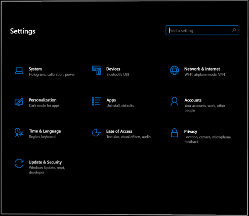

**New features and settings**

- Settings search: search for settings from the Settings homepage using keywords or the setting's name.
- System > Sound:
  - Input and output audio devices: independently choose your input and output audio devices (for example, listen to audio via Bluetooth headphones or use a USB-C microphone for audio input).
    > [!NOTE]
    > Bluetooth microphones are not supported by HoloLens 2.
  - App volume: independently adjust the volume of each app. See [per app volume control](#per-app-volume-control).
- System > Power & sleep: choose when the device should go to sleep after a period of inactivity.
- System > Battery: manually enable battery saver mode or set a battery threshold at which point battery saver mode turns on automatically.
- Devices > USB: you can disable USB connections by default.
- Network & Internet:
  - USB-C Ethernet adapters will now appear in Network & Internet.
  - USB-C Ethernet adapter settings are now available, including its IP address.
  - You can now enable airplane mode on HoloLens 2.
- Apps: you can reset the default apps used for file and link types. For more information see [Default app picker](#default-app-picker).
- Accounts > Other users: device owners can add users, upgrade standard users to device owners, downgrade device owners to standard users, and remove users.
- Ease of Access: change text size and some visual effects.

**Known issues**

- Previously placed Settings windows will be removed (see note above).
- You can no longer rename your device with the Settings app. IT admins can rename devices by using the [Windows Autopilot for HoloLens 2](hololens2-autopilot.md) device name template or the MDM [DevDetail CSP](/windows/client-management/mdm/devdetail-csp) Ext/Microsoft/DNSComputerName node.
- The Ethernet page shows a virtual Ethernet device ("UsbNcm") at all times.
- Battery usage for the new Microsoft Edge may not be accurate, due to its nature as a Win32 desktop application supported by a UWP adapter layer (no fix anticipated soon).

#### Display color calibration

With this new setting, you can select an alternative color profile for your HoloLens 2 display. This may help colors appear more accurate, especially at lower display brightness levels. Display color calibration can be found in the Settings app, on the System > Calibration page.

> [!NOTE]
> Because this setting saves a new color profile to your display firmware, it is a per-device setting (and not unique to each user account).

##### How to use display color calibration

1. Launch the **Settings** app and navigate to **System > Calibration**.
1. Under **Display color calibration**, select the **Run display color calibration** button.
1. The display color calibration experience will launch and encourage you to make sure your visor is in the correct position.
1. After you proceed through the instruction dialog boxes, your display will automatically be dimmed to 30% brightness.
    > [!TIP]
    > If you're having trouble seeing the dimmed scene in your environment, you can manually adjust the brightness level of HoloLens 2 using the brightness buttons on the left side of the device.
1. Select buttons 1-6 to instantly try out each color profile, and find one that looks the best to your eyes (this usually means the profile that helps the scene appear most neutral, with the grayscale pattern and skin tones looking as expected.)

    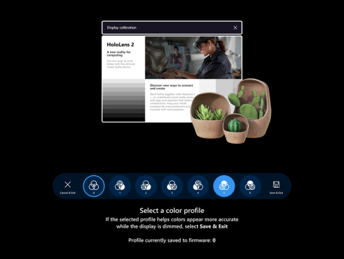

1. When you're happy with the selected profile, select the **Save & Exit** button
1. If you prefer not to make changes, select the **Cancel & Exit** button and your changes will be reverted

> [!TIP]
> Here are some helpful tips to keep in mind while using the display color calibration setting:
>
> - You can re-run display color calibration from Settings whenever you'd like
> - If anyone on the device has previously used the setting to change color profiles, the date/time of the most recent change will be reflected on the Settings page
> - When you re-run display color calibration, the color profile that was previously saved will be highlighted and Profile 0 will not appear (as Profile 0 represents the display's original color profile)
> - If you want to revert to the display's original color profile, you can do so from the Settings page (see [how to reset color profile](#how-to-reset-color-profile))

##### How to reset color profile

If you're unhappy with the custom color profile saved to your HoloLens 2, you can restore the device's original color profile:

1. Launch the **Settings** app and navigate to **System > Calibration**.
1. Under **Display color calibration**, select the **Reset to default color profile** button.
1. When the dialog box opens, select **Restart** if you're ready to restart HoloLens 2 and apply your changes.

#### Top display color calibration known issues

- On the Settings page, the status string that tells you when the color profile was last changed will be out of date until you reload that page of Settings.
    - Workaround: Select another Settings page and then re-select the Calibration page.

#### Default app picker

When you activate a hyperlink or open a file type with more than one installed app, which supports it, you will see a new window open prompting you to select which installed app should handle the file or link type. In this window, you can also choose to have the selected app handle the file or link type "Once" or "Always."

If you choose "Always" but later want to change which app handles a particular file or link type, you can reset your saved defaults in **Settings > Apps**. Scroll to the bottom of the page and select the **Clear** button under "Default apps for file types" and/or "Default apps for link types." Unlike the similar setting on desktop PCs, you can't reset individual file type defaults.

#### Per app volume control

Now in this Windows build, users can manually adjust the volume level of each app. This allows for users to better focus on the apps that they need to, or better hear when using multiple apps. Such as needing to turn down volume of one app while calling another person for remote assistance in another.

To set the volume of an individual app navigate to **Settings** > **System** > **Sound**, and under Advanced sound options select **App volume and device preferences**.<br/><br/>

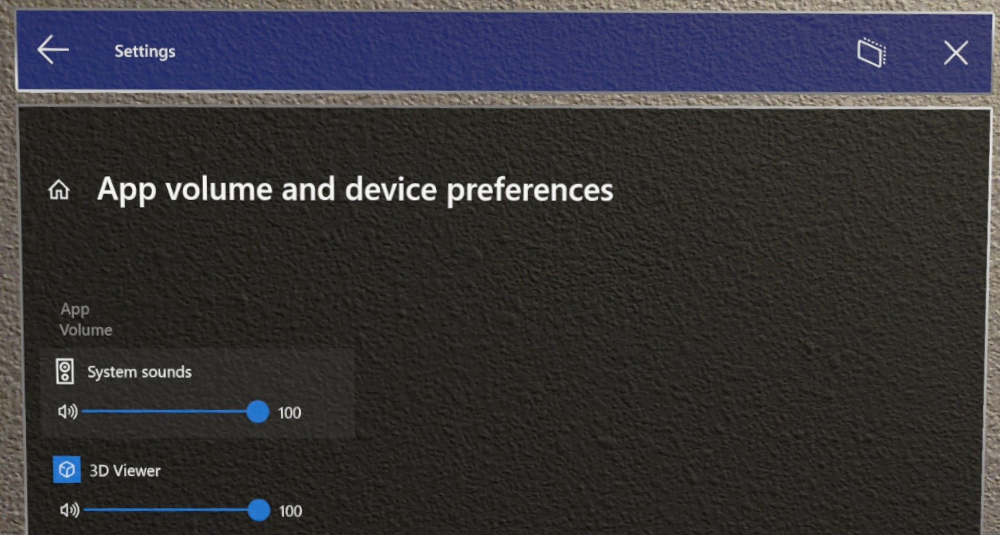

#### Swipe to type

Some customers find it faster to "type" on virtual keyboards by swiping the shape of the word they intend to type, and we're previewing this feature for the holographic keyboard. You can swipe one word at a time by passing the tip of your finger through the plane of the holographic keyboard, swiping the shape of the word, and then withdrawing the tip of your finger from the plane of the keyboard. You can swipe follow up words without needing to press the space bar by removing your finger from the keyboard between words. You will know the feature is working if you see a swipe trail following your finger's movement on the keyboard.

Please note, this feature can be tricky to use and master because of the nature of a holographic keyboard where you don't feel resistance against your finger (unlike a mobile phone display). 

### Power menu from Start

A new menu that allows the user to sign out, shut down and restart the device. An indicator in the HoloLens Start screen that shows when a system update is available.

#### How to use

1. Open the HoloLens Start screen using the [Start gesture](hololens2-basic-usage.md#start-gesture) or saying "Go to Start".

2. Notice the ellipsis icon (...) next to the user profile picture:<br/><br/>

   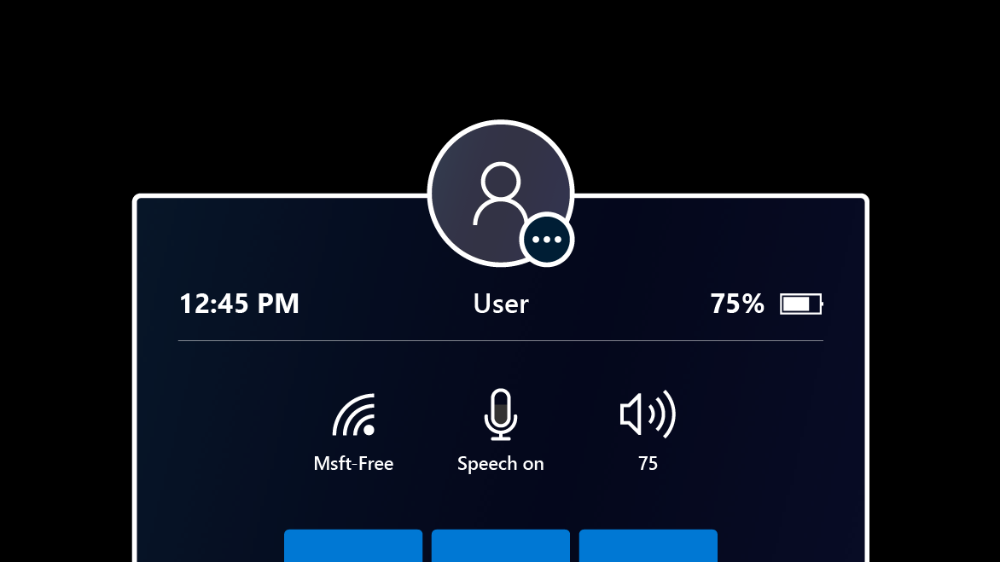

3. Select the user profile picture using your hands or the voice command "Power".

4. A menu appears with options to Sign out, Restart or Shut down the device:<br/><br/>

   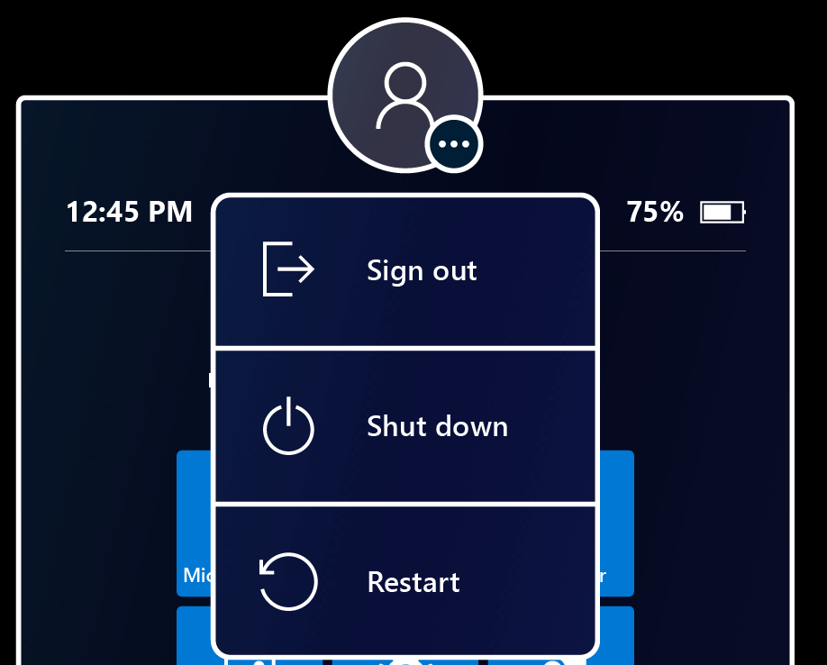

5. Select the menu options to sign out, restart or shut down your HoloLens. The Sign out option might not be available, if the device is set up for a [single Microsoft Account (MSA) or local account](hololens-identity.md).

6. Dismiss the menu by touching anywhere else or closing the Start menu with the Start gesture.

#### Update indicator

When an update is available, the ellipsis icon will light up to indicate that a restart will install the update
The menu options also change to reflect the presence of the update.<br/><br/>

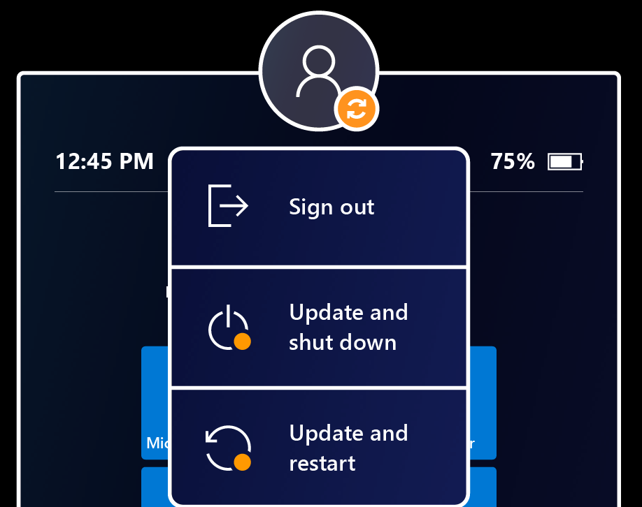

### Multiple users listed on Sign in screen

Previously the Sign In screen showed only the most recently signed in user, as well as an 'Other user' entry point. We have received customer feedback that this not sufficient if multiple users have signed into the device. They were still required to retype their username etc.

Introduced in this Windows build, when selecting **Other user** which is located to the right of the PIN entry field, the Sign in screen will display multiple users with have previously signed into the device. This allows users to select their user profile and then sign-in using their Windows Hello credentials. A new user can also be added to the device from this Other users page via the **Add account** button.

When in the Other users menu, the Other users button will display the last user signed into the device. Select this button to return to the Sign in screen for this user.

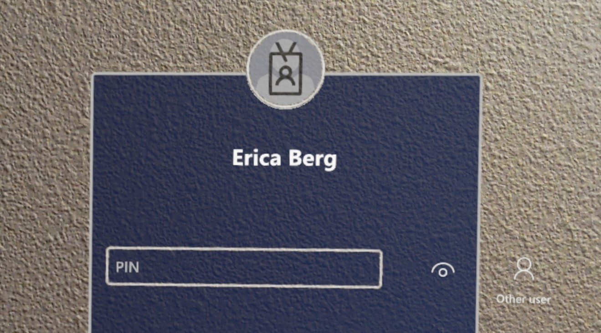

<br>


### USB-C External Microphone Support

> [!IMPORTANT]
> Plugging in **a USB mic will not automatically set it as the input device**. When plugging in a set of USB-C headphones users will observe that the headphone's audio will automatically be redirected to the headphones, but the HoloLens OS prioritizes the internal microphone array above any other input device. **In order to use a USB-C microphone follow the steps below.**

Users can select USB-C connected external microphones using the **Sound** settings panel. USB-C microphones can be used for calling, recording, etc.

Open the **Settings** app and select **System** > **Sound**.

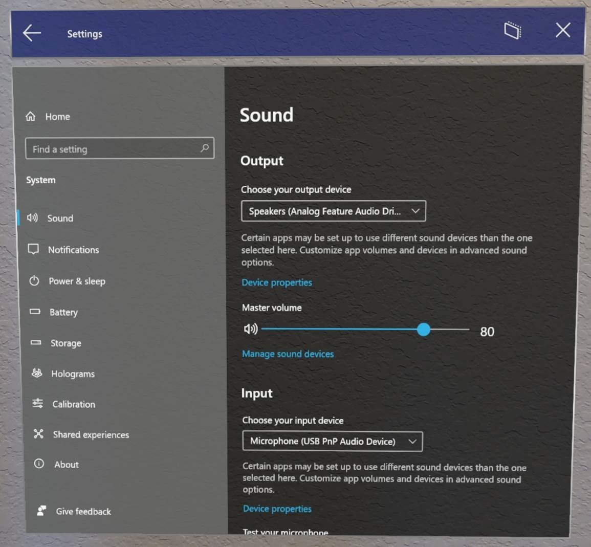

> [!IMPORTANT]
> To use external microphones with **Remote Assist**, users will need to click the “Manage sound devices” hyperlink.
>
> Then use the drop-down to set the external microphone as either **Default** or **Communications Default.** Choosing **Default** means that the external microphone will be used everywhere.
>
> Choosing **Communications Default** means that the external microphone will be used in Remote Assist and other communications apps, but the HoloLens mic array may still be used for other tasks.

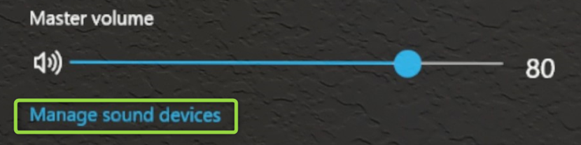

<br>

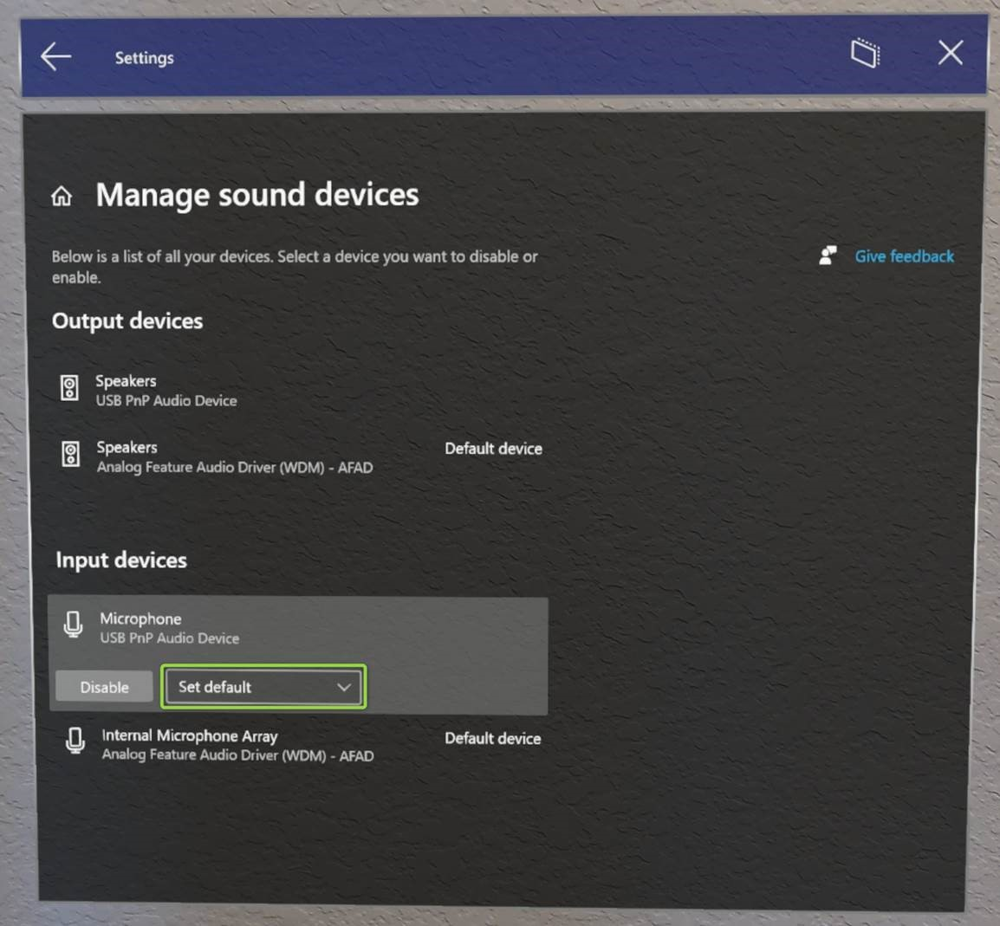

#### What about Bluetooth microphone support?

Unfortunately Bluetooth microphones are still not currently supported on HoloLens 2.

#### Troubleshooting USB-C microphones

Be aware that some USB-C microphones incorrectly report themselves as both a microphone *and* a speaker. This is a problem with the microphone and not with HoloLens. When plugging one of these microphones into HoloLens, sound may be lost. Fortunately there is a simple fix.  

In **Settings** > **System** > **Sound**, explicitly set the built-in speakers **(Analog Feature Audio Driver)** as the **Default device**. HoloLens should remember this setting even if the microphone is removed and reconnected later.

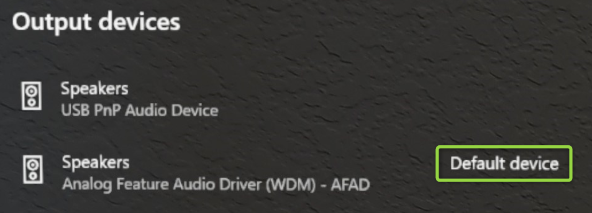

### Visitor Auto logon for Kiosks

This new feature enables the auto logon on Visitor accounts to be used for Kiosk modes.

For a non-AAD configuration, to configure a device for visitor auto-logon:

1. Create a provisioning package that:
    1. Configures **Runtime settings/AssignedAccess** to allow Visitor accounts.
    1. Optionally enrolls the device in MDM **(Runtime settings/Workplace/Enrollments)** so that it can be managed later.
    1. Do not create a local account
1. [Apply the provisioning package](hololens-provisioning.md).

For an AAD configuration, users can achieve something similar to this today without this change. AAD joined devices configured for kiosk mode can sign in a Visitor account with a single button tap from the sign in screen. Once signed in to the visitor account, the device will not prompt for sign in again until the Visitor is explicitly signed out from the start menu or the device is restarted.

Visitor Auto logon can be managed via [custom OMA-URI](/mem/intune/configuration/custom-settings-windows-10) policy:

- URI value: ./Device/Vendor/MSFT/MixedReality/VisitorAutoLogon

| Policy  | Description   | Configurations  |
|---|---|---|
| MixedReality/VisitorAutoLogon  | Allows for a Visitor to Auto logon to a Kiosk   | 1 (Yes), 0 (No, default.)  |

### Use the new Settings and Edge apps in Kiosk modes

When including apps in [Kiosks](hololens-kiosk.md), an IT Admin often adds the app to the Kiosk but using it's App User Model ID (AUMID). Because both the Settings app and Microsoft Edge app are considered new apps and different than the older apps Kiosks that use AUMIDs for those apps will need to be updated to use the new AUMID.

When modifying a Kiosk to include the new apps, we recommend adding in the new AUMID as well as leaving the old one. This will create an easy transition when users update the OS and won't need to receive new policies to keep using the Kiosk as intended.

| App                    | AUMID                                                  |
|------------------------|--------------------------------------------------------|
| Old Settings App       | HolographicSystemSettings_cw5n1h2txyewy!App            |
| New Settings App       | BAEAEF15-9BAB-47FC-800B-ACECAD2AE94B_cw5n1h2txyewy!App |
| Old Microsoft Edge app | Microsoft.MicrosoftEdge_8wekyb3d8bbwe!MicrosoftEdge    |
| New Microsoft Edge app | Microsoft.MicrosoftEdge.Stable_8wekyb3d8bbwe!MSEDGE    |

### Kiosk mode behavior changes for handling of failures

In older builds, if a device had a kiosk configuration, which is a combination of both global assigned access and AAD group member assigned access, if determining AAD group membership failed, the user would see “[nothing shown in start](hololens-kiosk.md#issue---no-apps-are-shown-in-start-menu-in-kiosk-mode)” menu.

Starting in this Windows release, the kiosk experience will fallback to global kiosk configuration (if present) in case of failures during AAD group kiosk mode.

### New Settings URIs for Page Settings Visibility

In [Windows Holographic, version 20H2](hololens-release-notes-2004.md#windows-holographic-version-20h2) we added the [Settings/PageVisibilityList policy](/windows/client-management/mdm/policy-csp-settings#settings-pagevisibilitylist) to restrict the pages seen within the Settings app. PageVisibilityList is a policy that allows IT Admins to either prevent specific pages in the System Settings app from being visible or accessible, or to do so for all pages except those specified.

If you visit [Page Settings Visibility](settings-uri-list.md), you can find instructions to use this CSP and the list of URIs available in previous releases.

We are expanding upon the list of available Settings URIs, which IT Admins can manage. Some of these URIs are for newly available areas within the new Settings app. If you are using Settings/PageVisibilityList policy, review the following list and adjust your allowed or blocked pages as needed.

> [!NOTE]
> **Deprecated: ms-settings:network-proxy**
>
> One settings page is deprecated in these newer builds. The old **Network & Internet** > **Proxy** page is no longer available as a global setting. The new per-connection proxy settings can be found under **Network & Internet** > **Wi-Fi** > **Properties** or **Network & Internet** > **Ethernet** > **Properties**.

<br>

| Settings page                                        | URI                                              |
|------------------------------------------------------|--------------------------------------------------|
| Apps > Apps & features                               | `ms-settings:appsfeatures`                         |
| Apps > Apps & features > Advanced options          | `ms-settings:appsfeatures-app`                     |
| Apps > Offline maps                                  | `ms-settings:maps`                                 |
| Apps > Offline maps > Download maps                  | `ms-settings:maps-downloadmaps`                    |
| Devices > Mouse                                      | `ms-settings:mouse`                                |
| Devices > USB                                        | `ms-settings:usb`                                  |
| Network & Internet > Airplane mode                   | `ms-settings:network-airplanemode`                 |
| Privacy > General                                    | `ms-settings:privacy-general`                      |
| Privacy > Ink & typing personalization             | `ms-settings:privacy-speechtyping`                 |
| Privacy > Motion                                     | `ms-settings:privacy-motion`                       |
| Privacy > Screenshot borders                         | `ms-settings:privacy-graphicsCaptureWithoutBorder` |
| Privacy > Screenshots and apps                       | `ms-settings:privacy-graphicsCaptureProgrammatic`  |
| System > Battery                                     | `ms-settings:batterysaver`                         |
| System > Battery                                     | `ms-settings:batterysaver-settings`                |
| System > Sound                                       | `ms-settings:sound`                                |
| System > Sound > App volume and device preferences | `ms-settings:apps-volume`                          |
| System > Sound > Manage sound   devices              | `ms-settings:sound-devices`                        |
| System > Storage > Configure Storage Sense         | `ms-settings:storagepolicies`                      |
| Time & Language > Date & time                        | `ms-settings:dateandtime`                          |
| Time & Language > Keyboard                           | `ms-settings:keyboard`                             |
| Time & Language > Language                           | `ms-settings:language`                             |
| Time & Language > Language                           | `ms-settings:regionlanguage-languageoptions`       |
| Update & Security > Reset & recovery               | `ms-settings:reset`                                |

#### Updated URIs

Previously the following two URIs would not take a user directly to the pages indicated but only blocked the main updates page. The following items have been updated to direct to their pages:

- `ms-settings:windowsupdate-options`
- `ms-settings:windowsupdate-restartoptions`

### Configuring Fallback Diagnostics via Settings app

Now in Settings App, a user can configure the behavior of [Fallback Diagnostics](hololens-diagnostic-logs.md). In the Settings app navigate to **Privacy** > **Troubleshooting** page to configure this setting.

> [!NOTE]
> If there is MDM policy configured for the device, user will not be able to override that behavior.  

### Share things with nearby devices

Share things with near by Windows 10 devices, including both PCs and other HoloLens 2 devices. You can try it out in **Settings** > **System** > **Shared Experiences** to share files or URLs from a HoloLens to a PC. For more details read more about how to [Share things with nearby devices in Windows 10](https://support.microsoft.com/windows/share-things-with-nearby-devices-in-windows-10-0efbfe40-e3e2-581b-13f4-1a0e9936c2d9).

This feature can be managed via [Connectivity/AllowConnectedDevices](/windows/client-management/mdm/policy-csp-connectivity#connectivity-allowconnecteddevices).

### New OS diagnostic traces

In addition to the previous troubleshooters within the Settings app, a new troubleshooter has been added with the addition of the new Settings app for OS Updates. Navigate to **Settings** > **Update &amp; Security** > **Troubleshoot** > **Windows Update** and select **Start**. This allows you to collect traces while reproducing your issue with OS Updates to assist better in troubleshooting with your IT or support.

### Delivery Optimization Preview

With this HoloLens update, Windows Holographic for Business enables delivery optimization settings to reduce bandwidth consumption for downloads from multiple HoloLens devices. A fuller description of this functionality along with the recommended network configuration is available here: [Delivery Optimization for Windows 10 updates](/windows/deployment/update/waas-delivery-optimization).

The following settings are enabled as part of the management surface and [can be configured from Intune](/mem/intune/configuration/delivery-optimization-settings):

- [DOCacheHost](/windows/client-management/mdm/policy-csp-deliveryoptimization#deliveryoptimization-docachehost)
- [DOCacheHostSource](/windows/client-management/mdm/policy-csp-deliveryoptimization#deliveryoptimization-docachehostsource)
- [DODelayCacheServerFallbackBackground](/windows/client-management/mdm/policy-csp-deliveryoptimization#deliveryoptimization-dodelaycacheserverfallbackbackground)
- [DODelayCacheServerFallbackForeground](/windows/client-management/mdm/policy-csp-deliveryoptimization#deliveryoptimization-dodelaycacheserverfallbackforeground)
- [DODownloadMode](/windows/client-management/mdm/policy-csp-deliveryoptimization#deliveryoptimization-dodownloadmode)
- [DOMaxBackgroundDownloadBandwidth](/windows/client-management/mdm/policy-csp-deliveryoptimization#deliveryoptimization-domaxbackgrounddownloadbandwidth)
- [DOMaxForegroundDownloadBandwidth](/windows/client-management/mdm/policy-csp-deliveryoptimization#deliveryoptimization-domaxforegrounddownloadbandwidth)
- [DOPercentageMaxBackgroundBandwidth](/windows/client-management/mdm/policy-csp-deliveryoptimization#deliveryoptimization-dopercentagemaxbackgroundbandwidth)
- [DOPercentageMaxForegroundBandwidth](/windows/client-management/mdm/policy-csp-deliveryoptimization#deliveryoptimization-dopercentagemaxforegroundbandwidth)
- [DOSetHoursToLimitForegroundDownloadBandwidth](/windows/client-management/mdm/policy-csp-deliveryoptimization#deliveryoptimization-dosethourstolimitforegrounddownloadbandwidth)
- [DOSetHoursToLimitBackgroundDownloadBandwidth](/windows/client-management/mdm/policy-csp-deliveryoptimization#deliveryoptimization-dosethourstolimitbackgrounddownloadbandwidth)

A few caveats about this preview offering:

- HoloLens support is limited in this preview to OS updates only.
- Windows Holographic for Business only supports HTTP download modes and downloads from a [Microsoft Connected Cache endpoint](/mem/configmgr/core/plan-design/hierarchy/microsoft-connected-cache); peer-to-peer download modes and group assignments are not supported for HoloLens devices at this time.
- HoloLens does not support deployment or delivery optimization for Windows Server Update Services endpoints.
- Troubleshooting will require either diagnostics on the Connected Cache server or collecting a trace on HoloLens on HoloLens via **Settings** > **Update & Security** >  **Troubleshooting** >  **Windows Update**.

### IT Admin - Update Checklist

This checklist will help you know the new items that features that are being added in this feature update that may affect your current device management configurations, or new features you might wish to start using.

#### Updates to Kiosk mode

✔️[**New AUMIDs for new apps in Kiosk mode**](#use-the-new-settings-and-edge-apps-in-kiosk-modes):

If you were previously using either the Settings app or Microsoft Edge app in a Kiosk, we have replaced these apps with new apps which use a different App ID. We highly encourage you to read [New AUMIDs for new apps in Kiosk mode](#use-the-new-settings-and-edge-apps-in-kiosk-modes) below. This will ensure you either continue to have the Settings app in your Kiosk, or include the new Microsoft Edge app. These changes can be done now, and deployed to all devices and allow for a smoother transition on update.

✔️[**Visitor Auto-logon for Kiosks**](#visitor-auto-logon-for-kiosks):

Visitors can now be automatically logged into a Kiosk. This behavior is on by default but can be managed and disabled.

✔️[**Improved Kiosk mode failure handing**](#kiosk-mode-behavior-changes-for-handling-of-failures):

If AAD group membership of signed-in AAD user is not successfully determined, then global kiosk configuration is used for start menu (if present) otherwise user is presented with empty start menu. While the empty start menu is not a configuration you can directly set, this new handling may be something to inform your support department of if you are using Kiosks, as this may apply to your configurations or you may want to make new adjustments to your assigned access configurations.

#### Updates to Page Settings Visibility

✔️[**New Settings URIs for Page Settings Visibility**](#new-settings-uris-for-page-settings-visibility)

If you are currently using [Page Settings Visibility](settings-uri-list.md) then you may wish to make adjustments to your existing URIs you have either allowed or blocked.

#### Updates for your WDAC policy

✔️ If you were previously blocking Microsoft Edge via WDAC, you'll want to update your WDAC policy. Please review the following and use the sample code provided.

#### Enable new endpoints for Edge

✔️ If you have an infrastructure that involves configuring network endpoints such as proxy or firewall, please enable these new endpoints for the new Microsoft Edge app.

#### Newly configurable items

✔️ [Configure Fallback Diagnostics](#configuring-fallback-diagnostics-via-settings-app): You may configure if and who may collect Fallback Diagnostics.

✔️[Share things with nearby devices](#share-things-with-nearby-devices): You may disable the new nearby sharing feature.

✔️ [Configuring policy settings for the new Microsoft Edge](#configuring-policy-settings-for-the-new-microsoft-edge): Review the newly configurations available for Microsoft Edge.

#### New diagnostic tool

✔️[New OS diagnostic traces](#new-os-diagnostic-traces): Collect logs related to OS Updates.

### Improvements and fixes in the update:

- [Offline diagnostics](hololens-diagnostic-logs.md#offline-diagnostics) will also include additional device information for serial number and OS version.
- Fixes an issue around deployment of line-of-business applications via runtime provisioning packages.
- Fixes an issue around line-of-business application install status reporting.
- Fixes an issue around the persistence of new app packages across device resets.
- Fixes an issue that could lead to incorrect symbols being typed in Edge for Japanese customers.
- Improves the resiliency of OS updates around preinstalled apps such as Edge.
- Addresses an update reliability impacting the installation of Microsoft Edge.


