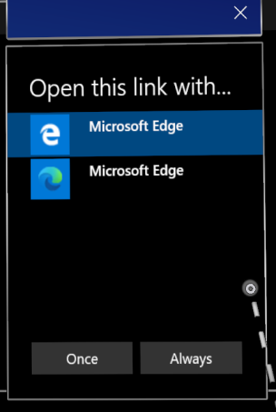
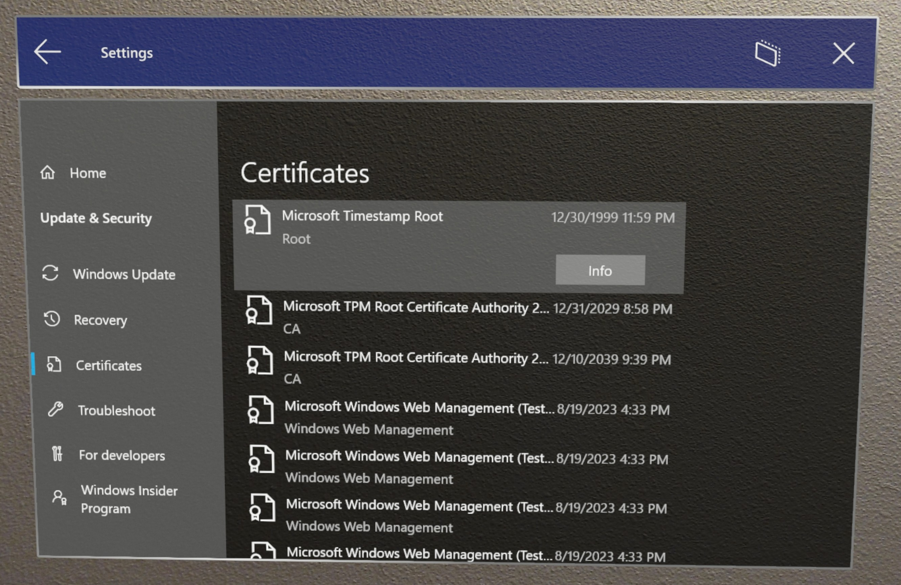
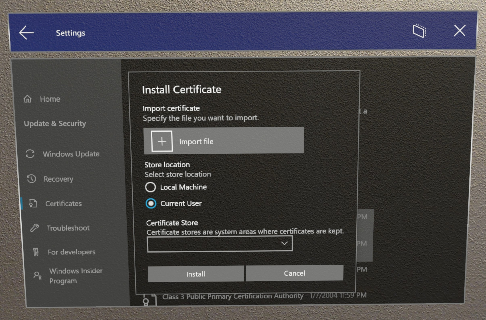
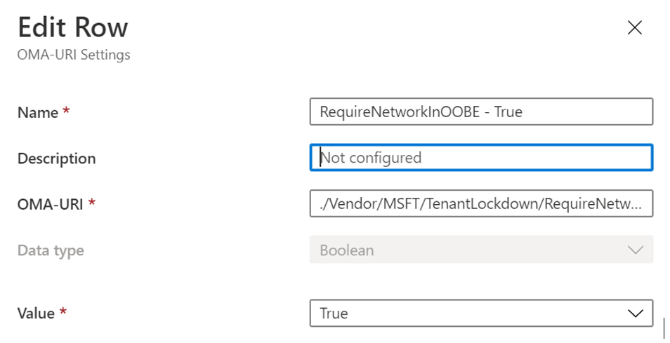
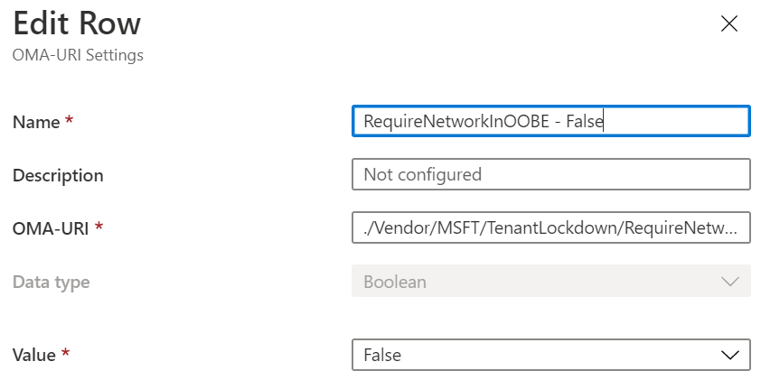
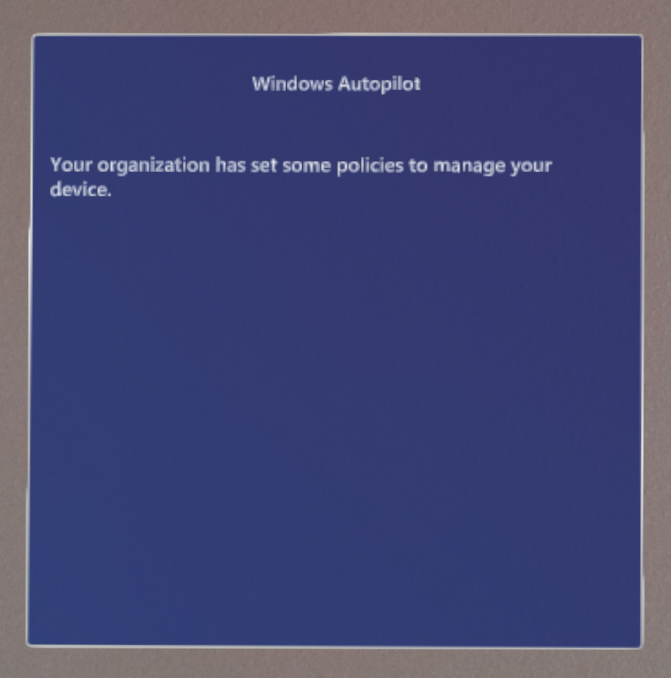

# HoloLens 2 release notes

To ensure you have a productive experience with your HoloLens devices, we continue to release feature, bug, and security updates. On this page, you can see what’s new for HoloLens each month. To get the latest HoloLens 2 update, you can either [check for updates and manually update](hololens-update-hololens.md#check-for-updates-and-manually-update) or get the Full Flash Update (FFU) to [flash your device via Advanced Recovery Companion](hololens-recovery.md#clean-reflash-the-device). The [download](https://aka.ms/hololens2download) is kept up to date and provides the latest generally available build.


## Windows Holographic, version 21H1
- Build 

This update contains features for two target audiences; features that can be used by anyone on a device by the End User, and new device management options that can be configured by IT Admins. The table below specifies the features that are relevant to each audience. If you are an IT Admin, please take a look at our [IT Admin - Update Checklist](#it-admin---update-checklist)

| Feature Name                                              | Short description                                                                      | Target Audience | 
|-----------------------------------------------------------|----------------------------------------------------------------------------------------|--------------------|
| [New Microsoft Edge](https://docs.microsoft.com/hololens/hololens-release-notes#introducing-the-new-microsoft-edge)<sup>1</sup>  | The new, Chromium-based Microsoft Edge is now available for HoloLens 2. | End User | 
[WebXR and 360 Viewer](https://docs.microsoft.com/hololens/hololens-release-notes#webxr-and-360-viewer) | Try immersive web experiences and 360 video playback. | End User | 
[New Settings App](https://docs.microsoft.com/hololens/hololens-release-notes#new-settings-app) | The legacy Settings app is being replaced by an updated version with new features and settings. | End User |
[Display color calibration](https://docs.microsoft.com/hololens/hololens-release-notes#display-color-calibration) | Select an alternative color profile for your HoloLens 2 display. | End User |
[Default app picker](https://docs.microsoft.com/hololens/hololens-release-notes#default-app-picker) | Choose which app should launch for each file or link type. | End User |
[Per app volume control](https://docs.microsoft.com/hololens/hololens-release-notes#per-app-volume-control) | Control app level volume independently from system volume. | End User |
[Office web app](https://docs.microsoft.com/hololens/hololens-release-notes#office-web-app) | A shortcut to the Office web app is now listed in "All apps". | End User |
[Swipe to type](https://docs.microsoft.com/hololens/hololens-release-notes#swipe-to-type) | Use the tip of your finger to "swipe" words on the holographic keyboard. | End User |
[Power menu from Start](https://docs.microsoft.com/hololens/hololens-release-notes#power-menu-from-start) | On Start Menu, restart and shut down HoloLens device. | End User |
[Multiple users listed on Sign in screen](https://docs.microsoft.com/hololens/hololens-release-notes#multiple-users-listed-on-sign-in-screen) | Display multiple user accounts on the Sign in screen. | End User |
[USB-C External Microphone Support](https://docs.microsoft.com/hololens/hololens-release-notes#usb-c-external-microphone-support) | Use USB-C microphones for apps and / or Remote Assist. | End User |
[Visitor Auto-logon for Kiosks](https://docs.microsoft.com/hololens/hololens-release-notes#visitor-auto-logon-for-kiosks) | Enables the auto-logon on Visitor accounts to be used for Kiosk modes. | IT Admin |
[New AUMIDs for new apps in Kiosk mode](https://docs.microsoft.com/hololens/hololens-release-notes#use-the-new-settings-and-edge-apps-in-kiosk-modes)<sup>1</sup>  | AUMIDs for new Settings and Edge apps. | IT Admin |
[Improved Kiosk mode failure handing](https://docs.microsoft.com/hololens/hololens-release-notes#kiosk-mode-behavior-changes-for-handling-of-failures) | Kiosk mode looks for Global Assigned Access before empty start menu. | IT Admin |
[New SettingsURIs for Page Settings Visibility](https://docs.microsoft.com/hololens/hololens-release-notes#new-settingsuris-for-page-settings-visibility) | 20+ new SettingsURIs for Settings/PageVisibilityList policy. | IT Admin |
[Configure Fallback Diagnostics](https://docs.microsoft.com/hololens/hololens-release-notes#configuring-fallback-diagnostics-via-settings-app) | Setting Fallback Diagnostic Behavior in Settings App. | IT Admin |
[Share things with nearby devices](https://docs.microsoft.com/hololens/hololens-release-notes#share-things-with-nearby-devices) | Share files or URLs from a HoloLens to a PC. | IT Admin |
[New OS Update troubleshooter](https://docs.microsoft.com/hololens/hololens-release-notes#new-os-update-troubleshooter) | New troubleshooter in Settings for OS updates. | IT Admin |
[Delivery Optimization Preview](https://docs.microsoft.com/hololens/hololens-release-notes#delivery-optimization-preview) | Reduce bandwidth consumption for downloads from multiple HoloLens devices. | IT Admin |
[Improvements and fixes in the update](https://docs.microsoft.com/hololens/hololens-release-notes#improvements-and-fixes-in-the-update) | Additional fixes in the update. | All |

<sup>1</sup> 
If you were previously using either the Settings app or Microsoft Edge app in a Kiosk, we have replaced these apps with new apps which use a different App ID. We highly encourage you to read [New AUMIDs for new apps in Kiosk mode](#use-the-new-settings-and-edge-apps-in-kiosk-modes) below. This will ensure you either continue to have the Settings app in your Kiosk, or include the new Microsoft Edge app.

Check out related release notes:

- [Visit the HoloLens Emulator archive](https://docs.microsoft.com/windows/mixed-reality/hololens-emulator-archive)
- [Dynamics 365 Remote Assist](https://docs.microsoft.com/dynamics365/mixed-reality/remote-assist/version-history-remote-assist-hololens)
- [Dynamics 365 Guides](https://docs.microsoft.com/dynamics365/mixed-reality/remote-assist/version-history-remote-assist-hololens)

### IT Admin - Update Checklist

This checklist will help you know the new items that features that are being added in this feature update that may affect your current device management configurations, or new features you might wish to start using.

### Updates to Kiosk mode

[**New AUMIDs for new apps in Kiosk mode**](#use-the-new-settings-and-edge-apps-in-kiosk-modes)

If you were previously using either the Settings app or Microsoft Edge app in a Kiosk, we have replaced these apps with new apps which use a different App ID. We highly encourage you to read [New AUMIDs for new apps in Kiosk mode](#use-the-new-settings-and-edge-apps-in-kiosk-modes) below. This will ensure you either continue to have the Settings app in your Kiosk, or include the new Microsoft Edge app.

These changes can be done now, and deployed to all devices and allow for a smoother transition on update.

[**Visitor Auto-logon for Kiosks**](#visitor-auto-logon-for-kiosks)

Visitors can now be automatically logged into a Kiosk. This behavior is on by default but can be managed and disabled.

[**Improved Kiosk mode failure handing**](#kiosk-mode-behavior-changes-for-handling-of-failures)

If AAD group membership of signed-in AAD user is not successfully determined, then global kiosk configuration is used for start menu (if present) otherwise user is presented with empty start menu. While the empty start menu is not a configuration you can directly set, this new handling may be something to inform your support department of if you are using Kiosks, as this may apply to your configurations or you may want to make new adjustments to your assigned access configurations.

### Updates to Page Settings Visibility

[**New SettingsURIs for Page Settings Visibility**](hololens-release-notes.md#new-settings-uris-for-page-settings-visibility)

IF you are currently using [Page Settings Visibility](settings-uri-list.md) then you may wish to make adjustments to your existing URIs you have either allowed or blocked.

### Updates for your WDAC policy

If you were previously blocking Microsoft Edge via WDAC, you'll want to update your WDAC policy. Please [review the following](#using-wdac-to-block-new-microsoft-edge) and use the sample code provided.

### Enable new endpoints for Edge

If you have an infrastructure that involves configuring network endpoints such as proxy or firewall, please [enable these new endpoints for the new Microsoft Edge app.](#managing-endpoints-for-the-new-microsoft-edge)

### Newly configurable items

- [Configure Fallback Diagnostics](#configuring-fallback-diagnostics-via-settings-app)
  - You may configure if and who may collect Fallback Diagnostics.
- [Share things with nearby devices](#share-things-with-nearby-devices)
  - You may disable the new nearby sharing feature.
- [Configuring policy settings for the new Microsoft Edge](#configuring-policy-settings-for-the-new-microsoft-edge)
  - Review the newly configurations available for Microsoft Edge.

### New diagnostic tool

- [New OS Update troubleshooter](#new-os-update-troubleshooter)
  - Collect logs related to OS Updates

### Introducing the new Microsoft Edge


The new Microsoft Edge [adopts the Chromium open source project](https://blogs.windows.com/windowsexperience/2018/12/06/microsoft-edge-making-the-web-better-through-more-open-source-collaboration/) to create better compatibility for customers and less fragmentation of the web for web developers.

With this Windows build, the new Microsoft Edge is available to HoloLens 2 customers for the first time! While the new Microsoft Edge will eventually replace legacy Microsoft Edge on HoloLens 2, both browsers are currently available to Insiders. Please share feedback and bugs with our team via the **Send Feedback** feature in the new Microsoft Edge or via [Feedback Hub](hololens-feedback.md).


#### Launching the new Microsoft Edge

There are two versions of Microsoft Edge available to Insiders: the new Microsoft Edge  (represented by a blue and green swirl icon) and legacy Microsoft Edge (represented by the white "e" icon). The new Microsoft Edge is pinned to the Start menu and will automatically launch when you activate a web link. If you would like to revert to using legacy Microsoft Edge as your default web browser, see the instructions below for [resetting default apps](#default-app-picker).

> [!NOTE]
> When you first launch the new Microsoft Edge on HoloLens 2, your settings and data will be imported from legacy Microsoft Edge. If you continue to use legacy Microsoft Edge after launching the new Microsoft Edge, that new data will not be synced from legacy Microsoft Edge to the new Microsoft Edge.

#### Configuring policy settings for the new Microsoft Edge

The new Microsoft Edge offers IT admins a much broader set of browser policies on HoloLens 2 than were previously available with legacy Microsoft Edge.

Here are some helpful resources for learning more about managing policy settings for the new Microsoft Edge:

- [Configure Microsoft Edge policy settings with Microsoft Intune](https://docs.microsoft.com/deployedge/configure-edge-with-intune)
- [Microsoft Edge Legacy to Microsoft Edge policy mapping](https://docs.microsoft.com/deployedge/microsoft-edge-policy-map-legacy-to-newedge)
- [Google Chrome to Microsoft Edge policy mapping](https://docs.microsoft.com/deployedge/microsoft-edge-policy-map-chrome-to-newedge)
- Full [Microsoft Edge Enterprise documentation](https://docs.microsoft.com/deployedge/)

> [!IMPORTANT]
> Because of the volume of browser policies supported by the new Microsoft Edge, our team is unable to guarantee that each new policy works on HoloLens 2. However, we've tested and confirmed than the new Microsoft Edge equivalent of each legacy Microsoft Edge policy previously supported on HoloLens 2 work as expected. See [Microsoft Edge Legacy to Microsoft Edge policy mapping](https://docs.microsoft.com/deployedge/microsoft-edge-policy-map-legacy-to-newedge) to find the new Microsoft Edge equivalent of each legacy Microsoft Edge browser policy you were using with HoloLens 2.
>
> There are at least two new Microsoft Edge policies that we know *will not* work with HoloLens 2:
> - EnterpriseModeSiteList
> - EnterpriseSiteListServiceURL

#### What to expect from the new Microsoft Edge on HoloLens 2

Because the new Microsoft Edge is a native Win32 app with a new UWP adapter layer allowing it to run on UWP-only devices like HoloLens 2, some features may not be immediately available. We'll be supporting new scenarios and features over the coming months, so check this space for up-to-date information.

**Scenarios and features expected to work:**
- First-run experience, sign in to profile, and sync
- Websites should render and behave as expected
- Most browser functionality (Favorites, History, etc.) should work as expected
- Dark mode
- Installing web apps to the device
- Installing extensions (please let us know if you use any extensions that don't work properly on HoloLens 2)
- Viewing and marking up a PDF
- Spatial sound from a single browser window
- Automatic and manual updating of the browser
- Saving a PDF from the Print menu (using "Save to PDF" option)
- WebXR and 360 Viewer extension
- Content restoration to correct window, when browsing across multiple windows placed in your environment

**Scenarios and features not expected to work:**
- Spatial sound from multiple windows with simultaneous audio streams
- "See it, say it"
- Printing

**Top browser known issues:**
- Wi-Fi proxy configurations, which are proxy policies that target individual Wi-Fi connections, don't currently work with the new Microsoft Edge. We're actively working to unblock this issue before public release of the OS update.
- The magnifier preview in the holographic keyboard has been disabled for the new Microsoft Edge. We hope to reenable this feature in a future update, once the magnification is working correctly.
- Two characters on the Japanese keyboard do not work as expected in the new Microsoft Edge. This issue has been root caused and should be fixed soon.
- Web links in the Microsoft Store app may not launch the browser
- Audio may play from the wrong browser window if you have another browser window open and active. You can work around this issue by closing the other active window that isn't supposed to be playing audio.
- When playing audio from a browser window in ["Follow me" mode](hololens2-basic-usage.md#follow-me-stop-following), the audio will continue playing if you disable "Follow me" mode. You can work around this issue by stopping audio playback before disabling "Follow me" mode or by closing the window with the **X** button.
- Interacting with active Microsoft Edge windows may cause other 2D app windows to go inactive unexpectedly. You can reactivate these windows by interacting with them again.
- Opening a web link from another app, or certain types of documents like PDFs, may cause a second blank tab to open in the browser (in addition to the new tab created with the contents of the web link or file link). You can work around this issue by closing the additional blank tab.

#### Microsoft Edge Insider channels

The Microsoft Edge team makes three preview channels available to the Edge Insider community: Beta, Dev, and Canary. Installing a preview channel doesn't uninstall the released version of Microsoft Edge on your HoloLens 2, and you can install more than one at the same time. 

Visit the [Microsoft Edge Insider homepage](https://www.microsoftedgeinsider.com) to learn more about the Edge Insider community. To learn more about the different Edge Insider channels and get started, visit the [Edge Insider download page](https://www.microsoftedgeinsider.com/download).

There are a couple methods available for installing Microsoft Edge Insider channels to HoloLens 2:

**Direct install on device (currently only available to unmanaged devices)**
  1. On your HoloLens 2, visit the [Edge Insider download page](https://www.microsoftedgeinsider.com/download).
  1. Select the **Download for HoloLens 2** button for the Edge Insider channel you wish to install.
  1. Launch the downloaded .msix file from the Edge download queue or from your device's "Downloads" folder (using File Explorer).
  1. [App installer](app-deploy-app-installer.md) will launch.
  1. Select the **Install** button.
  1. After successful install, you'll find Microsoft Edge Beta, Dev, or Canary as a separate entry in the **All apps** list of the Start menu.

**Install via PC with Windows Device Portal (requires [developer mode](https://docs.microsoft.com/windows/mixed-reality/develop/platform-capabilities-and-apis/using-the-windows-device-portal#setting-up-hololens-to-use-windows-device-portal) to be enabled on HoloLens 2)**
  1. On your PC, visit the [Edge Insider download page](https://www.microsoftedgeinsider.com/download).
  1. Select the **drop-down arrow button** next to the "Download for Windows 10" button for the Edge Insider channel you wish to install.
  1. Select **HoloLens 2** in the drop-down menu.
  1. Save the .msix file to the "Downloads" folder of your PC (or another folder you can easily find).
  1. Use [Windows Device Portal](https://docs.microsoft.com/windows/mixed-reality/develop/platform-capabilities-and-apis/using-the-windows-device-portal#installing-an-app) on your PC to install the downloaded .msix file on HoloLens 2.
  1. After successful install, you'll find Microsoft Edge Beta, Dev, or Canary as a separate entry in the **All apps** list of the Start menu.

#### Using WDAC to block new Microsoft Edge

For IT Admins looking to update their [WDAC policy](windows-defender-application-control-wdac.md) to block the new Microsoft Edge app, you'll need to add the following to your policy.

``` <Deny ID="ID_DENY_D_3_0" FriendlyName="C:\Data\Programs FileRule" PackageVersion="65535.65535.65535.65535" FileName="msedge.exe" /> ```

#### Managing endpoints for the new Microsoft Edge

Some environments may have network restrictions to account for as a consideration. To ensure a smooth experience with the new Edge please [enable these Microsoft endpoints.](https://docs.microsoft.com/deployedge/microsoft-edge-security-endpoints)

Read more about the currently available [endpoints for HoloLens](hololens-offline.md).

### WebXR and 360 Viewer

*Added in Windows Insider build 20289.1000*

The new Microsoft Edge includes support for WebXR, which is the new standard for creating immersive web experiences (replacing WebVR). Many immersive web experiences were designed with VR in mind (they replace your field of view with a virtual environment), but these experiences are also supported by HoloLens 2. The WebXR standard also enables augmented and mixed reality immersive web experiences that use your physical environment. As developers spend more time with WebXR, we anticipate new augmented and mixed reality immersive experiences will arrive for HoloLens 2 customers to try!

The 360 Viewer extension is built on WebXR and automatically installs alongside the new Microsoft Edge on HoloLens 2. This web extension gives you the ability to immerse yourself in 360-degree videos. YouTube offers the largest selection of 360 videos, so we encourage you to start there.

#### How to use WebXR

1. Navigate to a website with WebXR support.
1. Select the **Enter VR** button on the website. The location and visual representation of this button may vary per website, but it may look similar to:

    

1. The first time you try to launch a WebXR experience on a specific domain, the browser will ask for consent to enter an immersive view, select **Allow**.
1. Use [HoloLens 2 gestures](hololens2-basic-usage.md#the-hand-tracking-frame) to manipulate the experience.
1. If the experience doesn't have an **Exit** button, use the [Start gesture](hololens2-basic-usage.md#start-gesture) to return home.

**Recommended WebXR samples**
- 360 Viewer (see next section)
- [XR Dinosaurs](https://www.xrdinosaurs.com/)
- [Barista Express](https://constructarca.de/game/barista-express/)
- [WebXR Paint](https://threejs.org/examples/webxr_vr_paint.html)

#### How to use 360 Viewer

1. Navigate to a 360-degree video on YouTube.
1. In the video frame, select the mixed reality headset button:

    

1. The first time you try to launch 360 Viewer on a specific domain, the browser will ask for consent to enter an immersive view. Select **Allow**.
1. [Air tap](hololens2-basic-usage.md#select-using-air-tap) to bring up the playback controls. Use [hand rays and air tap](hololens2-basic-usage.md#select-using-air-tap) to play/pause, skip forward/back, turn captions on/off, or stop the experience (which exits the immersive view). The playback controls will disappear after a few seconds of inactivity.

#### Top WebXR and 360 Viewer known issues
- Depending on the complexity of the WebXR experience, the framerate may drop or stutter.
- Support for articulated hand joints in WebXR is not enabled by default. Developers can enable support via `edge://flags` by turning on "WebXR Hand Input."
- When exiting a WebXR or 360 Viewer experience, it may take 30 seconds or more for holograms in the mixed reality home to reappear.
- 360 videos from websites other than YouTube may not work as expected.
- Captions are currently disabled in 360 Viewer on HoloLens 2. We plan to enable this feature in a future update.
- Pausing a video in 360 Viewer stops the video from rendering (but selecting the play button correctly resumes playback).
- The "next video" button in 360 Viewer does not currently work.
- You can play 2D videos in an immersive "theater" mode, but the framerate may be less than 30 fps.

#### Providing feedback on WebXR and 360 Viewer

Please share feedback and bugs with our team via the **Send Feedback** feature in the new Microsoft Edge.

### New Settings app

With this release, we're introducing a new version of the Settings app. The new Settings app includes new features and expanded settings for HoloLens 2 in the following areas: Sound, Power & sleep, Network & Internet, Apps, Accounts, Ease of Access, and more.

> [!NOTE]
> Because the new Settings app is distinct from the legacy Settings app, any Settings windows you previously placed around your environment will be removed upon update.


**New features and settings**
- Settings search: search for settings from the Settings homepage using keywords or the setting's name.
- System > Sound:
  - Input and output audio devices: independently choose your input and output audio devices (for example, listen to audio via Bluetooth headphones or use a USB-C microphone for audio input).
    > [!NOTE]
    > Bluetooth microphones are not supported by HoloLens 2.
  - App volume: independently adjust the volume of each app. See [per app volume control](#per-app-volume-control).
- System > Power & sleep: choose when the device should go to sleep after a period of inactivity.
- System > Battery: manually enable battery saver mode or set a battery threshold at which point battery saver mode turns on automatically.
- Devices > USB: you can disable USB connections by default.
- Network & Internet:
  - USB-C Ethernet adapters will now appear in Network & Internet.
  - USB-C Ethernet adapter settings are now available, including its IP address.
  - You can now enable airplane mode on HoloLens 2.
- Apps: you can reset the default apps used for file and link types. For more information see [Default app picker](#default-app-picker).
- Accounts > Other users: device owners can add users, upgrade standard users to device owners, downgrade device owners to standard users, and remove users.
- Ease of Access: change text size and some visual effects.

**Known issues**
- Previously placed Settings windows will be removed (see note above).
- You can no longer rename your device with the Settings app. IT admins can rename devices by using the [Windows Autopilot for HoloLens 2](https://docs.microsoft.com/hololens/hololens2-autopilot) device name template or the MDM [DevDetail CSP](https://docs.microsoft.com/windows/client-management/mdm/devdetail-csp) Ext/Microsoft/DNSComputerName node.
- The Ethernet page shows a virtual Ethernet device ("UsbNcm") at all times.
- Battery usage for the new Microsoft Edge may not be accurate, due to its nature as a Win32 desktop application supported by a UWP adapter layer (no fix anticipated soon).

### Display color calibration

*Added in Windows Insider build 20293.1000*

With this new setting, you can select an alternative color profile for your HoloLens 2 display. This may help colors appear more accurate, especially at lower display brightness levels. Display color calibration can be found in the Settings app, on the System > Calibration page.

> [!NOTE]
> Because this setting saves a new color profile to your display firmware, it is a per-device setting (and not unique to each user account).

#### How to use display color calibration

1. Launch the **Settings** app and navigate to **System > Calibration**.
1. Under **Display color calibration**, select the **Run display color calibration** button.
1. The display color calibration experience will launch and encourage you to make sure your visor is in the correct position.
1. After you proceed through the instruction dialog boxes, your display will automatically be dimmed to 30% brightness.
    > [!TIP]
    > If you're having trouble seeing the dimmed scene in your environment, you can manually adjust the brightness level of HoloLens 2 using the brightness buttons on the left side of the device.
1. Select buttons 1-6 to instantly try out each color profile, and find one that looks the best to your eyes (this usually means the profile that helps the scene appear most neutral, with the grayscale pattern and skin tones looking as expected.)

    
    
1. When you're happy with the selected profile, select the **Save & Exit** button
1. If you prefer not to make changes, select the **Cancel & Exit** button and your changes will be reverted

> [!TIP]
> Here are some helpful tips to keep in mind while using the display color calibration setting:
> - You can re-run display color calibration from Settings whenever you'd like
> - If anyone on the device has previously used the setting to change color profiles, the date/time of the most recent change will be reflected on the Settings page
> - When you re-run display color calibration, the color profile that was previously saved will be highlighted and Profile 0 will not appear (as Profile 0 represents the display's original color profile)
> - If you want to revert to the display's original color profile, you can do so from the Settings page (see [how to reset color profile](#how-to-reset-color-profile))

#### How to reset color profile

If you're unhappy with the custom color profile saved to your HoloLens 2, you can restore the device's original color profile:
1. Launch the **Settings** app and navigate to **System > Calibration**.
1. Under **Display color calibration**, select the **Reset to default color profile** button.
1. When the dialog box opens, select **Restart** if you're ready to restart HoloLens 2 and apply your changes.

#### Top display color calibration known issues

- On the Settings page, the status string that tells you when the color profile was last changed will be out of date until you reload that page of Settings.
    - Workaround: Select another Settings page and then re-select the Calibration page.

### Default app picker

When you activate a hyperlink or open a file type with more than one installed app, which supports it, you will see a new window open prompting you to select which installed app should handle the file or link type. In this window, you can also choose to have the selected app handle the file or link type "Once" or "Always."



If you choose "Always" but later want to change which app handles a particular file or link type, you can reset your saved defaults in **Settings > Apps**. Scroll to the bottom of the page and select the **Clear** button under "Default apps for file types" and/or "Default apps for link types." Unlike the similar setting on desktop PCs, you can't reset individual file type defaults.

### Per app volume control

Now in this Windows build, users can manually adjust the volume level of each app. This allows for users to better focus on the apps that they need to, or better hear when using multiple apps. Such as needing to turn down volume of one app while calling another person for remote assistance in another.

To set the volume of an individual app navigate to **Settings** -> **System** -> **Sound**, and under Advanced sound options select **App volume and device preferences**.

 

### Swipe to type

Some customers find it faster to "type" on virtual keyboards by swiping the shape of the word they intend to type, and we're previewing this feature for the holographic keyboard. You can swipe one word at a time by passing the tip of your finger through the plane of the holographic keyboard, swiping the shape of the word, and then withdrawing the tip of your finger from the plane of the keyboard. You can swipe follow up words without needing to press the space bar by removing your finger from the keyboard between words. You will know the feature is working if you see a swipe trail following your finger's movement on the keyboard.

Please note, this feature can be tricky to use and master because of the nature of a holographic keyboard where you don't feel resistance against your finger (unlike a mobile phone display). We are evaluating this feature for public release, so your feedback is important; whether you find the feature useful or you have constructive feedback, please let us know via [Feedback Hub](hololens-feedback.md).

### Power menu from Start

A new menu that allows the user to sign out, shut down and restart the device. An indicator in the HoloLens Start screen that shows when a system update is available.

#### How to use

1. Open the HoloLens Start screen using the [Start gesture](hololens2-basic-usage.md#start-gesture) or saying "Go to Start".

2. Notice the ellipsis icon (...) next to the user profile picture:

   

3. Select the user profile picture using your hands or the voice command "Power".

4. A menu appears with options to Sign out, Restart or Shut down the device:

   

5. Select the menu options to sign out, restart or shut down your HoloLens. The Sign out option might not be available, if the device is set up for a [single Microsoft Account (MSA) or local account](hololens-identity.md).

6. Dismiss the menu by touching anywhere else or closing the Start menu with the Start gesture.

#### Update indicator

When an update is available, the ellipsis icon will light up to indicate that a restart will install the update
The menu options also change to reflect the presence of the update.<br/><br/>


### Multiple users listed on Sign in screen

Previously the Sign In screen showed only the most recently signed in user, as well as an 'Other user' entry point. We have received customer feedback that this not sufficient if multiple users have signed into the device. They were still required to retype their username etc.

Introduced in this Windows build, when selecting **Other user** which is located to the right of the PIN entry field, the Sign in screen will display multiple users with have previously signed into the device. This allows users to select their user profile and then sign-in using their Windows Hello credentials. A new user can also be added to the device from this Other users page via the **Add account** button.

When in the Other users menu, the Other users button will display the last user signed into the device. Select this button to return to the Sign in screen for this user.


<br>


### USB-C External Microphone Support

> [!IMPORTANT]
> Plugging in **a USB mic will not automatically set it as the input device**. When plugging in a set of USB-C headphones users will observe that the headphone's audio will automatically be redirected to the headphones, but the HoloLens OS prioritizes the internal microphone array above any other input device. **In order to use a USB-C microphone follow the steps below.**

Users can select USB-C connected external microphones using the **Sound** settings panel. USB-C microphones can be used for calling, recording, etc.

Open the **Settings** app and select **System** > **Sound**.


> [!IMPORTANT]
> To use external microphones with **Remote Assist**, users will need to click the “Manage sound devices” hyperlink.
>
> Then use the drop-down to set the external microphone as either **Default** or **Communications Default.** Choosing **Default** means that the external microphone will be used everywhere.
>
> Choosing **Communications Default** means that the external microphone will be used in Remote Assist and other communications apps, but the HoloLens mic array may still be used for other tasks.


<br>


#### What about Bluetooth microphone support?

Unfortunately Bluetooth microphones are still not currently supported on HoloLens 2.

#### Troubleshooting USB-C microphones

Be aware that some USB-C microphones incorrectly report themselves as both a microphone *and* a speaker. This is a problem with the microphone and not with HoloLens. When plugging one of these microphones into HoloLens, sound may be lost. Fortunately there is a simple fix.  

In **Settings** -> **System** -> **Sound**, explicitly set the built-in speakers **(Analog Feature Audio Driver)** as the **Default device**. HoloLens should remember this setting even if the microphone is removed and reconnected later.


### Visitor Auto logon for Kiosks

This new feature enables the auto logon on Visitor accounts to be used for Kiosk modes.

For a non-AAD configuration, to configure a device for visitor auto-logon:

1. Create a provisioning package that:
    1. Configures **Runtime settings/AssignedAccess** to allow Visitor accounts.
    1. Optionally enrolls the device in MDM **(Runtime settings/Workplace/Enrollments)** so that it can be managed later.
    1. Do not create a local account
1. [Apply the provisioning package](hololens-provisioning.md).

For an AAD configuration, users can achieve something similar to this today without this change. AAD joined devices configured for kiosk mode can sign in a Visitor account with a single button tap from the sign in screen. Once signed in to the visitor account, the device will not prompt for sign in again until the Visitor is explicitly signed out from the start menu or the device is restarted.

Visitor Auto logon can be managed via [custom OMA-URI](https://docs.microsoft.com/mem/intune/configuration/custom-settings-windows-10) policy:

- URI value: ./Device/Vendor/MSFT/MixedReality/VisitorAutoLogon

| Policy  | Description   | Configurations  |
|---|---|---|
| MixedReality/VisitorAutoLogon  | Allows for a Visitor to Auto logon to a Kiosk   | 1 (Yes), 0 (No, default.)  |

### Use the new Settings and Edge apps in Kiosk modes

When including apps in [Kiosks](hololens-kiosk.md), an IT Admin often adds the app to the Kiosk but using it's App User Model ID (AUMID). Because both the Settings app and Microsoft Edge app are considered new apps and different than the older apps Kiosks that use AUMIDs for those apps will need to be updated to use the new AUMID.

When modifying a Kiosk to include the new apps, we recommend adding in the new AUMID as well as leaving the old one. This will create an easy transition when users update the OS and won't need to receive new policies to keep using the Kiosk as intended.

| App                    | AUMID                                                  |
|------------------------|--------------------------------------------------------|
| Old Settings App       | HolographicSystemSettings_cw5n1h2txyewy!App            |
| New Settings App       | BAEAEF15-9BAB-47FC-800B-ACECAD2AE94B_cw5n1h2txyewy!App |
| Old Microsoft Edge app | Microsoft.MicrosoftEdge_8wekyb3d8bbwe!MicrosoftEdge    |
| New Microsoft Edge app | Microsoft.MicrosoftEdge.Stable_8wekyb3d8bbwe!MSEDGE    |

### Kiosk mode behavior changes for handling of failures

In older builds, if a device had a kiosk configuration, which is a combination of both global assigned access and AAD group member assigned access, if determining AAD group membership failed, the user would see “[nothing shown in start](https://docs.microsoft.com/hololens/hololens-kiosk#kiosk-mode-behavior-changes-for-handling-of-failures)” menu.

Starting in this Windows release, the kiosk experience will fallback to global kiosk configuration (if present) in case of failures during AAD group kiosk mode.

### New SettingsURIs for Page Settings Visibility

In [Windows Holographic, version 20H2](hololens-release-notes.md#windows-holographic-version-20h2) we added the [Settings/PageVisibilityList policy](https://docs.microsoft.com/windows/client-management/mdm/policy-csp-settings#settings-pagevisibilitylist) to restrict the pages seen within the Settings app. PageVisibilityList is a policy that allows IT Admins to either prevent specific pages in the System Settings app from being visible or accessible, or to do so for all pages except those specified.

If you visit [Page Settings Visibility](settings-uri-list.md), you can find instructions to use this CSP and the list of URIs available in previous releases.

In Windows Insider builds, we are expanding upon the list of list of available Settings URIs, which IT Admins can manage. Some of these URIs are for newly available areas within the new Settings app. If you are using Settings/PageVisibilityList policy, review the following list and adjust your allowed or blocked pages as needed.

> [!NOTE]
> **Deprecated: ms-settings:network-proxy**
>
> One settings page is deprecated in these newer builds. The old **Network & Internet** > **Proxy** page is no longer available as a global setting. The new per-connection proxy settings can be found under **Network & Internet** > **Wi-Fi** > **Properties** or **Network & Internet** > **Ethernet** > **Properties**.

<br>

| Settings page                                        | URI                                              |
|------------------------------------------------------|--------------------------------------------------|
| Apps > Apps & features                               | `ms-settings:appsfeatures`                         |
| Apps > Apps & features > Advanced options          | `ms-settings:appsfeatures-app`                     |
| Apps > Offline maps                                  | `ms-settings:maps`                                 |
| Apps > Offline maps > Download maps                  | `ms-settings:maps-downloadmaps`                    |
| Devices > Mouse                                      | `ms-settings:mouse`                                |
| Devices > USB                                        | `ms-settings:usb`                                  |
| Network & Internet > Airplane mode                   | `ms-settings:network-airplanemode`                 |
| Privacy > General                                    | `ms-settings:privacy-general`                      |
| Privacy > Ink & typing personalization             | `ms-settings:privacy-speechtyping`                 |
| Privacy > Motion                                     | `ms-settings:privacy-motion`                       |
| Privacy > Screenshot borders                         | `ms-settings:privacy-graphicsCaptureWithoutBorder` |
| Privacy > Screenshots and apps                       | `ms-settings:privacy-graphicsCaptureProgrammatic`  |
| System > Battery                                     | `ms-settings:batterysaver`                         |
| System > Battery                                     | `ms-settings:batterysaver-settings`                |
| System > Sound                                       | `ms-settings:sound`                                |
| System > Sound > App volume and device preferences | `ms-settings:apps-volume`                          |
| System > Sound > Manage sound   devices              | `ms-settings:sound-devices`                        |
| System > Storage > Configure Storage Sense         | `ms-settings:storagepolicies`                      |
| Time & Language > Date & time                        | `ms-settings:dateandtime`                          |
| Time & Language > Keyboard                           | `ms-settings:keyboard`                             |
| Time & Language > Language                           | `ms-settings:language`                             |
| Time & Language > Language                           | `ms-settings:regionlanguage-languageoptions`       |
| Update & Security > Reset & recovery               | `ms-settings:reset`                                |

#### Updated URIs

Previously the following two URIs would not take a user directly to the pages indicated but only blocked the main updates page. The following items have been updated to direct to their pages:

- `ms-settings:windowsupdate-options`
- `ms-settings:windowsupdate-restartoptions`

### Configuring Fallback Diagnostics via Settings app

Now in Settings App, a user can configure the behavior of [Fallback Diagnostics](hololens-diagnostic-logs.md). In the Settings app navigate to **Privacy** -> **Troubleshooting** page to configure this setting.

> [!NOTE]
> If there is MDM policy configured for the device, user will not be able to override that behavior.  

### Share things with nearby devices

Share things with near by Windows 10 devices, including both PCs and other HoloLens 2 devices running HoloLens Insider builds 20279.1006+. You can try it out in **Settings** -> **System** -> **Shared Experiences** to share files or URLs from a HoloLens to a PC. For more details read more about how to [Share things with nearby devices in Windows 10](https://support.microsoft.com/windows/share-things-with-nearby-devices-in-windows-10-0efbfe40-e3e2-581b-13f4-1a0e9936c2d9).

This feature can be managed via [Connectivity/AllowConnectedDevices](https://docs.microsoft.com/windows/client-management/mdm/policy-csp-connectivity#connectivity-allowconnecteddevices).

### New OS Update troubleshooter

In addition to the previous troubleshooters within the Settings app, a new troubleshooter has been added with the addition of the new Settings app for OS Updates. Navigate to **Settings** -> **Update &amp; Security** > **Troubleshoot** > **Windows Update** and select **Start**. This allows you to collect traces while reproducing your issue with OS Updates to assist better in troubleshooting with your IT or support.

### Delivery Optimization Preview

With this HoloLens update, Windows Holographic for Business enables delivery optimization settings to reduce bandwidth consumption for downloads from multiple HoloLens devices. A fuller description of this functionality along with the recommended network configuration is available here: [Delivery Optimization for Windows 10 updates](https://docs.microsoft.com/windows/deployment/update/waas-delivery-optimization).

The following settings are enabled as part of the management surface and [can be configured from Intune](https://docs.microsoft.com/mem/intune/configuration/delivery-optimization-settings):

- [DOCacheHost](https://docs.microsoft.com/windows/client-management/mdm/policy-csp-deliveryoptimization#deliveryoptimization-docachehost)
- [DOCacheHostSource](https://docs.microsoft.com/windows/client-management/mdm/policy-csp-deliveryoptimization#deliveryoptimization-docachehostsource)
- [DODelayCacheServerFallbackBackground](https://docs.microsoft.com/windows/client-management/mdm/policy-csp-deliveryoptimization#deliveryoptimization-dodelaycacheserverfallbackbackground)
- [DODelayCacheServerFallbackForeground](https://docs.microsoft.com/windows/client-management/mdm/policy-csp-deliveryoptimization#deliveryoptimization-dodelaycacheserverfallbackforeground)
- [DODownloadMode](https://docs.microsoft.com/windows/client-management/mdm/policy-csp-deliveryoptimization#deliveryoptimization-dodownloadmode)
- [DOMaxBackgroundDownloadBandwidth](https://docs.microsoft.com/windows/client-management/mdm/policy-csp-deliveryoptimization#deliveryoptimization-domaxbackgrounddownloadbandwidth)
- [DOMaxForegroundDownloadBandwidth](https://docs.microsoft.com/windows/client-management/mdm/policy-csp-deliveryoptimization#deliveryoptimization-domaxforegrounddownloadbandwidth)
- [DOPercentageMaxBackgroundBandwidth](https://docs.microsoft.com/windows/client-management/mdm/policy-csp-deliveryoptimization#deliveryoptimization-dopercentagemaxbackgroundbandwidth)
- [DOPercentageMaxForegroundBandwidth](https://docs.microsoft.com/windows/client-management/mdm/policy-csp-deliveryoptimization#deliveryoptimization-dopercentagemaxforegroundbandwidth)
- [DOSetHoursToLimitForegroundDownloadBandwidth](https://docs.microsoft.com/windows/client-management/mdm/policy-csp-deliveryoptimization#deliveryoptimization-dosethourstolimitforegrounddownloadbandwidth)
- [DOSetHoursToLimitBackgroundDownloadBandwidth](https://docs.microsoft.com/windows/client-management/mdm/policy-csp-deliveryoptimization#deliveryoptimization-dosethourstolimitbackgrounddownloadbandwidth)

A few caveats about this preview offering:

- HoloLens support is limited in this preview to OS updates only.
- Windows Holographic for Business only supports HTTP download modes and downloads from a [Microsoft Connected Cache endpoint](https://docs.microsoft.com/mem/configmgr/core/plan-design/hierarchy/microsoft-connected-cache); peer-to-peer download modes and group assignments are not supported for HoloLens devices at this time.
- HoloLens does not support deployment or delivery optimization for Windows Server Update Services endpoints.
- Troubleshooting will require either diagnostics on the Connected Cache server or collecting a trace on HoloLens on HoloLens via **Settings** > **Update & Security** >  **Troubleshooting** >  **Windows Update**.

### Improvements and fixes in the update:

- [Offline diagnostics](hololens-diagnostic-logs.md#offline-diagnostics) will also include additional device information for serial number and OS version.

### Known Issues and Work around

#### Pairing HoloLens to PC

Prior to the Windows Insider build 20325.1000, when a user had set Pairing credentials on either [Windows Holographic, version 20H2](hololens-release-notes.md#windows-holographic-version-20h2) or [Windows Holographic, version 2004](hololens-release-notes.md#windows-holographic-version-2004) and updated to the Windows Insider builds, their previous set credentials for pairing the HoloLens with the PC for purposes of deploying and debugging apps such as via Visual Studio no longer worked. Windows Insider build 20325.1000 fixes this issue and requires no additional actions to resume using device portal.

Users who have [flashed their device with an Insider build](#ffu-download-and-flash-directions) will now need to reflash their devices (to either 20325.1000+ or a GA build) in-order to Pair their devices with their PC.

Users who have not enrolled in Windows Insiders and will be taking the feature update when it is generally available are not affected.

### FFU download and flash directions
To test with a flight signed ffu, you first have to flight unlock your device prior to flashing the flight signed ffu.
1. On PC:

    1. Download ffu to your PC from [https://aka.ms/hololenspreviewdownload](https://aka.ms/hololenspreviewdownload).
    
    1. Install ARC (Advanced Recovery Companion) from the Microsoft Store: [https://www.microsoft.com/store/productId/9P74Z35SFRS8](https://www.microsoft.com/store/productId/9P74Z35SFRS8).
    
1. On HoloLens - Flight Unlock: Open **Settings** > **Update & Security** > **Windows Insider Program** then sign up, reboot device.

1. Flash FFU - Now you can flash the flight signed FFU using ARC.

## Windows Holographic, version 20H2 - March 2021 Update
- Build 19041.1140

Improvements and fixes in the update:

- Customers using AdvancedPhotoCapture or LowLagPhotoCapture to capture photos with HoloLens 2 are now able to retrieve the camera pose up to 3 seconds after the photo was captured.
- Fix for a memory leak in Device Portal Service, the issue caused increased memory usage by the service that caused other applications to fail allocating memory.
- Fixed an issue where users enrolled in Staged Rollout are not able to sign in to the device.

## Windows Holographic, version 1903 - March 2021 Update
- Build 18362.1102

Improvements and fixes in the update:

- Fix for a memory leak in Device Portal Service, the issue caused increased memory usage by the service that caused other applications to fail allocating memory.

## Windows Holographic, version 20H2 - February 2021 Update
- Build 19041.1136

Improvements and fixes in the update:

- Fixes an issue around initial device setup and store app updates.
- Addresses an issue around upgrades and flights for later HoloLens releases.
- Removed unused preinstalled certificates from the eSIM root store from HoloLens devices.

## Windows Holographic, version 1903 - February 2021 Update
- Build 18362.1098

This monthly quality update doesn't contain any notable changes, we encourage you to try out our latest builds for Windows Holographic, version 2004.

## Windows Holographic, version 20H2 - January 2021 Update
- Build 19041.1134

Improvements and fixes in the update:

- Improved performance during startup, resume, and user switching when there are many users on the device.
- Added arm32 support for [Research Mode](https://docs.microsoft.com/windows/mixed-reality/develop/platform-capabilities-and-apis/research-mode).

## Windows Holographic, version 1903 - January 2021 Update
- Build 18362.1091

This monthly quality update doesn't contain any notable changes, we encourage you to try out our latest builds for Windows Holographic, version 2004.

## Windows Holographic, version 20H2 – December 2020 Update
- Build 19041.1131

### Install Apps on HoloLens 2 via App Installer

We are **adding a new capability (App Installer) to allow you to install applications more seamlessly** on your HoloLens 2 devices. The feature will be **on by default for unmanaged devices**. To prevent disruption to enterprises, app installer will be **not be available for managed devices** at this time.  

A device is considered “managed” if **any** of the following are true:
- MDM [Enrolled](hololens-enroll-mdm.md)
- Configured with [provisioning package](hololens-provisioning.md)
- User [Identity](hololens-identity.md) is Azure AD

You are now able to install Apps without needing to enable Developer Mode or using Device Portal.  Simply download (over USB or through Edge) the Appx Bundle to your device and navigate to the Appx Bundle in the File Explorer to be prompted to kick off the installation.  Alternatively, [initiate an install from a web page](https://docs.microsoft.com/windows/msix/app-installer/installing-windows10-apps-web).  Just like apps you install from the Microsoft Store or sideload using MDM’s LOB App deployment capability, apps need to be digitally signed with the [Sign Tool](https://docs.microsoft.com/windows/win32/appxpkg/how-to-sign-a-package-using-signtool) and the [certificate used to sign must be trusted](https://docs.microsoft.com/windows/win32/appxpkg/how-to-sign-a-package-using-signtool#security-considerations) by the HoloLens device before the app can be deployed.

**Application install instructions.**

1.  Ensure that your device is not considered managed
1.  Ensure that your HoloLens 2 device is powered on and connected to your PC
1.  Ensure that you are signed into the HoloLens 2 device
1.  On your PC navigate to your custom app, and copy yourapp.appxbundle to yourdevicename\Internal Storage\Downloads.   After you’ve finished copying your file you can disconnect your device
1.  From your HoloLens 2 device Open the Start Menu, select All apps and launch the File Explorer app.
1.  Navigate to the Downloads folder. You may need to on the left panel of the app select This device first, then navigate to Downloads.
1.  Select the yourapp.appxbundle file.
1.  The App Installer will launch. Select the Install button to install your app.
The installed app will automatically launch upon completion of installation.

You can find sample apps on [Windows Universal Samples GitHub](https://github.com/microsoft/Windows-universal-samples/tree/master/Samples) to test this flow.

Read about the full process of [installing apps on HoloLens 2 with the App Installer](app-deploy-app-installer.md).  


### Improvements and fixes in the update:

- Hand tracking now maintains tracking in many new cases where the hand previously would have been lost.  In some of these new cases, only the palm position continues to update based on the user’s real hand, while the other joints are inferred based on a previous pose.  This change helps improve tracking consistency in movements such as slapping, throwing, scooping, and clapping.  It also helps in cases where the hand is close to a surface or holding an object.  When hand joints are being inferred, the [per joint accuracy](https://docs.microsoft.com/uwp/api/windows.perception.people.jointposeaccuracy?view=winrt-19041&preserve-view=true) value will be set to “Approximate” instead of “High.”
- Fixed an issue where PIN reset for Azure AD accounts would show an error "Something went wrong.
- Users should see much less post-boot OOBE crashes when launching ET, Iris from settings app, new user, or notification toast.
- Users should have correct time zone coming out of OOBE.

## Windows Holographic, version 1903 – December 2020 Update
- Build 18362.1088

This monthly quality update doesn't contain any notable changes, we encourage you to try out our latest Windows Holographic, version 20H2 – December 2020 Update and the new App Installer feature added in the build.


## Windows Holographic, version 20H2
- Build 19041.1128

Windows Holographic, version 20H2 is now available and brings a great set of new features to HoloLens 2 users and IT professionals. From Auto Eye Positioning, to Certificate Manager in Settings, to improved Kiosk Mode functionality, and new Autopilot setup capabilities. This new update enables IT teams to take more granular control to configuring and managing HoloLens devices, and offers users even more seamless holographic experiences. 

This latest release is a monthly update to version 2004, but this time we are including new features. The major build number will remain the same and Windows Update will indicate a monthly release to version 2004 (build 19041). You can look at your Build Number in your Settings > About screen to confirm you are on the latest available build 19041.1128+. To update to the latest release, open the Settings app, go to Update & Security, and tap Check for Updates. For more information on how to manage HoloLens updates, visit [this page](https://docs.microsoft.com/hololens/hololens-updates).

### What’s new in Windows Holographic, version 20H2  

| Feature                                              | Description                                                                                                                                     |
|------------------------------------------------------|-------------------------------------------------------------------------------------------------------------------------------------------------|
| [Auto Eye Position Support](hololens-release-notes.md#auto-eye-position-support) | Actively computes eye positions without users going through Eye Tracking calibration.   |
| [Certificate Manager](hololens-release-notes.md#certificate-manager)   | Allows new simpler methods to install and remove certificates from the Settings app.     |
| [Auto-launch provisioning from USB](hololens-release-notes.md#auto-launch-provisioning-from-usb)                    | Provisioning packages on USB drives automatically prompt the provisioning page in OOBE.                                                         |
| [Auto-confirm provisioning packages in OOBE](hololens-release-notes.md#auto-confirm-provisioning-packages-in-oobe)           | Provisioning packages are automatically applied during OOBE from the provisioning page.                                                         |
| [Automatic provisioning without using UI](hololens-release-notes.md#automatic-provisioning-without-using-ui) | How to combine the provisioning auto-launch and auto-confirm together. |
| [Using Autopilot with Wi-Fi connection](hololens-release-notes.md#using-autopilot-with-wi-fi-connection) | Use autopilot from device Wi-Fi without need for ethernet adapter. |
| [Tenantlockdown CSP and Autopilot](hololens-release-notes.md#tenantlockdown-csp-and-autopilot)                     | After tenant enrollment and the policy is applied, the device can only be enrolled in that tenant any time the device is reset or   re-flashed. |
| [Global Assigned Access](hololens-release-notes.md#global-assigned-access--kiosk-mode)                               | New configuration method for multiple app kiosk mode which applies the kiosk at the system level, making it applicable to all.                  |
| [Auto-launch an app in multi-app kiosk](hololens-release-notes.md#automatic-launch-of-an-application-in-multiple-app-kiosk-mode)                | Sets an application to launch automatically when signing into a multiple-app kiosk mode.                                                        |
| [Kiosk mode behavior changes for handling of failures](hololens-release-notes.md#kiosk-mode-behavior-changes-for-handling-of-failures) | Kiosk mode failure now has restrictive fallback.                                                                                                |
| [HoloLens Policies](hololens-release-notes.md#hololens-policies)                                    | New policies for HoloLens.     |
| [Cache Azure AD Group membership for offline Kiosk](hololens-release-notes.md#cache-azure-ad-group-membership-for-offline-kiosk)         | New policy allows users to uses group membership cache to use Kiosk mode offline for set number of days.                                        |
| [New device restriction policies for HoloLens 2](hololens-release-notes.md#new-device-restriction-policies-for-hololens-2)       | Device management policies enabled newly enabled for HoloLens 2.                                                                                |
| [New power policies for HoloLens 2](hololens-release-notes.md#new-power-policies-for-hololens-2)       | Newly supported policies for power timeout settings.  |
| [Update Policies](hololens-release-notes.md#newly-enabled-update-policies-for-hololens)        | Newly enabled policies allowing control of updates.           |
| [Enabled Settings page visibility for HoloLens 2](hololens-release-notes.md#enabled-settings-page-visibility-for-hololens-2)      | Policy to pick which pages are seen in Settings app.             |
| [Research mode](hololens-release-notes.md#research-mode) | Using Research mode on HoloLens 2. |
| [Recording length increased](hololens-release-notes.md#recording-length-increased) | MRC recordings no longer capped to 5 minutes. |
| [Improvements and fixes in the update](hololens-release-notes.md#improvements-and-fixes-in-the-update)                 | Additional fixes in the update.   |

### Auto Eye Position Support

In HoloLens 2, eye positions enable accurate hologram positioning, comfortable viewing experience and improved display quality. Eye positions are computed internally as part of the eye tracking computation. However, this requires each user to go through eye tracking calibration, even when the experience might not require eye gaze input.

**Auto Eye Position (AEP)** enables these scenarios with an interaction-free way to compute eye positions for the user. Auto Eye Position starts working in the background automatically from the moment the user puts the device on. If the user does not have a prior eye tracking calibration, Auto Eye Position will start providing the user's eye positions to the display system after a processing time of 20 - 30 seconds. The user data is not persisted on the device and hence this process is repeated if the user takes off and puts the device back on or if the device reboots or wakes up from sleep.

There are a few system behavior changes with Auto Eye Position feature when an uncalibrated user puts on the device. In this context, an uncalibrated user refers to someone who has not gone through the eye tracking calibration process on the device previously.

| Active Application | Prior Behavior | Behavior from Windows Holographic, version 20H2 Update |
|:-------------------|:-----------------|:-----------------------------------|
| Non-gaze enabled app or Holographic Shell |Eye tracking calibration prompt dialog is displayed. | No prompt is displayed. |
| Gaze enabled app | Eye tracking calibration prompt dialog is displayed. | Eye tracking calibration prompt is displayed only when the application accesses eye gaze stream. |

If the user transitions from a non-gaze enabled application to one that accesses the gaze data, the calibration prompt will be displayed. 

All other system behavior will be similar to when the current user does not have an active eye tracking calibration. For example, the One-handed Start gesture will not be enabled. There will be no change to the Out-Of-Box-Experience for initial setup.

For experiences that require eye gaze data or very precise hologram positioning, we recommend uncalibrated users to run eye tracking calibration. It is accessible from the eye tracking calibration prompt or by launching the Settings app from the start menu, and then selecting **System > Calibration > Eye Calibration > Run eye calibration**.

This information can be found later with [other calibration information](hololens-calibration.md#auto-eye-position-support). 

### Certificate Manager

- Improved auditing, diagnosis, and validation tooling for device security and compliance through the new Certificate Manager. This capability will enable you to deploy, troubleshoot, and validate your certificates at scale in commercial environments.

In Windows Holographic version 20H2, we are adding a Certificate Manager in the HoloLens 2 Settings app. Go to **Settings > Update & Security > Certificates**. This feature provides a simple and user-friendly way to view, install and remove certificates on your device. With the new Certificate Manager, admins and users now have improved auditing, diagnosis and validation tooling to ensure that devices remain secure and compliant. 

-	**Auditing:** Ability to validate that a certificate is deployed correctly or to confirm that it was removed appropriately. 
-	**Diagnosis:** When issues arise, validating that the appropriate certificates exist on the device saves time and helps with troubleshooting. 
-	**Validation:** Verifying that a certificate serves the intended purpose and is functional, can save significant time, particularly in commercial environments before deploying certificates at larger scale.

To find a specific certificate in the list quickly, there are options to sort by name, store or expiration date. Users may also directly search for a certificate. To view individual certificate properties, select the certificate and click on **Info**. 

Certificate installation currently supports .cer and .crt files. Device Owners can install certificates in Local Machine and Current User;  all other users can only install into Current User. Users can only remove certificates installed directly from the Settings UI. If a certificate has been installed through other means, it must also be removed by the same mechanism.

#### To install a certificate: 

1.	Connect your HoloLens 2 to a PC.
1.	Place the certificate file you want to install in a location on your HoloLens 2.
1.	Navigate to **Settings App > Update & Security > Certificates**, and select Install a certificate.
1.	Click **Import File** and navigate to the location you saved the certificate.
1.	Select **Store Location**.
1.	Select **Certificate Store**.
1.	Click **Install**.

The certificate should now be installed on the device.

#### To remove a certificate: 
1. Navigate to **Settings App > Update and Security > Certificates**.
1. Search for the certificate by name in the search box.
1. Select the certificate.
1. Click **Remove**
1. Select **Yes** when prompted for confirmation.





This information can be found later [on a new Certificate Manager page](certificate-manager.md).

### Auto-launch provisioning from USB

- Automated processes allowing for less user interaction, when USB Drives with Provisioning Packages are used during OOBE.

Before this release users had to launch the provisioning screen manually during OOBE to provision using a button combination. Now users can skip the button combination, by using a Provisioning Package on a USB storage drive. 

1. Plug in the USB drive with the provisioning package during OOBE’s first interactable moment
1. When the device is ready to be provisioned it will automatically open the prompt with the provisioning page. 

Note: If a USB drive is left plugged in while the device is booting then OOBE will enumerate existing USB storage device, as well as watch for additional ones being plugged in.

For more information about applying provisioning packages during OOBE, visit the [HoloLens provisioning](hololens-provisioning.md#apply-a-provisioning-package-to-hololens-during-setup) documentation.

Additional information on [auto-launch provisioning from a USB](hololens-provisioning.md#auto-launch-provisioning-from-usb) can be found in the HoloLens provisioning documentation.

### Auto-confirm provisioning packages in OOBE
- Automated process allowing for less user interaction, when the Provisioning Package page is displayed it will automatically apply all packages listed.

When the provisioning main screen comes up, OOBE will count down 10 seconds before automatically starting applying all provisioning packages. Users can still [confirm or cancel](hololens-provisioning.md#auto-confirm-provisioning-packages-in-oobe) within this 10 seconds after verifying the packages they expected.

### Automatic provisioning without using UI
- Combined automatic processes for reduced device interactions for provisioning. 

By combining the auto-launch of provisioning from USB devices and the auto-confirmation of provisioning packages, a user can provision HoloLens 2 devices automatically without using the device's UI or even wearing the device. You may continue to use the same USB drive and provisioning package for multiple devices. This is useful for deploying multiple devices at once in the same area. 

1. [Create a Provisioning Package](hololens-provisioning.md) using [Windows Configuration Designer](https://www.microsoft.com/store/productId/9NBLGGH4TX22). 
1. Copy the package to a USB storage drive.
1. [Flash your HoloLens 2](hololens-insider.md#ffu-download-and-flash-directions) to [19041.1361 or newer build](https://aka.ms/hololens2previewdownload). 
1. When [Advanced Recovery Companion](https://www.microsoft.com/store/productId/9P74Z35SFRS8) has completed flashing your device unplug your USB-C cable. 
1. Plug in your USB drive to the device.
1. When the HoloLens 2 device boots into OOBE it will automatically detect the provisioning package on the USB drive and launch the provisioning page.
1. After 10 seconds the device will automatically apply the provisioning package. 

Your device is now configured and will [display the Provisioning Successful screen](hololens-provisioning.md#automatic-provisioning-without-using-ui).

### Using Autopilot with Wi-Fi connection
- Removed need for USB-C adapters to ethernet reducing hardware needs, by enabling Autopilot to function on Wi-Fi connected devices.

Now during OOBE, once you connect HoloLens 2 with Wi-Fi, OOBE will check for an Autopilot profile for the device. If one is found it will be used to complete rest of the AAD join and enrollment flow. In other words, using ethernet to USB-C or Wi-Fi to USB-C adapter is not a requirement anymore, however they continue to work if provided at beginning of OOBE. Learn more about [Autopilot for HoloLens 2 devices](hololens2-autopilot.md).

### Tenantlockdown CSP and Autopilot
- Keeps devices on the organization's tenant by locking them to the tenant even through device reset or reflash. With further security by disallowing account creation in via provisioning. 

HoloLens 2 devices now support TenantLockdown CSP as of [Windows Holographic version 20H2](hololens-release-notes.md#windows-holographic-version-20h2). 

[TenantLockdown](https://docs.microsoft.com/windows/client-management/mdm/tenantlockdown-csp) CSP enables HoloLens 2 to be tied to MDM enrollment using Autopilot only. Once TenantLockdown CSP’s RequireNetworkInOOBE node is set to either true or false (initially set) value on HoloLens 2, that value remains on the device despite re-flashing, OS updates, etc. 

Once TenantLockdown CSPs’ RequireNetworkInOOBE node is set to true on HoloLens 2, OOBE waits indefinitely for Autopilot profile to be successfully downloaded and applied, after network connectivity. 

Once TenantLockdown CSPs’ RequireNetworkInOOBE node is set to true on HoloLens 2, following operations are disallowed in OOBE: 
- Creating local user using runtime provisioning 
- Performing Azure AD join operation via runtime provisioning 
- Selecting who owns the device in OOBE experience 

#### How to set this using Intune? 
1. Create a custom OMA URI device configuration profile and specify true for RequireNetworkInOOBE node as shown below.
OMA-URI value should be ./Vendor/MSFT/TenantLockdown/RequireNetworkInOOBE

   > [!div class="mx-imgBorder"]
   > 

1. Create a group and assign the device configuration profile to that device group. 

1. Make the HoloLens 2 device member of the group created in previous step and trigger sync.  

Verify in the Intune portal that device configuration has been successfully applied. Once this device configuration successfully applies on the HoloLens 2 device, effects of TenantLockdown will be active.

#### How to unset TenantLockdown’s RequireNetworkInOOBE on HoloLens 2 using Intune? 
1. Remove the HoloLens 2 from the device group to which the device configuration created above was previously assigned. 

1. Create a custom OMA URI based device configuration profile and specify false for RequireNetworkInOOBE as shown below. 
OMA-URI value should be ./Vendor/MSFT/TenantLockdown/RequireNetworkInOOBE

   > [!div class="mx-imgBorder"]
   > 

1. Create a group and assign the device configuration profile to that device group. 

1. Make the HoloLens 2 device member of the group created in previous step and trigger sync.

Verify in the Intune portal that device configuration has been successfully applied. Once this device configuration successfully applies on the HoloLens 2 device, effects of TenantLockdown will be inactive. 

#### What would happen during OOBE, if Autopilot profile is unassigned on a HoloLens after TenantLockdown was set to true? 
OOBE will wait indefinitely for Autopilot profile to download and following dialog will be presented. In order to remove effects of TenantLockdown, device must be enrolled with its original tenant first using Autopilot only and RequireNetworkInOOBE must be unset as described in previous step before restrictions introduced by TenantLockdown CSP are removed. 



This information can now be found alongside the rest of Autopilot under [Tenantlockdown CSP and Autopilot](hololens2-autopilot.md#tenantlockdown-csp-and-autopilot).

### Global Assigned Access – Kiosk Mode
- Reduced Identity management for Kiosk, by enabling new Kiosk method that applies Kiosk mode at the system level.

This new feature allows an IT Admin to configure a HoloLens 2 device for multiple app kiosk mode which is applicable at system level, has no affinity with any identity on the system and applies to everyone who signs into the device. Read about this new feature in detail in the [HoloLens global assigned access kiosk](hololens-global-assigned-access-kiosk.md).

### Automatic launch of an application in multiple-app kiosk mode 
- Focused experience with automatic app launch, further increasing the UI and app selections chosen for Kiosk mode experiences.

Applies only to multiple-app kiosk mode and only 1 app can be designated to auto-launch using highlighted attribute below in Assigned Access configuration. 

Application is automatically launched when user signs-in. 

```xml
<AllowedApps>                     
    <!--TODO: Add AUMIDs of apps you want to be shown here, e.g. <App AppUserModelId="Microsoft.MicrosoftEdge_8wekyb3d8bbwe!MicrosoftEdge" rs5:AutoLaunch="true"/> --> 
```

### Kiosk mode behavior changes for handling of failures
- More secure Kiosk mode by eliminating available apps on Kiosk mode failures. 

Earlier on encountering failures in applying kiosk mode, HoloLens used to show up all applications in start menu. Now in Windows Holographic version 20H2 in the case of failures no apps will be shown in the start menu as below: 


### HoloLens Policies
- Device management options specifically for HoloLens created for managing the device. 

New mixed reality policies have been created for HoloLens 2 devices on Windows Holographic version 20H2. New controllable settings include: setting brightness, setting volume, disabling audio recording in mixed reality captures, setting when diagnostics can be collected, and AAD group membership cache.  

| New HoloLens policy                                | Description                                                                               | Notes                                                                |
|----------------------------------------------------|-------------------------------------------------------------------------------------------|----------------------------------------------------------------------|
| MixedReality\BrightnessButtonDisabled              | Allows brightness buttons to be disabled so pressing it does not change brightness.       | 1 Yes, 0 No (default)                                                |
| MixedReality\VolumeButtonDisabled                  | Allows volume buttons to be disabled so pressing it does not change volume.               | 1 Yes, 0 No (default)                                                |
| MixedReality\MicrophoneDisabled                    | Disables microphone so no audio recording is possible on HoloLens 2.                      | 1 Yes, 0 No (default)                                                |
| MixedReality\FallbackDiagnostics                   | Controls behavior of when diagnostic logs can be collected.                               | 0 Disabled, 1 Enabled for Device Owners, 2 Enabled for all (Default) |
| MixedReality\HeadTrackingMode                      | Reserved for future use.                                                                  |                                                                      |
| MixedReality\AADGroupMembershipCacheValidityInDays | Controls how many days Azure AD group membership cache is used for Kiosk targeting Azure AD groups. | See below.                                                           |

### Cache Azure AD Group membership for offline Kiosk
- Enabled Offline Kiosks to be used with AAD groups for up to 60 days.

This policy controls for how many days, Azure AD group membership cache is allowed to be used for Assigned Access configurations targeting Azure AD groups for signed in user. Once this policy value is set to value greater than 0 only then cache is used otherwise not.  

Name: AADGroupMembershipCacheValidityInDays 
URI value: ./Vendor/MSFT/Policy/Config/MixedReality/AADGroupMembershipCacheValidityInDays

Min - 0 days  
Max - 60 days 

Steps to use this policy correctly: 
1. Create a device configuration profile for kiosk targeting Azure AD groups and assign it to HoloLens device(s). 
1. Create a custom OMA URI based device configuration which sets this policy value to desired number of days (> 0) and assign it to HoloLens device(s). 
    1. The URI value should be entered in OMA-URI text box as ./Vendor/MSFT/Policy/Config/MixedReality/AADGroupMembershipCacheValidityInDays
    1. The value can be between min / max allowed.
1. Enroll HoloLens devices and verify both configurations get applied to the device. 
1. Let Azure AD user 1 sign-in when internet is available, once user signs-in and Azure AD group membership is confirmed successfully, cache will be created. 
1. Now Azure AD user 1 can take HoloLens offline and use it for kiosk mode as long as policy value allows for X number of days. 
1. Steps 4 and 5 can be repeated for any other Azure AD user N. Key point here is that any Azure AD user must sign-in to device using Internet so at least once we can determine that they are member of Azure AD group to which Kiosk configuration is targeted. 
 
> [!NOTE]
> Until step 4 is performed for a Azure AD user will experience failure behavior mentioned in “disconnected” environments. 

### New device restriction policies for HoloLens 2
- Allows users to manage specific device management policies such as blocking adding or removing provisioning packages.

Newly enabled policies that allow for more management options of HoloLens 2 devices. 
- [AllowAddProvisioningPackage](https://docs.microsoft.com/windows/client-management/mdm/policy-csp-security#security-allowaddprovisioningpackage)
- [AllowRemoveProvisioningPackage](https://docs.microsoft.com/windows/client-management/mdm/policy-csp-security#security-allowremoveprovisioningpackage) 
- [ConfigureTimeZone](https://docs.microsoft.com/windows/client-management/mdm/policy-csp-timelanguagesettings#timelanguagesettings-configuretimezone)
- [RemoteLock](https://docs.microsoft.com/windows/client-management/mdm/remotelock-csp)

These two new polices for AllowAddProvisioningPackage and AllowRemoveProvisioningPackage are being added to our [Common Device Restrictions](hololens-common-device-restrictions.md).

> [!NOTE]
> In regard to [RemoteLock](https://docs.microsoft.com/windows/client-management/mdm/remotelock-csp), HoloLens will only support the ./Vendor/MSFT/RemoteLock/Lock configuration. The configurations dealing with PIN such as reset and recover are not supported.

### New power policies for HoloLens 2
- More options for when HoloLens sleeps or locks via power policies. 

These newly added policies allow admins to control power states, such as idle timeout. To read more about each individual policy please click the link for that policy.

|     Policy documentation link                |     Notes                                                                                                                                       |
|----------------------------------------------|-------------------------------------------------------------------------------------------------------------------------------------------------|
|     [DisplayOffTimeoutOnBattery](https://docs.microsoft.com/windows/client-management/mdm/policy-csp-power#power-displayofftimeoutonbattery)               |     Example value to use in   Windows Configuration Designer, i.e.,  `<enabled/><data   id="EnterVideoDCPowerDownTimeOut" value="100"/>`     |
|     [DisplayOffTimeoutPluggedIn](https://docs.microsoft.com/windows/client-management/mdm/policy-csp-power#power-displayofftimeoutpluggedin)               |     Example value to use in   Windows Configuration Designer, i.e.,  `<enabled/><data   id="EnterVideoACPowerDownTimeOut" value="100"/>`     |
|     [EnergySaverBatteryThresholdOnBattery](https://docs.microsoft.com/windows/client-management/mdm/policy-csp-power#power-energysaverbatterythresholdonbattery)     |  Example value to use in Windows Configuration Designer,   i.e., 100                                                                             |
|     [EnergySaverBatteryThresholdPluggedIn](https://docs.microsoft.com/windows/client-management/mdm/policy-csp-power#power-energysaverbatterythresholdpluggedin)     |     Example value to use in Windows Configuration   Designer, i.e., 100                                                                          |
|     [StandbyTimeoutOnBattery](https://docs.microsoft.com/windows/client-management/mdm/policy-csp-power#power-standbytimeoutonbattery)                  |     Example value to use in   Windows Configuration Designer, i.e.,   `<enabled/><data   id="EnterDCStandbyTimeOut" value="100"/>`          |
|     [StandbyTimeoutPluggedIn](https://docs.microsoft.com/windows/client-management/mdm/policy-csp-power#power-standbytimeoutpluggedin)                  |     Example value to use in   Windows Configuration Designer, i.e.,  `<enabled/><data   id="EnterACStandbyTimeOut" value="100"/>`           |

These two new polices for DisplayOffTimeoutOnBattery and DisplayOffTimeoutPluggedIn are being added to our [Common Device Restrictions](hololens-common-device-restrictions.md).

> [!NOTE]
> For consistent experience on HoloLens 2, please ensure that values for both DisplayOffTimeoutOnBattery and StandbyTimeoutOnBattery are set as same value. Same applies to DisplayOffTimeoutPluggedIn and StandbyTimeoutPluggedIn. Refer to [Display, sleep, and hibernate idle timers](https://docs.microsoft.com/windows-hardware/design/device-experiences/display--sleep--and-hibernate-idle-timers) for more details about modern standby.

### Newly enabled Update policies for HoloLens
- More options for when Updates are installed or disabling the Pause Updates button to ensure updates.

These update policies are now enabled on HoloLens 2 devices:
-	[Update/ActiveHoursEnd](https://docs.microsoft.com/windows/client-management/mdm/policy-csp-update#update-activehoursend)
-	[Update/ActiveHoursMaxRange](https://docs.microsoft.com/windows/client-management/mdm/policy-csp-update#update-activehoursmaxrange)
-	[Update/ActiveHoursStart](https://docs.microsoft.com/windows/client-management/mdm/policy-csp-update#update-activehoursstart)
-	[Update/SetDisablePauseUXAccess](https://docs.microsoft.com/windows/client-management/mdm/policy-csp-update#update-setdisablepauseuxaccess)

Full details on these update policies and how to use them for HoloLens devices can be read here in [Manage HoloLens updates](hololens-updates.md).

### Enabled Settings page visibility for HoloLens 2
- Increased UI control in the Settings App, which may be confused to show a limited selection of pages.

We’ve now enabled a policy that allows IT Admins to either prevent specific pages in the System Settings app from being visible or accessible, or to do so for all pages except those specified. To learn how to fully customize this feature click the link below.

- [PageVisibilityList](https://docs.microsoft.com/windows/client-management/mdm/policy-csp-settings#settings-pagevisibilitylist)

To learn which page settings you can customize on HoloLens 2, please visit our [Settings URIs page](settings-uri-list.md). 
 


### Research mode
While in Research Mode, the HoloLens 2 becomes a potent tool for computer vision research. Compared to previous editions, Research Mode for HoloLens 2 has the following advantages:
-	In addition to sensors exposed in HoloLens (1st gen) Research Mode, we now provide IMU sensor access including an accelerometer, gyroscope, and magnetometer.
-	HoloLens 2 provides new capabilities that can be used together with Research Mode. Specifically, access to articulated hand-tracking and eye-tracking APIs that can deliver a richer set of experiments.

Researchers now have the option of enabling Research Mode on their HoloLens devices to access all of these external facing raw image sensors streams. Research Mode for HoloLens 2 also provides access to the accelerometer, gyroscope, and magnetometer readings. To protect users’ privacy, raw eye-tracking camera images are not available through Research Mode, but eye-gaze direction  is available through existing APIs.

Check out the [Research Mode documentation](https://docs.microsoft.com/windows/mixed-reality/research-mode) for further technical details.

### Recording length increased
Due to customer feedback we’ve increased the recording length of [mixed reality captures](holographic-photos-and-videos.md). Mixed reality captures will no longer be limited to 5 minutes by default but instead will calculate the maximum recording length based on available disk space. The device will estimate the max video recording duration based on available disk space up to 80% of the total disk space.

> [!NOTE]
> The HoloLens will use default video recording length (5 minutes) if one of the following occurs:
> -	The estimated max recording duration is smaller than the default 5 mins.
> -	The available disk space is less than 20% of the total disk space.

You can find the full requirements in our [holographic photos and videos](holographic-photos-and-videos.md#maximum-recording-length) documentation. 

### Improvements and fixes in the update:
- More screens in OOBE  are now in dark mode.
- Learn more content should point to the latest Privacy Statement online.
- Addressed an issue where users could not provision VPN profiles through provisioning packages.
- Fixed proxy configuration issue for VPN connection.
- Updated policy to disable enumeration of USB functions through MDM for NCM for AllowUsbConnection.
- Addressed an issue that prevented a HoloLens device from showing up in File Explorer over Media Transfer Protocol (MTP) when the device is set up as a [single-app kiosk](hololens-kiosk.md). Note that MTP (and USB connection in general) can still be disabled using the [AllowUSBConnection](https://docs.microsoft.com/windows/client-management/mdm/policy-csp-connectivity#connectivity-allowusbconnection) policy.
- Fixed an issue where icons in the Start menu were scaled correctly in Kiosk mode.
- Fixed an issue due to HTTP caching interfering with kiosk mode targeted to Azure AD groups.
- Fixed an issue where users were unable to use the Pair button after enabling Developer mode with provisioning packages unless they disabled and re-enabled Developer mode.

## Windows Holographic, version 1903 - November 2020 Update
- Build 18362.1085

This monthly quality update doesn't contain any notable changes, we encourage you to try out our latest feature release build Windows Holographic, version 20H2.

## Windows Holographic, version 2004 - October 2020 Update
- Build 19041.1124
 
Improvements and fixes in the update:

- Removed an unnecessary check that caused runtime system fault.

## Windows Holographic, version 1903 - October 2020 Update
- Build 18362.1081

This monthly quality update doesn't contain any notable changes, we encourage you to try out our latest builds for Windows Holographic, version 2004.

## Windows Holographic, version 2004 - September 2020 Update
- Build 19041.1117

Improvements and fixes in the update:

- Addresses an issue that prevented Visual Studio from debugging an application when SupportsMultipleInstances=”true” is present in the appxmanifest.
- This release includes NCSI proxy detection fix to address failed Internet detection over network proxy. NCSI can use machine proxy and per-profile proxy for Internet connectivity detection. Per-user proxy will be supported by NCSI in future release.
- On most Windows Mixed Reality devices, the forward direction vector is parallel to the ground when the user's head is in a neutral position looking forward. However, earlier versions of HoloLens 2 aligned the vector to be perpendicular to the display panels instead, which is tilted downward a few degrees relative to the ideal orientation. Newer versions of HoloLens 2 have corrected this to ensure semantic consistency across form factors.
- Improved hand tracking robustness that will result in fewer tracking losses in specific scenarios.
- This release contains a fix to improve audio timestamp quality which may have contributed to video capture issues.

## Windows Holographic, version 1903 - September 2020 Update
- Build 18362.1079

Improvements and fixes in the update:

- On most Windows Mixed Reality devices, the forward direction vector is parallel to the ground when the user's head is in a neutral position looking forward. However, earlier versions of HoloLens 2 aligned the vector to be perpendicular to the display panels instead, which is tilted downward a few degrees relative to the ideal orientation. Newer versions of HoloLens 2 have corrected this to ensure semantic consistency across form factors.
- Improved hand tracking robustness that will result in fewer tracking losses in specific scenarios.

## Windows Holographic, version 2004 - August 2020 Update
- Build 19041.1113

Improvements and fixes in the update:

- Settings app will no longer follow the user into Iris Enrollment or Eye Tracking Calibration experiences.
- Fixed a bug where applying a provisioning package during OOBE that renames the device and performs other actions (such as connecting to a network) would fail to perform the other actions after the device reboot due to rename.
- Modified color scheme of initial device setup flows to improve visual quality.

## Windows Holographic, version 1903 - August 2020 Update
- Build 18362.1074

This monthly quality update doesn't contain any notable changes, we encourage you to try out our latest builds for Windows Holographic, version 2004.

## Windows Holographic, version 2004 - July 2020 Update
- Build 19041.1109

Improvements and fixes in the update:

- Developers can now choose between enabling or disabling having Device Portal require a secure connection.
- Reliability improved for application launches after OS updates.
- Changed default inbox brightness to 100 percent.
- Addressed an issue about HTTPS forwarding for the Windows Device Portal on HoloLens 2.

## Windows Holographic, version 1903 - July 2020 Update
- Build 18362.1071

Improvements and fixes in the update:

- Fixed an issue that could cause holograms to disappear in Unity applications when losing or regaining tracking.
- Fixed an issue that caused exclusive HoloLens apps to crash back to the shell while using the HoloLens Emulator with hardware acceleration on certain devices.
- Addressed an issue concerning HTTPS forwarding for the Windows Device Portal on HoloLens 2.

## Windows Holographic, version 2004 - June 2020 Update
- Build 19041.1106

Improvements and fixes in the update:

- Custom MRC recorders now have new default values for certain properties if they aren't specified.
  - On the *MRC Video Effect*:
    - PreferredHologramPerspective (1 PhotoVideoCamera)
    - GlobalOpacityCoefficient (0.9 (HoloLens) 1.0 (Immersive headset))
  - On the *MRC Audio Effect*:
    - LoopbackGain (the current "App Audio Gain" value on the Mixed Reality Capture page in Windows Device Portal)
    - MicrophoneGain (the current "Mic Audio Gain" value on the Mixed Reality Capture page in Windows Device Portal)
- Fixed a bug to improve audio quality in mixed reality capture scenarios. Specifically, this fix should eliminate audio glitching in the recording when the **Start** menu is displayed.
- Improved hologram stability in recorded videos.
- Resolved an issue where mixed reality capture couldn't record video after the device was left in standby state for multiple days.
- The HolographicSpace.UserPresence API is generally disabled for Unity applications. This behavior avoids an issue that caused some apps to pause when the visor was flipped up, even if the "run in the background" setting was enabled. The API is now enabled for Unity versions 2018.4.18 and later and 2019.3.4 and later.
- When you access Device Portal over a Wi-Fi connection, a web browser might prevent access to due to an invalid certificate. The browser might report an error such as "ERR_SSL_PROTOCOL_ERROR," even if the device certificate was previously trusted. In this case, you can't progress to Device Portal, as there's no option to ignore security warnings. This update resolved the issue. If the device certificate was previously downloaded and trusted on a PC to remove browser security warnings, and the SSL error occurs, the new certificate has to be downloaded and trusted to address browser security warnings.
- Enabled the ability to create a runtime provisioning package that can install an app by using MSIX packages.
- Added a setting in **Settings** > **System** > **Holograms** that allows users to automatically remove all holograms from Mixed Reality home when the device shuts down.
- Fixed an issue that caused HoloLens apps that change their pixel format to render black in the HoloLens emulator.
- Fixed a bug that caused a crash during Iris login.
- Fixed an issue about repeated store downloads for already-current apps.
- Fixed a bug to prevent immersive apps from opening Microsoft Edge repeatedly.
- Fixed an issue with launches of the Photos app in initial boots after updating from the 1903 release.
- Improved performance and reliability.

## Windows Holographic, version 1903 - June 2020 Update
- Build 18362.1064

Improvements and fixes in the update:

- Custom MRC recorders have new default values for certain properties if they aren't specified.
  - On the *MRC Video Effect*:
    - PreferredHologramPerspective (1 PhotoVideoCamera)
    - GlobalOpacityCoefficient (0.9 (HoloLens) 1.0 (Immersive headset))
  - On the *MRC Audio Effect*:
    - LoopbackGain (the current "App Audio Gain" value on the Mixed Reality Capture page in Windows Device Portal)
    - MicrophoneGain (the current "Mic Audio Gain" value on the Mixed Reality Capture page in Windows Device Portal)
- The HolographicSpace.UserPresence API is generally disabled for Unity applications. This behavior avoids an issue that causes some apps to pause when the visor is flipped up, even if the setting to run in the background is enabled. The API is now enabled for Unity versions 2018.4.18 and later, and 2019.3.4 and later.
- Fixed an issue that caused HoloLens apps that change their pixel format to render black in the HoloLens Emulator.
- Fixed an issue about launches of the Photos app in initial boots after updating from the 1903 release.

## Windows Holographic, version 2004  
- Build - 19041.1103

The May 2020 major software update for HoloLens 2, *Windows Holographic, version 2004* includes a host of exciting new capabilities, such as support for Windows Autopilot, app dark mode, USB Ethernet support for 5G/LTE hotspots, and much more. To update to the latest release, open the **Settings** app, go to **Update & Security**, and select the **Check for Updates** button. 

|             Feature                              |          Description                                                                                              |
|--------------------------------------------------|-------------------------------------------------------------------------------------------------------------------|
|       Windows Autopilot                          |          Pre-configure and seamlessly set up   new devices for production by using Windows AutoPilot                 |
|       FIDO 2 support                             |          Support for FIDO2 Security Keys to   enable fast and secure authentication for shared devices            |
|       Improved provisioning                      |          Seamlessly apply a provisioning   package from a USB drive to your HoloLens                              |
|       Application install status                 |          Check install status in the Settings app for apps have been pushed to HoloLens 2 via MDM               |
|       Configuration service providers   (CSPs)   |          Added new configuration service providers to enhance admin control capabilities                 |
|       USB 5G/LTE support                       |          Expanded USB Ethernet capability   enables support for 5G/LTE                                    |
|       Dark app mode                              |          Dark app mode available for apps that support both dark and light modes, improving the viewing experience        |
|       Voice commands                             |          Support for additional system voice   commands to control HoloLens hands-free                           |
|       Hand tracking improvements                 |          Hand tracking improvements make buttons and 2D slate interactions more accurate                        |
|       Quality improvements and fixes                 |          Various system performance and   reliability improvements across the platform                            |

### Support for Windows Autopilot

Windows Autopilot for HoloLens 2 lets the device sales channel pre-enroll HoloLens into your Intune tenant. When devices arrive, they’re ready to self-deploy as shared devices under your tenant. To take advantage of self-deployment, the device must connect to a network during the first screen in setup by using a USB-C-to-Ethernet.

After a user starts the Autopilot self-deploying process, the process completes the following steps:

1. Join the device to Azure Active Directory (Azure AD).
1. Use Azure AD to enroll the device in Microsoft Intune (or another MDM service).
1. Download the device-targeted policies, certificates, and networking profiles.
1. Provision the device.
1. Present the sign-in screen to the user.

Learn more from the [Windows Autopilot for HoloLens 2 evaluation guide](https://docs.microsoft.com/hololens/hololens2-autopilot).

*Contact your Account Manager to join the AutoPilot preview now. Autopilot-ready devices will begin shipping soon.*

### FIDO2 security key support

Some users share a HoloLens device with others in a work or school environment. So it's important that users can easily without typing long user names and passwords. Fast Identity Online (FIDO) lets anyone in your organization (Azure AD tenant) seamlessly sign-in to HoloLens without entering a user name or password.

FIDO2 security keys are an "unphishable" standards-based passwordless authentication method that can come in any form factor. FIDO is an open standard for passwordless authentication. It allows users and organizations to sign in to their resources without a user name or password. Instead they use an external security key or a platform key built into a device.

To get started, see [Enable passwordless security key sign-in](https://docs.microsoft.com/azure/active-directory/authentication/howto-authentication-passwordless-security-key).

### Improved MDM enrollment via provisioning package

Provisioning packages let you set HoloLens configuration through a config file rather than through the HoloLens out-of-box experience. Previously, provisioning packages had to be copied onto the HoloLens internal memory. Now they can be on a USB drive so they're easier to reuse on multiple HoloLens devices and you can provision devices in parallel. Provisioning packages now also support a field to enroll in device management so there's no manual setup after provisioning.

To try it out:

1. Download the latest version of the Windows Configuration Designer from the Windows store onto your PC.
1. Select **Provision HoloLens Devices** > **Provision HoloLens 2 devices**.
2. Build your configuration profile. Then copy all files that were created to a USB-C storage device.
3. Plug the USB-C device into any freshly flashed HoloLens. Then press the **volume down** + **power** buttons to apply your provisioning package.

### Line-of-business application install status

MDM app deployment and management for line of business apps is critical to HoloLens. Admins and users need to view app install status for auditing and diagnosis. In this release, we added more details in **Settings** > **Accounts** > **Access work or school** > **Click on your account** > **Info**.

### Additional CSPs and policies

A [configuration service provider (CSP)](https://docs.microsoft.com/windows/client-management/mdm/configuration-service-provider-reference?redirectedfrom=MSDN) is an interface to read, set, modify, or delete configuration settings on a device. In this release, we add support for more policies to increase the control administrators have over deployed HoloLens devices. For the list of CSPs supported by HoloLens, see [NetworkQoSPolicy CSP](https://docs.microsoft.com/windows/client-management/mdm/networkqospolicy-csp).

New in this release:

**Policy CSP** 

The Policy configuration service provider enables the enterprise to configure policies on Windows devices. In this release, we added new policies for HoloLens, which are listed here. To learn more, see [Policy CSPs supported by HoloLens 2](https://docs.microsoft.com/windows/client-management/mdm/policies-supported-by-hololens2).  

- LetAppsAccessCamera_ForceAllowTheseApps  
- LetAppsAccessCamera_ForceDenyTheseApps  
- LetAppsAccessCamera_UserInControlOfTheseApps 
- LetAppsAccessGazeInput 
- LetAppsAccessGazeInput_ForceAllowTheseApps 
- LetAppsAccessGazeInput_ForceDenyTheseApps 
- LetAppsAccessGazeInput_UserInControlOfTheseApps 
- LetAppsAccessMicrophone_ForceAllowTheseApps 
- LetAppsAccessMicrophone_ForceDenyTheseApps 
- LetAppsAccessMicrophone_UserInControlOfTheseApps 
- AllowWiFi 

**NetworkQoSPolicy CSP**

The NetworkQoSPolicy configuration service provider creates network quality-of-service (QoS) policies. A QoS policy performs a set of actions on network traffic based on a set of matching conditions. To learn more, see [NetworkQoSPolicy CSP](https://docs.microsoft.com/windows/client-management/mdm/networkqospolicy-csp).

### Expanded USB Ethernet support for 5G/LTE tethered devices

Support was added to enable certain mobile broadband devices, such as 5G/LTE phones and Wi-Fi hotspots, when they're tethered to the HoloLens 2 via USB. These devices are now displayed in **network settings** as another Ethernet connection. (Mobile broadband devices that require an external driver aren't supported.) This functionality enables high-bandwidth connections when Wi-Fi is not available and Wi-Fi tethering isn't performant enough. To learn more about supported USB devices, see [Connect to Bluetooth and USB-C devices](https://docs.microsoft.com/hololens/hololens-connect-devices).  

### Hand tracking improvements

This release includes several hand tracking improvements:

- **Pointing pose stability:** The system now resists bending the index finger when it gets occluded by the palm. This change improves the accuracy when you push buttons, type, scroll content, and more! 
- **Reduced accidental air taps:** We improved detection of the air tap gesture. There are now fewer accidental activations in several common scenarios, such as when you drop your hands to your sides.
- **User switch reliability:** The system is now faster and more reliable at updating the hand size when you share a device.
- **Reduced hand stealing:** We improved handling of cases where there are more than two hands in view of the sensors. If multiple people are working close together, there's now a much lower chance that the tracked hand will "jump" from the user to the hand of someone else in the scene.
- **System reliability:** Fixed an issue that caused hand tracking to stop working when the device is under high load.

### Dark mode

Many Windows apps now support both dark and light modes. HoloLens 2 users can choose the default mode for apps that support both. After the update, the default app mode is "dark," but you can easily change this setting: Navigate to **Settings** > **System** > **Colors** > **Choose your default app mode**. 

These "in-box" apps support dark mode: 

- Settings 
- Microsoft Store 
- Mail 
- Calendar 
- File Explorer 
- Feedback Hub 
- OneDrive 
- Photos 
- 3D Viewer 
- Movies & TV 


### System voice commands

You can now use voice commands with any app on the device. For more information, see [Use your voice to operate HoloLens](https://docs.microsoft.com/hololens/hololens-cortana). Also see [Supported languages for HoloLens 2](https://docs.microsoft.com/hololens/hololens2-language-support).  

### Cortana updates

The updated app integrates with Microsoft 365 to help you get more done across your devices (currently in US-English only). On HoloLens 2, Cortana no longer supports certain device-specific commands, like adjusting volume or restarting. These options are now supported by the new system voice commands. Learn more about the new Cortana app in our [blog](https://blogs.windows.com/windowsexperience/2020/02/28/cortana-in-the-upcoming-windows-10-release-focused-on-your-productivity-with-enhanced-security-and-privacy/).

### Quality improvements and fixes

Improvements and fixes also in the update:  
- Introduced an active display calibration system. This feature improves the stability and alignment of holograms. They now stay in place when you move your head from side to side.
- Fixed a bug where Wi-Fi streaming to HoloLens got disrupted periodically. If an application indicates that it needs low latency streaming, implement the fix by calling the [SetSocketMediaStreamingMode function](https://docs.microsoft.com/windows/win32/api/socketapi/nf-socketapi-setsocketmediastreamingmode).
- Fixed a device hang that occurred during streaming in research mode.
- Fixed a bug where in some cases the right user wouldn't be displayed on the sign-in screen when resuming a session.
- Fixed an issue where users couldn't export MDM logs through **Settings**.
- Fixed an issue where the accuracy of eye tracking immediately following out-of-box setup could be lower than expected.
- Fixed an issue where the eye tracking subsystem failed to initialize or perform calibration under certain conditions.
- Fixed an issue where eye calibration would be prompted for an already-calibrated user.
- Fixed an issue where a driver would crash during eye calibration.
- Fixed an issue where repeated power button presses could cause a 60-second system timeout and shell crash.
- Improved stability for depth buffers.
- Added a **Share** button in the Feedback Hub so users can more easily share feedback.
- Fixed a bug where RoboRaid wan't installed correctly.

### Known issues

- An issue with the zh-CN system language prevents voice commands from taking a mixed reality capture or displaying the device IP address.
- An issue requires you to launch the Cortana app after starting the device to use "Hey Cortana" voice activation. If you updated from a 18362 build, you may also see a second app tile for the previous version of the Cortana app that no longer works in **Start**.

## Windows Holographic, version 1903 - May 2020 Update 
- Build 18362.1061

This monthly quality update doesn't contain any notable changes because the team was working on the Windows Holographic version 2004 May Update, as described earlier.

## Windows Holographic, version 1903 - April 2020 Update
- Build 18362.1059

**Dark mode for supported apps** 

Many Windows apps support both dark and light mode. HoloLens 2 customers can now choose the default mode for apps that support both color schemes. Based on customer feedback, we set the default app mode to "dark," but you can easily change this setting at any time: Navigate to **Settings > System > Colors** to find **"Choose your default app mode."**

These "in-box" apps support dark mode:
- Settings
- Microsoft Store
- Mail
- Calendar
- File Explorer
- Feedback Hub
- OneDrive
- Photos
- 3D Viewer
- Movies & TV

**Improvements and fixes also in the update:** 
- Ensured that shell overlays are included in mixed reality captures.
- Unreal developers can now use the 3D View page in Device Portal to test and debug their applications.
- Improved hologram stability in mixed reality capture when the *HolographicDepthReprojectionMethod DepthReprojection* algorithm is used.
- Fixed the "WinRT IStreamSocketListener API Class not registered" error on 32-bit ARM apps.

## Windows Holographic, version 1903 - March 2020 Update 
- Build 18362.1056

Improvements and fixes in the update:

- Improved hologram stability in mixed reality capture when the *HolographicDepthReprojectionMethod AutoPlanar* algorithm is used.
- Ensured that the coordinate system attached to a depth MF sample is consistent with public documentation.
- Improved developer productivity by enabling customers to paste large amounts of text through the device portal.

## Windows Holographic, version 1903 - February 2020 Update 
- Build 18362.1053

Improvements and fixes in the update:

- Temporarily disabled the HolographicSpace.UserPresence API for Unity applications. This change avoids an issue that caused some apps to pause when the visor was flipped up, even if the "run in the background" setting was enabled.
- Fixed a random HUP crash caused by hand tracking, in which the user noticed a UI freeze then back to shell after several seconds.
- Improved hand tracking so that when you poke with your index finger, the upper part of that finger is less likely to curl unexpectedly.
- Improved reliability of head tracking, spatial mapping, and other runtimes.

## Windows Holographic, version 1903 - January 2020 Update 
- Build 18362.1043
 
Improvements and fixes in the update:

- Improved stability for exclusive apps when working with the HoloLens 2 emulator.

## Windows Holographic, version 1903 - December 2019 Update 
- Build 18362.1042

Improvements and fixes in the update:

- Introduced last stage reproduction (LSR) fixes. Improved visual rendering of holograms to appear more stable and crisp by more accurately accounting for their depth. This symptom will be more noticeable after this update if apps don't set the depth of holograms correctly.
- Fixed stability of exclusive apps and navigation between exclusive apps.
- Resolved an issue where mixed reality capture couldn't record video after the device was in standby state for several days.
- Improved hologram stability.

## Windows Holographic, version 1903 - November 2019 Update 
- Build 18362.1039

Improvements and fixes in the update:

- Fixed functionality of **Select** voice commands during initial setup for en-CA and en-AU.
- Improved visual quality of objects placed far away in the latest Unity and Mixed Reality Toolkit (MRTK) versions.
- Fixed addressing issues with holographic applications getting stuck in a paused state on startup until the Start menu was opened and then closed.
- OpenXR runtime conformance fixes and improvements for HoloLens 2 and the emulator.
