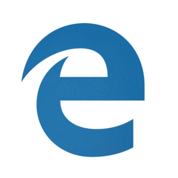

# HoloLens 2 release notes

To ensure you have a productive experience with your HoloLens devices, we continue to release features, bug fixes, and security updates. On this page, you can see what’s new for HoloLens each month. To get the latest HoloLens 2 update, you can either [check for updates, and manually update](hololens-update-hololens.md#check-for-updates-and-manually-update) or get the Full Flash Update (FFU) to [flash your device via Advanced Recovery Companion](hololens-recovery.md#clean-reflash-the-device). The [download](https://aka.ms/hololens2download) is kept up to date and provides the latest generally available build.

## About HoloLens releases

HoloLens 2 has had many updates over time. Sometimes our feature releases are on the same code base, and sometimes we move forward. This distinction can be seen in the major version number of the builds. When an update shares the same code base, such as "2004" and "20H2", they also share the same major version number, which is 19041. In the next feature release we updated the code base, and the new major build number is 20346, so that's where the next feature release "21H1" version is.

> [!NOTE]
> When using a [deferral policy](hololens-updates.md#configure-an-update-deferral-policy) only a change in major build number is considered a feature update.

The Windows Holographic version name gives you an indication of the time when the release became available. The current naming convention is year/half. For example, version 21H1 became available in the first half of 2021. The "21" in the name indicates the year (2021) and "H1" indicates the first half of that year. Prior to that naming convention was based on year/month.

In between our feature updates, we also release fixes and improvements and security updates. These updates are always minor updates and never change the major build number.

To help provide clarity, this release notes page provides information for every major and minor update. The most current release is listed first, and previous releases follow in chronological order. If you’d like to learn about updates to down level versions (or view previous major feature releases), refer to the table that follows.

Note:  the current release version is the October 2023 Update, Build 1244.

| Major release   number | Feature release(s) name                  | Date         | Build number |
|------------------------|-------------------------------------|--------------|--------------|
| 22621| [Windows Holographic, version 23H2](#windows-holographic-version-23h2---october-2023-update) <br> [Windows Holographic, version 23H1](#windows-holographic-version-23h1---june-2023-update)  | October 2023  <br> June 2023   | 22621.1244  <br> 22621.1113 |
| 20348| [Windows Holographic, version 22H2](#windows-holographic-version-22h2) <br> [Windows Holographic, version 22H1](#windows-holographic-version-22h1) <br> [Windows Holographic, version 21H2](#windows-holographic-version-21h2) <br> [Windows Holographic, version 21H1](#windows-holographic-version-21h1)  | November 2022 <br> April 2022 <br> October 2021 <br> May 2021   | 20348.1528 <br> 20348.1501 <br> 20348.1432 <br> 20346.1002   |
| 19041                  | [Windows Holographic, version 20H2](hololens-release-notes-2004.md#windows-holographic-version-20h2) <br> [Windows Holographic, version 2004](hololens-release-notes-2004.md#windows-holographic-version-2004) | Nov 2020 <br> May 2020    | 19041.1128 <br> 19041.1103  |
| 18362                  | [Windows Holographic, version 1903](hololens-release-notes-1903.md#windows-holographic-version-1903---november-2019-update)   | Nov 2019     | 18362.1039   |

### How to find out which operating system version is on HoloLens?

To check what version your HoloLens is on, open the Settings app and select **System** -> **About** (depending on how big your window is you may need to scroll down to the bottom to see the About page.)


### How to get specific operating system version on HoloLens?

By default, the OS on HoloLens is typically updated automatically outside of active hours of use, as long as HoloLens is in modern-standby mode and plugged in with power source with an internet connection.

To explicitly check for updates, launch the Settings app and select **Update & Security**, then tap on the **Check for updates** button.


> [!TIP]
> Searching for a feature but didn't find it on this page? Try checking out of the previous feature release pages. You can navigate there using the links above, or the table of contents.

## Windows Holographic, version 23H2 - October 2023 Update

- Build 22621.1244

Windows Holographic, version 23H2 is now available and brings a great set of new features to HoloLens 2 users, IT professionals and developers. Check out all the new great features for HoloLens 2!

| Feature   | Description  | User or scenario | 
|-----------|--------------|---|
|[Faster eye position updates](#faster-eye-position-updates)|This improvement provides faster eye position updates when a user has not gone through eye calibration. | All |
|[Viewfinder for Camera](#viewfinder-for-camera)| A viewfinder is now included to show what is captured in an image or video. | All |
|[Rename HoloLens 2 device](#rename-hololens-2-device)| HoloLens 2 devices can now be renamed from the Settings app. | All|
|[Start Menu gesture settings in MDM](#start-menu-gesture-settings-in-mdm)| A new policy is available to configure start menu gesture settings. | IT Admin | 
|[Policies to block USB Peripherals on HoloLens 2](#policies-to-block-usb-peripherals)| HoloLens 2 devices can now be locked down to prevent the use of USB peripherals. | IT Admin| 
|[Domain name suggested during sign-in](#domain-suggested-during-signin)| During sign-in, the domain name is auto-populated to save time.| All | 
|[New policy for Windows Hello Provisioning behavior](#windows-hello-behavior-with-fido2-policy) | This new policy can be used to control Windows Hello provisioning behavior for users signed in with FIDO2 security keys.| IT Admin| 
|[New policy for Sign-in app default screen](#signin-app-default-screen-policy) | This new policy can be used to control the default screen shown when the Sign-in app launches to show Other User.| IT Admin| 
|[Hand tracking improvements](#hand-tracking-improvements) | Hand tracking is now more reliable when aiming at the floor. | All | 
|[Font and IME improvements](#font-and-ime-improvements) | Several simplified Chinese fonts and the Microsoft Pinyin Input Method Editor (IME) now support GB18030-2022. | All | 
|[Support for NFC readers](#support-for-nfc-readers) | Users can now login to their devices using their security badge with an NFC reader. | All | 
|[Fixes and improvements](#fixes-and-improvements)  | More fixes and improvements for HoloLens. | All   | 

### IT Admin Checklist

✔️ If you want to configure start gesture menu settings for your users, then see [Start Menu gesture settings in MDM](#start-menu-gesture-settings-in-mdm).

✔️ If you want to prevent the use of USB peripherals on the HoloLens2, then see [Policies to block USB Peripherals on HoloLens 2](#policies-to-block-usb-peripherals).

✔️ If you want to control the behavior of Windows Hello provisioning for user users signed in with FIDO2 security keys, then see [New policy for Windows Hello Provisioning behavior](#windows-hello-behavior-with-fido2-policy).

✔️ If you want to set the default screen that shows up when the Sign-in app launches to show "Other user," then see [New policy for Sign-in app default screen](#signin-app-default-screen-policy).


### Faster eye position updates

For HoloLens 2 users who haven't saved their Eye Tracking calibration (either skipped or encountered a failure during initial setup), we are now updating Eye Positions, or Inter Pupillary Distance (IPD), earlier once the user puts on the device. This results in a considerably smoother user experience, especially for close holograms interactions like pressing buttons or typing on the keyboard.

### Viewfinder for camera

With the latest camera updates coming in this release, you now have a viewfinder that provides an indication of what is included in your image or video capture. This overlay does not hide anything in your view when taking a picture or video. Note that the content in the capture is larger than the bracket area.


You now see indicators for both the center and approximate borders for the PV camera stream.


### Rename HoloLens 2 device

HoloLens 2 devices can now be renamed by going to the About page of the Settings app. Users or IT Admins can choose the “Rename” button and follow the prompts to create a new name for their device.  A combination of letters, hyphens and numbers can be used.  


A confirmation screen is displayed when the device has been successfully renamed.


The device must be rebooted for the renaming change to take effect.

### Start menu gesture settings in MDM

IT Admins can now control Start Menu gesture settings on managed HoloLens 2 devices through MDM via a new set of Start Menu gesture policies.

#### EnableStartMenuWristTap

This policy controls if the Start menu can be opened by tapping the start icon on the wrist.  It is managed via [custom OMA-URI](/mem/intune/configuration/custom-settings-windows-10) policy:

- URI value: ./Vendor/MSFT/Policy/Config/MixedReality/EnableStartMenuWristTap

| Policy | Description | Configurations |
| -------- | -------- | -------- |
| MixedReality/EnableStartMenuWristTap | Allows the Start menu to be opened with a wrist tap | 0 (Disabled), 1 (Enabled, default)

#### RequireStartIconVisible

This policy controls whether it is required that the user looks at the Start icon when it is tapped in order to open the Start menu.  It is managed via [custom OMA-URI](/mem/intune/configuration/custom-settings-windows-10) policy:

- URI value: ./Vendor/MSFT/Policy/Config/MixedReality/RequireStartIconVisible

| Policy | Description | Configurations |
| -------- | -------- | -------- |
| MixedReality/RequireStartIconVisible | Controls whether the user looks at the Start icon to open the Start menu | 0 (Disabled, default), 1 (Enabled)

#### RequireStartIconHold

This policy controls whether it is required that the Start icon is pressed for two seconds to open the Start menu.  It is managed via [custom OMA-URI](/mem/intune/configuration/custom-settings-windows-10) policy:

- URI value: ./Vendor/MSFT/Policy/Config/MixedReality/RequireStartIconHold

| Policy | Description | Configurations |
| -------- | -------- | -------- |
| MixedReality/RequireStartIconHold | Controls whether the Start icon is pressed for two second to open the Start menu | 0 (Disabled, default), 1 (Enabled)

#### EnableStartMenuSingleHandGesture

This policy controls whether the Start menu can be opened by pinching the thumb and index finger while looking at the Start icon on the wrist.  It is managed via [custom OMA-URI](/mem/intune/configuration/custom-settings-windows-10) policy:

- URI value: ./Vendor/MSFT/Policy/Config/MixedReality/EnableStartMenuSingleHandGesture

| Policy | Description | Configurations |
| -------- | -------- | -------- |
| MixedReality/EnableStartMenuSingleHandGesture | Controls whether the Start menu can be opened by pinching the thumb and index finger while looking at the Start icon | 0 (Disabled), 1 (Enabled, default)

#### EnableStartMenuVoiceCommand

This policy controls whether using voice commands can be used to open the Start menu.  It is managed via [custom OMA-URI](/mem/intune/configuration/custom-settings-windows-10) policy:

- URI value: ./Vendor/MSFT/Policy/Config/MixedReality/EnableStartMenuVoiceCommand

| Policy | Description | Configurations |
| -------- | -------- | -------- |
| MixedReality/EnableStartMenuVoiceCommand | Controls whether voice commands can be used to open the Start menu | 0 (Disabled), 1 (Enabled, default)

### Policies to block USB peripherals

You may want to lock down your HoloLens 2 devices to prevent the use of USB Ethernet dongles or USB Flash drives.  Several DeviceInstall MDM policies have been enabled in this update to allow IT Admins to configurate device driver installation policies.  In order to take effect, the policies must be applied prior to connecting the USB Peripherals.  It is recommended that these policies be configured either after the device is reset or on a clean, reflashed device.

#### DeviceInstall_Removable_Deny

This policy allows you to prevent HoloLens 2 from installing removable devices.  It is managed via [custom OMA-URI](/mem/intune/configuration/custom-settings-windows-10) policy:

- URI value: ./Device/Vendor/MSFT/Policy/Config/ADMX_DeviceInstallation/DeviceInstall_Removable_Deny

| Policy | Data Type| Value|
| -------- | -------- | -------- |
| Config/ADMX_DeviceInstallation/DeviceInstall_Removable_Deny | String | `<enabled/><data id="DenyRemovableDevices" value="1"/>`

Refer to [DeviceInstall_Removable_Deny](/windows/client-management/mdm/policy-csp-admx-deviceinstallation#deviceinstall_removable_deny) for details.

#### EnableInstallationPolicyLayering

This policy changes the evaluation order in which Allow and Prevent policy settings are applied when more than one install policy setting is applicable for a given device. Enable this policy setting to ensure that devices listed in the AllowInstallationOfMatchingDeviceIDs policy are allowed to install even if the DeviceInstall_Removable_Deny policy is enabled. It is managed via [custom OMA-URI](/mem/intune/configuration/custom-settings-windows-10) policy: 

- URI value: ./Device/Vendor/MSFT/Policy/Config/DeviceInstallation/EnableInstallationPolicyLayering

| Policy | Data Type| Value|
| -------- | -------- | -------- |
| Config/DeviceInstallation/EnableInstallationPolicyLayering | String | `<enabled/><data id="AllowDenyLayered" value="1"/>`

Refer to [EnableInstallationPolicyLayering](/windows/client-management/mdm/policy-csp-deviceinstallation#enableinstallationpolicylayering) for details.

#### AllowInstallationOfMatchingDeviceIDs

This policy specifies a list of Plug and Play hardware IDs and compatible IDs for devices that HoloLens 2 is allowed to install. This policy is intended to be used only when the EnableInstallationPolicyLayering policy setting is enabled.  It is managed via [custom OMA-URI](/mem/intune/configuration/custom-settings-windows-10) policy: 

- URI value: ./Device/Vendor/MSFT/Policy/Config/DeviceInstallation/AllowInstallationOfMatchingDeviceIDs

| Policy | Data Type| Value|
| -------- | -------- | -------- |
| Config/DeviceInstallation/AllowInstallationOfMatchingDeviceIDs | String | `<enabled/><data id="DeviceInstall_IDs_Allow_List" value="your_allowed_device_ids"/>`

Refer to [AllowInstallationOfMatchingDeviceIDs](/windows/client-management/mdm/policy-csp-deviceinstallation#allowinstallationofmatchingdeviceids) for details.

### Domain suggested during signin

During the sign-in process, if [PreferredAadTenantDomainName](/windows/client-management/mdm/policy-csp-authentication#preferredaadtenantdomainname) MDM policy is set on HoloLens 2, the tenant domain name is suggested to the user to speed up the login process and save time.  Users can type in a different tenant domain name if desired.

> [!NOTE] 
> IT Admins need to configure the policy for this feature to be in effect.

### Windows Hello behavior with FIDO2 policy

To simplify user account setup, new users signing-in to HoloLens 2 with FIDO2 security keys (instead of web sign-in) after initial device setup are no longer required to go through Iris and PIN enrollment. This behavior does not apply to the user signing-in during [initial device setup](/hololens/hololens2-start#set-up-windows).

To support users requiring Iris and/or PIN as alternative sign-in options to FIDO2 security keys, a new policy, EnableWindowsHelloProvisioningForSecurityKeys, has been added to the PassportForWork CSP to control Windows Hello Provisioning behavior. If this policy is enabled on HoloLens 2, the device starts Iris and PIN enrollments after new users sign-in to their devices with FIDO2 security keys. It can be configured in Intune via a [custom OMA-URI](/mem/intune/configuration/custom-settings-windows-10) profile:

- URI value: ./Device/Vendor/MSFT/PassportForWork/{TenantId}/Policies/EnableWindowsHelloProvisioningForSecurityKeys   

| Policy | Data Type| Value|
| -------- | -------- | -------- |
| MSFT/PassportForWork/{TenantId}/Policies/EnableWindowsHelloProvisioningForSecurityKeys | bool| False (default), True

### Signin app default screen policy 

In environments where devices are shared between multiple people and not everyone has enrolled in Iris sign-in, it may be preferable to always show the Other User screen so a user picking up the device can quickly start the sign-in process. For example, in an environment where everyone uses their FIDO2 security keys to sign in, it would be preferable to start on the Other User screen instead of having to find the correct user first.

To help with this scenario, we added a new MDM policy: PreferLogonAsOtherUser. When this policy is enabled, the HoloLens Sign-in app shows the Other User screen by default when the app starts. 

- URI value: ./Device/Vendor/MSFT/Policy/Config/MixedReality/PreferLogonAsOtherUser  

| Policy | Data Type| Value|
| -------- | -------- | -------- |
| Config/MixedReality/PreferLogonAsOtherUser   | Int | 0 (Disabled, default), 1 (Enabled)

### Hand tracking improvements 

Hand tracking system has been improved so that tracking is more reliable when aiming down at objects on the floor.

### Font and IME improvements

This update improves several simplified Chinese fonts and the Microsoft Pinyin Input Method Editor (IME) to support GB18030-2022. You can enter and display characters from conformance level 1 or 2 using the additions to Microsoft Yahei, Simsun, and Dengxian. This update now supports Unicode Extensions E and F in the Simsun Ext-B font. This update meets the requirements for level 3.  These improvements are in-line with what has been released to the Windows 11 Build Release Preview Channel.  More details can be found on the [Windows Insiders blog](https://blogs.windows.com/windows-insider/2023/06/20/releasing-windows-11-build-22621-1926-to-the-release-preview-channel/).

### Support for NFC readers

The next Insider Preview flight for HoloLens includes the ability for users to take advantage of NFC Readers.  Using a USB-C NFC reader, the HoloLens 2 device can be integrated with NFC FIDO2 cards as supported by Azure AD. For users in clean room environments, or where ID Badges contain FIDO technology, this method can enable a “Tap & PIN” experience for HoloLens Sign on.  This feature enables a faster sign-in experience for users.

#### USB NFC reader support

USB-CCID (Chip Card Interface Device) compatible NFC FIDO2 readers with USB base class ‘0B’ and subclass ‘00’ are supported. Refer to [Microsoft Class Drivers for USB CCID Smart Cards](/previous-versions/windows/hardware/design/dn653571(v=vs.85)) for details on Microsoft class driver for USB CCID devices.  To determine if your NFC reader is compatible with HoloLens, you may either refer to the documentation provided by the reader's manufacturer, or use the Device Manager on your PC, as follows:

1.	Plug in the USB NFC reader to a Windows PC.
2.	In Device Manager, locate the reader device and right click on it and select Properties.
3.	In Details tab, select "Compatible Ids" properties and check if "USB\Class_0b&SubClass_00" is in the list.


> [!NOTE] 
> If a USB NFC reader works on Windows Desktop with the inbox CCID driver, that same reader is expected to be compatible with the HoloLens 2.  If the reader requires a third-party driver (either from Windows Update or through manual driver installation), the reader is not compatible with HoloLens 2.

Whether you sign into a device you have used before or a new device, follow these steps to sign in with an NFC reader:

1.	From the “Other User” screen, enter the FIDO Key / Tap the NFC Key against the reader.
2.	Enter the FIDO PIN.
3.	Press the button on the FIDO Key / Tap the NFC Key against the reader again.
4.	The Device logs in.

      a.	Note:  if the user is new to the device, the Single Biometric Disclosure Screen is displayed.
5.	Start Menu then appears.

> [!NOTE] 
> NFC reader support for the HoloLens 2 only supports NFC CTAP for FIDO2 login. There is no plan to provide the same level of Smartcard WinRT API support as on Windows Desktop.  This is due to variations across Smartcard WinRT APIs.  In addition, the SCard API used for HoloLens 2 has somewhat less functionality compared to the Desktop versions and some reader types and features may not be supported.

### Fixes and improvements

- Fixed an issue where specific pages were not showing / hiding correctly in PageVisibility MDM policy (Windows 11 builds only).
- Fixed an issue where swipe to type on the virtual keyboard was not working correctly (Windows 11 builds only).
- Fixed an issue where the "Reset" button was not showing in the case of an Autopilot failure that occurred before reading the ESP configuration.
- Minor updates were made to the virtual keyboard, including optimization of the keyboard suggestions that are presented to users and improved audio feedback while typing.
- Prior to this update, users were often unclear when dictation from the virtual keyboard was available.  Users now see a spinning icon while dictation is being initiated and the dictation tip to begin speaking is only displayed once dictation is available.
- The "Add Account" button on the sign-in screen can now be found above the list of existing accounts on the device.  It is now visible regardless of your scroll position on the screen.
- Fixed an issue where users could not specify the active hour range for Windows Update via the Settings App.
- Fixed an issue where it may take several minutes for the first-time user setup (Iris enrollment, PIN enrollment, etc.) to show up after a user signs in to a device for the first time.
- Fixed an issue with the Settings App where some launch URIs were handled incorrectly.
- Fixed search box functionality in Settings App.
- Added support for LocalUsersAndGroups MDM policy on HoloLens. (Only for "Device Owners" group.)

## Windows Holographic, version 23H1 - September 2023 Update

- Build 22621.1133

Improvements and fixes in the update:

- Fixed an issue where the device may crash when deleting a user.
- Restored WebXR (AR) functionality in Microsoft Edge.

## Windows Holographic, version 23H1 - August 2023 Update

- Build 22621.1125

Improvements and fixes in the update:

- This update included Windows security updates.

## Windows Holographic, version 23H1 - July 2023 Update

- Build 22621.1120

Improvements and fixes in the update:

- Fixed an issue where incorrect Speech recognition settings were displayed when the Privacy/AllowInputPersonalization policy was set to not allowed.
- Fixed an issue where users could not use Bluetooth to pair with a PC.

## Windows Holographic, version 23H1 - June 2023 Update

- Build 22621.1113

Windows Holographic, version 23H1 is now available and brings a great set of new features to HoloLens 2 users, IT professionals and developers. Check out all the new great features for HoloLens 2!

HoloLens 2 is moving to Windows 11 as part of the 23H1 release. To upgrade, HoloLens 2 device(s) must be currently running 21H1 May 2021 update (build 20346.1002) or newer. If the 23H1 feature update is not available, update your device and try again. If you are on a version that is older than Windows Holographic version 20H2 (Build 19041.1136), you first need to update to the February 2021 update (build 19041.1136 or newer) before you update to the 21H1 May 2021 update (build 20346.1002) or newer. 

Note:  With the introduction of Windows Holographic version 23H1, we are discontinuing monthly servicing updates for Windows Holographic version 20H2 (Build 19041.1128+). This change enables us to focus on more recent releases and continue to deliver valuable improvements. 

| Feature   | Description  | User or scenario | 
|-----------|--------------|------------------|
| [Store app update from Settings feature](#store-app-update-from-settings) | Introduces the option to manually check for app updates from the Settings app. | All |
| [WebView2 control now available](#webview2-now-available) | The Microsoft Edge WebView2 control allows you to embed web technologies (HTML, CSS, and JavaScript) in your native apps and is now available for the HoloLens 2. | Developer|
| [Device reset requirements in the Settings Application](#device-reset-requirements-in-settings-app) | Devices must have sufficient battery and free disk space to perform a device reset. | All |
| [Removing placements of an app in the mixed world](#removing-placements-of-apps-in-mixed-world) | An option to close one or all placements of an app is now available in the context menu. | All 
| [Automatic update of Dynamics 365 Remote Assist and Dynamics 365 Guides during Autopilot flow](#automatic-update-of-dynamics-365-remote-assist-and-guides-during-autopilot-flow) | When provisioning a HoloLens 2 device using Autopilot, Dynamics 365 applications update automatically. | IT Admin |
| [Reboot CSP enabled and related changes](#reboot-csp-enabled-and-related-changes-in-intune) | Hololens now supports weekly scheduled reboots and other options. | IT Admin |
| [Update available notification](#update-available-notification) | Shows user that update is available when looking at the start menu. | End User |
| [Autopilot reset experience](#autopilot-reset-experience) | Improvements in Autopilot reset experience to enable users to reset HoloLens 2 and restart Autopilot without requiring manual flashing.| IT Admin  |
| [Biometrics disclosure screen](#biometrics-disclosure-screen) | Displays information to all new users on what biometrics the device uses. | All |
| [Remove users on device](#remove-users-on-a-device) | New policies to manage when to remove users from the device to prevent hitting the maximum limit. | IT Admin  |
| [Fixes improvements](#fixes-and-improvements)  | Fixes and improvements for HoloLens. | All   |

### IT Admin Checklist

✔️ If you want to manage whether users can manually check for updates to Store apps from the Settings App, then see [Store app update from Settings](#store-app-update-from-settings).

✔️ If you want to learn more about how D365 Apps automatically update to the latest versions, then read [Automatic update during Autopilot Flow](#automatic-update-of-dynamics-365-remote-assist-and-guides-during-autopilot-flow).

✔️ If you want to allow users to reset their device without requiring a manual flash, then see [Autopilot reset experience](#autopilot-reset-experience).

✔️ If you need to delete users from your HoloLens automatically, then see [Remove users on a device](#remove-users-on-a-device).

✔️ If you'd like to set a policy for your HoloLens devices to automatically [reboot on a schedule](#reboot-csp-enabled-and-related-changes-in-intune), then read on.

### Store app update from Settings

While apps from the Microsoft Store are kept up to date automatically by the device, sometimes you may want to manually check for updates to get those app updates sooner. Typically, this check is done from within the Microsoft Store app. However, that option is not available if the Microsoft Store is blocked in your environment. For such environments, you can now manually check for updates to Store apps from the Settings app under Apps -> App updates.

IT admins are able to block or allow this page with the [Settings/PageVisibilityList policy](/windows/client-management/mdm/policy-csp-settings#pagevisibilitylist) with the URI `ms-settings:appupdate`.

This screenshot of the Settings app where this feature can be seen.

.png)


### WebView2 Now Available

The Microsoft Edge WebView2 control allows you to embed web technologies (HTML, CSS, and JavaScript) in your native apps and is now available for the HoloLens 2 as a Public Preview. The WebView2 control uses the new Chromium-based Microsoft Edge as the rendering engine to display the web content in native apps.
With WebView2, you can embed web code in different parts of your native app or build all of the native app within a single WebView2 instance.


To start building a WebView2 app, see [Get started with WebView2](/microsoft-edge/webview2/) for a general overview.  HoloLens specific documentation can be found at [Get started with WebView2 in HoloLens 2 Unity apps (Preview)](/microsoft-edge/webview2/get-started/hololens2).

For HoloLens 2 development, the **Microsoft.Web.WebView2** package must be version 1.0.1722.45 or higher, which may be higher than the default. For Unity developers, the **Microsoft Mixed Reality WebView plugin for Unity** already includes at least this version.

### Device Reset Requirements in Settings app

In order for a device reset to complete successfully, the following two conditions must be met:  the device must have both sufficient battery charge and free disk space. On the Reset & recovery page, the Get started button is now only enabled when the device meets a minimum of 40% of battery charge and 6GB free disk space thresholds.


### Removing Placements of Apps in Mixed World

You can now close all placements of an application in the mixed world by selecting the **Close all** (or **Close** when there is only one placement) option from that application’s context menu.  This feature is also available in Kiosk mode. Note: this menu option is only available when an application has been placed in the mixed world. 


### Automatic update of Dynamics 365 Remote Assist and Guides During Autopilot Flow

When provisioning a HoloLens 2 device using Autopilot, both the Dynamics 365 Remote Assist and Dynamics 365 Guides applications is now automatically updated to the latest available versions. The update takes place immediately after the Azure Active Directory join is completed.

### Reboot CSP enabled and related changes in Intune

In addition to supporting scheduled single daily reboots, [Reboot CSP](/windows/client-management/mdm/reboot-csp) now supports scheduled weekly reboots.

Create a custom OMA-URI device configuration profile as follows and apply it to a HoloLens device group:

 :::image type="content" alt-text ="This screenshot shows using OMA URI to configure the weekly reboot." source="./images/weekly-reboot-oma-uri.png":::

> [!NOTE]
>
> Setting Reboot CSP through the “Settings catalog” will be supported soon. Until then, use OMA-URI.

1. For the OMA-URI field, specify any of these three options:

   - `./Device/Vendor/MSFT/Reboot/Schedule/Single`
   - `./Device/Vendor/MSFT/Reboot/Schedule/DailyRecurrent`
   - `./Device/Vendor/MSFT/Reboot/Schedule/WeeklyRecurrent`

   > [!NOTE]
   >
   > Setting both DailyRecurrent and WeeklyRecurrent configurations on the same device is not supported.

1. For the **data type** field, choose **string**.

1. For the **value** field, enter a date value for a starting date and time, such as *2023-01-06T10:35:00* to set DailyRecurrent reboots starting on the given date and *two minutes after* the set starting time daily. Similarly, setting WeeklyRecurrent reboots starting at the given date and *two minutes after* the starting time every seven days. For example, if you specify 10:00, the reboot occurs at 10:02.

   > [!NOTE]
   >
   > The actual time of recurrent schedule reboots is about 2 minutes after the configured time. This delay is expected and intentional to preserve the operations and communication states.

### Update available notification

Having up-to-date devices is important. A previous feature improvement lets you see when updates are ready to *install*. With this new update, your device displays when an update is available to *download*. As with desktop devices, when an update is available, your Hololens displays a blue update circle icon. This icon is near your user icon.

1. Select your user icon. The user context menu opens.
1. Select **Download update** to launch the Settings app updates page that shows the update available to download.

:::image type="content" alt-text="This screenshot shows the start menu context for OS updates." source="images/hl2-update-context-menu-crop-6in.png":::

### Autopilot reset experience

We've added a new setting to improve the Autopilot reset experience if Hololens 2 fails in certain installation scenarios. This setting lets users begin the Autopilot experience again without requiring a manual flash of HoloLens 2 devices. In the ESP configuration, set **Allow users to reset device if installation error occurs** to **Yes** and the device displays a "Reset device" button. If the user selects **Reset device**, after a delay of about 1 minute, HoloLens 2 dresets the operating system and OOBE experience.

### Biometrics disclosure screen

We've changed one of our OOBE screens before the device calibrates to show information on device usage for head, hand, and eye movements. Devices configured to skip calibration do not skip this biometrics disclosure screen, so all new users on a device sees device biometrics usage.  The purpose of this screen is to better inform users about the data being collected.  There are no changes to the data that is being collected.

:::image type="content" alt-text="This screenshot shows the Biometrics OOBE window." source="images/biometrics-oobe-notification.jpg":::

### Remove users on a device

Organizations with scaled deployments of HoloLens 2 devices might encounter the 64-user limit per device that prevents adding users. To address this situation, we've added controls that delete the least recent users from the device at controlled intervals, which is a feature you might have used on the Desktop version. Deleting users in a controlled way is useful for other reasons, too. Removing the inactive accounts speeds up the sign-in process and improves privacy and security by reducing retention of unused data. We use three criteria to determine when to remove user accounts on the device:

- When a user has been inactive on the device for a specific number of days, configurable via **ProfileInactivityThreshold.**
- When the device has reached a storage threshold, configurable via **StorageCapacityStartDeletion** and **StorageCapacityStopDeletion**.
- When the device has reached the maximum number of supported users (64).
   
To learn more about these policies, visit [AccountManagement CSP](/windows/client-management/mdm/accountmanagement-csp) or refer to [Share HoloLens with multiple people](/hololens/hololens-multiple-users/) section of the deployment guide.

### Fixes and improvements

- Previously, it was possible to install an app in the device context via the EnterpriseModernAppManagement CSP.  It is now possible to uninstall an app in the device context as well.

- Introduced a Low-Signal depth mode that produces more complete depth measurements on dark and shiny objects.  This feature improves Azure Object Anchoring detection on dark cars.

- Updated flight build documentation to address broken device reset scenario and solution.

- Fixed an issue where specific pages were not showing / hiding correctly in PageVisibility MDM policy.

## Windows Holographic, version 22H2 - May 2023 Update

- Build 20348.1543

This update included Windows security updates.

## Windows Holographic, version 22H2 - April 2023 Update

- Build 20348.1542

This update included Windows security updates.
  
## Windows Holographic, version 22H2 - March 2023 Update

- Build 20348.1540
   
The following issue was fixed in this update:

- Improved reliability of processing AAD group membership when a specific network failure occurs. This issue impacted the sign-in experience for a limited set of users in kiosk mode.
   
## Windows Holographic, version 22H2 - February 2023 Update

- Build 20348.1537

Improvements and fixes in the update:

- Updated the Extended Eye Tracking API to provide access to 90fps eye tracking data.
- Updated the behavior of `AADGroupMembershipCacheValidityInDays` so that on cache expiration, the AAD group membership check for sign-in user is made immediately.
- Fixed an issue where hyperlinks clicked from Edge that had multiple protocol handlers registered would not open properly.
- Improved reliability for installing LOB apps over MDM while device is on standby.

## Windows Holographic, version 22H2 - January 2023 Update

- Build 20348.1535

Improvements and fixes in the update:

- Resolved an issue that in some cases prevented the two-hand start gesture (wrist tap) from operating correctly.

## Windows Holographic, version 22H2 - December 2022 Update

- Build 20348.1531

Improvements and fixes in the update:

- Fixed an issue where a MDM managed profile gets deleted unexpectedly if both the deletion and the addition of a VPN profile were in the same session.

## Windows Holographic, version 22H2

- Build 20348.1528

This update brings a great set of new features to HoloLens 2 users and IT professionals. Check out all the new great features for HoloLens 2!

| Feature   | Description  | User or Scenario |
|-----------|--------------|------------------|
| [New policies to speed up adding users](#policies-to-speed-up-adding-users) | New policies we've enabled that allow IT Admins to skip several screens in  OOBE when adding new users to devices. | IT Admin |
| [New policy to disable NCSI passive polling](#new-policy-to-disable-ncsi-passive-polling) | Turn off auto-reconnect to Wi-Fi access points to stay connected to intranet. | IT Admin       |
| [Captive portal on sign-in screen, enter Wi-Fi credentials to help sign-in](#captive-portal-on-sign-in-screen-enter-wi-fi-credentials-to-help-sign-in)  | New policy that IT Admins can enable that allows the use of captive portals on the sign-in screen to help connecting to Wi-Fi. | IT Admin |
| [Clean up storage via MDM](#clean-up-storage-via-mdm) | Clean up files via MDM, using storage sense to clean up older unused files.  | IT Admin |
| [Security Baseline](#security-baseline) | Two sets of security restrictions you can use to add more control to your devices. | IT Admin |
| [Configure NTP client for W32 Time service](#configure-ntp-client-for-w32-time-service) | Used to set your own time server for your devices, to help keep them compliant. |  IT Admin |
| [Fixes improvements](#fixes-improvements-in-windows-holographic-version-22h2---november-2022-update)  | Fixes and improvements for HoloLens.  | All   |

### IT Admin Checklist

✔️ If you'd like to speed up new user sign-ons check out the new [new policies to speed up adding users](#policies-to-speed-up-adding-users). <br>
✔️ If you need to keep your devices from auto-connecting to Wi-Fi access points then learn how to [disable Wi-Fi auto recovery](#new-policy-to-disable-ncsi-passive-polling). <br>
✔️ Trying to remotely troubleshoot a device, but don't have enough room to gather logs? Try to [clean up some storage space using MDM](#clean-up-storage-via-mdm). <br>
✔️ If you need to have more security, are planning on vending out your devices, or need to check a box for a security review, check out the [security baseline](#security-baseline). <br>
✔️ If you use your own time server, and would like your HoloLens devices to use it as well check out how to [set your own](#configure-ntp-client-for-w32-time-service).

List of new or newly enabled policies:
- `MixedReality/AllowCaptivePortalBeforeLogon`
- `MixedReality/ConfigureNtpClient`
- `MixedReality/DisallowNetworkConnectivityPassivePolling`
- `MixedReality/NtpClientEnabled`
- `MixedReality/SkipCalibrationDuringSetup`
- `MixedReality/SkipTrainingDuringSetup`
- `Storage/AllowStorageSenseGlobal`
- `Storage/AllowStorageSenseTemporaryFilesCleanup`
- `Storage/ConfigStorageSenseCloudContentDehydrationThreshold`
- `Storage/ConfigStorageSenseDownloadsCleanupThreshold`
- `Storage/ConfigStorageSenseGlobalCadence`

### Policies to speed up adding users

As you scale deployment of your HoloLens devices across your enterprise, you can set up new users more quickly through these new policies that allow you to skip steps in your Out-of-Box-Experience (OOBE). There are two new areas you are able to by-pass. When combined these screens allow for someone adding a new Azure AD user to a device to be up and running faster than before. These new policies enable you to apply even more fine tuning across your device inventory.

The new policies and screens they skip are:

| Policy          | What's skipped                                                                    |  Screenshot |
|------------------|-----------------------------------------------------------------------------------|---|
| Skip Calibration | The calibration run during OOBE, which can later be run via the Settings app, or when an app that uses eye tracking prompts the user to calibrate. <br> Using: `SkipCalibrationDuringSetup`      |  |
| Skip Training    | How to open and close the Start menu, which can later be learned via the Tips app. <br> Using: `SkipTrainingDuringSetup`  |  |

The [OMA-URI](/troubleshoot/mem/intune/deploy-oma-uris-to-target-csp-via-intune) (Open Mobile Alliance Uniform Resource Identifier) of new policies:

- `./Device/Vendor/MSFT/Policy/Config/MixedReality/SkipCalibrationDuringSetup`
- `./Device/Vendor/MSFT/Policy/Config/MixedReality/SkipTrainingDuringSetup`

- Int value
  - 0 : Keep the experience (default)
  - 1 : Skip

For more info on how to increase your setup speed for new users, check out our [guide on how to quickly set up new users.](hololens2-new-user-optimize.md)

Find this information later at [Policy CSP - MixedReality](/windows/client-management/mdm/policy-csp-mixedreality).

### New policy to disable NCSI passive polling

Windows Network Connectivity Status Indicator may get false positive Internet capable signal from passive polling. Which may result in unexpected Wi-Fi adapter reset when device connects to an intranet only access point. Enabling this policy would avoid unexpected network interruptions caused by false positive NCSI passive polling.

The OMA-URI of new policies:
`./Device/Vendor/MSFT/Policy/Config/MixedReality/DisallowNetworkConnectivityPassivePolling`

- Bool value

Find this information later at [Policy CSP - MixedReality](/windows/client-management/mdm/policy-csp-mixedreality).

### Captive portal on sign-in screen, enter Wi-Fi credentials to help sign-in

Sometimes Wi-Fi connections require additional information to provide credentials to the access point. Previously users were only able to provide these credentials the first time the device was set up in OOBE, or in the Settings app once signed in. Previously, users couldn't adjust this configuration on the sign-in screen, which was sometimes tricky to work around.

This new feature is an opt-in policy that IT Admins can enable to help with the setup of new devices in new areas or new users. When this policy is turned on it allows a [captive portal](/windows-hardware/drivers/mobilebroadband/captive-portals) on the sign-in screen, which allows a user to enter credentials to connect to the Wi-Fi access point. If enabled, sign in implements similar logic as OOBE to display captive portal if necessary.

MixedReality/AllowCaptivePortalBeforeLogon

The OMA-URI of new policy:
`./Device/Vendor/MSFT/Policy/Config/MixedReality/AllowCaptivePortalBeforeLogon`

Int value

- 0: Default - Off
- 1: On

Find this information later at [Policy CSP - MixedReality](/windows/client-management/mdm/policy-csp-mixedreality).

### Clean up storage via MDM

[Storage Sense](/windows/manage-drive-space-with-storage-sense-654f6ada-7bfc-45e5-966b-e24aded96ad5) is available on HoloLens 2 today to manage cleanup of old files. IT admins can now also configure behavior of Storage Sense on HoloLens 2 with following MDM policies:

- [Storage/AllowStorageSenseGlobal](/windows/client-management/mdm/policy-csp-storage#storage-allowstoragesenseglobal)
  - Sets Storage sense to be enabled on the device and runs whenever reaching low storage.
- [Storage/AllowStorageSenseTemporaryFilesCleanup](/windows/client-management/mdm/policy-csp-storage#storage-allowstoragesensetemporaryfilescleanup)
  - When Storage Sense runs, it can delete the user’s temporary files that aren't in use.
- [Storage/ConfigStorageSenseCloudContentDehydrationThreshold](/windows/client-management/mdm/policy-csp-storage#storage-configstoragesensecloudcontentdehydrationthreshold)
  - When Storage Sense runs, it can dehydrate cloud-backed content that hasn’t been opened in a specific number of days. If you enable this policy setting, you must provide the minimum number of days a cloud-backed file can remain unopened before Storage Sense dehydrates it. Supported values are: 0–365.
- [Storage/ConfigStorageSenseDownloadsCleanupThreshold](/windows/client-management/mdm/policy-csp-storage#storage-configstoragesensedownloadscleanupthreshold)
  - When Storage Sense runs, it can delete files in the user’s Downloads folder if they haven’t been opened for more than a specific number of days. If you enable this policy setting, you must provide the minimum number of days a file can remain unopened before Storage Sense deletes it from the Downloads folder. Supported values are: 0-365.
- [Storage/ConfigStorageSenseGlobalCadence](/windows/client-management/mdm/policy-csp-storage#storage-configstoragesenseglobalcadence)
  - Storage Sense can automatically clean some of the user’s files to free up disk space. The following are supported options:
    - 1 – Daily
    - 7 – Weekly
    - 30 – Monthly
    - 0 – During low free disk space (Default)

Find this information later at [Policy CSP - MixedReality](/windows/client-management/mdm/policy-csp-mixedreality).

### Security baseline

In some cases, you may want to place some stronger restrictions on your devices. Whatever your need for security, we've written out two security baselines that you can use to add an extra layer of security to your device fleet.

Select this link to read the [security baselines](security-baseline.md).

### Configure NTP client for W32 Time service

You may want to configure a different time server for your device fleet. With this update, IT admins can now configure certain aspects of NTP client with following policies. In the Settings app, the Time/Language page shows the time server after a time sync has occurred, for example, `time.windows.com` or another if another value is configured via MDM policy.

> [!NOTE]
> Reboot is required for these policies to take effect.

#### NtpClientEnabled

This policy setting specifies whether the Windows NTP Client is enabled.

- OMA-URI: `./Device/Vendor/MSFT/Policy/Config/MixedReality/NtpClientEnabled`
- Data Type: String
- Value `<enabled/>`

#### ConfigureNtpClient

This policy setting specifies a set of parameters for controlling the Windows NTP Client. Refer to [Policy CSP - ADMX_W32Time - Windows Client Management](/windows/client-management/mdm/policy-csp-admx-w32time#admx-w32time-policy-configure-ntpclient) for supported configuration parameters.

> [!NOTE]
> Replace the values in the example provided with the desired values for your time server. Refer to [this link](/windows/client-management/mdm/policy-csp-admx-w32time#admx-w32time-policy-configure-ntpclient) for more details.

- OMA-URI: `./Device/Vendor/MSFT/Policy/Config/MixedReality/ConfigureNtpClient`
- Data Type: String
- Value:


```xml
<enabled/><data id="W32TIME_NtpServer"
value="time.windows.com,0x9"/><data id="W32TIME_Type"
value="NTP"/><data id="W32TIME_CrossSiteSyncFlags"
value="2"/><data id="W32TIME_ResolvePeerBackoffMinutes"
value="15"/><data id="W32TIME_ResolvePeerBackoffMaxTimes"
value="7"/><data id="W32TIME_SpecialPollInterval"
value="1024"/><data id="W32TIME_NtpClientEventLogFlags"
value="0"/>
```

### Fixes improvements in Windows Holographic, version 22H2 - November 2022 Update

- Fixed an issue where remote log collection was not reliably getting collected when device is in connected-standby and connected to AC power source after 8 hours of enrollment.

## Windows Holographic, version 22H1 - October 2022 Update

- Build 20348.1522

This month's build only contains windows security fixes. Be look forward to our upcoming release and [check out our insider build](hololens-insider.md).

## Windows Holographic, version 22H1 - September 2022 Update

- Build 20348.1518

Improvements and fixes in the update:

- In-box OpenXR code updated. This is to provide best out-of-box experience for customers without Microsoft store access.
- Medical partners can access 90fps eye tracking via Extended ET API.
- Fixed an issue in AssignedAccessSettings where it was not providing correct result when kiosk mode was enabled for signed in user on HoloLens 2.

## Windows Holographic, version 22H1 - August 2022 Update

- Build 20348.1513

Improvements and fixes in the update:

- Remove "Developer" from "OpenXR Tools" app's title and settings tab.
- Stability improvements with app suspend/resume and device sleep mode.
- Improve performance of hand tracking.
- Update `XR_MSFT_spatial_graph_bridge` function and structure names.
- No need to request permission to use Extended ET API.
- Extended ET API now supports 30fps, 60fps and 90fps.

## Windows Holographic, version 22H1 - July 2022 Update

- Build 20348.1511

Improvements and fixes in the update:

- Fixed an issue where trying to debug hologram stability for OpenXR workflows may cause a crash.

## Windows Holographic, version 22H1 - June 2022 Update

- Build 20348.1506

Improvements and fixes in the update:

- This monthly quality update doesn't contain any notable changes, we encourage you to keep your devices up to date for all the latest fixes and improvements. Keep an eye on our [Insider builds](hololens-insider.md) for some potential new features for our next feature release.

## Microsoft Store app update

There is a new version of the Microsoft Store app for the HoloLens 2. This app update occurs seamlessly when the Microsoft Store app itself is updated. When the update is complete, you see a storefront similar to the store app that is available on desktop. Since this is an app update it is distributed to all HoloLens 2 devices, regardless of OS version.


With the new store, you see apps that are available for HoloLens 2, and you are able to scroll through different various industries and solutions to view apps that may be useful to you. You are able to access any company apps by selecting the Work icon, which looks like a briefcase in the top left. (The company name and user has been censored in this screenshot).

Want to check your apps, or app versions? You can select the **Library** icon and **Get updates**. Want to know what version an app is on? From the **Library** screen, select an app installed on your device to go to that apps page, and scroll to the bottom and look for **>_ Installed version**.

## Windows Holographic, version 22H1 - May 2022 Update

- Build 20348.1503

Improvements and fixes in the update:

- Fixed a Known issue where [HoloLens user couldn't launch Microsoft Edge](hololens-troubleshooting.md#fixed---hololens-user-cant-launch-microsoft-edge) if ApplicationManagement/AllowAllTrustedApps GPO is disabled.
- Improved reliability in remote diagnostic log collection via Microsoft Intune, especially for logs of larger sizes.
- When initiating a Device Wipe of a HoloLens 2 from Intune, the device is now deleted for Intune's console after the device is wiped.
- Improved reliability when using the AutoRestartRequiredNotificationDismissal and ScheduleRestartWarning policies.

## Windows Holographic, version 22H1

- Build 20348.1501

Windows Holographic, version 22H1 is now available and brings a great set of new features to HoloLens 2 users and IT professionals.

Many of you have been so eager to receive our feature updates we've release some of them earlier this year in January and February. Several of these are improvements and manageability of last release's major item Moving Platform Mode. Check out all the new great features for HoloLens 2!

This latest release is a "monthly update" to versions 21H1 (and 21H2), which includes new features.  As a result, the major build number remains the same and Windows Update indicates a monthly release to version 21H1 (build 20348). To ensure you've received 22H1, verify the version number is 20348.1501 or higher. You can look at your Build Number in your **Settings** -> **System** -> **About** screen to confirm you are on the latest available build 20348.1501+.

To update to the latest release, open the Settings app, go to Update & Security, and tap Check for Updates. For more information on how to manage HoloLens updates, visit [Manage HoloLens updates.](hololens-updates.md)

| Feature | Description | Target Audience | Available in Build |
|---------|-------------|-----------------|--------------------|
| [Color-blind mode](#color-blind-mode)        | Applies filters that adjust the displayed colors for Color-blind users.      | End users        | 22H1       |
| [Single app kiosk policy for launching other apps](#single-app-kiosk-policy-for-launching-other-apps) | Allows for app launch of secondary app. | IT Admins | 22H1 |
| [Power and Thermal SDK for apps](#power-and-thermal-sdk-for-apps) | Allows apps to adapt to reduce the thermal impact. | Developers | 22H1 |
| [Moving Platform Mode Settings](#moving-platform-mode-settings) | Toggle Moving Platform Mode and more via Settings | End users | [February](#windows-holographic-version-21h2---february-2022-update) |
| [Moving Platform Mode MDM policies](#moving-platform-mode-mdm-policies) | Configures new MPM settings via MDM | IT Admins |  [February](#windows-holographic-version-21h2---february-2022-update) |
| [Moving Platform Mode SDK](#moving-platform-mode-sdk) | Configures MPM via Apps | Developers |  [February](#windows-holographic-version-21h2---february-2022-update) |
| [Start gestures settings](#start-gestures-settings)        | Custom limitations for how the start menu can be opened.            | End users        | [January](#windows-holographic-version-21h2---january-2022-update) |
| [Fixes and improvements in Windows Holographic, version 22H1](#fixes-and-improvements-in-windows-holographic-version-22h1) | These fixes are improvements are part of Windows Holographic, version 22H1. | All | 22H1 |

### IT Admin Feature Checklist - 22H1

✔️ If you'd like to allow launching another app from a single app Kiosk (such as settings) check out the new [single app kiosk policy for launching other apps](#single-app-kiosk-policy-for-launching-other-apps). <br>
✔️ If you use your HoloLens devices in a location that has dynamic movement, consider setting these new [Moving Platform Mode MDM policies](#moving-platform-mode-mdm-policies).

### Color-blind mode

Color-blind mode is a feature to help make HoloLens more accessible. The new color-blind mode can be found in the Settings app under **Settings** -> **Ease of Access** -> **Color filters**. Several new filters are available. Here's a visual example of some of the available filters.

| Off | Grey scale | Tritanopia |
|-----|-----------|------------|
|    |          |           |

### Single app kiosk policy for launching other apps

Introduced a new MDM policy MixedReality\AllowLaunchUriInSingleAppKiosk. This can be enabled to allow for other apps to be launched with in a single app Kiosk, which may be useful, for example,  if you want to launch the Settings app to calibrate your device or change your Wi-Fi.

By default, launching applications via [Launcher API (Launcher Class (Windows.System) - Windows UWP applications)](/uwp/api/Windows.System.Launcher?view=winrt-22000&preserve-view=true) is disabled in single app kiosk mode. To enable applications to launch in single app kiosk mode on HoloLens devices, set the policy value to true.

The OMA-URI of new policy: `./Device/Vendor/MSFT/Policy/Config/MixedReality/AllowLaunchUriInSingleAppKiosk`

- Bool value

### Power and Thermal SDK for apps

When the HoloLens 2 is running in warm environments or with heavy performance requirements (CPU/GPU usage, peripheral usage, etc.), it might get hot enough that it takes actions automatically to keep itself from overheating. If your app demands high peripheral performance, consider using the [PowerThermalNotification Software Development Kit (SDK)](/windows/mixed-reality/develop/unity/managing-power-and-thermals) to subscribe to notification events and implement your own custom actions.

Using this new SDK can allow the device to operate longer in situations where the app is closed by the system.

### Fixes and improvements in Windows Holographic, version 22H1

These fixes are improvements are part of Windows Holographic, version 22H1. If addition to the features mentioned above these fixes and quality of life improvements are available to devices upgraded to version 22H1 and newer.

- Improvements to Moving Platform Mode when detecting the down direction.
- Fixed an issue around update dialogs.
- Updated inbox Microsoft Edge browser version.
- Fixed an issue where toggling optional diagnostic data didn't persist the chosen setting in telemetry settings page after a reboot.
- Fixed an issue where MDM enrollment was stuck when applied with runtime provisioning for local accounts.
- Fixed an issue where kiosk mode wasn’t falling back to global kiosk (if configured) on encountering failures for AAD group-based kiosk configuration.
- Fixed an issue where graphics memory is leaked during some camera usage scenarios.
- Updated HoloLens inbox Microsoft Edge browser version to 98.0.1108.43.
- Fixed an issue in Location API where value of Privacy/LetAppsAccessLocation_ForceAllowTheseApps policy was not correctly respected..

## Windows Holographic, version 21H2 - March 2022 Update

- Build 20348.1450

Improvements and fixes in the update:

- Fixed a background MDM sync failure over proxy network.

## Windows Holographic, version 21H2 - February 2022 Update

- Build 20348.1447

| Feature | Description | Target Audience |
|---------|-------------|-----------------|
| [Moving Platform Mode Settings](#moving-platform-mode-settings) | Toggle Moving Platform Mode and more via Settings | Ends users |
| [Moving Platform Mode MDM policies](#moving-platform-mode-mdm-policies) | Configures new MPM settings via MDM | IT Admins |
| [Moving Platform Mode SDK](#moving-platform-mode-sdk) | Configures MPM via Apps | Developers |

✔️ If you use your HoloLens devices in a location that has dynamic movement, consider setting these new [Moving Platform Mode MDM policies](#moving-platform-mode-mdm-policies).

### Moving Platform Mode Settings

We've added new a new page to the Settings app to configure and control [Moving Platform Mode](hololens2-moving-platform.md). Being able to turn on Moving Platform Mode no longer requires needing to use device portal, which increases usability and security. User can reach the new page by opening the **Settings** app and selecting -> **System** -> **Holograms** and scroll down to see the Moving Platform Mode section and select **Setup Moving Platform Mode**.


From this new page, users are able to manually turn on Moving Platform Mode by adjusting the toggle.

Users can also manually set the down direction, if, for instance,  you’re using the device in such a way where you don't want gravity to be the down direction. This works well in instances where you may be lying down under what you are working on, or if your platform is rotated relative to gravity. Feel free to use it to suit your own space. You can also clear the down direction when done using the device so everything is oriented back to default afterwards.


### Moving Platform Mode MDM policies

#### MixedReality/ConfigureMovingPlatform

This policy controls the behavior of moving platform feature on HoloLens 2, that is, whether it’s turned off / on.  It can be toggled by a user. It should only be used by customers who intend to use HoloLens 2 in moving environments with low dynamic motion. Refer to [HoloLens 2 Moving Platform Mode](hololens2-moving-platform.md) for background information.

The OMA-URI of new policy: `./Device/Vendor/MSFT/Policy/Config/MixedReality/ConfigureMovingPlatform`

Supported values:

- 0 (Default) - Last set user's preference. Initial state is OFF and after that user's preference is persisted across reboots and is used to initialize the system.
- 1 Force off - Moving platform is disabled and cannot be changed by a user.
- 2 Force on - Moving platform is enabled and cannot be changed by a user.

#### MixedReality/ManualDownDirectionDisabled

This policy controls whether the user can change down direction manually or not. If no down direction is set by the user, then an automatically calculated down direction is used by the system. This policy has no dependency on ConfigureMovingPlatform policy and they can be set independently.

The OMA-URI of new policy: `./Device/Vendor/MSFT/Policy/Config/MixedReality/ManualDownDirectionDisabled`

Supported values:

- False (Default) - User can manually change down direction if they desire, otherwise down direction is determined automatically based on the measured gravity vector.
- True - User can’t manually change down direction and down direction is always determined automatically based on the measured gravity vector.

### Moving Platform Mode SDK

Sometimes you may want the decision on if to use Moving Platform Mode to be dependent on your situation, you may only need it enabled when using your app, or only a specific app. In these cases, you may wish to [enable Moving Platform Mode from your app using the SDK](/windows/mixed-reality/develop/unity/moving-platform-unity).

#### Improvements and fixes in the February 2022 update

- Addressed an issue that prevented the uninstall of side loaded apps in certain scenarios.
- Fixed an error when using Media Foundation Media Capture that prevented a developer from being able to create a MediaEncodingProfile using HEVC.
- Fixes an issue that could prevent an application from accessing a user's video folder.

## Windows Holographic, version 21H2 - January 2022 Update

- Build 20348.1442

| Feature | Description | Target Audience |
|---------|-------------|-----------------|
| [Start gestures settings](#start-gestures-settings)        | Custom limitations for how the start menu can be opened.            | End users        |

### Start gestures settings

The team has implemented a solution for users who don't want the start menu popping up while doing tasks while looking at their hands, such as surgery and using apps like Remote Assist. This can also help in other scenarios.

Open the **Start menu** and select the **Settings** app -> **System** -> **Start gestures**.


Start gesture options:

- Allow tapping the Star icon on your wrist to open the Start menu - *default*: On
  - Require the Start icon to be looked at when you tap it - *default*: Unchecked
  - Require the Start icon to be pressed for 2 seconds - *default*: Unchecked
- Allow pinching your thumb and index finger, while looking at the Start icon on your wrist, to open the Start menu - *default*: On
- Allow voice commands to open the Start menu - *default*: On

If you find yourself wondering how to use your voice to open and close the Start menu:

- "Go to Start"  to bring up the Start menu
- "Close" while looking at it to close

#### Improvements and fixes in the January 2022 update

- Corrects an issue preventing devices from booting correctly in previous flights.
- Fixes an issue on the Windows Device Portal Deploy Apps panel when accessed from Internet Explorer 11.

## Windows Holographic, version 21H2 - December 2021 Update

- Build 20348.1440

Improvements and fixes in the update:

- Fixed an issue that prevents the keyboard from showing up in some apps using Kiosk Mode.

## Windows Holographic, version 21H2 - November 2021 Update

- Build 20348.1438

Improvements and fixes in the update:

- Fixed a known issue where [every time the power goes to 18 percent, the device suddenly shuts down automatically](hololens-troubleshooting.md#fixed---every-time-the-power-goes-to-18-percent-the-device-suddenly-shuts-down-automatically).
- Micro QR codes, which were oriented at 45/135deg were not detected often enough or not detected at all. This issue is addressed and now they are detected reliably.
- Removed the HoloLens release identifier "Version" in Settings pages as it isn't uniquely descriptive to identity the OS version your device is running. To verify your build, you should use Build Number in **Settings** -> **System** -> **About** screen.

## Windows Holographic, version 21H2

- Build 20348.1432

Windows Holographic, version 21H2 is now available and brings a great set of new features to HoloLens 2 users and IT professionals. This one’s about the improved troubleshooting and device reports, some fixed bugs in kiosk mode and the certificate viewer, the expanded manageability surface and the increased update reliability. A new flagship feature of this feature update coming to HoloLens is our Moving Platform Mode. Check out all the new great features for HoloLens 2!

This latest release is a monthly update to version 21H1, but this time we are including new features, because of this the major build number remains the same and Windows Update indicates a monthly release to version 21H1 (build 20348). To ensure you've received 21H2, verify the version number is 20348.1432 or higher. You can look at your Build Number in your **Settings** -> **System** -> **About** screen to confirm you are on the latest available build 20348.1432+.

To update to the latest release, open the Settings app, go to Update & Security, and tap Check for Updates. For more information on how to manage HoloLens updates, visit [Manage HoloLens updates.](hololens-updates.md)

| Feature                 | Description                | User or Scenario |
|-------------------------|----------------------------|--------------|
| [Moving Platform Mode](#moving-platform-mode) | Introduces Moving Platform Mode beta, which when configured, enables the use of HoloLens 2 on large marine vessels experiencing low-dynamic motion. | All |
| [PFX file support for Certificate Manager](#pfx-file-support-for-certificate-manager) | Add PFX certs via Settings UI | End User |
| [View advanced diagnostic report in Settings on HoloLens](#view-advanced-diagnostic-report-in-settings-on-hololens) | View MDM diagnostic logs on device | Troubleshooting |
| [Offline Diagnostics notifications](#offline-diagnostics-notifications) | Audiovisual feedback for log collection | Troubleshooting |
| [Low storage log collection improvements](#low-storage-log-collection-improvements) | Improvements to log collection scenarios during low storage situations. | Troubleshooting |
| [CSP changes for reporting HoloLens details](#csp-changes-for-reporting-hololens-details) | New CSPs to query data | IT Admins    |
| [Auto login policy controlled by CSP](#auto-login-policy-controlled-by-csp) | Used to log in an account automatically | IT Admins |
| [Improved update restart detection and notifications](#improved-update-restart-detection-and-notifications) | New enabled policies and UX for updates. | IT Admins |
| [Smart Retry for app updates](#smart-retry-for-app-updates) | Allows IT Admins to scheduled retries to update apps. | IT Admins |
| [Use only private store apps only for Microsoft Store](#use-only-private-store-apps-for-microsoft-store) | Configure the store app to show only apps from organization | IT Admin |
| [Use WDAC and LOB apps](#use-wdac-and-lob-apps) | Allows IT Admins to use their own apps and still use WDAC to block other apps. | IT Admins |
| [Fixes and improvements](#fixes-and-improvements) | Fixes and improvements for HoloLens. | All |

### IT Admin Feature Checklist - 21H2

✔️ If you'd like to set a single Azure AD account to automatically log in, [configure this new CSP.](#auto-login-policy-controlled-by-csp) <br>
✔️ If you'd like to configure your apps to automatically attempt to update after failing to update, [set this new CSP for smart retry.](#smart-retry-for-app-updates) <br>
✔️ If you'd like to have more control over OS updates, check out these [newly enabled Update policies.](#improved-update-restart-detection-and-notifications) <br>
✔️ If you need to make your organization's apps available on the company store via the Microsoft Store, but want to only allow access to your organization's apps and not the full store, [set this policy.](#use-only-private-store-apps-for-microsoft-store) <br>
✔️ If you'd like to know the free storage space, SSID, or BSSID of your HoloLens devices, then check out these [reporting CSPs.](#csp-changes-for-reporting-hololens-details) <br>
✔️ If you'd like to use WDAC to block apps or processes from launching, but also need to use your own line of bushiness apps, you can now [allow LOB in your WDAC policy](#use-wdac-and-lob-apps).

### Moving Platform Mode

As of [Windows Holographic, version 21H2](hololens-release-notes.md#windows-holographic-version-21h2) we have added beta support for tracking on low-dynamic motion moving platforms on HoloLens 2. After installing the build and enabling Moving Platform Mode, you’ll be able to use your HoloLens 2 in previously inaccessible environments, like large ships and large marine vessels. Currently, the feature is targeted at enabling these specific moving platforms only. While nothing prevents you from attempting to use the feature in other environments, the feature is focused on adding support for these environments first.

To learn more about what is supported and how to enable this new feature, [visit the moving platform page](hololens2-moving-platform.md).

#### Overview to try out Moving Platform Mode

1. [Enable developer mode and device portal](/windows/mixed-reality/develop/platform-capabilities-and-apis/using-the-windows-device-portal).
1. [Enable moving platform mode through Device portal](hololens2-moving-platform.md#enabling-moving-platform-mode).
1. Take your device to your large moving platform and observe how stable holograms are.

### PFX file support for Certificate Manager

Introduced in Windows Insider build 20348.1405. We’ve added support to the [Certificate Manager](certificate-manager.md) to now use .pfx certificates. When users navigate to **Settings** > **Update & Security** > **Certificates**, and select **Install a certificate** the UI now supports .pfx certificate file.
Users can import .pfx certificate, with private key, to user store or machine store.

#### Overview to try out PFX files in Certificate Manager

1. Prepare your PFX file.
1. Copy the file to your device via a USB-C cable.
1. Open the Settings app, and navigate to the [Certificate Manager](certificate-manager.md) and apply the certificate.

### View advanced diagnostic report in Settings on HoloLens

For managed devices when troubleshooting behavior, confirming that an expected policy configuration was applied is an important step. Previously to this new feature, this had to be done off device via MDM or near the device after exporting MDM diagnostic logs gathered via **Settings** -> **Accounts** > **Access work or school**, and select **Export your management logs** and viewed on a nearby PC.

Now the MDM Diagnostics can be viewed on device using the Edge browser. To more easily view the MDM Diagnostic report navigate to the Access work or school page, and select **View advanced diagnostic report**. This generates and open the report in a new Edge window.


#### Overview to try out the advanced diagnostic report

1. Open the Settings app.
1. Navigate to the Accounts page, and click the new link **Export your management logs**.
1. View advanced information on your device's configurations.

### Offline Diagnostics notifications

This an update for an existing feature called [Offline Diagnostics](hololens-diagnostic-logs.md#offline-diagnostics). Previously, there was no clear indicator to users that they had triggered diagnostic collection or it had completed.
Now added in [Windows Holographic, version 21H2](hololens-release-notes.md#windows-holographic-version-21h2), there are two forms of audiovisual feedback for Offline Diagnostics. The first being toasts notifications displayed for both when collection starts and completes. These are displayed when the user is logged in and has visuals.


Because users often use Offline Diagnostics as a  log gathering mechanism for when they don’t have access to a display, can’t log in or are still in OOBE there is also an audio cue played when logs are gathered. This sound is played in addition to the toast notification.

This new feature is enabled when your device updates, and doesn’t need to be enabled or managed. In any event that this new feedback can’t be displayed or heard, Offline Diagnostics are still generated.

We hope with this newer addition of audiovisual feedback it’s easier to gather diagnostic data, and more quickly be able to troubleshoot your problems.

This information can be viewed later on the [diagnostic logs page](hololens-diagnostic-logs.md#offline-diagnostics).

#### Overview to try out the diagnostics notifications

1. Unlock your device and wear it.
1. Press the **Power** and **Volume down** button combination to gather [Offline Diagnostics](hololens-diagnostic-logs.md#offline-diagnostics).
1. View the toast notifications and hear audio cues for when your device starts and finishes collecting logs.

### Low storage log collection improvements

In scenarios where a device seems to be low on disk space when diagnostic logs are collected, an additional report named **StorageDiagnostics.zip** is created. The threshold of low storage is determined automatically by Windows [storage sense](https://support.microsoft.com/office/use-onedrive-and-storage-sense-in-windows-10-to-manage-disk-space-de5faa9a-6108-4be1-87a6-d90688d08a48).

This information can be viewed later on the [diagnostic logs page](hololens-diagnostic-logs.md#offline-diagnostics).

#### Overview to try out the low storage improvements

1. Fill up your device's storage space.
1. Press the **Power** and **Volume down** button combination to gather [Offline Diagnostics](hololens-diagnostic-logs.md#offline-diagnostics).
1. Observe there’s a new file in the collection of logs stored in the Documents folder of your HoloLens.

### CSP changes for reporting HoloLens details

The following CSPs have been updated with new ways to report information from your HoloLens devices.

#### DevDetail CSP - Free Storage

DevDetail CSP now also reports free storage space on HoloLens device. This should approximately match with the value shown in Settings App's Storage page. Following is the specific node containing this information.

- ./DevDetail/Ext/Microsoft/FreeStorage (GET operation only)

#### DeviceStatus CSP - SSID and BSSID

DeviceStatus CSP now also reports SSID and BSSID of Wi-Fi network with which HoloLens is actively connected. Following are the specific nodes containing this information.

- ./Vendor/MSFT/DeviceStatus/NetworkIdentifiers/*mac address of Wi-Fi adapter*/SSID
- ./Vendor/MSFT/DeviceStatus/NetworkIdentifiers/*mac address of Wi-Fi adapter*/BSSID

Example syncml blob (for MDM vendors) to query for NetworkIdentifiers

```xml
<SyncML>
<SyncBody>
	<Get>
        <CmdID>$CmdID$</CmdID>
        <Item>
            <Target>
            <LocURI>
                ./Vendor/MSFT/DeviceStatus/NetworkIdentifiers?list=StructData
			</LocURI>
            </Target>
        </Item>
    </Get>
    <Final/>
</SyncBody>
</SyncML>
```

### Auto login policy controlled by CSP

This new AutoLogonUser policy controls whether a user is automatically logged on. Some customers want to set up devices that are tied to an identity but don't want any sign-in experience. Imagine picking up a device and using remote assist immediately. Or have a benefit of being able to rapidly  distribute HoloLens devices and enable their end users to expedite login.

When the policy is set to a non-empty value, it specifies the email address of the auto-logon user. The specified user must log on to the device at least once to enable auto-logon.

The OMA-URI of new policy `./Device/Vendor/MSFT/Policy/Config/MixedReality/AutoLogonUser`
String value

- User with the same email address have auto logon enabled.

On a device where this policy is configured, the user specified in the policy needs to log on at least once. Subsequent reboots of the device after the first logon have the specified user automatically logged on. Only a single auto-logon user is supported. Once enabled, the automatically logged on user won’t be able to log out manually. To log on as a different user, the policy must first be disabled.

> [!NOTE]
>
> - Some events such as major OS updates may require the specified user to logon to the device again to resume auto-logon behavior.
> - Auto-logon is only supported for MSA and AAD users.

#### Overview to try auto-logon CSP

1. Configure the new CSP to a desired user [using a custom policy](/mem/intune/configuration/custom-settings-windows-10): `./Device/Vendor/MSFT/Policy/Config/MixedReality/AutoLogonUser`
1. Apply the CSP to the device via [provisioning package](hololens-provisioning.md) or [MDM](hololens-mdm-configure.md).
1. Sign into the specified account.
1. Restart the device and observe the user is automatically logged in.

### Improved update restart detection and notifications

Between active hours and install time policies, it’s possible to avoid rebooting HoloLens devices when they are in use. However, it would also delay the adoption of updates if reboots don’t occur to complete the installation of a required update. We’ve now added policies to allow IT to enforce deadlines and required reboots and ensure that the installation of an update is completed in a timely manner. Users can be notified prior to the reboot being initiated and they can delay the reboot in accordance with IT policy.

The following update policies were added:

- [Update/AutoRestartNotificationSchedule](/windows/client-management/mdm/policy-csp-update#update-autorestartnotificationschedule)
- [Update/AutoRestartRequiredNotificationDismissal](/windows/client-management/mdm/policy-csp-update#update-autorestartrequirednotificationdismissal)
- [Update/ConfigureDeadlineForFeatureUpdates](/windows/client-management/mdm/policy-csp-update#update-configuredeadlineforfeatureupdates)
- [Update/ConfigureDeadlineForQualityUpdates](/windows/client-management/mdm/policy-csp-update#update-configuredeadlineforqualityupdates)
- [Update/ConfigureDeadlineGracePeriod](/windows/client-management/mdm/policy-csp-update#update-configuredeadlinegraceperiod)
- [Update/ConfigureDeadlineNoAutoReboot](/windows/client-management/mdm/policy-csp-update#update-configuredeadlinenoautoreboot)
- [Update/ScheduleImminentRestartWarning](/windows/client-management/mdm/policy-csp-update#update-scheduleimminentrestartwarning)
- [Update/ScheduleRestartWarning](/windows/client-management/mdm/policy-csp-update#update-schedulerestartwarning)
- [Update/UpdateNotificationLevel](/windows/client-management/mdm/policy-csp-update#update-updatenotificationlevel)

#### Overview to try new update notifications

1. Configure one of the new update CSPs via [provisioning package](hololens-provisioning.md) or [MDM](hololens-mdm-configure.md) (see the link list above and pick one).
1. Use the device during the scheduled time.
1. Observe the user is notified about the update and the need to restart the device\*.

\* Your results may vary based on Update policies used.

### Smart Retry for app updates

Now enabled for HoloLens is a new policy that allows IT Admins to set a recurring or one time date to restart apps whose update failed due to the app being in use allowing the update to be applied. These can be set based on a few different triggers such as a scheduled time or sign-in. To learn more about how to use this policy, view [ApplicationManagement/ScheduleForceRestartForUpdateFailures](/windows/client-management/mdm/policy-csp-applicationmanagement#applicationmanagement-scheduleforcerestartforupdatefailures).

This information can be found later in the [app deployment store for business page](app-deploy-store-business.md).

#### Overview to try Smart Retry for app updates

1. Configure the new smart retry feature.
1. On a device that hasn’t yet received your app and is correctly configured to, log in an online environment.
1. Make the device unable to download the app by means of turning it off or disconnecting it.
1. Have your device powered on and connected to the internet during your triggered time to retry the download.

### Use only private store apps for Microsoft Store

The RequirePrivateStoreOnly  policy has been enabled for HoloLens. This policy enables the Microsoft Store app to be configured to only show the private store configured for your organization via [Microsoft Store for Business](/microsoft-store/microsoft-store-for-business-overview). Limiting access to only the apps you’ve made available.

Learn more about [ApplicationManagement/RequirePrivateStoreOnly](/windows/client-management/mdm/policy-csp-applicationmanagement#applicationmanagement-requireprivatestoreonly)

This information can be found later in the [app deployment store for business page](app-deploy-store-business.md).

#### Overview to try only private store apps

1. Configure the new policy for your devices via [MDM](hololens-mdm-configure.md).
1. Log in to a device that has the policy.
1. Open the Microsoft Store app and observe you can only see your organization's apps.

### Use WDAC and LOB apps

You can now use WDAC to block apps or processes from launching and continue to use your own line of bushiness apps. you can now allow them in your WDAC policy. Using this policy involves running an extra line of code in PowerShell when creating your WDAC policy. [Review the steps here.](/mem/intune/configuration/custom-profile-hololens)

#### Overview to try your own apps while using WDAC to block others

1. Gather the AUMIDs of your LOB app, and the apps you intend to block.
1. [Create a new WDAC policy](/mem/intune/configuration/custom-profile-hololens) following the new steps.
1. [Deploy the policy using MDM](hololens-mdm-configure.md) to your device.
1. Sign into the device and observe you can launch your app and block others.

### Fixes and improvements

#### For Developers

- Fixed a [known issue for Device Portal where there was no prompt downloading locked files](hololens-troubleshooting.md#fixed---downloading-locked-files-doesnt-error).
- Fixed a [known issue for Device Portal with file upload and download time outs](hololens-troubleshooting.md#fixed---device-portal-file-uploaddownload-times-out).
- Gamepad processing for 2D apps was disabled in Insider builds. By removing it, apps are now free to use the Gamepad APIs directly and have access to the whole set of controls and can be developed in mind to do more. Developers should use the Gamepad APIs to consume Gamepad input. Here’s a sample for [Gamepad Class (Windows.Gaming.Input) - Windows UWP applications](/uwp/api/windows.gaming.input.gamepad?view=winrt-20348&preserve-view=true).
- Enabled an [Assigned Access API](/uwp/api/windows.system.userprofile.assignedaccesssettings?view=winrt-20348&preserve-view=true) so that apps can now determine if a HoloLens is running in a Kiosk mode for the user logged into the HoloLens.

#### For Enterprise

- Addresses issues around reporting compliance properties from HoloLens devices; a reboot may be required for the correct reporting to be triggered on Insider builds.  
- Updated the in-box version of Remote Assist that's installed on fresh flashes.
- Fixed an issue where after first user sign-in, OOBE was being terminated in scenarios where AAD group-based kiosk configurations were being used.
- Corrected an issue around displaying update notifications and dialog prompts for device restart.
- Fixed an issue where after device reboot, Xbox Controllers and other Bluetooth LE peripherals needed be paired again to connect.
- Fixed video encoder issue, which could cause a short freeze of outbound video during a Remote Assist call. Wi-Fi driver and firmware changes to address “Fragment and Forge”  Wi-Fi vulnerabilities.
- Wi-Fi driver and firmware changes to address “Fragment and Forge”  Wi-Fi vulnerabilities.
- When using Moving Platform Mode (MPM), "Down" is estimated by averaging gravity over a short time. This value replaces true gravity when in Moving Platform Mode.
- Fixed periodic wobble in holograms when in 3DoF mode, or during loss of tracking.
- Addresses an issue impacting updates to the 21H1/21H2 release from older releases.

## Windows Holographic, version 21H1 - September 2021 Update

- Build 20348.1018

Improvements and fixes in the update:

- Fixes to resolve issue where system time may jump unexpectedly.

## Windows Holographic, version 21H1 - August 2021 Update

- Build 20348.1014

Improvements and fixes in the update:

- Fixed an issue that prevented Xbox controllers from working in immersive applications with controller support.
- Improved diagnostics for device update failures.

## Windows Holographic, version 21H1 - July 2021 Update

- Build 20348.1010

Improvements and fixes in the update:

- Device Portal has enhanced methods of notifying the customer when File Explorer encounters issues opening locked files.
- File upload, download, rename and delete is now fixed when using https in all supported browsers.
- Fixed issue where Wi-Fi proxy can't be saved when Wi-Fi properties UI is launched from **Settings > Network & Internet > Status > Properties**.
- Addressed an issue around the removal of eSIM certificates across OS updates. This fix ensures that the eSIM certificates and related components are removed when updating to the 21H1 release.
- Corrected an issue impacting preinstalled apps across OS resets.
- Battery charging performance tuned to increase runtime when charging with increased CPU loading. While charging HoloLens 2 devices, if the device is detected to be running hot, the internal battery charges more slowly to reduce heat. The positive tradeoff is that a device is less likely to shut down due to thermal issues, with the impact is that the device runs longer. If the device is running cool, the charge rate is unaffected.

> [!NOTE]
> Due to a now resolved [known issue in our 21H1 build that was affecting Remote Assist users](hololens-troubleshooting.md#fixed---remote-assist-video-freezes-after-20-minutes), we temporally paused the offering of Windows Holographic, version 21H1 updates. We had also changed the default Advanced Recovery Companion (ARC) build to the [Windows Holographic, version 20H2 – June 2021 Update](hololens-release-notes-2004.md#windows-holographic-version-20h2--june-2021-update). The ARC build now resumes targeting the 21H1 build.

## Windows Holographic, version 21H1 - June 2021 Update

- Build 20348.1007

### OneDrive for work or school Camera Roll upload

We've added a new feature to the HoloLens 2 Settings app, which allows customers to automatically upload mixed reality photos and videos from the device's Pictures > Camera Roll folder to the corresponding OneDrive for work or school folder. This feature addresses a [feature gap within the OneDrive app](holographic-photos-and-videos.md#share-your-mixed-reality-photos-and-videos) on HoloLens 2, which only supports automatic Camera Roll upload to a customer's personal Microsoft account (and not their work or school account).

**How it works**

- Visit **Settings > System > Mixed Reality Camera** to enable "Camera upload."
- By setting this feature to the **On** position, any mixed reality photos or videos captured to your device are automatically queued for upload to the Pictures > Camera Roll folder of your OneDrive for work or school account.
- > [!NOTE]
  > Photos and videos captured prior to enabling this feature *are not* queued for upload and still needs to be manually uploaded.

- A status message on the Settings page displays the number of files pending upload (or read "OneDrive is up to date" when all pending files have been uploaded).
- If you're concerned about bandwidth or want to "pause" upload for any reason, you can switch the feature to the **Off** position. Temporarily disabling the feature ensures that the upload queue continues to increase as you add new files to the Camera Roll folder, but files won’t upload until you re-enable the feature.
- Newest files upload first (last in, first out).
- If your OneDrive account has issues (for example, after your password changes) a **Fix now** button appears on the Settings page.
- There’s no maximum file size, but note that large files take longer to upload (especially if your upload bandwidth is constrained). If you "pause" or turn off upload while a large file is being uploaded, the partial upload is preserved. If upload is re-enabled within several hours of being "paused" or turned off, the upload continues from where it left off. However, if upload is re-enabled after several hours, the large file's upload restarts from the beginning.

**Known issues and caveats**

- This setting has no built in throttling based on current bandwidth usage. If you need to maximize bandwidth for another scenario, turn off the setting manually. Upload is paused but the feature continues to monitor newly added files to Camera Roll. Re-enable upload when you're ready for it to continue.
- This feature must be enabled for each user account on the device, and it can only actively upload files for the user who is currently signed-in to the device.
- If you're taking photos or videos while watching the upload count on the Settings page in real-time, note that the pending file count may not change until the current file has completed uploading.
- Upload pauses if your device falls asleep or is powered off. To ensure your pending uploads complete, actively use the device until the Settings page reads "OneDrive is up to date" or adjust your **Power & sleep** settings.

### Added support for some telemetry policies

The following telemetry policies are now supported on the HoloLens 2:

- ConfigureTelemetryOptInSettingsUx
- DisableDeviceDelete
- AllowDeviceNameInDiagnosticData
- FeedbackHubAlwaysSaveDiagnosticsLocally

Both System\AllowTelemetry and System\ConfigureTelemetryOptInSettingsUx should be used together to have complete control on the Telemetry and behavior in the Settings app.

Improvements and fixes in the update:

- Fixes major video corruption with Color calibration.
- Addresses an issue where text might be truncated in the Power menu.
- Enables support for the RequirePrivateStoreOnly policy.

## Windows Holographic, version 21H1

- Build 20346.1002

This update contains features for two target audiences; features that can be used by anyone on a device by the End User, and new device management options that can be configured by IT Admins. The table that follows specifies the features that are relevant to each audience. If you’re an IT Admin, take a look at our [IT Admin - Update Checklist](#it-admin---update-checklist---21h1).
>[!IMPORTANT]
>In order to update to this build, HoloLens 2 device(s) must be currently running the February 2021 update (build 19041.1136) or newer. If you are not seeing this feature update available, update your device first and try again.

| Feature Name                                              | Short description                                                                      | Target Audience |
|-----------------------------------------------------------|----------------------------------------------------------------------------------------|--------------------|
| [New Microsoft Edge](#introducing-the-new-microsoft-edge)  | The new, Chromium-based Microsoft Edge is now available for HoloLens 2. | End User |
[WebXR and 360 Viewer](#webxr-and-360-viewer) | Try immersive web experiences and 360 video playback. | End User |
[New Settings app](#new-settings-app) | The legacy Settings app is being replaced by an updated version with new features and settings. | End User |
[Display color calibration](#display-color-calibration) | Select an alternative color profile for your HoloLens 2 display. | End User |
[Default app picker](#default-app-picker) | Choose which app should launch for each file or link type. | End User |
[Per app volume control](#per-app-volume-control) | Control app level volume independently from system volume. | End User |
[Install web apps](#install-web-apps) | Install web apps on HoloLens 2, like Microsoft Office, with the new Microsoft Edge browser. | End User |
[Swipe to type](#swipe-to-type) | Use the tip of your finger to "swipe" words on the holographic keyboard. | End User |
[Power menu from Start](#power-menu-from-start) | On Start Menu, restart and shut down HoloLens device. | End User |
[Multiple users listed on Sign-in screen](#multiple-users-listed-on-sign-in-screen) | Display multiple user accounts on the Sign-in screen. | End User |
[USB-C External Microphone Support](#usb-c-external-microphone-support) | Use USB-C microphones for apps and / or Remote Assist. | End User |
[Visitor Auto-logon for Kiosks](#visitor-auto-logon-for-kiosks) | Enables the auto-logon on Visitor accounts to be used for Kiosk modes. | IT Admin |
[New AUMIDs for new apps in Kiosk mode](#use-the-new-settings-and-edge-apps-in-kiosk-modes)  | AUMIDs for new Settings and Edge apps. | IT Admin |
[Improved Kiosk mode failure handing](#kiosk-mode-behavior-changes-for-handling-of-failures) | Kiosk mode looks for Global Assigned Access before empty start menu. | IT Admin |
[New SettingsURIs for Page Settings Visibility](#new-settings-uris-for-page-settings-visibility) | 20+ new SettingsURIs for Settings/PageVisibilityList policy. | IT Admin |
[Configure Fallback Diagnostics](#configuring-fallback-diagnostics-via-settings-app) | Setting Fallback Diagnostic Behavior in Settings App. | IT Admin |
[Share things with nearby devices](#share-things-with-nearby-devices) | Share files or URLs from a HoloLens to a PC. | All |
[New OS diagnostic traces](#new-os-diagnostic-traces) | New troubleshooter in Settings for OS updates. | IT Admin |
[Delivery Optimization Preview](#delivery-optimization-preview) | Reduce bandwidth consumption for downloads from multiple HoloLens devices. | IT Admin |

Check out related release notes:

- [Visit the HoloLens Emulator archive](/windows/mixed-reality/hololens-emulator-archive)
- [Dynamics 365 Remote Assist](/dynamics365/mixed-reality/remote-assist/version-history-remote-assist-hololens)
- [Dynamics 365 Guides](/dynamics365/mixed-reality/remote-assist/version-history-remote-assist-hololens)

### Introducing the new Microsoft Edge



The new Microsoft Edge [adopts the Chromium open source project](https://blogs.windows.com/windowsexperience/2018/12/06/microsoft-edge-making-the-web-better-through-more-open-source-collaboration/) to create better compatibility for customers and less fragmentation of the web for web developers.

> [!IMPORTANT]
> This new Microsoft Edge automatically replaces legacy Microsoft Edge, which is [no longer supported](https://blogs.windows.com/msedgedev/2021/03/09/microsoft-edge-legacy-end-of-support/) in new releases.


#### Launching the new Microsoft Edge

The new Microsoft Edge  (represented by a blue and green swirl icon) is pinned to the Start menu and automatically launches when you activate a web link.

> [!NOTE]
> When you first launch the new Microsoft Edge on HoloLens 2, your settings and data is imported from legacy Microsoft Edge. If you continue to use legacy Microsoft Edge after launching the new Microsoft Edge, that new data is not synced from legacy Microsoft Edge to the new Microsoft Edge.

#### Configuring policy settings for the new Microsoft Edge

The new Microsoft Edge offers IT admins a much broader set of browser policies on HoloLens 2 than were previously available with legacy Microsoft Edge.

Here are some helpful resources for learning more about managing policy settings for the new Microsoft Edge:

- [Configure Microsoft Edge policy settings with Microsoft Intune](/deployedge/configure-edge-with-intune)
- [Microsoft Edge Legacy to Microsoft Edge policy mapping](/microsoft-edge/deploy/group-policies/)
- [Google Chrome to Microsoft Edge policy mapping](/deployedge/microsoft-edge-policies)
- Full [Microsoft Edge Enterprise documentation](/deployedge/)

#### What to expect from the new Microsoft Edge on HoloLens 2

Because the new Microsoft Edge is a native Win32 app with a new UWP adapter layer allowing it to run on UWP-only devices like HoloLens 2, some features may not be immediately available. We'll be supporting new scenarios and features over the coming months, so check this space for up-to-date information.

**Scenarios and features expected to work:**

- First-run experience, sign in to profile, and sync
- Websites should render and behave as expected
- Most browser functionality (Favorites, History, etc.) should work as expected
- Dark mode
- Installing web apps to the device
- Installing extensions (let us know if you use any extensions that don't work properly on HoloLens 2)
- Viewing and marking up a PDF
- Spatial sound from a single browser window
- Automatic and manual updating of the browser
- Saving a PDF from the Print menu (using "Save to PDF" option)
- WebXR and 360 Viewer extension
- Content restoration to correct window, when browsing across multiple windows placed in your environment

**Scenarios and features not expected to work:**

- Spatial sound from multiple windows with simultaneous audio streams
- "See it, say it"
- Printing

**Top browser known issues:**

- The magnifier preview in the holographic keyboard has been disabled for the new Microsoft Edge. We hope to reenable this feature in a future update, once the magnification is working correctly.
- Audio may play from the wrong browser window if you have another browser window open and active. You can work around this issue by closing the other active window that isn't supposed to be playing audio.
- When playing audio from a browser window in ["Follow me" mode](hololens2-basic-usage.md#follow-me-stop-following), the audio continues playing if you disable "Follow me" mode. You can work around this issue by stopping audio playback before disabling "Follow me" mode or by closing the window with the **X** button.
- Interacting with active Microsoft Edge windows may cause other 2D app windows to go inactive unexpectedly. You can reactivate these windows by interacting with them again.

#### Microsoft Edge Insider channels

The Microsoft Edge team makes three preview channels available to the Edge Insider community: Beta, Dev, and Canary. Installing a preview channel doesn't uninstall the released version of Microsoft Edge on your HoloLens 2, and you can install more than one at the same time.

Visit the [Microsoft Edge Insider homepage](https://www.microsoftedgeinsider.com) to learn more about the Edge Insider community. To learn more about the different Edge Insider channels and get started, visit the [Edge Insider download page](https://www.microsoftedgeinsider.com/download).

There are a couple methods available for installing Microsoft Edge Insider channels to HoloLens 2:

**Direct install on device (currently only available to unmanaged devices)**

  1. On your HoloLens 2, visit the [Edge Insider download page](https://www.microsoftedgeinsider.com/download).
  1. Select the **Download for HoloLens 2** button for the Edge Insider channel you wish to install.
  1. Launch the downloaded .msix file from the Edge download queue or from your device's "Downloads" folder (using File Explorer).
  1. [App installer](app-deploy-app-installer.md) launches.
  1. Select the **Install** button.
  1. After successful install, you'll find Microsoft Edge Beta, Dev, or Canary as a separate entry in the **All apps** list of the Start menu.

**Install via PC with Windows Device Portal (requires [developer mode](/windows/mixed-reality/develop/platform-capabilities-and-apis/using-the-windows-device-portal#setting-up-hololens-to-use-windows-device-portal) to be enabled on HoloLens 2)**

  1. On your PC, visit the [Edge Insider download page](https://www.microsoftedgeinsider.com/download).
  1. Select the **drop-down arrow button** next to the "Download for Windows 10" button for the Edge Insider channel you wish to install.
  1. Select **HoloLens 2** in the drop-down menu.
  1. Save the .msix file to the "Downloads" folder of your PC (or another folder you can easily find).
  1. Use [Windows Device Portal](/windows/mixed-reality/develop/platform-capabilities-and-apis/using-the-windows-device-portal#installing-an-app) on your PC to install the downloaded .msix file on HoloLens 2.
  1. After successful install, you'll find Microsoft Edge Beta, Dev, or Canary as a separate entry in the **All apps** list of the Start menu.

#### Using WDAC to block new Microsoft Edge

For IT Admins looking to update their [WDAC policy](windows-defender-application-control-wdac.md) to block the new Microsoft Edge app, you'll need to add the following to your policy.

``` <Deny ID="ID_DENY_D_3_0" FriendlyName="C:\Data\Programs FileRule" PackageVersion="65535.65535.65535.65535" FileName="msedge.exe" /> ```

#### Managing endpoints for the new Microsoft Edge

Some environments may have network restrictions to account for as a consideration. To ensure a smooth experience with the new Edge, [enable these Microsoft endpoints.](/deployedge/microsoft-edge-security-endpoints)

Read more about the currently available [endpoints for HoloLens](hololens-offline.md).

### Install web apps

 > [!Note]
>As of [Windows Holographic, version 21H1](hololens-release-notes.md#windows-holographic-version-21h1), the Office web app is no longer pre-installed.

You can use the new Edge to install web apps alongside Microsoft Store apps. For example, you can install the Microsoft Office web app to view and edit files hosted on SharePoint or OneDrive. To install the Office web app, visit https://www.office.com and select the **App Available** or **Install Office** button in the address bar. Select **Install** to confirm.

> [!IMPORTANT]
> Office web app functionality is only available when your HoloLens 2 has an active internet connection.

### WebXR and 360 Viewer

The new Microsoft Edge includes support for WebXR, which is the new standard for creating immersive web experiences (replacing WebVR). Many immersive web experiences were designed with VR in mind (they replace your field of view with a virtual environment), but these experiences are also supported by HoloLens 2. The WebXR standard also enables augmented and mixed reality-immersive web experiences that use your physical environment. As developers spend more time with WebXR, we anticipate new augmented and mixed reality-immersive experiences arrives for HoloLens 2 customers to try!

The 360 Viewer extension is built on WebXR and automatically installs alongside the new Microsoft Edge on HoloLens 2. This web extension gives you the ability to immerse yourself in 360-degree videos. YouTube offers the largest selection of 360 videos, so we encourage you to start there.

#### How to use WebXR

1. Navigate to a website with WebXR support.
1. Select the **Enter VR** button on the website. The location and visual representation of this button may vary per website, but it may look similar to:

    

1. The first time you try to launch a WebXR experience on a specific domain, the browser asks for consent to enter an immersive view, select **Allow**.
1. Use [HoloLens 2 gestures](hololens2-basic-usage.md#the-hand-tracking-frame) to manipulate the experience.
1. If the experience doesn't have an **Exit** button, use the [Start gesture](hololens2-basic-usage.md#start-gesture) to return home.

**Recommended WebXR samples**

- 360 Viewer (see next section)
- [XR Dinosaurs](https://www.xrdinosaurs.com/)
- [Barista Express](https://constructarca.de/game/barista-express/)
- [WebXR Paint](https://threejs.org/examples/webxr_vr_paint.html)

#### How to use 360 Viewer

1. Navigate to a 360-degree video on YouTube.
1. In the video frame, select the mixed reality headset button:

    

1. The first time you try to launch 360 Viewer on a specific domain, the browser asks for consent to enter an immersive view. Select **Allow**.
1. [Air tap](hololens2-basic-usage.md#select-using-air-tap) to bring up the playback controls. Use [hand rays and air tap](hololens2-basic-usage.md#select-using-air-tap) to play/pause, skip forward/back, turn captions on/off, or stop the experience (which exits the immersive view). The playback controls disappears after a few seconds of inactivity.

#### Top WebXR and 360 Viewer known issues

- Depending on the complexity of the WebXR experience, the framerate may drop or stutter.
- Support for articulated hand joints in WebXR is not enabled by default. Developers can enable support via `edge://flags` by turning on "WebXR Hand Input."
- 360 videos from websites other than YouTube may not work as expected.

#### Providing feedback on WebXR and 360 Viewer

Share feedback and bugs with our team via the **Send Feedback** feature in the new Microsoft Edge.

### New Settings app

With this release, we're introducing a new version of the Settings app. The new Settings app includes new features and expanded settings for HoloLens 2 in the following areas: Sound, Power & sleep, Network & Internet, Apps, Accounts, Ease of Access, and more.

> [!NOTE]
> Because the new Settings app is distinct from the legacy Settings app, any Settings windows you previously placed around your environment is removed upon update.


**New features and settings**

- Settings search: search for settings from the Settings homepage using keywords or the setting's name.
- System > Sound:

> [!NOTE]
> Bluetooth microphones are not supported by HoloLens 2.

  - App volume: independently adjust the volume of each app. See [per app volume control](#per-app-volume-control).
- System > Power & sleep: choose when the device should go to sleep after a period of inactivity.
- System > Battery: manually enable battery saver mode or set a battery threshold at which point battery saver mode turns on automatically.
- Devices > USB: you can disable USB connections by default.
- Network & Internet:
  - USB-C Ethernet adapters now appears in Network & Internet.
  - USB-C Ethernet adapter settings are now available, including its IP address.
  - You can now enable airplane mode on HoloLens 2.
- Apps: you can reset the default apps used for file and link types. For more information see [Default app picker](#default-app-picker).
- Accounts > Other users: device owners can add users, upgrade standard users to device owners, downgrade device owners to standard users, and remove users.
- Ease of Access: change text size and some visual effects.

**Known issues**

- Previously placed Settings windows is removed (see note above).
- You can no longer rename your device with the Settings app. IT admins can rename devices by using the [Windows Autopilot for HoloLens 2](hololens2-autopilot.md) device name template or the MDM [DevDetail CSP](/windows/client-management/mdm/devdetail-csp) Ext/Microsoft/DNSComputerName node.
- The Ethernet page shows a virtual Ethernet device ("UsbNcm") at all times.
- Battery usage for the new Microsoft Edge may not be accurate, due to its nature as a Win32 desktop application supported by a UWP adapter layer (no fix anticipated soon).

#### Display color calibration

With this new setting, you can select an alternative color profile for your HoloLens 2 display. This may help colors appear more accurate, especially at lower display brightness levels. Display color calibration can be found in the Settings app, on the System > Calibration page.

> [!NOTE]
> Because this setting saves a new color profile to your display firmware, it is a per-device setting (and not unique to each user account).

##### How to use display color calibration

1. Launch the **Settings** app and navigate to **System > Calibration**.
1. Under **Display color calibration**, select the **Run display color calibration** button.
1. The display color calibration experience launches and encourage you to make sure your visor is in the correct position.
1. After you proceed through the instruction dialog boxes, your display is automatically dimmed to 30% brightness.

    > [!TIP]
    > If you're having trouble seeing the dimmed scene in your environment, you can manually adjust the brightness level of HoloLens 2 using the brightness buttons on the left side of the device.

1. Select buttons 1-6 to instantly try out each color profile, and find one that looks the best to your eyes (this usually means the profile that helps the scene appear most neutral, with the grayscale pattern and skin tones looking as expected.)

    

1. When you're happy with the selected profile, select the **Save & Exit** button
1. If you prefer not to make changes, select the **Cancel & Exit** button and your changes is reverted

> [!TIP]
> Here are some helpful tips to keep in mind while using the display color calibration setting:
>
> - You can re-run display color calibration from Settings whenever you'd like
> - If anyone on the device has previously used the setting to change color profiles, the date/time of the most recent change is reflected on the Settings page
> - When you re-run display color calibration, the color profile that was previously saved is highlighted and Profile 0 does not appear (as Profile 0 represents the display's original color profile)
> - If you want to revert to the display's original color profile, you can do so from the Settings page (see [how to reset color profile](#how-to-reset-color-profile))

##### How to reset color profile

If you're unhappy with the custom color profile saved to your HoloLens 2, you can restore the device's original color profile:

1. Launch the **Settings** app and navigate to **System > Calibration**.
1. Under **Display color calibration**, select the **Reset to default color profile** button.
1. When the dialog box opens, select **Restart** if you're ready to restart HoloLens 2 and apply your changes.

#### Top display color calibration-known issues

- On the Settings page, the status string that tells you when the color profile was last changed is out of date until you reload that page of Settings.
  - Workaround: Select another Settings page and then re-select the Calibration page.

#### Default app picker

When you activate a hyperlink or open a file type with more than one installed app, which supports it, you sees a new window open prompting you to select which installed app should handle the file or link type. In this window, you can also choose to have the selected app handle the file or link type "Once" or "Always."

If you choose "Always" but later want to change which app handles a particular file or link type, you can reset your saved defaults in **Settings > Apps**. Scroll to the bottom of the page and select the **Clear** button under "Default apps for file types" and/or "Default apps for link types." Unlike the similar setting on desktop PCs, you can't reset individual file type defaults.

#### Per app volume control

Now in this Windows build, users can manually adjust the volume level of each app. This allows for users to better focus on the apps that they need to, or better hear when using multiple apps. Such as needing to turn down volume of one app while calling another person for remote assistance in another.

To set the volume of an individual app navigate to **Settings** > **System** > **Sound**, and under Advanced sound options select **App volume and device preferences**.<br/><br/>


#### Swipe to type

Some customers find it faster to "type" on virtual keyboards by swiping the shape of the word they intend to type, and we're previewing this feature for the holographic keyboard. You can swipe one word at a time by passing the tip of your finger through the plane of the holographic keyboard, swiping the shape of the word, and then withdrawing the tip of your finger from the plane of the keyboard. You can swipe follow up words without needing to press the space bar by removing your finger from the keyboard between words. You know the feature is working if you see a swipe trail following your finger's movement on the keyboard.

Note, this feature can be tricky to use and master because of the nature of a holographic keyboard where you don't feel resistance against your finger (unlike a mobile phone display).

### Power menu from Start

A new menu that allows the user to sign out, shut down and restart the device. An indicator in the HoloLens Start screen that shows when a system update is available.

#### How to use

1. Open the HoloLens Start screen using the [Start gesture](hololens2-basic-usage.md#start-gesture) or saying "Go to Start".

2. Notice the ellipsis icon (...) next to the user profile picture:<br/><br/>

   

3. Select the user profile picture using your hands or the voice command "Power".

4. A menu appears with options to Sign out, Restart or Shut down the device:<br/><br/>

   

5. Select the menu options to sign out, restart or shut down your HoloLens. The Sign out option might not be available, if the device is set up for a [single Microsoft Account (MSA) or local account](hololens-identity.md).

6. Dismiss the menu by touching anywhere else or closing the Start menu with the Start gesture.

#### Update indicator

When an update is available, the ellipsis icon lights up to indicate that a restart installs the update.
The menu options also change to reflect the presence of the update.<br/><br/>


### Multiple users listed on Sign-in screen

Previously the Sign-in screen showed only the most recently signed in user, as well as an 'Other user' entry point. We have received customer feedback that this not sufficient if multiple users have signed into the device. They were still required to retype their username etc.

Introduced in this Windows build, when selecting **Other user** which is located to the right of the PIN entry field, the Sign-in screen displays multiple users with have previously signed into the device. This allows users to select their user profile and then sign-in using their Windows Hello credentials. A new user can also be added to the device from this Other users page via the **Add account** button.

When in the Other users menu, the Other users button displays the last user signed into the device. Select this button to return to the Sign-in screen for this user.

### USB-C External Microphone Support

> [!IMPORTANT]
> Plugging in **a USB mic does not automatically set it as the input device**. When plugging in a set of USB-C headphones users observe that the headphone's audio is automatically redirected to the headphones, but the HoloLens OS prioritizes the internal microphone array above any other input device. **In order to use a USB-C microphone follow these steps.**

Users can select USB-C connected external microphones using the **Sound** settings panel. USB-C microphones can be used for calling, recording, etc.

Open the **Settings** app and select **System** > **Sound**.

> [!IMPORTANT]
> To use external microphones with **Remote Assist**, users need to click the “Manage sound devices” hyperlink.
>
> Then use the drop-down to set the external microphone as either **Default** or **Communications Default.** Choosing **Default** means that the external microphone is used everywhere.
>
> Choosing **Communications Default** means that the external microphone is used in Remote Assist and other communications apps, but the HoloLens mic array may still be used for other tasks.

#### What about Bluetooth microphone support?

Unfortunately Bluetooth microphones are still not currently supported on HoloLens 2.

#### Troubleshooting USB-C microphones

Be aware that some USB-C microphones incorrectly report themselves as both a microphone *and* a speaker. This is a problem with the microphone and not with HoloLens. When plugging one of these microphones into HoloLens, sound may be lost. Fortunately there is a simple fix.  

In **Settings** > **System** > **Sound**, explicitly set the built-in speakers **(Analog Feature Audio Driver)** as the **Default device**. HoloLens should remember this setting even if the microphone is removed and reconnected later.


### Visitor Auto logon for Kiosks

This new feature enables the auto logon on Visitor accounts to be used for Kiosk modes.

For a non-AAD configuration, to configure a device for visitor auto-logon:

1. Create a provisioning package that:
    1. Configures **Runtime settings/AssignedAccess** to allow Visitor accounts.
    1. Optionally enrolls the device in MDM **(Runtime settings/Workplace/Enrollments)** so that it can be managed later.
    1. Do not create a local account
1. [Apply the provisioning package](hololens-provisioning.md).

For an AAD configuration, users can achieve something similar to this today without this change. AAD joined devices configured for kiosk mode can sign in a Visitor account with a single button tap from the sign-in screen. Once signed in to the visitor account, the device does not prompt for sign in again until the Visitor is explicitly signed out from the start menu or the device is restarted.

Visitor Auto logon can be managed via [custom OMA-URI](/mem/intune/configuration/custom-settings-windows-10) policy:

- URI value: ./Device/Vendor/MSFT/MixedReality/VisitorAutoLogon

| Policy  | Description   | Configurations  |
|---|---|---|
| MixedReality/VisitorAutoLogon  | Allows for a Visitor to Auto logon to a Kiosk   | 1 (Yes), 0 (No, default.)  |

### Use the new Settings and Edge apps in Kiosk modes

When including apps in [Kiosks](hololens-kiosk.md), an IT Admin often adds the app to the Kiosk but using it's App User Model ID (AUMID). Because both the Settings app and Microsoft Edge app are considered new apps and different than the older apps. Kiosks that use AUMIDs for those apps need to be updated to use the new AUMID.

When modifying a Kiosk to include the new apps, we recommend adding in the new AUMID as well as leaving the old one. This creates an easy transition when users update the OS and won't need to receive new policies to keep using the Kiosk as intended.

| App                    | AUMID                                                  |
|------------------------|--------------------------------------------------------|
| Old Settings App       | HolographicSystemSettings_cw5n1h2txyewy!App            |
| New Settings App       | BAEAEF15-9BAB-47FC-800B-ACECAD2AE94B_cw5n1h2txyewy!App |
| Old Microsoft Edge app | Microsoft.MicrosoftEdge_8wekyb3d8bbwe!MicrosoftEdge    |
| New Microsoft Edge app | Microsoft.MicrosoftEdge.Stable_8wekyb3d8bbwe!MSEDGE    |

### Kiosk mode behavior changes for handling of failures

In older builds, if a device had a kiosk configuration, which is a combination of both global assigned access and AAD group member assigned access, if determining AAD group membership failed, the user would see “[nothing shown in start](hololens-kiosk.md#issue---no-apps-are-shown-in-start-menu-in-kiosk-mode)” menu.

Starting in this Windows release, the kiosk experience goes to global kiosk configuration (if present) in case of failures during AAD group kiosk mode.

### New Settings URIs for Page Settings Visibility

In [Windows Holographic, version 20H2](hololens-release-notes-2004.md#windows-holographic-version-20h2) we added the [Settings/PageVisibilityList policy](/windows/client-management/mdm/policy-csp-settings#settings-pagevisibilitylist) to restrict the pages seen within the Settings app. PageVisibilityList is a policy that allows IT Admins to either prevent specific pages in the System Settings app from being visible or accessible, or to do so for all pages except those specified.

If you visit [Page Settings Visibility](settings-uri-list.md), you can find instructions to use this CSP and the list of URIs available in previous releases.

We are expanding upon the list of available Settings URIs, which IT Admins can manage. Some of these URIs are for newly available areas within the new Settings app. If you are using Settings/PageVisibilityList policy, review the following list and adjust your allowed or blocked pages as needed.

> [!NOTE]
> **Deprecated: ms-settings:network-proxy**
>
> One settings page is deprecated in these newer builds. The old **Network & Internet** > **Proxy** page is no longer available as a global setting. The new per-connection proxy settings can be found under **Network & Internet** > **Wi-Fi** > **Properties** or **Network & Internet** > **Ethernet** > **Properties**.

| Settings page                                        | URI                                              |
|------------------------------------------------------|--------------------------------------------------|
| Apps > Apps & features                               | `ms-settings:appsfeatures`                         |
| Apps > Apps & features > Advanced options          | `ms-settings:appsfeatures-app`                     |
| Apps > Offline maps                                  | `ms-settings:maps`                                 |
| Apps > Offline maps > Download maps                  | `ms-settings:maps-downloadmaps`                    |
| Devices > Mouse                                      | `ms-settings:mouse`                                |
| Devices > USB                                        | `ms-settings:usb`                                  |
| Network & Internet > Airplane mode                   | `ms-settings:network-airplanemode`                 |
| Privacy > General                                    | `ms-settings:privacy-general`                      |
| Privacy > Ink & typing personalization             | `ms-settings:privacy-speechtyping`                 |
| Privacy > Motion                                     | `ms-settings:privacy-motion`                       |
| Privacy > Screenshot borders                         | `ms-settings:privacy-graphicsCaptureWithoutBorder` |
| Privacy > Screenshots and apps                       | `ms-settings:privacy-graphicsCaptureProgrammatic`  |
| System > Battery                                     | `ms-settings:batterysaver`                         |
| System > Battery                                     | `ms-settings:batterysaver-settings`                |
| System > Sound                                       | `ms-settings:sound`                                |
| System > Sound > App volume and device preferences | `ms-settings:apps-volume`                          |
| System > Sound > Manage sound   devices              | `ms-settings:sound-devices`                        |
| System > Storage > Configure Storage Sense         | `ms-settings:storagepolicies`                      |
| Time & Language > Date & time                        | `ms-settings:dateandtime`                          |
| Time & Language > Keyboard                           | `ms-settings:keyboard`                             |
| Time & Language > Language                           | `ms-settings:language`                             |
| Time & Language > Language                           | `ms-settings:regionlanguage-languageoptions`       |
| Update & Security > Reset & recovery               | `ms-settings:reset`                                |

#### Updated URIs

Previously the following two URIs would not take a user directly to the pages indicated but only blocked the main updates page. The following items have been updated to direct to their pages:

- `ms-settings:windowsupdate-options`
- `ms-settings:windowsupdate-restartoptions`

### Configuring Fallback Diagnostics via Settings app

Now in Settings App, a user can configure the behavior of [Fallback Diagnostics](hololens-diagnostic-logs.md). In the Settings app navigate to **Privacy** > **Troubleshooting** page to configure this setting.

> [!NOTE]
> If there is MDM policy configured for the device, user are not able to override that behavior.  

### Share things with nearby devices

Share things with near by Windows 10 devices, including both PCs and other HoloLens 2 devices. You can try it out in **Settings** > **System** > **Shared Experiences** to share files or URLs from a HoloLens to a PC. For more details read more about how to [Share things with nearby devices in Windows 10](https://support.microsoft.com/windows/share-things-with-nearby-devices-in-windows-10-0efbfe40-e3e2-581b-13f4-1a0e9936c2d9).

This feature can be managed via [Connectivity/AllowConnectedDevices](/windows/client-management/mdm/policy-csp-connectivity#connectivity-allowconnecteddevices).

### New OS diagnostic traces

In addition to the previous troubleshooters within the Settings app, a new troubleshooter has been added with the addition of the new Settings app for OS Updates. Navigate to **Settings** > **Update &amp; Security** > **Troubleshoot** > **Windows Update** and select **Start**. This allows you to collect traces while reproducing your issue with OS Updates to assist better in troubleshooting with your IT or support.

### Delivery Optimization Preview

With this HoloLens update, Windows Holographic for Business enables delivery optimization settings to reduce bandwidth consumption for downloads from multiple HoloLens devices. A fuller description of this functionality along with the recommended network configuration is available here: [Delivery Optimization for Windows 10 updates](/windows/deployment/update/waas-delivery-optimization).

The following settings are enabled as part of the management surface and [can be configured from Intune](/mem/intune/configuration/delivery-optimization-settings):

- [DOCacheHost](/windows/client-management/mdm/policy-csp-deliveryoptimization#deliveryoptimization-docachehost)
- [DOCacheHostSource](/windows/client-management/mdm/policy-csp-deliveryoptimization#deliveryoptimization-docachehostsource)
- [DODelayCacheServerFallbackBackground](/windows/client-management/mdm/policy-csp-deliveryoptimization#deliveryoptimization-dodelaycacheserverfallbackbackground)
- [DODelayCacheServerFallbackForeground](/windows/client-management/mdm/policy-csp-deliveryoptimization#deliveryoptimization-dodelaycacheserverfallbackforeground)
- [DODownloadMode](/windows/client-management/mdm/policy-csp-deliveryoptimization#deliveryoptimization-dodownloadmode)
- [DOMaxBackgroundDownloadBandwidth](/windows/client-management/mdm/policy-csp-deliveryoptimization#deliveryoptimization-domaxbackgrounddownloadbandwidth)
- [DOMaxForegroundDownloadBandwidth](/windows/client-management/mdm/policy-csp-deliveryoptimization#deliveryoptimization-domaxforegrounddownloadbandwidth)
- [DOPercentageMaxBackgroundBandwidth](/windows/client-management/mdm/policy-csp-deliveryoptimization#deliveryoptimization-dopercentagemaxbackgroundbandwidth)
- [DOPercentageMaxForegroundBandwidth](/windows/client-management/mdm/policy-csp-deliveryoptimization#deliveryoptimization-dopercentagemaxforegroundbandwidth)
- [DOSetHoursToLimitForegroundDownloadBandwidth](/windows/client-management/mdm/policy-csp-deliveryoptimization#deliveryoptimization-dosethourstolimitforegrounddownloadbandwidth)
- [DOSetHoursToLimitBackgroundDownloadBandwidth](/windows/client-management/mdm/policy-csp-deliveryoptimization#deliveryoptimization-dosethourstolimitbackgrounddownloadbandwidth)

A few caveats about this preview offering:

- HoloLens support is limited in this preview to OS updates only.
- Windows Holographic for Business only supports HTTP download modes and downloads from a [Microsoft Connected Cache endpoint](/mem/configmgr/core/plan-design/hierarchy/microsoft-connected-cache); peer-to-peer download modes and group assignments are not supported for HoloLens devices at this time.
- HoloLens does not support deployment or delivery optimization for Windows Server Update Services endpoints.
- Troubleshooting requires either diagnostics on the Connected Cache server or collecting a trace on HoloLens via **Settings** > **Update & Security** >  **Troubleshooting** >  **Windows Update**.

### IT Admin - Update Checklist - 21H1

This checklist helps you know the new items that features that are being added in this feature update that may affect your current device management configurations, or new features you might wish to start using.

#### Updates to Kiosk mode

✔️[**New AUMIDs for new apps in Kiosk mode**](#use-the-new-settings-and-edge-apps-in-kiosk-modes):

If you were previously using either the Settings app or Microsoft Edge app in a Kiosk, we have replaced these apps with new apps which use a different App ID. We highly encourage you to read [New AUMIDs for new apps in Kiosk mode](#use-the-new-settings-and-edge-apps-in-kiosk-modes). This ensures you either continue to have the Settings app in your Kiosk, or include the new Microsoft Edge app. These changes can be done now, and deployed to all devices and allow for a smoother transition on update.

✔️[**Visitor Auto-logon for Kiosks**](#visitor-auto-logon-for-kiosks):

Visitors can now be automatically logged into a Kiosk. This behavior is on by default but can be managed and disabled.

✔️[**Improved Kiosk mode failure handing**](#kiosk-mode-behavior-changes-for-handling-of-failures):

If AAD group membership of signed-in AAD user is not successfully determined, then global kiosk configuration is used for start menu (if present) otherwise user is presented with empty start menu. While the empty start menu is not a configuration you can directly set, this new handling may be something to inform your support department of if you are using Kiosks, as this may apply to your configurations or you may want to make new adjustments to your assigned access configurations.

#### Updates to Page Settings Visibility

✔️[**New Settings URIs for Page Settings Visibility**](#new-settings-uris-for-page-settings-visibility)

If you are currently using [Page Settings Visibility](settings-uri-list.md) then you may wish to make adjustments to your existing URIs you have either allowed or blocked.

#### Updates for your WDAC policy

✔️ If you were previously blocking Microsoft Edge via WDAC, you'll want to update your WDAC policy. Review the following and use the sample code provided.

#### Enable new endpoints for Edge

✔️ If you have an infrastructure that involves configuring network endpoints such as proxy or firewall, enable these new endpoints for the new Microsoft Edge app.

#### Newly configurable items

✔️ [Configure Fallback Diagnostics](#configuring-fallback-diagnostics-via-settings-app): You may configure if and who may collect Fallback Diagnostics.

✔️ [Share things with nearby devices](#share-things-with-nearby-devices): You may disable the new nearby sharing feature.

✔️ [Configuring policy settings for the new Microsoft Edge](#configuring-policy-settings-for-the-new-microsoft-edge): Review the new configurations available for Microsoft Edge.

#### New diagnostic tool

✔️[New OS diagnostic traces](#new-os-diagnostic-traces): Collect logs related to OS Updates.

### Improvements and fixes in the update

- [Offline diagnostics](hololens-diagnostic-logs.md#offline-diagnostics) also includes additional device information for serial number and OS version.
- Fixes an issue around deployment of line-of-business applications via runtime provisioning packages.
- Fixes an issue around line-of-business application install status reporting.
- Fixes an issue around the persistence of new app packages across device resets.
- Fixes an issue that could lead to incorrect symbols being typed in Edge for Japanese customers.
- Improves the resiliency of OS updates around preinstalled apps such as Edge.
- Addresses an update reliability impacting the installation of Microsoft Edge.


