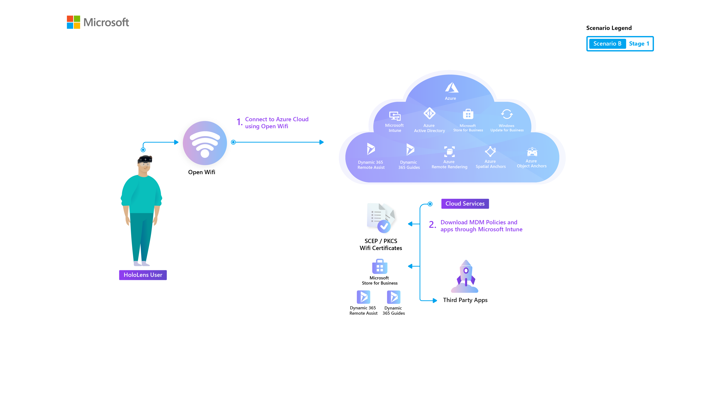
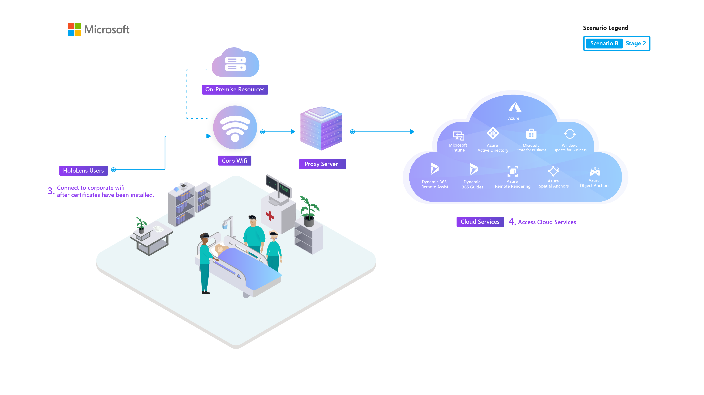
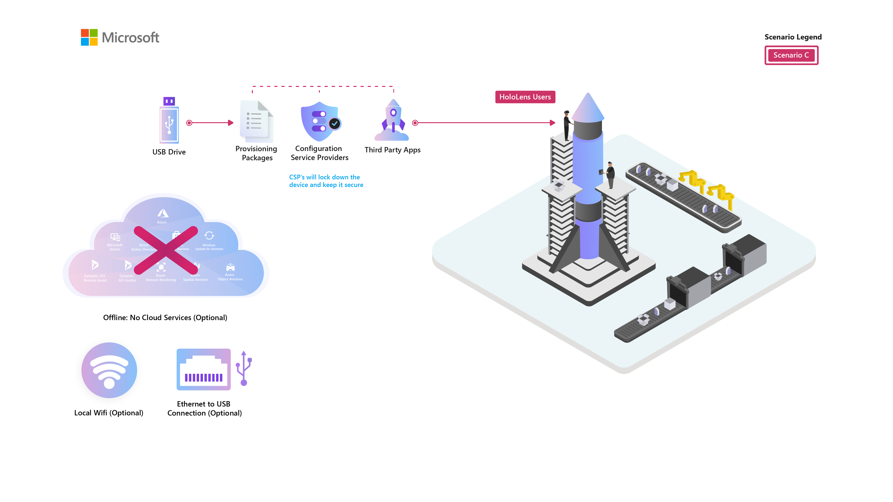

# Common Deployment Scenarios

## Overview

Figuring out how to deploy a new device can be a struggle when you try it the first time and do not have the right knowledge. Here we share different ways to deploy and manage Microsoft HoloLens 2 devices within the organization.

HoloLens 2 is designed as a highly secure device that supports Modern Device Management and requires low maintenance effort. Windows Autopilot self-deploying mode enables a device to be deployed with zero user interaction.​ Self-deploying mode greatly simplifies a deployment process by applying device targeted policies, applications, certificate and networking profiles.​

You want solutions - deployed at scale. We want to get you there. Let's first talk about the steps to deploy devices, therefore holograms, to achieve value for your target Mixed Reality scenario, whether you are using D365 Remote Assist, Guides, or an Azure mixed reality service-enabled application you created in house.

You may be a business decision-maker, IT professional, or an innovation team looking to adopt HoloLens within your organization. As you build from Proof of Concept to a scaled deployment, our deployment guides make sense of HoloLens within your IT infrastructure - no matter how big or small.

To enable smooth deployment process of HoloLens 2 at your organization, it is important to understand common deployment scenarios and test them. Choosing among these scenarios, and understanding the capabilities and limitations of each, is a key task. Based on your existing infrastructure, we invite you to review the Modern Device Management style (MDM) in the following scenarios. The following deployment scenarios are the most common:

 1. [Scenario A: Cloud connected devices](hololens2-cloud-connected-overview.md). When you first begin your deployment, you may start small and deploy a single device connected to the cloud just to see the basic process.
  1. Devices connected to cloud services and public internet.
  1. This is most suitable for External customer use cases, Filed Services, and Proof of Concept.
 1. [Scenario B: Organization's network](hololens2-corp-connected-overview.md). As you deploy to production at scale, you may need to integrate with your own enterprise network.
  1. Devices connected to a "Corporate" wi-fi network
  1. Most suitable for Internal users, or use within the corporate environment.
 1. [Scenario C: Offline secure environment](hololens-common-scenarios-offline-secure.md)
  1. Devices connected to a highly restrictive network or purely offline devices.
  1. Most suitable for highly secure environments, or "Experiences" where public will be using the devices.

## Scenario A: Deploy to cloud connected devices

This scenario is comparable to deploying managed mobile devices within a company. HoloLens 2 is deployed for use primarily in environments external to a corporate network. Corporate resources aren't accessed or may be limited through VPN.

### When to use

Consider this deployment model for:

* External customer use cases
* Deploying Proof of Concept, Pilots and Field Services
* Deploying [Remote Assist](hololens2-options-remote-assist.md)

### Basic Common Configurations

* Wi-Fi networks are typically fully open to the Internet and Cloud services.
* Azure AD Join with Mobile Device Management (MDM) Auto Enrollment--MDM (Intune) Managed
* Users sign in with their own corporate account (Azure AD)
  * Single or multiple users per device supported
* Varying levels of device lockdown configurations are applied based on specific use cases, from Fully Open to Single App Kiosk.
* One or more applications are deployed via MDM

### Common Challenges

* Determining which MDM configurations to apply to the HoloLens 2 based on scenario requirements.

The corresponding Cloud connected guide covers how to enroll HoloLens 2 into your device management, apply licenses as needed, and validate that your end users are able to immediately use Remote Assist upon device setup.

> [!div class="nextstepaction"]
> [Cloud connected environment deployment guide](hololens2-cloud-connected-overview.md)

Use the External Clients guide to deploy devices to a remote site for short-term or long-term external use.

> [!div class="nextstepaction"]
> [Cloud connected environment (External Clients) deployment guide](hololens2-deployment-guide.md)

## Scenario B: Deploy inside your organization's network

This scenario is identical to a classic deployment for most Windows 10 PCs. HoloLens 2 is deployed for use primarily on the corporate network with access to internal corporate resources. Internet and cloud services may be limited. 

### When to use

Consider this deployment model for:

* Internal users
* Deploying at scale (Pilot and Production) within the corporate environment

### Basic Common Configurations

* Wi-Fi network is an internal corporate network with access to internal resources, and limited access to the internet or Cloud services.
* Azure AD Join with MDM Auto Enrollment
* MDM (Intune) Managed
* Users sign in with their own corporate account (Azure AD)
  * Single or multiple users per device supported
* Varying levels of device lockdown configurations are applied based on specific use cases, from Fully Open to Single App Kiosk.
* One or more applications are deployed via MDM

### Common Challenges

* HoloLens 2 doesn't support on premises AD join or SCCM. Only Azure AD join with MDM. Many companies today still deploy Windows 10 PCs in this scenario as on premises AD joined devices, managed by System Center Configuration Manager (SCCM) and may not have the infrastructure deployed/configured for managing internal Windows 10 devices via cloud-based MDM solutions.
* As HoloLens 2 is a cloud first device, it relies heavily on internet and cloud connected services for User authentication, OS updates, MDM management, and so on. When connecting to a corporate network, Proxy/Firewall rules will most likely need to be adjusted to enable access for HoloLens 2 and the applications that run on it.
* Corporate Wi-Fi connectivity typically requires certificates to authenticate the device or user to the network. The required infrastructure or settings to deploy certificates to Windows 10 devices through MDM can be challenging to configure.

The corresponding Corporate network guide instructs on how to enroll HoloLens 2 into your existing device management, apply licenses as needed, and validate that your end users are able to operate a Dynamics 365 Guide, as well as use custom line of business apps, after device set up.

> [!div class="nextstepaction"]
> [Corporate network deployment guide](hololens2-corp-connected-overview.md)

## Scenario C: Deploy in secure offline environment

This is a typical deployment for highly secure or confidential locations. HoloLens 2 is deployed for use primarily offline with no network or internet access.

### When to use

Consider this deployment model for:

* Highly Secure environments where "data" needs to be retained in house
* "Experiences" where the public will be using the devices
* Internet connectivity issue in the remote area

### Basic Common Configurations

* Wi-Fi connectivity is disabled. Ethernet via USB may be enabled for LAN connectivity if necessary.
* Not Managed.
* Local user account for device sign-in.
  * HoloLens 2 supports only one local account.
* Varying levels of device lockdown configurations are applied via Provisioning Packages based on specific use cases. These configurations are typically restricted because of secure environment requirements.
* One or more applications are deployed via Provisioning Package

### Common Challenges

* There's a limited set of configurations available through Provisioning Packages
* Cloud services aren't able to be used, therefore limiting the HoloLens 2 capabilities.
* Higher administrative overhead since these devices have to be set up, configured, and updated manually.

The corresponding Offline secure guide provides instruction for applying a sample Provisioning Package that will lock down a HoloLens 2 for use in secure environments.

> [!div class="nextstepaction"]
> [Offline secure environment deployment guide](hololens-common-scenarios-offline-secure.md)
