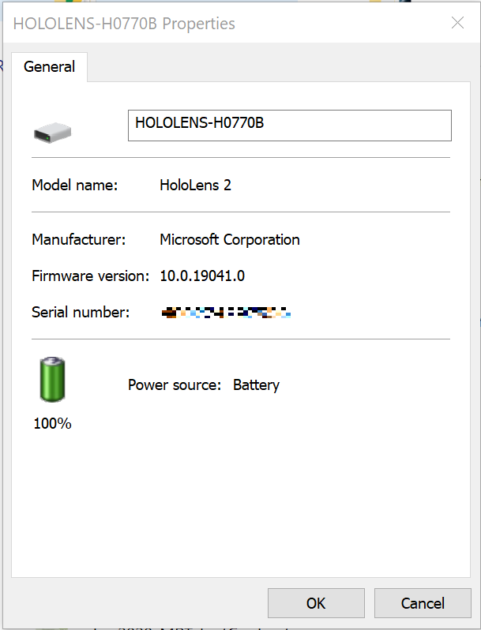

# Troubleshoot HoloLens issues

This article describes tools and approaches to help you if you run into any issues with HoloLens device.

>[!IMPORTANT]
> Before you start any troubleshooting procedure, make sure that your device is charged to **20 to 40 percent** of battery capacity, if possible. The [battery indicator lights](hololens2-setup.md#lights-that-indicate-the-battery-level) located under the power button are a quick way to verify the battery capacity without logging into the device.

## Charge the device

Use the [charger and the USB Type-C cable](https://www.microsoft.com/en-us/p/microsoft-hololens-2-usb-c-charger-cable/8vj21f2z8pk5?rtc=1) that came with the HoloLens 2 as that is the best way to charge your device. The charger supplies 18W of power (9V at 2A). Using the wall charger supplied, HoloLens 2 devices can charge the battery to full in less than 65 minutes when the device is in standby. If those accessories aren't available, make sure the charger that's available can support at least 15W of power.

> [!NOTE]
> If possible, avoid using a PC to charge the device over USB, which is slow.

If the device is correctly booted and running, there are three ways to check the battery charge level:

- From the main menu of the HoloLens device UI.
- View the LED close to the power button (for a 40-percent charge, you should see at least two solid LEDs).
    - When the device is charging, the battery indicator lights up to indicate the current level of charge.  The last light will fade in and out to indicate active charging.
    - When your HoloLens is on, the battery indicator displays the battery level in five increments.
    - When only one of the five lights is on, the battery level is below 20 percent.
    - If the battery level is critically low and you try to turn on the device, one light will blink briefly, then go out.
- On your host PC, open **File Explorer** and look for your HoloLens 2 device on left side under **This PC**. Right-click the device, and select **Properties**. A dialog box will show the battery charge level.

   

If the device can't boot to the startup menu, note the LED appearance and device enumeration on the host PC. Then follow the guide [Troubleshoot common issues](hololens-troubleshooting.md). If the state of the device doesn't match any of the states listed in the troubleshooting guide, perform the [hard reset procedure](hololens-recovery.md#hard-reset-procedure) with the device connected to the power supply, not to your host PC. Wait at least one hour for the device to charge.

## Diagnostic logs

Enable collection of data from HoloLens device to capture and view diagnostic logs. For more information, see [Enable diagnostic logs](hololens-diagnostic-logs.md).

## Common or known issues

There are different issues you might experience while using your HoloLens. To learn how to resolve these issues, see [Troubleshoot common issues](hololens-troubleshooting.md). Additionally take a look at the [Know issues and workarounds](hololens-known-issues.md) article.

## Frequently asked questions

Check the list of commonly asked questions about HoloLens [General FAQ](hololens-faq.md).

## Next steps

If you couldn't find a solution or need more help, please visit the page [Support and help options](hololens2-support.md).

> [!div class="nextstepaction"]
> [Support and help options](hololens2-support.md)