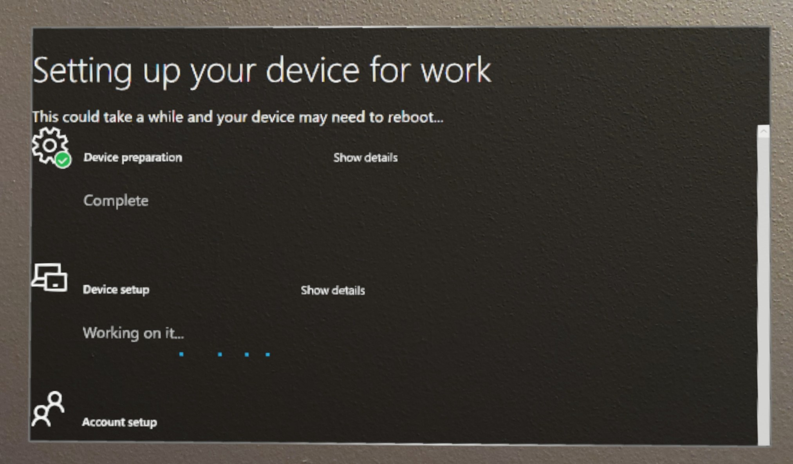

# Windows Autopilot for HoloLens 2

## Overview

To deploy at scale, we recommend getting started with Windows Autopilot. It’s considered “low touch” in that it dramatically simplifies setting up HoloLens for both IT and end users. 

At a high level, an IT administrator will typically create the business-ready configurations and register HoloLens 2 devices on MDM portals. When HoloLens 2 devices boot with out-of-box experience (OOBE) and connects with the Internet, business-ready configurations for registered HoloLens 2 device are automatically downloaded and applied to make devices business-ready without any user intervention.

For more information, see the [Overview of Windows Autopilot | Microsoft Docs](/mem/autopilot/windows-autopilot) article.

## Supported autopilot scenario on HoloLens 2

> [!NOTE]
> Autopilot configuration for HoloLens in Microsoft Endpoint Manager is transitioning from **Public Preview** to **General Availability**. All tenants will be able to setup Autopilot in the MEM admin center.

Starting with Windows Holographic version 2004, HoloLens 2 supports Windows Autopilot [Self-Deploying Mode](/mem/autopilot/self-deploying) with Microsoft Intune (third party MDMs are not supported). This configuration reduces inventory management overhead, cost of hands-on device preparation and support calls from employees during the setup experience. Learn more in the [Windows Autopilot](/mem/autopilot/windows-autopilot) documentation.

Like for Surface devices, it is recommended that customers work with their Microsoft [Cloud Solution Provider](https://partner.microsoft.com/cloud-solution-provider) (reseller or distributor) to get devices registered with the Autopilot service through Partner Center.

When a user starts the Autopilot self-deploying process, Autopilot completes the following steps:

1. Join the device to Azure Active Directory (Azure AD). Autopilot for HoloLens does not support Active Directory join or Hybrid Azure AD join.

1. Use Azure AD to enroll the device in Microsoft Endpoint Manager (or another MDM service).

1. Download and apply device-targeted policies, certificates, networking profiles and applications.

1. Present the sign in screen to the user.

## Configuring Autopilot for HoloLens 2

Follow the steps below to set up your environment:

1. [Review requirements for Windows Autopilot for HoloLens 2.](#1-review-requirements-for-windows-autopilot-for-hololens-2)

1. [Enable Automatic MDM Enrollment](#2-enable-automatic-mdm-enrollment)

1. (For Intune only) [Ensure that MDM enrollment is not blocked for Windows devices.](/mem/intune/enrollment/enrollment-restrictions-set)

1. [Register devices in Windows Autopilot.](#4-register-devices-in-windows-autopilot)

1. [Create a device group.](#5-create-a-device-group)

1. [Create autopilot profile and assign it to the device group.](#6-create-autopilot-profile-and-assign-it-to-the-device-group)

1. [Create Enrollment Status Page (ESP) configuration and assign it to the device group.](#7-create-enrollment-status-page-esp-configuration-and-assign-it-to-the-device-group)

1. [Verify the profile status of the HoloLens devices.](#8-verify-the-profile-status-of-the-hololens-devices)

### 1. Review requirements for Windows Autopilot for HoloLens 2

#### Review the following sections of the Windows Autopilot requirements article:

- [Network requirements](/mem/autopilot/networking-requirements)  
- [Licensing requirements](/mem/autopilot/licensing-requirements)  
- [Configuration requirements](/mem/autopilot/configuration-requirements)

**Review the "[Requirements](/windows/deployment/windows-autopilot/self-deploying#requirements)" section of the Windows Autopilot Self-Deploying mode article.** Your environment has to meet these requirements and the standard Windows Autopilot requirements. You do not have to review the "Step by step" and "Validation" sections of the article. The procedures later in this article provide corresponding steps that are specific to HoloLens.

Ensure that the devices are not already members of Azure AD, and are not enrolled in Intune (or another MDM system). The Autopilot self-deploying process completes these steps. To make sure that all the device-related information is cleaned up, check the **Devices** pages in both Azure AD and Intune Portals. Convert all targeted devices to Autopilot" feature is not supported on HoloLens at the moment. 

#### Review HoloLens OS requirements:

To confirm the build version on your device or reflash to the latest OS, use the [Advanced Recovery Companion (ARC)](https://www.microsoft.com/p/advanced-recovery-companion/9p74z35sfrs8?rtc=2&activetab=pivot:overviewtab) and our [device reflash instructions](hololens-recovery.md). Devices delivered until late September 2020 have Windows Holographic version 1903 pre-installed. Contact your reseller to ensure that Autopilot-ready devices are shipped to you.

 Minimum operating system version | Feature supported | Remarks 
 ------ | ------ | ------  
 [Windows Holographic, version 2004](hololens-release-notes.md#windows-holographic-version-2004) (build 19041.1103) or later | 1.	Self-deploying scenario of Autopilot on HoloLens 2. | Autopilot profile download is supported only via Ethernet. Ensure the HoloLens is connected to ethernet using a "USB-C to Ethernet" adapter **before turning it on**.  If you are planning for an Autopilot roll-out to many HoloLens devices, we recommend that you plan for the adapter infrastructure. We do not recommend USB Hubs, as they often require third-party drivers to be installed which is not supported on HoloLens.
 [Windows Holographic, version 20H2](hololens-release-notes.md#windows-holographic-version-20h2) (build 19041.1128) or later | 1. Downloading autopilot profile over Wi-Fi. <br> 2. [Tenant lockdown CSP and Autopilot](#tenant-lockdown-csp-and-autopilot) to lock devices with Autopilot specified tenant. | You may still use ethernet adapters if desired. For devices connected via Wi-fi, the user must only: <ul> <li> Go through the hummingbird scene. </li> <li> Choose the language and locale. </li> <li> Run eye-calibration. </li> <li> Successfully connect with desired wifi network. </li> </ul>

### 2. Enable Automatic MDM Enrollment:

In order for Autopilot to succeed you'll need to enable Automatic MDM Enrollment in your Azure portal. This will enable the device to enroll without a user.

Review the following short [guide on enabling MDM Automatic Enrollment](/windows/client-management/mdm/azure-ad-and-microsoft-intune-automatic-mdm-enrollment-in-the-new-portal) or the [Auto Enrollment Quick start guide](/mem/intune/enrollment/quickstart-setup-auto-enrollment) for even more information getting set-up.

### 3. Ensure that MDM enrollment isn't blocked for Windows devices.

In order for Autopilot to succeed you'll need to make sure that your HoloLens devices can enroll. Since HoloLens is considered a Windows device, there will need to be no enrollment restrictions that could block your deployment. [Review this list of restrictions](/mem/intune/enrollment/enrollment-restrictions-set) and ensure you'll be able to enroll your devices.

### 4. Register devices in Windows Autopilot

Your devices must be registered in Windows Autopilot before first setup. 

There are three primary ways to register HoloLens devices:

 - **Reseller can register devices in the Partner Center when you place an order.**

   > [!NOTE]  
   > This is the recommended path for adding devices to the Autopilot service. [Learn more](/mem/autopilot/partner-registration).  

 - **You can [submit a support request](hololens2-autopilot-registration-support.md) directly to Microsoft.**
 - **Retrieve the hardware hash (also known as the hardware ID) and register the device manually in MEM admin center**.

#### Obtain hardware hash

You can retrieve the hardware hash from the device. The device records its hardware hash in a CSV file during the OOBE process, or later when a device owner starts the diagnostic log collection process (described in the following procedure). Typically, the device owner is the first user to sign in to the device.

> [!WARNING]
> In builds prior to 20H2, if you have gone through OOBE and the telemetry was set to Required, you cannot collect the hardware hash for Autopilot through this method. In          order to collect your hardware hash via this method set your telemetry option to Full via the Settings App and select **Privacy** > **Diagnostics**.

1. Start the HoloLens 2 device.

1. On the device, press the **Power** and **Volume Down** buttons at the same time and then release them. The device collects diagnostic logs and the hardware hash, and stores them in a set of .zip files.

1. For full details and an instructional video for how to perform this read about [Offline Diagnostics](hololens-diagnostic-logs.md#offline-diagnostics).

1. Use a USB-C cable to connect the device to a computer.

1. On the computer, open File Explorer. Open <b>This PC\\</b><*HoloLens device name*><b>\\Internal Storage\\Documents</b>, and locate the AutopilotDiagnostics.zip file.  

   > [!NOTE]  
   > The .zip file may not immediately be available. If the file is not ready yet you may see a HoloLensDiagnostics.temp file in the Documents folder. To update the list of files, refresh the window.
    
1. Extract the contents of the AutopilotDiagnostics.zip file.

1. In the extracted files, locate the CSV file that has a file name prefix of "DeviceHash." Copy that file to a drive on the computer where you can access it later.  

   > [!IMPORTANT]  
   > The data in the CSV file should use the following header and line format:
   >
   > ```
   > Device Serial Number,Windows Product ID,Hardware Hash,Group Tag,Assigned User <serialNumber>,<ProductID>,<hardwareHash>,<optionalGroupTag>,<optionalAssignedUser>
   >```

#### Register device through MEM

1. In [Microsoft Endpoint Manager admin center](https://endpoint.microsoft.com), select **Devices** > **Windows** > **Windows enrollment**, and then select **Devices** > **Import** under **Windows Autopilot Deployment Program**.

1. Under **Add Windows Autopilot devices**, select the DeviceHash CSV file, select **Open**, and then select **Import**.  

   > [!div class="mx-imgBorder"]
   > 

1. After the import finishes, select **Devices** > **Windows** > **Windows enrollment** > **Devices** > **Sync**. The process might take a few minutes to complete, depending on how many devices are being synchronized. To see the registered device, select **Refresh**.  

   > [!div class="mx-imgBorder"]
   >   

### 5. Create a device group

1. In [Microsoft Endpoint Manager admin center](https://endpoint.microsoft.com), select **Groups** > **New group**.

1. For **Group type**, select **Security**, and then enter a group name and description.

1. For **Membership type**, select either **Assigned** or **Dynamic Device**.

1. Do one of the following:  

   - If you selected **Assigned** for **Membership type** in the previous step, select **Members**, and then add Autopilot devices to the group. Autopilot devices that aren't yet enrolled are listed by using the device serial number as the device name.
   - If you selected **Dynamic Devices** for **Membership type** in the previous step, select **Dynamic device members**, and then enter code in **Advanced rule** that resembles the following:
     - If you want to create a group that includes all of your Autopilot devices, type: `(device.devicePhysicalIDs -any _ -contains "[ZTDId]")`
     - Intune's group tag field maps to the **OrderID** attribute on Azure AD devices. If you want to create a group that includes all of your Autopilot devices that have a specific group tag (the Azure AD device OrderID), you must type: `(device.devicePhysicalIds -any _ -eq "[OrderID]:179887111881")`
     - If you want to create a group that includes all your Autopilot devices that have a specific Purchase Order ID, type: `(device.devicePhysicalIds -any _ -eq "[PurchaseOrderId]:76222342342")`

     > [!NOTE]  
     > These rules target attributes that are unique to Autopilot devices.
1. Select **Save**, and then select **Create**.

### 6. Create autopilot profile and assign it to the device group

1. In [Microsoft Endpoint Manager admin center](https://endpoint.microsoft.com), select **Devices** > **Windows** > **Windows enrollment** > **Windows Autopilot deployment profiles** > **Create profile** > **HoloLens**.
   

1. Enter a profile name and description, and then select **Next**.  
   You should see a list that includes **HoloLens**. If this option is not present, use one of the [Feedback](hololens2-autopilot.md#feedback-and-support-for-autopilot) options to contact us.

   > [!div class="mx-imgBorder"]
   > 

1. On the **Out-of-box experience (OOBE)** page, most of the settings are pre-configured to streamline OOBE for this evaluation. Optionally, you can configure the following settings:  

   - **Language (Region)**: Select the language for OOBE. We recommend that you select a language from the list of [supported languages for HoloLens 2](hololens2-language-support.md).
   - **Automatically configure keyboard**: To make sure that the keyboard matches the selected language, select **Yes**.
   - **Apply device name template**: To automatically set the device name during OOBE, select **Yes** and then enter the template phrase and placeholders in **Enter a name** For example, enter a prefix and `%RAND:4%`&mdash;a placeholder for a four-digit random number.
     > [!NOTE]  
     > If you use a device name template, the OOBE process restarts the device one time after it applies the device name and before it joins the device to Azure AD. This restart enables the new name to take effect.  

   > [!div class="mx-imgBorder"]
   > 

1. After you configure the settings, select **Next**.
1. On the **Scope tags** page, optionally add the scope tags that you want to apply to this profile. For more information about scope tags, see [Use role-based access control and scope tags for distributed IT](/mem/intune/fundamentals/scope-tags.md). When finished, select **Next**.
1. On the **Assignments** page, select **Selected groups** for **Assign to**.
1. Under **SELECTED GROUPS**, select **+ Select groups to include**.
1. In the **Select groups to include** list, select the device group that you created for the Autopilot HoloLens devices, and then select **Next**.  
  
   If you want to exclude any groups, select **Select groups to exclude**, and select the groups that you want to exclude.

   > [!div class="mx-imgBorder"]
   > 

1. On the **Review + Create** page, review the settings and then select **Create** to create the profile.  

   > [!div class="mx-imgBorder"]
   > 

### 7. Create Enrollment Status Page (ESP) configuration and assign it to the device group

The Enrollment Status Page (ESP) displays the status of the complete device configuration process that runs when an MDM-managed user signs into a device for the first time. Make sure that your ESP configuration resembles the following, and verify that the assignments are correct.  

> [!div class="mx-imgBorder"]
> 

For more information about ESP, refer to [Set up the Enrollment Status Page - Microsoft Intune | Microsoft Docs](/mem/intune/enrollment/windows-enrollment-status)

### 8. Verify the profile status of the HoloLens devices

1. In Microsoft Endpoint Manager Admin Center, select **Devices** > **Windows** > **Windows enrollment** > **Devices**.

1. Verify that the HoloLens devices are listed, and that their profile status is **Assigned**.  

   > [!NOTE]  
   > It may take a few minutes for the profile to be assigned to the device.  

   > [!div class="mx-imgBorder"]
   > 

## Windows Autopilot for HoloLens 2 User Experience

Once the above instructions are completed, your HoloLens 2 users will go through the following experience to provision their HoloLens devices:  

1. Autopilot experience requires internet access. Use one of following options to provide internet access:

    - Connect your device to a Wi-Fi network in OOBE and then let it detect Autopilot experience automatically. This is the only time you will need to interact with OOBE until Autopilot experience completes on its own.

    - Connect your device with Ethernet using "USB-C to Ethernet" adapters for wired internet connectivity and let HoloLens 2 complete Autopilot experience automatically.

    - Connect your device with "USB-C to Wi-Fi" adapters for wireless internet connectivity and let HoloLens 2 complete Autopilot experience automatically.

        > [!IMPORTANT]  
       > Devices attempting to use Wi-Fi networks in OOBE for Autopilot must be on [Windows Holographic, version 20H2](hololens-release-notes.md#windows-holographic-version-20h2).
       >
       > For devices using ethernet adapters you must connect the device to the network before the Out-of-the-Box-Experience (OOBE) starts. The device determines whether it is provisioning as an Autopilot device while on the first OOBE screen. If the device cannot connect to the network, or if you choose not to provision the device as an Autopilot device, you cannot change to Autopilot provisioning at a later time. Instead, you would have to start this procedure over in order to provision the device as an Autopilot device.

1. The device should automatically start OOBE. Do not interact with OOBE.

    > [!IMPORTANT]
    > Please do not interact with OOBE or press power button to bring system into standby / shutdown, while autopilot is in progress. This may cause autopilot flow to not complete.

   Let HoloLens 2 detect network connectivity and allow it complete OOBE automatically. The device may restart during OOBE. The OOBE screens should resemble the following.

   
   
   

1. At the end of OOBE, you can sign in to the device by using your user name and password.

   <br/>

## Tenant lockdown CSP and Autopilot

HoloLens 2 devices support TenantLockdown CSP as of Windows Holographic, version 20H2. This CSP keeps devices on the organization's tenant by locking them to that tenant even through device reset or reflash.

[TenantLockdown](/windows/client-management/mdm/tenantlockdown-csp) CSP enables HoloLens 2 to be tied to MDM enrollment using Autopilot only. Once TenantLockdown CSP’s RequireNetworkInOOBE node is set to either true or false (initially set) value on HoloLens 2, that value remains on the device despite reflashing, OS updates, etc.

Once TenantLockdown CSPs’ RequireNetworkInOOBE node is set to true on HoloLens 2, OOBE waits indefinitely for Autopilot profile to be successfully downloaded and applied, after network connectivity.

Once TenantLockdown CSPs’ RequireNetworkInOOBE node is set to true on HoloLens 2, following operations are disallowed in OOBE:

- Creating local user using runtime provisioning 
- Performing Azure AD join operation via runtime provisioning 
- Selecting who owns the device in OOBE experience 

#### How to set this using Intune? 
1. Create a custom OMA URI device configuration profile and specify true for RequireNetworkInOOBE node as shown below.
OMA-URI value should be ./Vendor/MSFT/TenantLockdown/RequireNetworkInOOBE

   > [!div class="mx-imgBorder"]
   > 

1. Create a group and assign the device configuration profile to that device group.

1. Make the HoloLens 2 device member of the group created in previous step and trigger sync.  

Verify in the Intune portal that device configuration has been successfully applied. Once this device configuration successfully applies on the HoloLens 2 device, effects of TenantLockdown will be active.

#### How to unset TenantLockdown’s RequireNetworkInOOBE on HoloLens 2 using Intune?

1. Remove the HoloLens 2 from the device group to which the device configuration created above was previously assigned.

1. Create a custom OMA URI-based device configuration profile and specify false for RequireNetworkInOOBE as shown below.
OMA-URI value should be ./Vendor/MSFT/TenantLockdown/RequireNetworkInOOBE

   > [!div class="mx-imgBorder"]
   > 

1. Create a group and assign the device configuration profile to that device group. 

1. Make the HoloLens 2 device member of the group created in previous step and trigger sync.

Verify in the Intune portal that device configuration has been successfully applied. Once this device configuration successfully applies on the HoloLens 2 device, effects of TenantLockdown will be inactive.

#### What would happen during OOBE, if Autopilot profile is unassigned on a HoloLens after TenantLockdown was set to true? 
OOBE will wait indefinitely for Autopilot profile to download and following dialog will be presented. In order to remove effects of TenantLockdown, device must be enrolled with its original tenant first using Autopilot only and RequireNetworkInOOBE must be unset as described in previous step before restrictions introduced by TenantLockdown CSP are removed.


#### Why did I not see Autopilot experience even though the Autopilot profile is assigned in Intune?

By default, HoloLens 2 waits for 15 seconds to detect Autopilot after detecting the internet. If no autopilot profile is detected within 15 seconds, that means Autopilot was not discovered correctly, and you will see the EULA page.

Reboot your device and try again. For more information, see [Known Issues and Limitations](hololens2-autopilot.md#known-issues-and-limitations) or [Troubleshooting](hololens2-autopilot.md#troubleshooting).

## Known issues and limitations

- We are investigating an issue where device-context based application install configured in MEM does not apply to HoloLens. [Learn more about device context and user context installs.](/mem/intune/apps/apps-windows-10-app-deploy#install-apps-on-windows-10-devices)
- While setting up Autopilot over Wi-Fi, there may be an instance where the Autopilot profile is not downloaded when Internet connection is first established. In this case End User License Agreement (EULA) is presented and the user has the option to proceed with non-Autopilot setup experience. To retry setting up with Autopilot, put the device to sleep and then power up, or reboot the device and let it try again.

### Troubleshooting

The following articles may be a useful resource for you to learn more information and troubleshoot Autopilot Issues, however these articles are based on Windows 10 Desktop and not all information may apply to HoloLens:

- [Windows Autopilot - known issues](/mem/autopilot/known-issues)
- [Troubleshoot Windows device enrollment problems in Microsoft Intune](/mem/intune/enrollment/troubleshoot-windows-enrollment-errors)
- [Windows Autopilot - Policy Conflicts](/mem/autopilot/policy-conflicts)

## Feedback and support for Autopilot

To provide feedback or report issues, use one of the following methods:

- For support on device registration, contact your reseller or distributor.
- For general support inquiries about Windows Autopilot, or for issues like profile assignments, group creation or MEM portal controls, [contact Microsoft Endpoint Manager support](/mem/get-support)  
- If your device is registered to the Autopilot service and the profile is assigned on MEM portal, contact HoloLens [support](/hololens/) (see 'Support' card). Open a support ticket and if applicable, include screenshots and logs by capturing [offline diagnostic logs](hololens-diagnostic-logs.md#offline-diagnostics) during the out-of-box-experience (OOBE).
- To report an issue from the device, use the Feedback Hub app on your HoloLens. In Feedback Hub, select the **Enterprise Management** > **Device** category.
- To provide general feedback on Autopilot for HoloLens, you can submit this [survey](https://forms.office.com/Pages/ResponsePage.aspx?id=v4j5cvGGr0GRqy180BHbR7vUmjNI0XhCp1T72ODD84xUMEM3TVJPOURBRkNVWkYwM0RWWEhJNVdJSi4u&wdLOR=cEF1F57F6-AD9B-4CCE-B919-AB5AE320A993)

## Delete Autopilot devices

You may wish to no longer use a device for Autopilot, or to register your devices to a different tenant. If you would like to do this, then read [how to delete Autopilot devices.](/mem/autopilot/add-devices#delete-autopilot-devices)