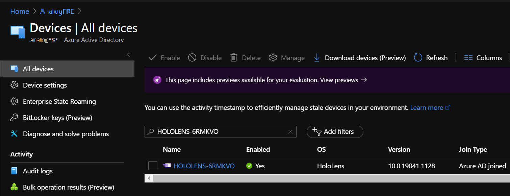
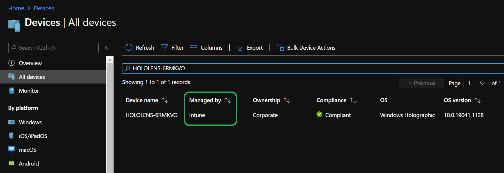

# Deploy - Cloud connected Guide

Now that you have everything configured you should be ready to distribute devices. However, now is when you should first validate your setup. First the Azure AD Join and MDM Enrollment process should be validated, followed by verifying that a Remote Assist call can be placed.

## Enrollment Validation

Now that everything is properly configured for Azure AD and MDM Enrollment, the rest should now be a snap. You&#39;ll need a Wi-Fi connection and the HoloLens device, as well as one of the previously configured AAD user accounts.

If your device isn&#39;t currently sitting in a factory settings state, now would be a good time to [reflash the device](/hololens/hololens-recovery#clean-reflash-the-device).

1. Once your device is in OOBE, you&#39;ll need to start interacting and following the prompts. 
1. The critical prompt will be when you are asked **Who owns this HoloLens?** Select **My work or school owns it** and enter your Azure AD account credentials.
1. When enrollment is successful, you&#39;ll be prompted to set up a PIN. This PIN is unique to this device for this user. You will also be prompted for Iris scans, voice data, and telemetry settings and finally, you&#39;ll be able to learn how to open the start menu and complete OOBE.
1. Once you land in the Mixed Reality Home open the Start menu using the **Start gesture** you just learned.
1. Select the **Settings** app and select **System.** The first piece of information you&#39;ll see is your Device name, which for your HoloLens 2 device will be &quot;HOLOLENS-&quot; followed by a six character string.
1. Take note of this name.

7. You can verify that your device is successfully enrolled in the Azure AD within the Settings app. From **Settings** select **Accounts** -> **Access work or school**. From this screen you can verify you are successfully enrolled by seeing &quot;Connected to _nameofAAD_&#39;s Azure AD. Connected by _yourusername_@_nameofAAD_.onmicrosoft.com&quot;.

To validate the device has Azure AD Joined we can check the Azure Active Directory from the [Azure portal](https://portal.azure.com/#home) -> **Azure Active Directory** -> **Devices** -> **All devices**, and search the device name. You&#39;ll be able to see the device is a part of the Azure Active Directory.

Next you&#39;ll need to log into the [Microsoft Endpoint Manager admin center](https://endpoint.microsoft.com/#home). Log in and select **Devices** then **All devices**. From here you can search your HoloLens device&#39;s name. You should be able to see your HoloLens listed on Intune.

## Remote Assist Call Validation

Once you&#39;ve verified that your device is enrolled in both your AAD and MDM, it&#39;s time to place a test Remote Assist call. For this validation you&#39;ll need to have the HoloLens device and a Windows 10 PC, as well as a second Azure AD user account for the PC.

This validation step will assume that you have previously completed the last validation step and your device is enrolled and your Azure AD user is on the device.

1. If you don't already have Microsoft Teams installed on your PC, you can [download Teams here](https://www.microsoft.com/microsoft-365/microsoft-teams/download-app).
2. Sign into Teams using the second  Azure AD user account than the one currently signed into your HoloLens. Once signed in your PC you will be ready to receive the call.
3. Unlock your HoloLens and sign in.
4. To launch the Remote Assist app open the **Start Menu** and select **Remote Assist**. Remote Assist is not only bundled as an inbox app but pinned to the HoloLens 2&#39;s start menu. In an event you don&#39;t see it pinned to the Start menu, then open the **All apps** list to look for it.
5. Once Remote Assist starts it should identify the user of the device via [SSO](/azure/active-directory/manage-apps/what-is-single-sign-on) and log into the app.
6. From within the app, select **Search** and search for the second user on the PC. Select the user to start the call.
7. From your PC, answer the call.

Congratulations, you&#39;ve successfully connected and are on your remote assist call. Make sure to try out specific remote assist features, such as using:

- [Inking annotations](/dynamics365/mixed-reality/remote-assist/add-annotations-hololens)
- [Share a file and view in mixed reality](/dynamics365/mixed-reality/remote-assist/display-save-files)
- [Get help in another HoloLens app](/dynamics365/mixed-reality/remote-assist/get-help-hololens-app-hololens)

## Next step

> [!div class="nextstepaction"]
> [Cloud connected deployment - Maintain](hololens2-cloud-connected-maintain.md)