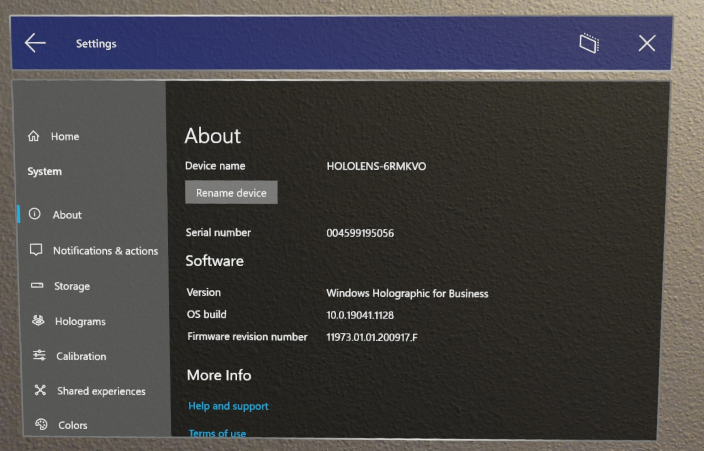

# Deploy - Corporate Connected Guide

An important part of each deployment is ensuring that your deployment is properly set up before testing it yourself to ensure a smooth experience for the end user.

Because we are deploying the Wi-Fi certificate via MDM, we'll need to initially set up HoloLens and enroll devices on an open Wi-Fi network, or a network that doesn't require the certificate. Once the HoloLens has finished OOBE and Enrolled, the device will receive the network certificate and LOB configured previously and we'll be able to validate both were received by the device.

Afterwards, you'll be able confirm you can both author and operate a test Guide.

## Enrollment Validation

Now that everything is properly configured for Azure AD and MDM Enrollment, the rest should now be a snap. You'll need a Wi-Fi connection and the HoloLens device, and one of the previously configured Azure AD user accounts.

If your device isn't currently sitting in a factory settings state, now would be a good time to [reflash the device](/hololens/hololens-recovery#clean-reflash-the-device).

1. Once your device is in OOBE, you'll need to start interacting and following the prompts.

2. Connect to an open Wi-Fi network that does not require certificates to join the Wi-Fi. This will allow the device to download the certificate to be used on the organization's Wi-Fi after initial setup.

3. The critical prompt will be when you are asked **Who owns this HoloLens?** Select **My work or school owns it** and enter your Azure AD account credentials.

4. When enrollment is successful, you'll be prompted to set up a PIN. This PIN is unique to this device for this user. You will also be prompted for Iris scans, voice data, and telemetry settings and finally, you'll be able to learn how to open the start menu and complete OOBE.

5. Once you land in the Mixed Reality Home, open the Start menu using the **Start gesture** you just learned.

6. Select the **Settings** app and select **System**. The first piece of information you'll see is your Device name, which for your HoloLens 2 device will be &quot;HOLOLENS-&quot; followed by a six character string.

7. Take note of this name.

    

8. Verify that your device is successfully joined to Azure AD. There are two ways;

    1.  The Settings app. From **Settings** select **Accounts** -> **Access work or school**. From this screen, you can verify you are successfully enrolled by seeing &quot;Connected to nameofAAD&#39;s Azure AD. Connected by *yourusername@nameofAAD.onmicrosoft.com*. This will verify your device is joined to your organization&#39;s Azure AD.

    1. The [Azure portal](https://portal.azure.com/#home). Go to **Azure Active Directory** -> **Devices** -> **All devices**, and search the device name. Under Join Type, it will show as being 'Azure AD Joined'.
        

9. Verify that your device is enrolled with MDM. There are two ways;

    1. From **Settings**, select **Accounts** -> **Access work or school**. From this screen, you can verify you are successfully enrolled by seeing &quot;Connected to nameofAAD&#39;s Azure AD. Connected by *yourusername@nameofAAD.onmicrosoft.com*. From this Access work or school account by selecting &quot;Connected to nameofAAD&#39;s Azure AD. Connected by yourusername@nameofAAD.onmicrosoft.com&quot; and select the **Info** button.

    1. [Microsoft Endpoint Manager Admin Center](https://endpoint.microsoft.com/#home). Log in and select  **Devices**  then  **All devices**. From here, you can search your HoloLens device&#39;s name. You should be able to see your HoloLens listed on Intune.

        

## Wi-Fi certificate validation

By now, the device should have received the Wi-Fi certificate. The simplest validation you can do is attempt to connect to the Wi-Fi connection for which you&#39;ve received the certificate. Open up the **Settings** app and navigate to **Network &amp; Internet** -> **Wi-Fi** and select the Wi-fi connection. Once connected, open up the Microsoft Edge app and confirm you can navigate to a website.

To confirm that you have received the certificate on the device, you can use the [Certificate Manager](/hololens/certificate-manager).

## Validate LOB app install

To see a managed app's install progress, you either see if the app is installed or check Settings. By configuring a LOB app as a required installation for our group, after enrolling the HoloLens with a user in the assigned group, the app will automatically download to the HoloLens.

Open the Start menu and select **All apps**. Depending on the number of apps you have, you may need to use the **page up** or **page down** buttons.

To validate the installation of the app on device, you can do so via **Settings** -> **Accounts** -> **Access work or school**; select the account then the **Info** button, and scroll down to see different configurations and apps applied to the device from MDM.

To validate the install from Intune, navigate to the [MEM portal](https://endpoint.microsoft.com/#home) -> **Apps** -> All **apps** ->*TheNameOfYourApp* -> **Device install status** page.

See more: [Intune App Deployment for HoloLens](/hololens/app-deploy-intune)

## Validate Dynamics 365 Guides

There are modes for the Guides app on HoloLens, authoring and operating. You'll need to finish authoring a guide before operating it.

### Authoring the Guide

We don't need to do much for this quick validation. Simply select the guide you prepared on your PC. You'll need to [anchor the guide](/dynamics365/mixed-reality/guides/hololens-app-anchor), for a quick validation you can use a holographic anchor. Afterwards, you should [place your steps and models](/dynamics365/mixed-reality/guides/hololens-app-orientation).

>[!NOTE]
> You will need the **Authoring** role to login to the PC and author on the HoloLens. The Operator role is read-only and has no access to the PC app.

<iframe width="560" height="315" src="https://www.youtube.com/embed/poE7s7_zWDE" frameborder="0" allow="accelerometer; autoplay; clipboard-write; encrypted-media; gyroscope; picture-in-picture" allowfullscreen></iframe>

### Operating the Guide

Once your holograms are in place, you can test out operating your guide. 
- Select **Operator mode**
- Click through the steps of your guide.

For more in-depth guidance on how to operate a guide, check out these resources:

[Overview of operating a guide in Dynamics 365 Guides](/dynamics365/mixed-reality/guides/operator-overview)

[Get oriented with the Step card as an operator in Dynamics 365 Guides](/dynamics365/mixed-reality/guides/operator-step-card-orientation)

<iframe width="560" height="315" src="https://www.youtube.com/embed/9s41BKGHVL8" frameborder="0" allow="accelerometer; autoplay; clipboard-write; encrypted-media; gyroscope; picture-in-picture" allowfullscreen></iframe>

## Next step 
> [!div class="nextstepaction"]
> [Corporate connected deployment - Maintain](hololens2-corp-connected-maintain.md)
