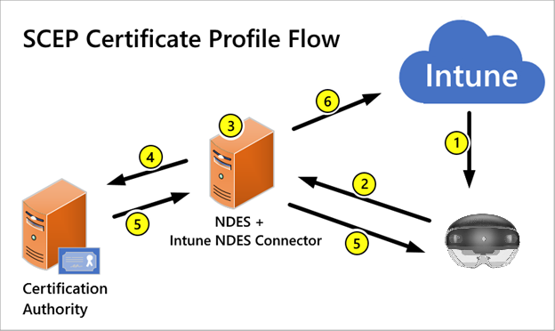

# Prepare - Corporate Connected Guide
## Infrastructure Essentials
For both personal and corporate deployment scenarios, a Mobile Device Management (MDM) system is the essential infrastructure required to deploy and manage Windows 10 devices, especially the HoloLens 2. An [Azure AD Premium subscription](https://docs.microsoft.com/azure/active-directory/fundamentals/active-directory-get-started-premium) is recommended as an identity provider and **required** to support certain capabilities.

> [!NOTE]
> Although the HoloLens 2 is deployed and managed like a mobile device, it is generally used as a shared device between many users.

## Azure Active Directory
Azure AD is a cloud-based directory service that provides identity and access management. Organizations that use Microsoft Office 365 or Intune are already using Azure AD, which has three editions: Free, Premium P1, and Premium P2 (see [Azure Active Directory editions](https://azure.microsoft.com/documentation/articles/active-directory-editions)). All editions support Azure AD device registration, but Premium P1 is required to enable MDM auto-enrollment which we will be using in this guide later.
> [!Important]
> It is essential to have an Azure AD as HoloLens devices do not support on-premises AD join. If you don't already have an Azure AD set up, follow the instructions to get started and [Create a new tenant in Azure Active Directory](https://docs.microsoft.com/azure/active-directory/fundamentals/active-directory-access-create-new-tenant).

## Identity Management
In this guide, the [Identity](https://docs.microsoft.com/hololens/hololens-identity) used will be Azure AD accounts. There are several benefits to Azure AD accounts, such as:
- Employees use their Azure AD account to register the device in Azure AD and can automatically enroll it with the organization's MDM solution (Azure AD+MDM – requires an [Azure AD Premium subscription](https://docs.microsoft.com/azure/active-directory/fundamentals/active-directory-get-started-premium)).
- Azure AD accounts have additional [authentication options](https://docs.microsoft.com/hololens/hololens-identity) via [Windows Hello for Business](https://docs.microsoft.com/windows/security/identity-protection/hello-for-business/hello-identity-verification). In addition to Iris log-in, users can sign in from another device or use FIDO security keys.

> [!WARNING] 
> Employees can use only one account to initialize a device so **it's imperative that your organization controls which account is enabled first**. The account chosen will determine who controls the device and influence your management capabilities.

## Mobile Device Management
Microsoft Intune, part of Enterprise Mobility + Security, is a cloud-based MDM system that manages devices connected to your tenant. Like Office 365, Intune uses Azure AD for identity management, so employees use the same credentials to enroll devices in Intune that they use to sign into Office 365. Intune also supports devices that run other operating systems, such as iOS and Android, to provide a complete MDM solution. For the purposes of this guide, we'll be focusing on using Intune for enabling a deployment to your internal network with HoloLens 2.
> [!Important] 
> It is essential to have Mobile Device Management. If you don't already have it set up, follow this guide and Get started with Intune.

> [!Important]
> In order to use Guides, an Azure AD account is required.

> [!Note] 
> Multiple MDM systems support Windows 10 and most support personal and corporate device deployment scenarios. MDM providers that support Windows 10 Holographic include: AirWatch, MobileIron, and others. Most industry-leading MDM vendors already support integration with Azure AD. You can find the most current list of MDM vendors that support Azure AD in [Azure Marketplace](https://azuremarketplace.microsoft.com/marketplace/apps/category/azure-active-directory-apps).

## Network Access 
Dynamics 365 Guides is a cloud-based application. If your network admin has an approve list, they may need to add IP addresses and/or endpoints that are required to connect to the Dynamics 365 servers. [Learn more about unblocking IP addresses and URLs](https://docs.microsoft.com/power-platform/admin/online-requirements#ip-addresses-and-urls).

## Certificates
Certificates help improve security by providing account authentication, Wi-Fi authentication, VPN encryption, and SSL encryption of web content. Although administrators can manage certificates on devices manually through provisioning packages, it’s a best practice to use your MDM system to manage those certificates throughout their entire lifecycle – from enrollment through renewal and revocation. 

Your MDM system can automatically deploy these certificates to the devices’ certificate stores after you enroll them (as long as your MDM system supports the **Simple Certificate Enrollment Protocol (SCEP)** or **Public Key Cryptography Standards #12 (PKCS#12)**). [Learn about certificate types and profiles you use with Microsoft Intune](https://docs.microsoft.com/mem/intune/protect/certificates-configure). MDM can also query and delete enrolled client certificates or trigger a new enrollment request before the current certificate is expired.
 
If your MDM systems is already configured for certificates, reference [Prepare certificates and network profiles for HoloLens 2](https://docs.microsoft.com/hololens/hololens-certificates-network) to start deploying certificates and profiles for your HoloLens 2 devices.

## SCEP

The following services are required for SCEP deployment, with the exception of the Web Application Proxy Server.
- [Certification Authority](https://docs.microsoft.com/previous-versions/windows/it-pro/windows-server-2012-R2-and-2012/jj125375(v=ws.11))
- [NDES Server role](https://docs.microsoft.com/previous-versions/windows/it-pro/windows-server-2012-R2-and-2012/hh831498(v=ws.11))
- [Microsoft Intune Connector](https://docs.microsoft.com/mem/intune/protect/certificates-scep-configure#install-the-microsoft-intune-connector)

You must also publish your NDES URL external to your corporate network using [Azure AD application proxy or Web Access Proxy](https://docs.microsoft.com/azure/active-directory/manage-apps/application-proxy-add-on-premises-application). You can also use another reverse proxy of your choice.

If your network does not already support SCEP, or you are unsure if your network is correctly set up for SCEP with Intune, reference  [Configure infrastructure to support SCEP with Intune](https://docs.microsoft.com/mem/intune/protect/certificates-scep-configure).

If your infrastructure already supports SCEP, you will need to [create](https://docs.microsoft.com/mem/intune/protect/certificates-profile-scep) a [profile](https://docs.microsoft.com/mem/configmgr/protect/deploy-use/create-certificate-profiles) for each SCEP certificate that the HoloLens 2 will use. If you are having issues with SCEP, use [Troubleshoot use of SCEP certificate profiles to provision certificates with Microsoft Intune](https://docs.microsoft.com/troubleshoot/mem/intune/troubleshoot-scep-certificate-profiles).

## PKCS
Intune also supports the use of private and public key pair (PKCS) certificates. Reference [Use private and public key certificates in Microsoft Intune](https://docs.microsoft.com/mem/intune/protect/certificates-pfx-configure) for more information.

## Proxy
Most corporate intranet networks leverage a proxy to manage external traffic. With HoloLens 2 you can configure a proxy server for ethernet, Wi-Fi and VPN connections.

There are a few different types of proxy and ways to configure proxy. For the purposes of this guide, we are opting to choose **Wi-Fi proxy, set via PAC URL, and deployed via MDM**. This comes with the advantages of being deployed via MDM automatically, being able to update the PAC file instead of using a server:port configuration, and finally using Wi-Fi proxy to configure proxy to only apply to a single Wi-Fi connection allowing the devices to be used still if connected in another location. 

For more details on proxy settings for Windows 10, see [Create a Wi-Fi profile for devices in Microsoft Intune - Azure](https://docs.microsoft.com/mem/intune/configuration/wi-fi-settings-configure).

## Line of Business Apps 
While several apps can be installed via the Microsoft Store, it is likely you have your own custom app that you have created specifically to use in mixed reality. These custom apps distributed throughout your organization for your business are called Line of Business (LOB) apps.
  
There are multiple ways to deploy applications to HoloLens 2 devices. Apps can be deployed directly through MDM, the Microsoft Store for Business(MSfB), or sideloaded through a Provisioning Package. For the sake of this guide, we will be deploying apps via MDM, through the use of required app install. This will allow for your LOB apps to be automatically downloaded to your HoloLens devices once they finish enrollment.

For those of you who do not have your own LOB, we will provide a sample app to test this deployment flow. This app will be the [MRTK Examples](https://aka.ms/HoloLensDocs-Sample-MRTK-Examples-App) app, and has already been prebuilt and packaged to test for proof of concept.
 
More details regarding app deployment can be found at [App Management: Overview](https://docs.microsoft.com/hololens/app-deploy-overview).

> [!NOTE]
> HoloLens 2 supports running of UWP ARM64 apps only.

## Guides Playbook
Guides uses a Microsoft Dataverse environment as the datastore for your Guides apps. It’s important to understand the bigger picture of how your Dataverse environment interacts with your Guides apps and your tenant. We won’t be covering how to manage your dataverse in this guide, but please review [Basic concepts for deploying Dynamics 365 Guides - Dynamics 365 Mixed Reality](https://docs.microsoft.com/dynamics365/mixed-reality/guides/admin-deployment-playbook).

## Next step 
> [!div class="nextstepaction"]
> [Corporate connected deployment - Configure](hololens2-corp-connected-configure.md)