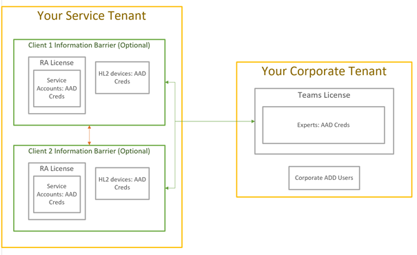

# External cients

This guide is a supplement to the [Cloud Connected Deployment Guide](hololens2-cloud-connected-overview.md). It's used in situations where your organization wants to ship HoloLens 2 devices to an external client's facility for short or long-term use. The external client will log into the HoloLens 2 device using credentials provided by your organization, and use [Remote Assist](/dynamics365/mixed-reality/remote-assist/ra-overview) to contact your experts. This guide provides [general HoloLens 2 deployment recommendations](#general-deployment-recommendations-and-instructions) that are applicable to most external HoloLens 2 deployment scenarios and [common concerns](#common-concerns) that customers have when deploying Remote Assist for external use. 

## Prerequisites

The following infrastructure should be in place per the [Cloud Connected Deployment Guide](hololens2-cloud-connected-overview.md) in order to deploy the HoloLens 2 externally.

- Azure AD Join with MDM Auto Enrollment—MDM-managed (Intune)
- Users sign in with their own corporate account (Azure AD)
    - Single or multiple users per device are supported.

### Remote Assist licensing and requirements

- Azure AD account (required for purchasing the subscription and assigning licenses)
- [Remote Assist subscription](dynamics365/mixed-reality/remote-assist/buy-and-deploy-remote-assist) (or [Remote Assist Trial](/dynamics365/mixed-reality/remote-assist/try-remote-assist))

### Dynamics 365 Remote Assist user

- Remote Assist license
- Network Connectivity

### Microsoft Teams user

- Microsoft Teams or [Teams Freemium](https://products.office.com/microsoft-teams/free)
- Network connectivity

See [Learn more about Remote Assist](/hololens/hololens2-cloud-connected-overview#learn-about-remote-assist).

## General deployment recommendations

We recommend the following for external HoloLens 2 deployment:

1. Use the [latest HoloLens OS release](https://aka.ms/hololens2download) as your baseline build.
1. Assign user-based or device-based licenses:
    1. User-based and device-based licenses both follow the following steps:
        1. [Create a group in AAD and add members](/azure/active-directory/fundamentals/active-directory-groups-create-azure-portal#create-a-basic-group-and-add-members) for HoloLens/RA users.
        1. [Assign device-based or user-based licenses](/azure/active-directory/enterprise-users/licensing-groups-assign#:~:text=In%20this%20article%201%20Assign%20the%20required%20licenses,3%20Check%20for%20license%20problems%20and%20resolve%20them) to this group.
        1. (Optional) You can target groups for MDM policies.

1. Devices should be AAD joined to your tenant, [Auto Enrolled](/hololens/hololens-enroll-mdm#auto-enrollment-in-mdm), and configured through [Autopilot](/hololens/hololens2-autopilot).
    1. Please note that the first user on the device will be the device owner.
    1. Please note that if the device is AAD joined, the user that performed the join is made device owner.
    1. For more, see [Device Owner](/hololens/security-adminless-os#device-owner).
1. [Tenant lock](/hololens/hololens-release-notes#tenantlockdown-csp-and-autopilot) the device so that it can only joined your tenant.
    1. Additional Link: [Tenant lock CSP](/windows/client-management/mdm/tenantlockdown-csp).
1. [Configure Kiosk mode using global assigned access](/hololens/hololens-global-assigned-access-kiosk).
1. We recommend disabling the following (optional) capabilities:
    1. Ability to put the device into developer mode [here](/windows/client-management/mdm/policy-csp-applicationmanagement#applicationmanagement-allowdeveloperunlock).
    1. Ability to connect the HoloLens to a PC to copy date [disable USB](/windows/client-management/mdm/policy-csp-connectivity#connectivity-allowusbconnection).
       > [!NOTE]
        > If you don’t want to disable USB but want the ability to apply a provisioning package to the device using USB, follow the [instructions on how to allow provisioning package installation](/windows/client-management/mdm/policy-csp-security#security-allowaddprovisioningpackage).

1. Use [WDAC](/hololens/windows-defender-application-control-wdac) to allow or block apps on the HoloLens 2 device.
1. Update Remote Assist to the latest version as part of the setup. There are two options to do this:
    1. This can be done by going to Windows **Microsoft Store --> Remote Assist --> and Update App**.
    1. [ApplicationManagement/AllowAppStoreAutoUpdate](/windows/client-management/mdm/policy-csp-applicationmanagement#applicationmanagement-allowappstoreautoupdate) - which allows automatic app updates - is enabled by default. Keep the device plugged in to receive updates.
1. [Disable all settings pages](/hololens/settings-uri-list) except the network settings to allow users to connect to guest networks at client sites.
1. [Manage HoloLens Updates](/hololens/hololens-updates)
    1. Option to [control OS updates](/mem/intune/protect/windows-update-for-business-configure#create-and-assign-update-rings) or allow to flow freely.
1. [Common Device Restrictions](/hololens/hololens-common-device-restrictions).

<mark>  We should add a verb here.. and also a few lines below this list outlining what they achieve by going through all 11 of these "steps".  This way it reads as an actionable list with a clear cut outcome. </mark>

## Common concerns

- [Ensuring clients cannot communicate with one another](#ensure-that-external-clients-cannot-communicate-with-one-another)
- [Ensuring clients cannot access company resources](#ensure-that-clients-do-not-have-access-to-company-resources)
- [Hiding or restricting apps](#hidden-or-restricted-apps)
- [Managing passwords for your clients](#password-management-for-your-clients) 
- [Ensuring clients cannot access chat history](#ensure-that-clients-do-not-have-access-to-chat-history)

### Ensure that external clients cannot communicate with one another

Remote Assist HoloLens to HoloLens calls are not supported. Clients will be able to search for, but can't communicate with each other. [Information barriers in Microsoft 365](/microsoft-365/compliance/information-barriers) can further restrict with whom a client can search and call. Another option is to use [Microsoft Teams scoped Directory Search](/MicrosoftTeams/teams-scoped-directory-search).

 > [!NOTE]
> Since single sign on is enabled, it is important to disable the browser using [Windows Defender Application Control (WDAC)](/hololens/windows-defender-application-control-wdac). If an external client opens the browser and uses the web version of Teams, the client will have access to your chat history.

### Ensure that clients do not have access to company resources

There are two options to consider.

The first option is a multi-layer approach:

1. Only assign licenses that the user requires. If you do not assign OneDrive, Outlook, SharePoint, Yammer, etc. to the user, he/she will not have access to those resources. The only licenses the users will need is Remote Assist, Intune, and AAD licenses to begin.
1. Block apps (such as email) that you don’t want clients to access (See [Apps are hidden or restricted](#apps are hidden or restricted)).
1. Do NOT share usernames nor password with clients. To log into the HoloLens 2, an email and numerical PIN is required.

The second option is to create a separate tenant that hosts clients (see Image 1.1).

**Image 1.1**

### Hidden or restricted apps

[Kiosk Mode](/hololens/hololens-kiosk) and/or [WDAC (Windows Defender Application Control)](/hololens/windows-efender-application-control-wdac) are options for hiding and/or restricting applications.

### Password management for your clients

1. Remove password expiration. However, this increases the chance that an account will be compromised. NIST password recommendation is change passwords every 30-90 days.
1. Extend the password expiration for HoloLens 2 devices to exceed 90 days.
1. The devices should be returned to your organization to change the passwords. However, this can cause issues if the devices are expected to be in the client's plant for 90+ days.  
1. For devices that are sent to multiple clients, reset passwords before shipping the device to clients.

### Ensure that clients do not have access to chat history

Remote Assist clears chat history after each session. However, chat history will be available for Microsoft Teams users.

> [!NOTE]
> Since single sign on is enabled, it is important to disable the browser using [**WDAC**](/hololens/windows-defender-application-control-wdac[Windows Defender Application Control (WDAC)](/hololens/windows-defender-application-control-wdac).  If a external client opens the browser and uses the web version of Teams, the client will have access to call/chat history.

