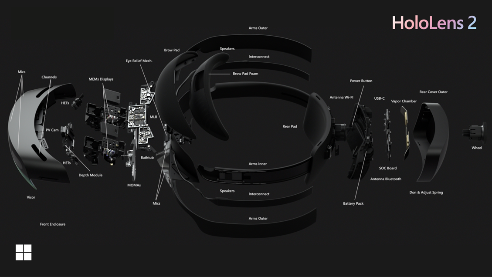
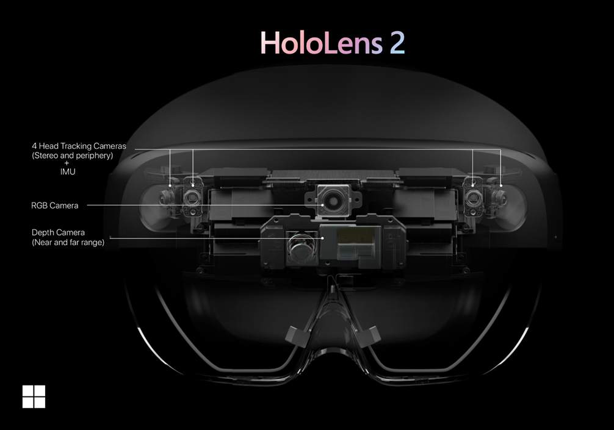
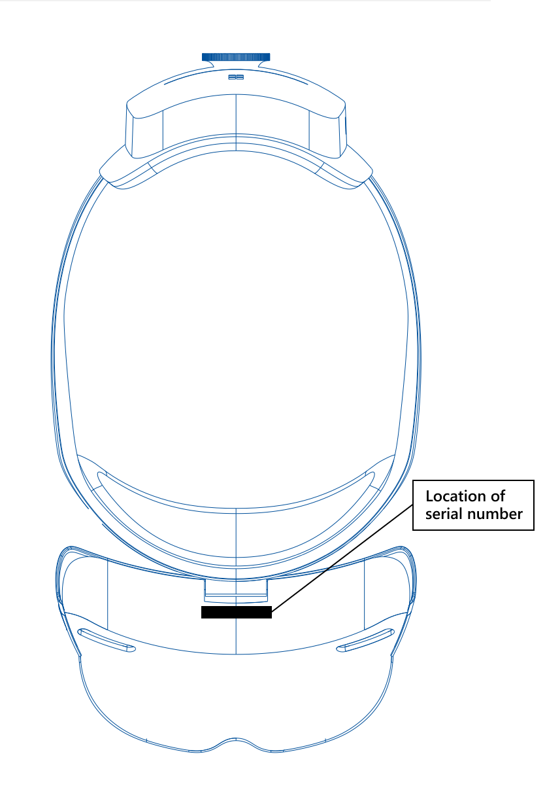

# HoloLens 2 hardware

Microsoft HoloLens 2 is an untethered holographic computer.  It refines the holographic computing journey started by HoloLens (1st gen) to provide a more comfortable and immersive experience paired with more options for collaborating in mixed reality.

## HoloLens components

- **Visor**. Contains the HoloLens sensors and displays. You can rotate the visor up while wearing the HoloLens.
- **Headband**. To put the HoloLens on, use the adjustment wheel to expand the headband. With the HoloLens in place, tighten the adjustment wheel by turning to the right, until the headband is comfortable.
- **Brightness buttons**. When wearing the HoloLens, the brightness buttons are on the left side of the visor near your temple.
- **Volume buttons**. When wearing the HoloLens, the volume buttons are on the right side of the visor near your temple.
- **Power button**. When wearing the HoloLens, the power button is located on the right side of the rear outer cover.
- **USB-C port**. When wearing the HoloLens, the USB-C port is located on the right side of the rear outer cover below the Power button.

## In the box

- **Brow pad**. You can remove and replace the brow pad, as needed.
- **Overhead strap**. When you're wearing the HoloLens while moving around, use the overhead strap to help keep the device in place. When wearing the HoloLens for extended periods, the overhead strap may make the device more comfortable to wear.
- **USB-C cable**. Use the USB-C cable to connect your HoloLens to the power supply for charging, or to connect your HoloLens to your computer.
- **Power supply**. Plugs into a power outlet.
- **Microfiber cloth**. Use to clean your HoloLens visor.

### Power Supply details

The power supply and the USB cable that come with the device are the best supported mechanism for charging. The power supply is an 18W charger.  Its supplies 9V at 2A.

Charging rate and speed may vary depending on the environment in which the device is running.

In order to maintain/advance Internal Battery Charge Percentage while the device is on, it must be connected minimum to a 15W charger.

## Device specifications

### Display

|   |   |
| - | - |
| Optics | See-through holographic lenses (waveguides) |
| Holographic resolution | 2k 3:2 light engines |
| Holographic density | >2.5k radiants (light points per radian) |
| Eye-based rendering | Display optimization for 3D eye position |

### Sensors

|   |   |
| - | - |
| Head tracking | 4 visible light cameras |
| Eye tracking | 2 Infrared (IR) cameras |
| Depth | 1-MP Time-of-Flight depth sensor |
| Inertial measurement unit (IMU) | Accelerometer, gyroscope, magnetometer |
| Camera | 8-MP stills, 1080p30 video |

> [!NOTE]
> Do not cover any of the sensors that are called out in the picture. The head tracking cameras have a very wide FOV, nothing should be around them in addition to not covering them.

### Audio and speech

|   |   |
| - | - |
| Microphone array | 5 channels |
| Speakers | Built in spatial sound |

### Compute and connectivity

|   |   |
| - | - |
| System on chip | Qualcomm Snapdragon 850 Compute Platform [details](https://www.qualcomm.com/products/snapdragon-850-mobile-compute-platform) |
| Holographic processing unit | Second-generation custom-built holographic processing unit |
| Memory | 4-GB LPDDR4x system DRAM |
| Storage | 64-GB UFS 2.1 |
| WiFi | 802.11ac 2x2 |
| Bluetooth | 5.0 |
| USB | USB Type-C |

### Power

|   |   |
| - | - |
| Battery Life | 2-3 hours of active use. Up to 2 weeks of standby time. |
| Battery technology | [Lithium batteries](https://www.microsoft.com/download/details.aspx?id=43388) |
| Charging behavior | Fully functional when charging |
| Cooling type | Passively cooled (no fans) |
| Power draw | In order to maintain/advance Internal Battery Charge Percentage while the device is on, it must be connected minimum to a 15W charger. |

### Fit

|   |   |
| - | - |
| Sizing | Single size with adjustable band.  Fits over eyeglasses |
| Weight | 566 grams |

## Device capabilities

### Human understanding

|   |   |
| - | - |
| Hand tracking | Two-handed fully articulated model, direct manipulation |
| Eye tracking | Real-time tracking |
| Voice | Command and control on-device; Cortana natural language with internet connectivity |

### Environment understanding

|   |   |
| - | - |
| Six Degrees of Freedom (6DoF) tracking | World-scale positional tracking |
| Spatial mapping | Real-time environment mesh |
| Mixed reality capture | Mixed hologram and physical environment photos and videos |

## Pre-installed software

|   |   |
| - | - |
| Windows Holographic Operating System | With Windows Holographic, Windows 10 users will be able to use some of their apps and games in a mixed reality environment via the HoloLens 2.
| 3D Viewer | [3D Viewer](https://www.microsoft.com/p/3d-viewer/9nblggh42ths?activetab=pivot:overviewtab) lets you easily view 3D models and animations in real time.|
| Cortana | [Cortana](https://www.microsoft.com/p/cortana/9nffx4szz23l?activetab=pivot:overviewtab), your personal productivity assistant, helps you stay on top of what matters and save time finding what you need.  |
| Dynamics 365 Guides |  [Dynamics 365 Guides](https://www.microsoft.com/p/microsoft-dynamics-365-guides/9n038fb42kkb?activetab=pivot:overviewtab) will help employees learn new skills faster on HoloLens devices. |
| Dynamics 365 Remote Assist | [Microsoft Dynamics 365 Remote Assist](https://www.microsoft.com/p/microsoft-dynamics-365-remote-assist/9p77qgw10k9m?activetab=pivot:overviewtab) empowers technicians to collaborate and solve problems with remote collaborators using Microsoft Teams or Dynamics 365 Remote Assist.  |
| Feedback Hub | [Feedback Hub](https://www.microsoft.com/p/feedback-hub/9nblggh4r32n?activetab=pivot:overviewtab) lets you provide feedback about Windows and apps by sharing your suggestions or problems.  |
| File Explorer | File Explorer provides a graphical user interface for accessing the file systems. |
| Mail and Calendar | The [Mail and Calendar](https://www.microsoft.com/p/mail-and-calendar/9wzdncrfhvqm#activetab=pivot:overviewtab) apps help you stay up to date on your email, manage your schedule and stay in touch with your contacts. |  
| Microsoft Edge | Microsoft Edge gives you world-class performance with more privacy, more productivity, and more value while you browse. |
| Microsoft Store | The [Microsoft Store](https://www.microsoft.com) is your go-to source for apps and games that work with HoloLens.|
| Movies & TV | [Movies & TV](https://www.microsoft.com/p/movies-tv/9wzdncrfj3p2?activetab=pivot:overviewtab) brings you the latest entertainment in one simple, fast, and elegant app. |
| OneDrive | [OneDrive](https://www.microsoft.com/p/onedrive/9wzdncrfj1p3?activetab=pivot:overviewtab) lets you access and edit your files from all your devices anywhere.  |
| Photos| [Photos](https://www.microsoft.com/p/microsoft-photos/9wzdncrfjbh4?activetab=pivot:overviewtab) lets you view and edit your photos and videos, make movies and create albums.  |
| Settings | The Settings app is the place where you customize how Windows Holographic works in detail.  |
| Tips | [Tips](https://www.microsoft.com/p/microsoft-tips/9wzdncrdtbjj?activetab=pivot:overviewtab) lets you master surprising and lesser-known things you can do in Windows Holographic. |

## Device certifications

### Safety

* [Product Safety](https://support.microsoft.com/en-us/help/4023454/safety-information)
* [Product Safety Warnings and Instructions](https://support.microsoft.com/en-us/help/4558037/product-safety-warnings-and-instructions)
* Eye safety: HoloLens 2 has been tested and conforms to the basic impact protection requirements of ANSI Z87.1, CSA Z94.3 and EN 166.
* [SAR Information](https://support.microsoft.com/help/12673/mobile-devices-sar-information)

### Regulatory information
[HoloLens Regulatory](https://support.microsoft.com/en-us/help/13761/hololens-regulatory-information): Includes information on temperature, disposal, radio and TV interference, and more.

## Package Dimensions

|      Measurement               |      Units metric     |      Units imperial     |
|--------------------------------|-----------------------|-------------------------|
|     Unit Length                |     378.97 mm          |     14.920 inches       |
|     Unit Width                 |     247.90 mm          |     9.760 inches        |
|     Unit Depth                 |     163.07 mm          |     6.420 inches        |
|     Unit Weight                |     2.878 kg           |     6.344 lbs           |
|     Exterior Shipper Length    |     446.00 mm          |     17.559 inches       |
|     Exterior Shipper Width     |     257.99 mm          |     10.157 inches       |
|     Exterior Shipper Depth     |     172.01 mm          |     6.772 inches        |
|     Exterior Shipper Weight    |     3.284 kg           |     7.240 lbs           |

> [!NOTE]
> - Unit: The black, retail-style box HoloLens 2 is sold in.
> - Exterior Shipper: The protective shipping packaging around Unit.

## Finding the Serial number

The serial number for HoloLens 2 devices is printed underneath the visor.

1. Lift the visor of the device up.
1. Look near the brow pad.
1. You can find the serial number located close to the hinge.

The serial number can also be found via a connected PC:

1. Plug in the device
1. Navigate to **This PC** in file explorer
1. Right Click and select **Properties** of the HoloLens device
1. This will display the series number of the device, as shown in the screenshot below.

## Next step

> [!div class="nextstepaction"]
> [Set up and start your HoloLens 2](hololens2-setup.md)
