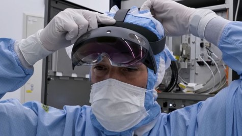

# HoloLens 2 - Industrial Edition FAQ

## HoloLens 2 Industrial Edition Benefits

### What benefits does HoloLens 2 Industrial Edition 2 include?

The HoloLens 2 Industrial Edition is designed to solve challenges for industrial customers in clean room environments and assist with operational safety in those environments. It is designed and tested for clean room compliance, intrinsic safety certifications, and backed by an even more robust support program.

By using the HoloLens 2 Industrial Edition in these environments there will be significant reduction in travel in and out of the clean room areas, and reduction of general labor costs. Being able to have a small footprint physically inside the clean room and yet still have access to any / all documentation and levels of expertise will reduce labor costs.

### What clean room environments does HoloLens 2 Industrial Edition support?

HoloLens 2 Industrial Edition supports highly-controlled environments such as clean room environments ISO class 6 through ISO Class 8.

For more information, please read more on [ISO standard 14644-1](https://www.iso.org/standard/53394.html) (Airborne Particulate Cleanliness Classes in Cleanrooms and Clean Zones).

### Does HoloLens 2 Industrial Edition meet requirements for Intrinsic Safety?

 The HoloLens 2 Industrial Edition features UL Class I, Dev 2 certified for use in environments where flammable gases, vapors or liquids may exist.

For more information read about [UL certifications](https://www.ul.com/services/ul-and-c-ul-hazardous-areas-certification-north-america?csrf-token=CIwNZNlR4XbisJF39I8yWnWX9wX4WFoz&amp;Search=UL+Class+I%2C+Dev+2+&amp;search-submit=Search).

### Can the device be used in semiconductor and pharmaceutical environments?

Yes. The HoloLens 2 Industrial Edition is designed with these environmental considerations, with the certifications for clean rooms and operational safety in mind this HoloLens 2 edition is ready to use in these environments.

### What is the HoloLens 2 Industrial Edition warranty?

The HoloLens 2 Industrial Edition features a 2-year warranty and a rapid replacement program.

Visit this page to find [HoloLens warranty information](https://support.microsoft.com/warranty).

### What&#39;s the rapid replacement program?

In addition to the 2-year warranty, HoloLens 2 Industrial Edition includes the rapid replacement program enabling customers to receive a replacement device overnight or expedited shipping (faster of the available options) before a defective device is received by Microsoft. To start a replacement please [contact support](https://aka.ms/hololenssupport).

> [!NOTE]
> Support will need a clear description of any defect, and to confirm the device cannot be recovered to a working state before it is replaced.

### Can I purchase replacement parts for HoloLens 2 Industrial Edition?

Replacement parts and refurbishments are not supported for the HoloLens 2 Industrial Edition. If you find yourself in need of a replacement, use our rapid replacement program for the HoloLens 2 Industrial Edition.

### Is the carrying case clean room approved?

The carrying case is made of a porous material and should not be used in clean rooms.

## Cleaning the Industrial Edition

### Can I use the same cleaning materials for HoloLens 2 Industrial Edition as the other editions?

The HoloLens 2 Industrial Edition can be cleaned by a solution of &quot;70%&quot; isopropyl alcohol and water to clean the hard surfaces of the device, including the visor, brow pad, and head strap. For more information, see the [HoloLens 2 cleaning FAQ](https://docs.microsoft.com/hololens/hololens2-maintenance).

### How do I clean HoloLens 2 Industrial Edition?

Much of the advice for cleaning the standard HoloLens 2 applies to the HoloLens 2 Industrial Edition. Review the [HoloLens 2 cleaning FAQ](https://docs.microsoft.com/hololens/hololens2-maintenance).

### How should I hold HoloLens 2 Industrial Edition when cleaning it?

Firmly from the brow pad. By holding the HoloLens 2 from the brow pad you put the least amount of pressure on the arms of the device and ensure its longevity.

## General questions

### What operating system does the HoloLens 2 Industrial Edition have?

The Industrial Edition has the same OS as all other HoloLens 2 editions. For more information on HoloLens OS updates [read our release notes](https://docs.microsoft.comhololens/hololens-release-notes).

### What apps can run-on the HoloLens 2 Industrial Edition?

HoloLens 2 Industrial Edition supports both 1st and 3rd party apps, with a selection of in-box enterprise ready apps. Line of business apps can be deployed to devices utilizing the several  [app deployment methods](https://docs.microsoft.com/hololens/app-deploy-overview).

### Can I upgrade from HoloLens 2 to HoloLens 2 Industrial Edition?

We do not offer upgrades from HoloLens 2 to HoloLens 2 Industrial Edition.
