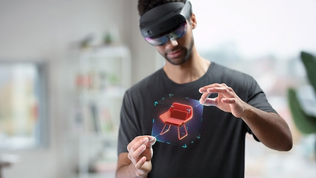

# HoloLens 2 Development Edition

Start building for mixed reality with this offer that combines HoloLens 2 with free trials of Unity software and Azure credits for cloud services. Learn how to go beyond the basics and start developing for mixed reality.

## Learn about the Development Edition

> [!NOTE]
> The Development Edition is not permitted to be deployed with a commercially distributed solution. The Development Edition is permitted to be deployed in the aiding of the development and/or testing of applications in a commercial setting.  

The HoloLens 2 Development Edition includes a HoloLens 2, $500 in Azure credits, a 3-month Unity Pro Trial, and a 3-month PiXYZ plugin trial:

| Bundle feature | Description |
|---|---|
|  [Unity](https://unity.com/) | A real-time 3D development platform.   |
|  [Pixyz plug-in for Unity](https://www.pixyz-software.com/plugin/) | A bridge for connecting the engineering &amp; CAD worlds with the development world.   |
| [$500 in Azure credits for Azure services](https://azure.microsoft.com/resources/) | The Azure credits included with the HoloLens 2 Development Edition are to quickly get started building and testing mixed reality applications on Azure. |

## Redeem your credits

### Unity
You'll have received a unique code. Directions to redeem Unity Pro trial:
1. Visit [id.unity.com](http://id.unity.com/)
1. Sign in with your Unity ID or create one
1. Click **Redeem a product code**
1. Enter product code, and click **Redeem a product code**

More details on [How to activate a Unity license](https://support.unity3d.com/hc/articles/211438683-How-do-I-activate-my-license-). Contact [Unity Support](https://support.unity3d.com/hc) for help as needed.  

### Pixyz
You'll have received a unique code. Directions to redeem Pixyz Plugin trial:
1. Visit [id.unity.com](http://id.unity.com/)
1. Click **Redeem a product code**
1. Enter your Pixyz Plugin product code, and click **Redeem a product code**

More details on how to [Redeem your Pixyz license.](https://www.pixyz-software.com/documentations/html/2020.1/review/TrialLicense.html) Contact [Pixyz Support](https://www.pixyz-software.com/support/) for help as needed.

### Azure
Here are some common [Azure products for Mixed Reality](https://azure.microsoft.com/topic/mixed-reality/) you may wish you redeem your Azure credit for.
How to redeem Azure credits:
To redeem your $500 Azure credits, redeem your Azure Pass promo code and activate your subscription. [Learn more.](hololens2-development-edition-faq.yml#how-can-i-redeem-my--500-azure-credit-)

- [Learn how Azure Spatial Anchors can help you build apps that map, share, and persist 3D content](https://azure.microsoft.com/services/spatial-anchors/)
- [Learn how Azure Remote Rendering can render high-quality, interactive 3D content, and stream it to your devices in real time](https://azure.microsoft.com/services/remote-rendering/)

## Get started developing

Choose your engine, download your tools, and dust off your keyboard. Welcome to the Mixed Reality ecosystem - it's time to create.

|     Checkpoint                              |     Outcome                                                                                                                    |
|---------------------------------------------|---------------------------------------------------------------------------------------------------------------------------------|
|     [Start Designing and Prototyping](/windows/mixed-reality/design/design)         |     Start your adventure into designing Mixed Reality applications across core concepts, interaction models, and UX elements.     |
|     [Start Developing for Mixed Reality](/windows/mixed-reality/develop/development?tabs=unity)    |     Choose your engine, download your tools, add core building blocks, and start building today.                                  |
|     [Explore Azure Cloud Services](/windows/mixed-reality/develop/mixed-reality-cloud-services)            |     Build compelling immersive experiences with Azure Remote Rendering and Azure Spatial Anchors.                                 |

## Developer Edition additional resources

- [HoloLens 2 Development Edition FAQs](hololens2-development-edition-faq.md)
- [Make sure to install the tools for HoloLens development.](/windows/mixed-reality/develop/install-the-tools?tabs=unity)
- [Learn about developing for HoloLens 2 with Unity](/windows/mixed-reality/develop/unity/unity-development-overview?tabs=mrtk%2Carr%2Chl2).
- [Learn about how to combine MRTK with Unity](/windows/mixed-reality/develop/unity/mrtk-getting-started).
- [Learn how to deploy your built apps](app-deploy-overview.md).
- [Explore the all the possibilities for Mixed Reality](/windows/mixed-reality/).
- [Learn about developing for HoloLens 2 with Unreal.](/windows/mixed-reality/develop/unreal/unreal-development-overview?tabs=mrtk%2Casa)
- [Reach out to your fellow developers on our HoloDevelopers Slack Channel](https://holodevelopersslack.azurewebsites.net/).

## Next steps

1. Start interacting right away with Mixed Reality and navigating Windows 10 on your HoloLens - check out the **Tips** app for hands-on tutorials for hand interactions. Use the start gesture to go to Start or say "Go to Start" and select Tips.
1. Click below to continue reading about getting around HoloLens 2.

> [!div class="nextstepaction"]
> [Get started with HoloLens 2](hololens2-basic-usage.md)
