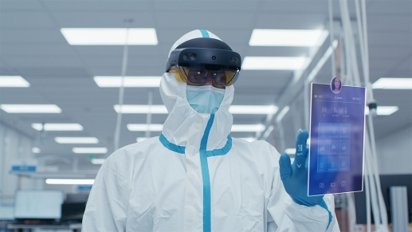

# HoloLens 2 Industrial Edition

Designed, built, and tested to support clean room environments with standards ranging from ISO Class 6 through ISO Class 8, the HoloLens 2 Industrial Edition is UL Class I, Division 2 certified and is supported with a 2-year warranty and a rapid replacement program.

## Learn about HoloLens 2 Industrial Edition

The HoloLens 2 Industrial Edition has been enhanced and redesigned with new materials and certifications to support a broader set of industrial environments, including:

- **Clean room environments:** The HoloLens 2 Industrial Edition supports with standards ranging from ISO 14644-1 Class 5 clean rooms where the quantity of foreign particles is limited and restricted, and objects in these spaces have limits on shedding, outgassing, and contaminant retention.
- **Hazardous Locations:** The HoloLens 2 Industrial Edition supports environments where flammable gasses, vapors, or liquids exist but are generally not present in ignitable concentrations during normal operations and includes a UL Class I, Division 2-Groups A, B, C, and D HAZLOC certification.

In addition to the upgraded device, HoloLens 2 Industrial Edition features a 2-year warranty & rapid replacement program.

Review the [HoloLens 2 Industrial Edition FAQ](hololens2-industrial-edition-faq.md).

## Cleaning and Handling HoloLens 2

The HoloLens 2 Industrial Edition can be cleaned by a solution of "70%" isopropyl alcohol and water to clean the hard surfaces of the device, including the visor, brow pad, and head strap. For more information, see the [HoloLens 2 cleaning FAQ](/hololens/hololens2-maintenance).

## Next steps

1. Start interacting right away with Mixed Reality and navigating Windows 10 on your HoloLens - check out the **Tips** app for hands-on tutorials for hand interactions. Use the start gesture to go to Start or say "Go to Start" and select Tips.
1. Click below to continue reading about getting around HoloLens 2.

> [!div class="nextstepaction"]
> [Get started with HoloLens 2](hololens2-basic-usage.md)