# [Intune UI Single app](#tab/uisak)

Microsoft Intune kiosk template - Single App Kiosk.

1. Create a configuration profile   
<kbd>
    
</kbd>

 

2. Choose kiosk template   
<kbd>
    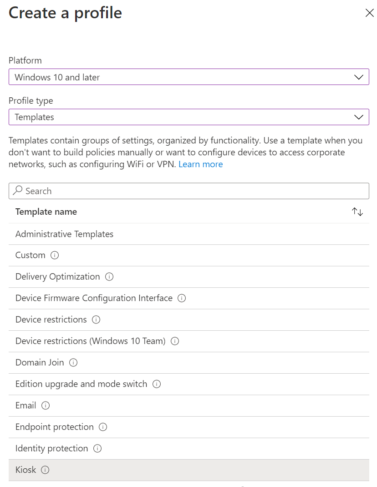
</kbd>

 

3. Choose whether single app or multiple app kiosk and also choose kind of user targeting for kiosk mode   
<kbd>
    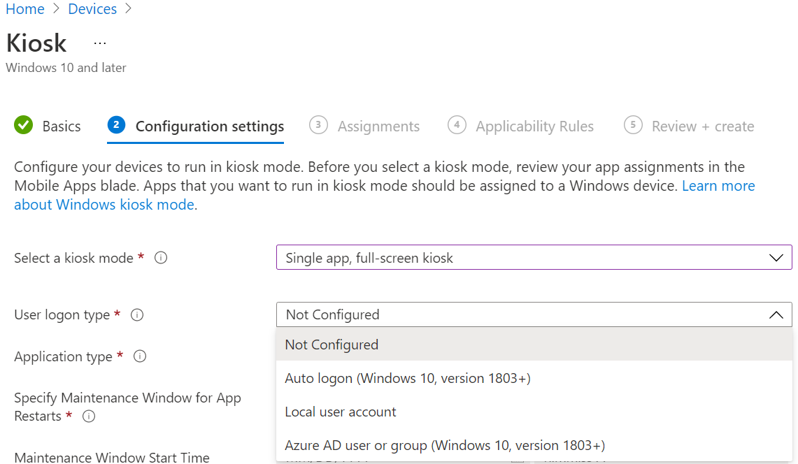
</kbd>

 

4. Choose the app to run in kiosk mode   
<kbd>
    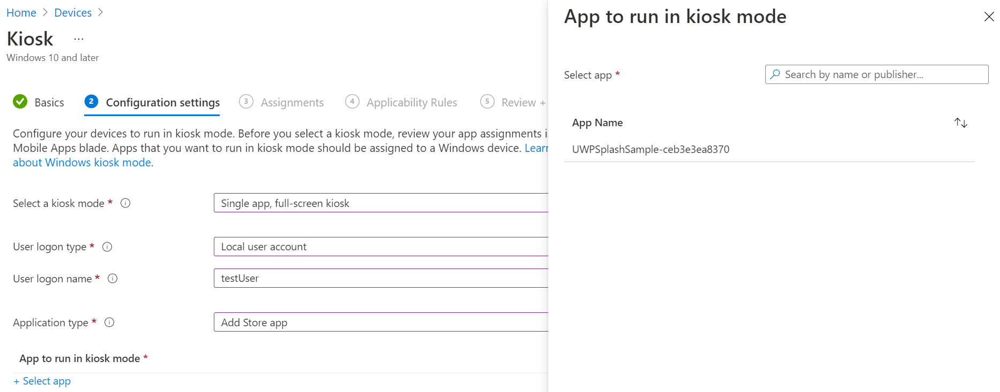
</kbd>

 

5. Leave rest of the options as is   
<kbd>
    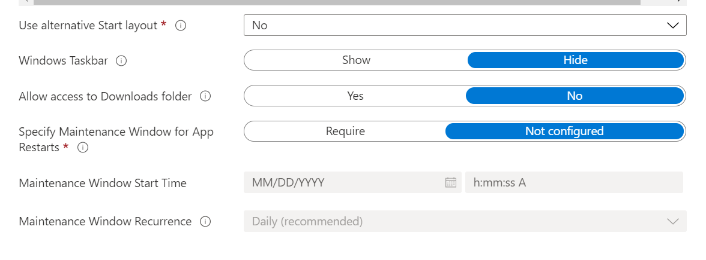
</kbd>

 

6. Choose which groups / devices or users this configuration profile should get assigned to   
<kbd>
    
</kbd>

7. Review and create to save configuration profile
8. Perform MDM sync starting from either device or Intune to apply configuration to device. [Sync devices from Intune](/mem/intune/remote-actions/device-sync#sync-a-device) or on device via **Settings -> Accounts -> Work or school ->** select the connected account **-> Info -> Sync**
9. Sign in as the target user to experience kiosk.

# [Intune UI Multi app](#tab/uimak)

Microsoft Intune kiosk template - Multi App Kiosk.

1. Create a configuration profile   
<kbd>
    
</kbd>

 

2. Choose kiosk template   
<kbd>
    
</kbd>

 

3. Choose whether single app or multiple app kiosk and also choose kind of user targeting for kiosk mode   
<kbd>
    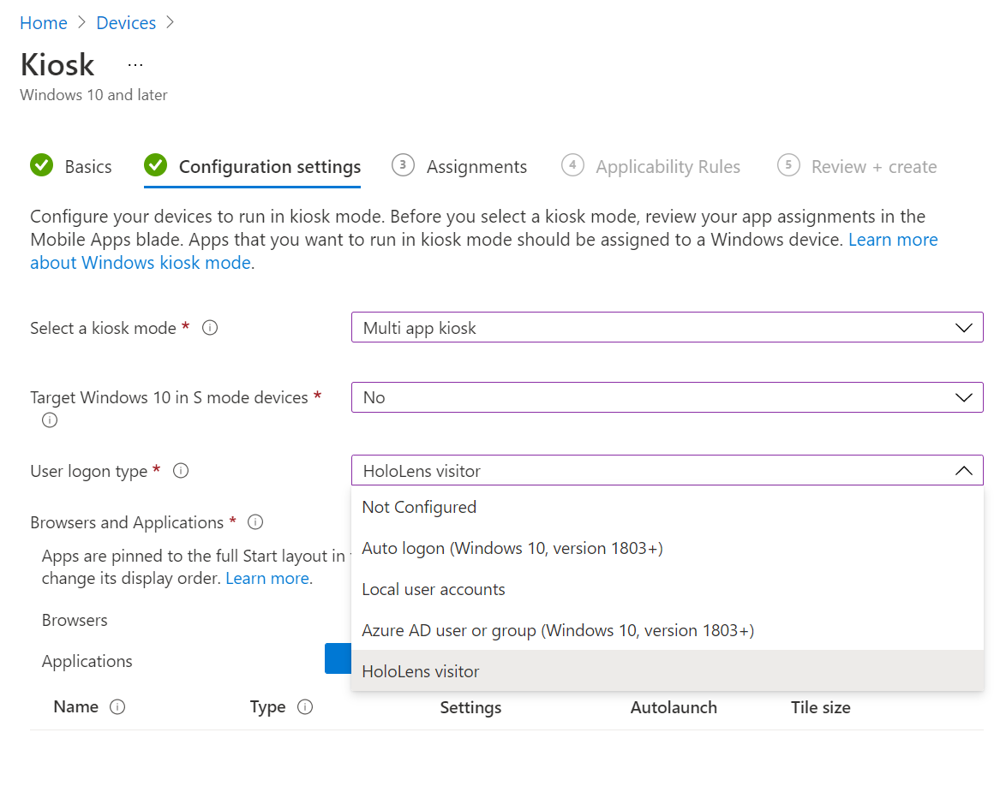
</kbd>

 

4. Choose the app(s) to run in kiosk mode   
<kbd>
    
</kbd>

 

5. Leave rest of the options as is   
<kbd>
    
</kbd>

 

6. Choose which groups / devices or users this configuration profile should get assigned to   
<kbd>
    
</kbd>

 

7. Review and create to save configuration profile
8. Perform MDM sync starting from either device or Intune to apply configuration to device. [Sync devices from Intune](/mem/intune/remote-actions/device-sync#sync-a-device) or on device via **Settings -> Accounts -> Work or school ->** select the connected account **-> Info -> Sync**
9. Sign in as the target user to experience kiosk.

# [Intune Custom profile](#tab/intunecustom)

1. Create a custom configuration profile  
<kbd>
    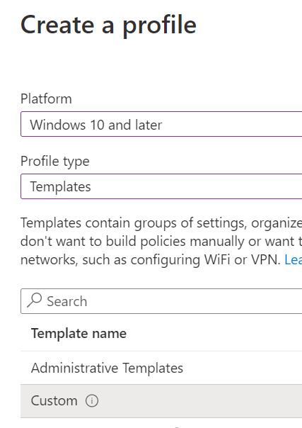
</kbd>

 

2. Specify name of custom configuration profile and click on “Add” in “Configuration settings” section to add OMA-URI settings.
<kbd>
    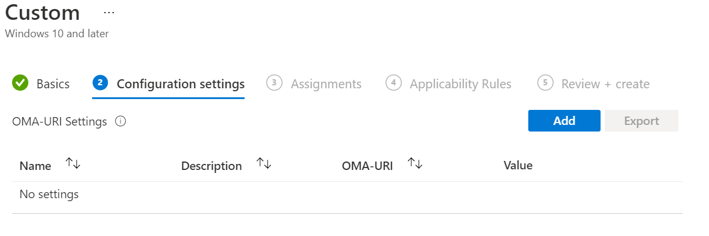
</kbd>

 

3. Specify name of OMA-URI settings.

    1. In OMA-URI textbox, enter **./Device/Vendor/MSFT/AssignedAccess/Configuration**
    1. Choose Data type as **String**.
    1. In value textbox, copy-paste the assigned access configuration xml (see reference links for examples based on your scenario and update as needed before copy-pasting).
    1. Select the save button to save the setting and configuration.

<kbd>
    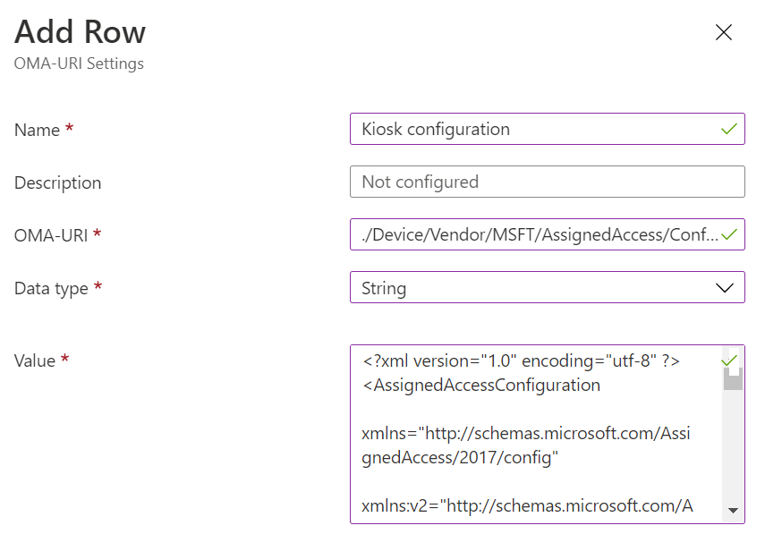
</kbd>

 

4. Choose which groups / devices or users this configuration profile should get assigned to.

<kbd>
    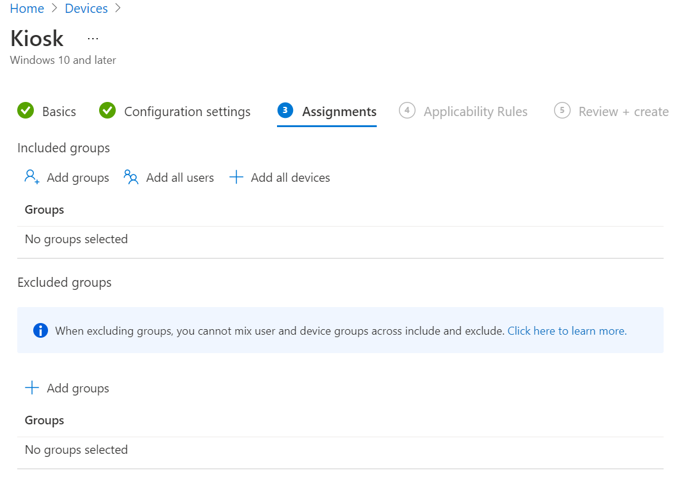
</kbd>

 

5. Review and create to save configuration profile.
1. Perform MDM sync starting from either device or Intune to apply configuration to device. [Sync devices from Intune](/mem/intune/remote-actions/device-sync#sync-a-device) or on device via **Settings -> Accounts -> Work or school ->** select the connected account **-> Info -> Sync**
1. Sign in as the target user to experience kiosk.

# [Provisioning package multi app kiosk](#tab/ppkgmak)

Provisioning package multi app kiosk

1. Open [Windows Configuration Designer](https://www.microsoft.com/store/apps/9nblggh4tx22).

1. On the Start page select **Provision HoloLens devices.**

<kbd>
    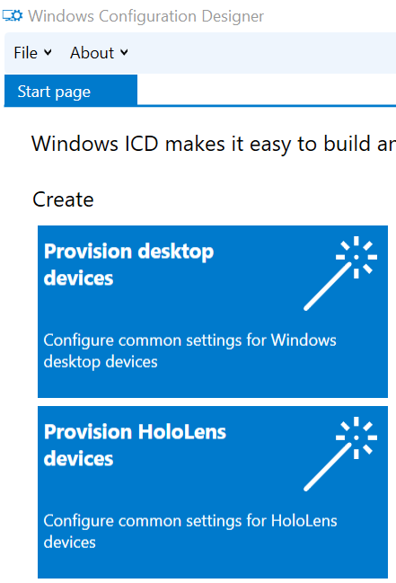
</kbd>

 

3. Select **Provision HoloLens 2 devices,** then select next.

<kbd>
    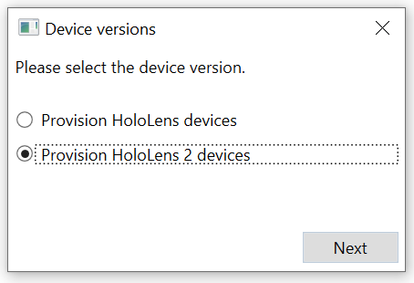
</kbd>

 

4. Name your project. Optionally write a description. Select **Finish** to proceed.

5. In the bottom left of the screen, select **Switch to advanced editor.** Confirm switching to the advanced editor by selecting **Yes.**

<kbd>
    
</kbd>

 

6. On the left hand side, expand Runtime settings -\&gt; AssignedAccess and select **MultiAppAssignedAccess**.

<kbd>
    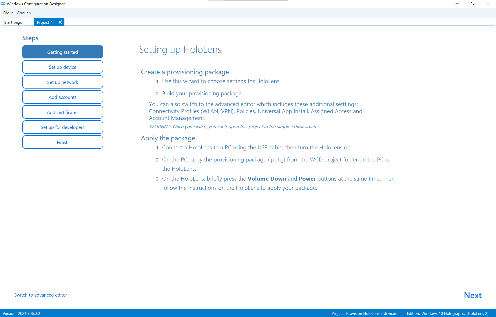
</kbd>

 

7. Select the **Browse…** button to open the file explorer. And select the your configured Kiosk xml file.

8. Select **Export** , then **Provisioning Package**.

<kbd>
    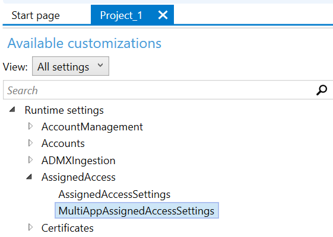
</kbd>

 

9. Change owner type to **IT Admin**.

<kbd>
    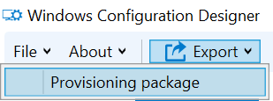
</kbd>

 

10. Select **Next** three times. Then select **Build**.

11. After your provisioning package builds, open the Output location folder. The .ppkg file is your provision package. Optional step: Save your project.

12. Now you can apply your provisioning package. You can either [apply a provisioning package to HoloLens during setup](../hololens/hololens-provisioning.md#apply-a-provisioning-package-to-hololens-during-setup) or [apply a provisioning package to HoloLens after setup](../hololens/hololens-provisioning.md#applyremove-a-provisioning-package-to-hololens-after-setup).

13. Sign in as the target user to experience kiosk.