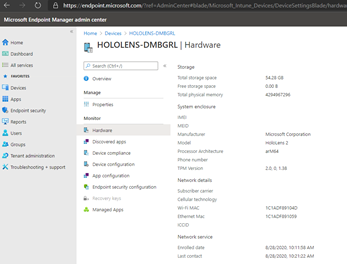
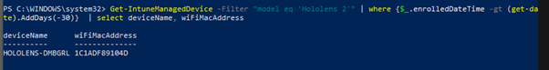

# Enterprise Enrollment of HoloLens Devices in MAC address restricted Wi-Fi Environment

This document will describe a common scenario we have identified within customer environments where the Wi-Fi is restricted by MAC addresses, or certificates are required to join Wireless networks.

## Example Scenario

Many customers in secure environments have restrictions on their Wireless or wired networks which will only allow approved devices (based on MAC Addresses) to connect successfully (either with MAC Address filtering on a Wireless Access Point or on a DHCP server). Additionally, some Wireless networks can be protected with PEAP, which requires that a certificate be applied to the device prior to being able to successfully authenticate the Wireless network.

Two key issues can arise with HoloLens devices, which can cause delays and manual work in joining the HoloLens Devices to the network.

- The Wireless PEAP certificate must be applied to the device prior to the device successfully joining the wireless network.
- The MAC Address of the HoloLens Wi-Fi adaptor must be registered.

The key challenges to this are:

1. The MAC Address can currently only be identified from the &quot;Settings&quot; app on the device, or from Intune after a successful Intune enrollment.
2. Without the MAC address, the device cannot join the Wi-Fi Network to begin enrollment.
3. Manual Solutions to these challenges require technician involvement with the devices.

## Solutions

There are a number of ways to improve this situation, depending on the infrastructure available within the environment.

| Solution | Benefits | Requirements |
| --- | --- | --- |
| Provisioning Package with Ethernet Adaptor | Improves OOBE experience and allows for a quicker technician experience. | HoloLens compatible USB C HubTechnician will still need to interact with the device for MAC Capture and OOBE finalisation |
| Autopilot with Intune Registration over Ethernet | Single Step connection and registration of the device to the customer environmentMAC capture can be completed without interacting with the device | Intune enabled for the customer AAD TenantHoloLens Compatible USB-C network adaptor |
| Automated reporting of MAC Addresses | When devices have been registered within the Intune Tenant, Script the reporting of the MAC address to the technician. | Intune Powershell Commandlets |

## Provisioning Package with Ethernet Adaptor

**If the wired network is also subject to MAC restrictions, then the MAC address of the USB-C Ethernet adaptor / Hub will need to be pre-approved. Care should be taken with this hub as it will allow access to the network from other devices.**

### Requirements

- Wired network port with access to the customer network
- HoloLens Compatible USB-C Hub containing an Ethernet adaptor – Any hub that doesn&#39;t require any additional drivers or application installs should be suitable.
- Provisioning Package containing:
  - Containing Wireless Network information and Certificate
  - Optionally containing enrollment information for the Organisation&#39;s Azure AD
  - Containing any other required provisioning settings

### Process

**The Process may vary depending on the software level of the device. If the device has the May 2004 update, follow the steps below.**

1. Place the provisioning package onto the root of a USB stick, and plug into the Hub.
2. Connect Ethernet cable to the hub.
3. Connect USB-C hub to HoloLens device.
4. Turn on HoloLens Device and wear the device.
5. Press the Volume Down and Power button to apply the Provisioning Package.
6. The technician can now follow OOBE, and when complete, open the Settings App, and retrieve the MAC Address of the device.

**If the device does not have the 2004 update, follow the steps below.**

1. Turn on the HoloLens Device, and plug the device into a PC.
2. Press Volume Down and Power, and the device should show up on the PC as a file storage device.
3. Copy the Provisioning Package to the Device
4. Connect Ethernet cable to the hub.
5. Connect USB-C hub to HoloLens device.
6. Wear the device.
7. Press the Volume Down and Power button to apply the Provisioning Package.
8. The technician can now follow OOBE, and when complete, open the Settings App, and retrieve the MAC Address of the device.

### Benefits

This will allow a &quot;Single touch&quot; of the device, to apply the correct provisioning package and gather the MAC address of the device. [Provisioning packages can be created following the guidance here.](https://docs.microsoft.com/hololens/hololens-provisioning)

## Autopilot with Intune Enrolment

### Requirements

- Wired network port with access to the customer network
- HoloLens devices running Windows Holographic 2004
- HoloLens Compatible USB-C Hub
- Intune set up and enabled for the customer Tenant
- Device registered for Autopilot and imported into the Customer Tenant
- Intune Policies defined for the device:
   - Containing Wireless Network information and Certificate
   - Containing any other required provisioning settings

This will allow a customer with advanced networking requirements to enroll the devices in a hands-off, scalable approach

Additional pre-requisites will be needed as below:
1. [Enable the Tenant for the Autopilot preview](https://docs.microsoft.com/hololens/hololens2-autopilot)
1. Create the HoloLens policies to replace the Provisioning Package within Intune
1. Create the HoloLens Intune Policies
1. Assign the devices to the correct group.

### Process

1. Plug the USB-C hub and ethernet cable into the HoloLens 2 device.
2. Turn on the HoloLens 2.
3. The device should automatically connect to the internet at OOBE via the Ethernet adaptor, detect the Autopilot configuration, and automatically register with Azure AD and Intune
4. The Device will apply the required Wi-Fi Certificates and other configuration as needed via Intune
5. When complete, the technician will be able to load the Intune (Endpoint Manager) Portal, and drill into the device properties page at **Home -> Devices -> DeviceName -> Hardware**
6. The Wifi MAC address will be visible within the Intune Portal



7. The technician will add this MAC address as an allowed device.

### Benefits

This will allow a &quot;Heads off&quot; deployment experience for the Technician, with the device being able to go from the box to enrolled in AAD and Intune without the technician having to wear the device or manually interact with the HoloLens environment.

## Reporting of MAC addresses to the Technician

### Requirements

- Authorisation of the &quot;Intune Graph Powershell&quot; against the customer Tenant
- Installation of the Intune Graph Powershell on the technicians machine.
- [https://www.powershellgallery.com/packages/Microsoft.Graph.Intune/6.1907.1.0](https://www.powershellgallery.com/packages/Microsoft.Graph.Intune/6.1907.1.0)
- Read access to the &quot;Managed Devices&quot; elements of Intune. (Help Desk Operator or above, or a custom role)

At present, there is no &quot;simple&quot; way to trigger an automation command based on the enrolment of a new device within Intune. Therefore, this command will provide the technician a simple way to retrieve the MAC address without needing to log onto the portal and manually retrieve it.

```
Import-Module Microsoft.Graph.Intune

Connect-MSGraph

Get-IntuneManagedDevice -Filter &quot;model eq &#39;Hololens 2&#39;&quot; | where {$\_.enrolledDateTime -gt (get-date).AddDays(-30)} | select deviceName, wiFiMacAddress
```

This will return the name and MAC address of any HoloLens devices which have been enrolled in the last 30 days.



### Process

After the Intune enrolment has completed, the Technician would run the above script to retrieve the MAC address
