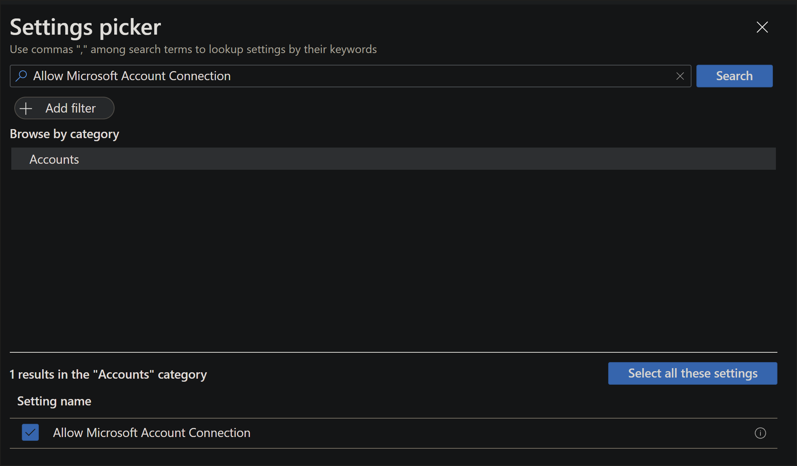
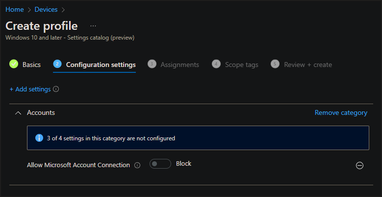
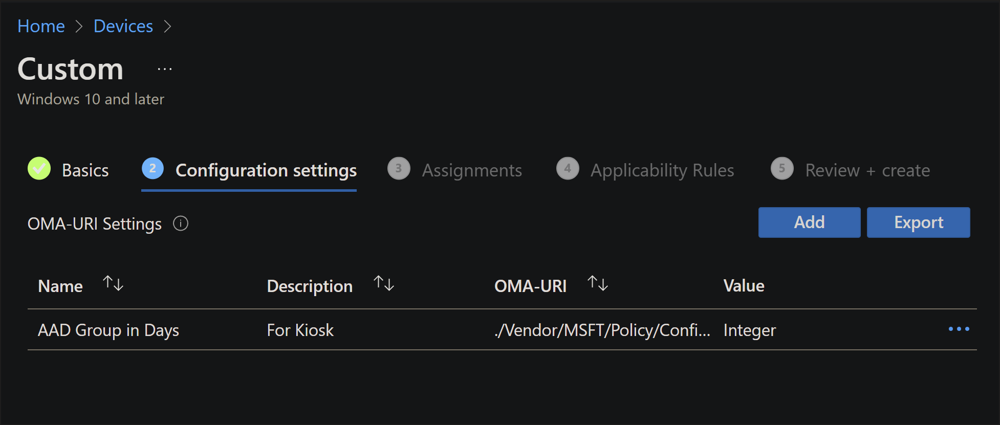

# HoloLens 2 Security Baselines

> [!IMPORTANT]
> Some of the policies used in this security baseline are introduced in our latest [Insider build](hololens-insider.md). Those policies will only function on devices updated to the latest Insider build.

This article lists and describes the various security baseline settings you can configure on HoloLens 2 devices using Configuration Service Providers (CSP). As part of your mobile device management using Microsoft Endpoint Manager (formally known as Microsoft Intune), use the following standard or advanced security baseline settings depending on your organizational policies and needs. As a HoloLens 2 administration team, use these security baseline settings to help protect your organizational resources.

- Standard security baseline settings are applicable to all types of customers irrespective of the use case scenario and industry vertical.
- Advanced security baseline settings are recommended settings for customers those who have strict security controls of their environment and require stringent security policies to be applied to any device used in their environment

These security baseline settings are based on Microsoft’s best practice guidelines and experience gained in deploying and supporting HoloLens 2 devices to multiple customers in various industries.

Once you've reviewed the baselines and decided to use the one, both, or parts, then check out [how to enable these security base lines](#how-to-enable-these-security-base-lines)

## 1. Standard security baseline settings

The following sections describe the recommended settings of each CSP as part of the standard security baseline profile.

### 1.1 [Policy CSP](/windows/client-management/mdm/policies-in-policy-csp-supported-by-hololens2)

| **Policy Name** | **Value** | **Description** |
| --- | --- | --- | --- |
| **Accounts** | | |
| [Accounts/AllowMicrosoftAccountConnection](/windows/client-management/mdm/policy-csp-accounts#accounts-allowmicrosoftaccountconnection) | 0 – Not Allowed | Restrict the user to use an MSA account for non-email related connection authentication and services. |
| **Application Management** | | |
| [ApplicationManagement/AllowAllTrustedApps](/windows/client-management/mdm/policy-csp-applicationmanagement#applicationmanagement-allowalltrustedapps) | 0 - Explicit deny | Explicitly deny non Microsoft Store apps. |
| [ApplicationManagement/AllowAppStoreAutoUpdate](/windows/client-management/mdm/policy-csp-applicationmanagement#applicationmanagement-allowappstoreautoupdate) | 1 – Allowed | Allow automatic update of apps from Microsoft Store. |
| [ApplicationManagement/AllowDeveloperUnlock](/windows/client-management/mdm/policy-csp-applicationmanagement#applicationmanagement-allowdeveloperunlock) | 0 - Explicit deny | Restrict the user to unlock developer mode, which allows the user to install apps on the device from an IDE. |
| **Browser** | | |
| [Browser/AllowCookies](/windows/client-management/mdm/policy-csp-browser#browser-allowcookies) | 1 – Block only cookies from third party websites |
| [Browser/AllowPasswordManager](/windows/client-management/mdm/policy-csp-browser#browser-allowpasswordmanager) | 0 – Not allowed | Disallow Microsoft Edge to use the password manager. |
| [Browser/AllowSmartScreen](/windows/client-management/mdm/policy-csp-browser#browser-allowsmartscreen) | 1 – Turned on | Enabling this policy turns on Windows Defender SmartScreen and prevent users from turning it off. |
| **Connectivity** | | |
| [Connectivity/AllowUSBConnection](/windows/client-management/mdm/policy-csp-connectivity#connectivity-allowusbconnection) | 0 – Not allowed | Disables USB connection between the device and a computer to sync files with the device or to use developer tools to deploy or debug applications. |
| **Device Lock** | | |
| [DeviceLock/AllowIdleReturnWithoutPassword](/windows/client-management/mdm/policy-csp-devicelock#devicelock-allowidlereturnwithoutpassword) | 0 – Not allowed | Disallow return from idle without PIN or password. |
| [DeviceLock/AllowSimpleDevicePassword](/windows/client-management/mdm/policy-csp-devicelock#devicelock-allowsimpledevicepassword) | 0 – Blocked | Block PINs or passwords such as &quot;1111&quot; or &quot;1234&quot;. |
| [DeviceLock/AlphanumericDevicePasswordRequired](/windows/client-management/mdm/policy-csp-devicelock#devicelock-alphanumericdevicepasswordrequired) | 1 – Password or Numeric PIN required | Require password or alphanumeric PIN. |
| [DeviceLock/DevicePasswordEnabled](/windows/client-management/mdm/policy-csp-devicelock#devicelock-devicepasswordenabled) | 0 – Enabled | Device lock is enabled. |
| [DeviceLock/MaxInactivityTimeDeviceLock](/windows/client-management/mdm/policy-csp-devicelock#devicelock-maxinactivitytimedevicelock) | An integer X where 0 \&lt;= X \&lt;= 999 Recommended value: 3 | Specifies the maximum amount of time (in minutes) allowed after the device is idle that will cause the device to become PIN or password locked. |
| [DeviceLock/MinDevicePasswordComplexCharacters](/windows/client-management/mdm/policy-csp-devicelock#devicelock-mindevicepasswordcomplexcharacters) | 1 - Digits only | The number of complex element types (uppercase and lowercase letters, numbers, and punctuation) required for a strong PIN or password. |
| [DeviceLock/MinDevicePasswordLength](/windows/client-management/mdm/policy-csp-devicelock#devicelock-mindevicepasswordlength) | An integer X where 4 \&lt;= X \&lt;= 16 for client devicesRecommended value: 8 | Specifies the minimum number or characters required in the PIN or password. |
| **MDM Enrollment** | | |
| [Experience/AllowManualMDMUnenrollment](/windows/client-management/mdm/policy-csp-experience#experience-allowmanualmdmunenrollment) | 0 – Not allowed | Disallow the user to delete the workplace account using the workplace control panel. |
| **Identity** | | |
| [MixedReality/AADGroupMembershipCacheValidityInDays](/windows/client-management/mdm/policy-csp-mixedreality#mixedreality-aadgroupmembershipcachevalidityindays) | Number of days the cache to be validRecommended value: 7 days | Number of days the Azure AD group membership cache should be valid. |
| **Power** | | |
|  [Power/DisplayOffTimeoutPluggedIn](/windows/client-management/mdm/policy-csp-power#power-displayofftimeoutpluggedin) | Idle time in number of secondsRecommended values: 60 secs | Allows you to specify the period of inactivity before Windows turns off the display. |
| **Settings** | | |
| [Settings/AllowVPN](/windows/client-management/mdm/policy-csp-settings#settings-allowvpn) | 0 – Not allowed | Disallow the user to change VPN settings. |
| [Settings/PageVisibilityList](/windows/client-management/mdm/policy-csp-settings#settings-pagevisibilitylist) | Shortened name of the pages that are visible to the user. Will provide a UI to select or unselect the page names. See comments for recommended pages to hide. | Allow only listed pages to be displayed to the user in Settings app. |
| **System** | | |
| [System/AllowStorageCard](/windows/client-management/mdm/policy-csp-system#system-allowstoragecard) | 0 – Not allowed | SD card use isn't allowed and USB drives are disabled. This setting doesn't prevent programmatic access to the storage card. |
| **Updates** | | |
| [Update/AllowUpdateService](/windows/client-management/mdm/policy-csp-update#update-allowupdateservice)  | 1 – Allowed  | Allow access to Microsoft Update, Windows Server Update Services (WSUS), or Microsoft Store.  |
| [Update/ManagePreviewBuilds](/windows/client-management/mdm/policy-csp-update#update-managepreviewbuilds) | 0 - Disable Preview builds | Disallow preview builds to be installed on the device. |

### 1.2 [ClientCertificateInstall CSP](/windows/client-management/mdm/clientcertificateinstall-csp)

We recommend configuring this CSP as a best practice but don't have recommendations for specific values for each node in this CSP.

### 1.3 [PassportForWork CSP](/windows/client-management/mdm/passportforwork-csp)

| **Node Name** | **Value** | **Description** |
| --- | --- | --- |
| Tenant ID | _TenantId_ | A globally unique identifier (GUID), without curly braces ( { , } ), that is used as part of Windows Hello for Business provisioning and management. |
| _TenantId_/Policies/UsePassportForWork | True | Sets Windows Hello for Business as a method for signing into Windows. |
| _TenantId_/Policies/RequireSecurityDevice | True | Requires a Trusted Platform Module (TPM) for Windows Hello for Business. |
| _TenantId_/Policies/ExcludeSecurityDevices/TPM12 | False | TPM revision 1.2 modules will be allowed to be used with Windows Hello for Business. |
| _TenantId_/Policies/EnablePinRecovery | False | PIN recovery secret won't be created or stored. |
| _TenantId_/Policies/UseCertificateForOnPremAuth | False | PIN will be provisioned when the user logs in, without waiting for a certificate payload. |
| _TenantId_/Policies/PINComplexity/MinimumPINLength | 6 | PIN length must be greater than or equal to this number. |
| _TenantId_/Policies/PINComplexity/MaximumPINLength | 6 | PIN length must be less than or equal to this number. |
| _TenantId_/Policies/PINComplexity/UppercaseLetters | 2 | Digits are required and all other character sets aren't allowed. |
| _TenantId_/Policies/PINComplexity/LowercaseLetters | 2 | Digits are required and all other character sets aren't allowed. |
| _TenantId_/Policies/PINComplexity/SpecialCharacters | 2 | Doesn't allow the use of special characters in PIN. |
| _TenantId_/Policies/PINComplexity/Digits | 0 | Allows the use of digits in PIN. |
| _TenantId_/Policies/PINComplexity/History | 10 | Number of past PINs that can be associated to a user account that can&#39;t be reused. |
| _TenantId_/Policies/PINComplexity/Expiration | 90 | Period of time (in days) that a PIN can be used before the system requires the user to change it. |
| _TenantId_/Policies/UseHelloCertificatesAsSmartCardCertificates | False | Applications don't use Windows Hello for Business certificates as smart card certificates, and biometric factors are available when a user is asked to authorize the use of the certificate&#39;s private key. |

### 1.4 [RootCATrustedCertificates CSP](/windows/client-management/mdm/rootcacertificates-csp)

We recommend configuring **Root, CA, TrustedPublisher and TrustedPeople** nodes in this CSP as a best practice but won't recommend on specific values for each node in this CSP.

### 1.5 [TenantLockdown CSP](/windows/client-management/mdm/tenantlockdown-csp)

| **Node Name** | **Value** | **Description** |
| --- | --- | --- |
| RequireNetworkInOOBE | True | When the device goes through OOBE at first logon or after a reset, the user is required to choose a network before proceeding. There's no &quot;skip for now&quot; option. This ensures that the device remains bound to the tenant in case of accidental or intentional resets or wipes. |

### 1.6 [VPNv2 CSP](/windows/client-management/mdm/vpnv2-csp)

We recommend configuring this CSP as a best practice but don't have recommendations for specific values for each node in this CSP. Most of the settings are related to the customer environment.

### 1.7 [WiFi CSP](/windows/client-management/mdm/wifi-csp)

We recommend configuring this CSP as a best practice but don't have recommendations for specific values for each node in this CSP. Most of the settings are related to the customer environment.

## 2 Advanced security baseline settings

The following sections describe the recommended settings of each CSP as part of the advanced security baseline profile.

### 2.1 [Policy CSP](/windows/client-management/mdm/policies-in-policy-csp-supported-by-hololens2)

| **Policy Name** | **Value** | **Description** |
| --- | --- | --- |
| **Accounts** | | |
| [Accounts/AllowMicrosoftAccountConnection](/windows/client-management/mdm/policy-csp-accounts#accounts-allowmicrosoftaccountconnection) | 0 – Not Allowed | Restrict the user to use an MSA account for non-email related connection authentication and services. |
| **Application Management** | | |
| [ApplicationManagement/AllowAllTrustedApps](/windows/client-management/mdm/policy-csp-applicationmanagement#applicationmanagement-allowalltrustedapps) | 0 - Explicit deny | Explicitly deny non Microsoft Store apps. |
| [ApplicationManagement/AllowAppStoreAutoUpdate](/windows/client-management/mdm/policy-csp-applicationmanagement#applicationmanagement-allowappstoreautoupdate) | 1 – Allowed | Allow automatic update of apps from Microsoft Store. |
| [ApplicationManagement/AllowDeveloperUnlock](/windows/client-management/mdm/policy-csp-applicationmanagement#applicationmanagement-allowdeveloperunlock) | 0 - Explicit deny | Restrict the user to unlock developer mode, which allows the user to install apps on the device from an IDE. |
| **Authentication** | | |
| [Authentication/AllowFastReconnect](/windows/client-management/mdm/policy-csp-authentication#authentication-allowfastreconnect) | 0 – Not allowed | Disallow EAP Fast Reconnect from being attempted for EAP Method TLS. |
| **Bluetooth** | | |
| [Bluetooth/AllowDiscoverableMode](/windows/client-management/mdm/policy-csp-bluetooth#bluetooth-allowdiscoverablemode) | 0 – Not allowed | Other devices won't be able to detect this device. |
| **Browser** | | |
| [Browser/AllowAutofill](/windows/client-management/mdm/policy-csp-browser#browser-allowautofill) | 0 – Prevented/not allowed | Prevent users using Autofill feature to populate the form fields in Microsoft Edge automatically. |
| [Browser/AllowCookies](/windows/client-management/mdm/policy-csp-browser#browser-allowcookies) | 1 – Block only cookies from third party websites | Block only cookies from third party websites. |
| [Browser/AllowDoNotTrack](/windows/client-management/mdm/policy-csp-browser#browser-allowdonottrack) | 0 - Never send tracking information | Never send tracking information. |
| [Browser/AllowPasswordManager](/windows/client-management/mdm/policy-csp-browser#browser-allowpasswordmanager) | 0 – Not allowed | Disallow Microsoft Edge to use the password manager. |
| [Browser/AllowPopups](/windows/client-management/mdm/policy-csp-browser#browser-allowpopups) | 1 – Turn on Pop-up Blocker | Turn on Pop-up Blocker stopping pop-up windows from opening. |
| [Browser/AllowSearchSuggestionsinAddressBar](/windows/client-management/mdm/policy-csp-browser#browser-allowsearchsuggestionsinaddressbar) | 0 – Prevented/not allowed | Hide search suggestions in the Address bar of Microsoft Edge. |
| [Browser/AllowSmartScreen](/windows/client-management/mdm/policy-csp-browser#browser-allowsmartscreen) | 1 – Turned on | Enabling this policy turns on Windows Defender SmartScreen and prevent users from turning it off. |
| **Connectivity** | | |
| [Connectivity/AllowBluetooth](/windows/client-management/mdm/policy-csp-connectivity#connectivity-allowbluetooth) | 0 – Disallow Bluetooth | Bluetooth control panel will be grayed out and the user won't be able to turn on Bluetooth. |
| [Connectivity/AllowUSBConnection](/windows/client-management/mdm/policy-csp-connectivity#connectivity-allowusbconnection) | 0 – Not allowed | Disables USB connection between the device and a computer to sync files with the device or to use developer tools to deploy or debug applications. |
| **Device Lock** | | |
| [DeviceLock/AllowIdleReturnWithoutPassword](/windows/client-management/mdm/policy-csp-devicelock#devicelock-allowidlereturnwithoutpassword) | 0 – Not allowed | Disallow return from idle without PIN or password. |
| [DeviceLock/AllowSimpleDevicePassword](/windows/client-management/mdm/policy-csp-devicelock#devicelock-allowsimpledevicepassword) | 0 – Blocked | Block PINs or passwords such as &quot;1111&quot; or &quot;1234&quot;. |
| [DeviceLock/AlphanumericDevicePasswordRequired](/windows/client-management/mdm/policy-csp-devicelock#devicelock-alphanumericdevicepasswordrequired) | 0 – Password or Alphanumeric PIN required | Require password or alphanumeric PIN. |
| [DeviceLock/DevicePasswordEnabled](/windows/client-management/mdm/policy-csp-devicelock#devicelock-devicepasswordenabled) | 0 – Enabled | Device lock is enabled. |
| [DeviceLock/DevicePasswordHistory](/windows/client-management/mdm/policy-csp-devicelock#devicelock-devicepasswordhistory) | An integer X where 0 \&lt;= X \&lt;= 50Recommended value: 15 | Specifies how many passwords can be stored in the history that can&#39;t be used. |
| [DeviceLock/MaxDevicePasswordFailedAttempts](/windows/client-management/mdm/policy-csp-devicelock#devicelock-maxdevicepasswordfailedattempts) | An integer X where 4 \&lt;= X \&lt;= 16 for client devicesRecommended value: 10 | The number of authentication failures allowed before the device will be wiped. |
| [DeviceLock/MaxInactivityTimeDeviceLock](/windows/client-management/mdm/policy-csp-devicelock#devicelock-maxinactivitytimedevicelock) | An integer X where 0 \&lt;= X \&lt;= 999 Recommended value: 3 | Specifies the maximum amount of time (in minutes) allowed after the device is idle that will cause the device to become PIN or password locked. |
| [DeviceLock/MinDevicePasswordComplexCharacters](/windows/client-management/mdm/policy-csp-devicelock#devicelock-mindevicepasswordcomplexcharacters) | 3 - Digits, lowercase letters, and uppercase letters are required | The number of complex element types (uppercase and lowercase letters, numbers, and punctuation) required for a strong PIN or password. |
| [DeviceLock/MinDevicePasswordLength](/windows/client-management/mdm/policy-csp-devicelock#devicelock-mindevicepasswordlength) | An integer X where 4 \&lt;= X \&lt;= 16 for client devicesRecommended value: 12 | Specifies the minimum number or characters required in the PIN or password. |
| **MDM Enrollment** | | |
| [Experience/AllowManualMDMUnenrollment](/windows/client-management/mdm/policy-csp-experience#experience-allowmanualmdmunenrollment) | 0 – Not allowed | Disallow the user to delete the workplace account using the workplace control panel. |
| **Identity** | | |
| [MixedReality/AADGroupMembershipCacheValidityInDays](/windows/client-management/mdm/policy-csp-mixedreality#mixedreality-aadgroupmembershipcachevalidityindays) | Number of days the cache to be validRecommended value: 7 days | Number of days the Azure AD group membership cache should be valid. |
| **Power** | | |
| [Power/DisplayOffTimeoutPluggedIn](/windows/client-management/mdm/policy-csp-power#power-displayofftimeoutpluggedin) | Idle time in number of secondsRecommended values: 60 secs | Allows you to specify the period of inactivity before Windows turns off the display. |
| **Privacy** | | |
| [Privacy/LetAppsAccess](/windows/client-management/mdm/policy-csp-privacy#privacy-letappsaccessaccountinfo)   [AccountInfo](/windows/client-management/mdm/policy-csp-privacy#privacy-letappsaccessaccountinfo) | 2 - Force deny | Denies Windows apps access to account information. |
| [Privacy/LetAppsAccess](/windows/client-management/mdm/policy-csp-privacy#privacy-letappsaccessaccountinfo-forceallowtheseapps)   [AccountInfo\_ForceAllowTheseApps](/windows/client-management/mdm/policy-csp-privacy#privacy-letappsaccessaccountinfo-forceallowtheseapps) | List of semi-colon delimited Package Family Names of Windows apps | Listed Windows apps are allowed access to account information. |
| [Privacy/LetAppsAccess](/windows/client-management/mdm/policy-csp-privacy#privacy-letappsaccessaccountinfo-forcedenytheseapps)   [AccountInfo\_ForceDenyTheseApps](/windows/client-management/mdm/policy-csp-privacy#privacy-letappsaccessaccountinfo-forcedenytheseapps) | List of semi-colon delimited Package Family Names of Windows apps | Listed Windows apps are denied access to account information. |
| [Privacy/LetAppsAccess](/windows/client-management/mdm/policy-csp-privacy#privacy-letappsaccessaccountinfo-userincontroloftheseapps)   [AccountInfo\_UserInControlOfTheseApps](/windows/client-management/mdm/policy-csp-privacy#privacy-letappsaccessaccountinfo-userincontroloftheseapps) | List of semi-colon delimited Package Family Names of Windows apps | The user is able to control the account information privacy setting for the listed Windows apps. |
| [Privacy/LetAppsAccess](/windows/client-management/mdm/policy-csp-privacy#privacy-letappsaccessbackgroundspatialperception)   [BackgroundSpatialPerception](/windows/client-management/mdm/policy-csp-privacy#privacy-letappsaccessbackgroundspatialperception)  | 2 - Force deny | Deny Windows apps access to the movement of the user&#39;s head, hands, motion controllers, and other tracked objects, while the apps are running in the background. |
| [Privacy/LetAppsAccess](/windows/client-management/mdm/policy-csp-privacy#privacy-letappsaccessbackgroundspatialperception-forceallowtheseapps)   [BackgroundSpatialPerception\_ForceAllowTheseApps](/windows/client-management/mdm/policy-csp-privacy#privacy-letappsaccessbackgroundspatialperception-forceallowtheseapps) | List of semi-colon delimited Package Family Names of Windows Store Apps | Listed apps are allowed access to the user&#39;s movements while the apps are running in the background. |
| [Privacy/LetAppsAccess](/windows/client-management/mdm/policy-csp-privacy#privacy-letappsaccessbackgroundspatialperception-forcedenytheseapps)   [BackgroundSpatialPerception\_ForceDenyTheseApps](/windows/client-management/mdm/policy-csp-privacy#privacy-letappsaccessbackgroundspatialperception-forcedenytheseapps) | List of semi-colon delimited Package Family Names of Windows Store Apps | Listed apps are denied access to the user&#39;s movements while the apps are running in the background. |
| [Privacy/LetAppsAccess](/windows/client-management/mdm/policy-csp-privacy#privacy-letappsaccessbackgroundspatialperception-userincontroloftheseapps)   [sBackgroundSpatialPerception\_UserInControlOfTheseApps](/windows/client-management/mdm/policy-csp-privacy#privacy-letappsaccessbackgroundspatialperception-userincontroloftheseapps) | List of semi-colon delimited Package Family Names of Windows Store Apps | The user is able to control the user movements privacy setting for the listed apps. |
| [Privacy/LetAppsAccess](/windows/client-management/mdm/policy-csp-privacy#privacy-letappsaccessmicrophone-forcedenytheseapps)   [Microphone\_ForceDenyTheseApps](/windows/client-management/mdm/policy-csp-privacy#privacy-letappsaccessmicrophone-forcedenytheseapps) | List of semi-colon delimited Package Family Names of Microsoft Store Apps | Listed apps are denied access to the microphone. |
| [Privacy/LetAppsAccess](/windows/client-management/mdm/policy-csp-privacy#privacy-letappsaccessmicrophone-userincontroloftheseapps)   [Microphone\_UserInControlOfTheseApps](/windows/client-management/mdm/policy-csp-privacy#privacy-letappsaccessmicrophone-userincontroloftheseapps) | List of semi-colon delimited Package Family Names of Microsoft Store Apps | The user is able to control the microphone privacy setting for the listed apps. |
| **Search** | | |
| [Search/AllowSearchToUseLocation](/windows/client-management/mdm/policy-csp-search#search-allowsearchtouselocation) | 0 – Not allowed | Disallow search to use location information. |
| **Security** | | |
| [Security/AllowAddProvisioningPackage](/windows/client-management/mdm/policy-csp-security#security-allowaddprovisioningpackage) | 0 – Not allowed | Disallow the runtime configuration agent to install provisioning packages. |
| **Settings** | | |
| [Settings/AllowVPN](/windows/client-management/mdm/policy-csp-settings#settings-allowvpn) | 0 – Not allowed | Disallow the user to change VPN settings. |
| [Settings/PageVisibilityList](/windows/client-management/mdm/policy-csp-settings#settings-pagevisibilitylist) | Shortened name of the pages that are visible to the userWill provide a UI to select or unselect the page names. See comments for recommended pages to hide. | Allow only listed pages to be displayed to the user in Settings app. |
| **System** | | |
|[System/AllowStorageCard](/windows/client-management/mdm/policy-csp-system#system-allowstoragecard) | 0 – Not allowed | SD card use isn't allowed and USB drives are disabled. This setting doesn't prevent programmatic access to the storage card. |
| [System/AllowTelemetry](/windows/client-management/mdm/policy-csp-system#system-allowtelemetry) | 0 - Not allowed | Disallow device to send diagnostic and usage telemetry data, such as Watson. |
| **Updates** | | |
| [Update/AllowUpdateService](/windows/client-management/mdm/policy-csp-update#update-allowupdateservice) | 1 – Allowed | Allow access to Microsoft Update, Windows Server Update Services (WSUS), or Microsoft Store. |
| [Update/ManagePreviewBuilds](/windows/client-management/mdm/policy-csp-update#update-managepreviewbuilds) | 0 - Disable Preview builds | Disallow preview builds to be installed on the device. |
| **Wi-Fi** | | |
| [Wifi/AllowManualWiFiConfiguration](/windows/client-management/mdm/policy-csp-wifi#wifi-allowmanualwificonfiguration) | 0 – Not allowed | Disallow connecting to Wi-Fi outside of MDM server-installed networks. |

### 2.2 [AccountManagement CSP](/windows/client-management/mdm/accountmanagement-csp)

| **Node Name** | **Value** | **Description** |
| --- | --- | --- |
| UserProfileManagement/EnableProfileManager | True | Enable profile lifetime management for shared or communal device scenarios. |
| UserProfileManagement/DeletionPolicy | 2 - delete at both storage capacity threshold and profile inactivity threshold | Configures when profiles will be deleted. |
| UserProfileManagement/StorageCapacityStartDeletion | 25% | Start deleting profiles when available storage capacity falls below this threshold, given as percent of total storage available for profiles. Profiles that have been inactive the longest will be deleted first. |
| UserProfileManagement/StorageCapacityStopDeletion | 50% | Stop deleting profiles when available storage capacity is brought up to this threshold, given as percent of total storage available for profiles. |
| UserProfileManagement/ProfileInactivityThreshold | 30 | Start deleting profiles when they haven't been logged on during the specified period, given as number of days. |

### 2.3 [ApplicationControl CSP](/windows/client-management/mdm/applicationcontrol-csp)

| **Node Name** | **Value** | **Description** |
| --- | --- | --- |
| Policies/Policy GUID | _Policy ID_ in the policy blob | Policy ID in the policy blob. |
| Policies/_Policy GUID_/Policy | _Policy blob_ | Policy binary blob encoded in base64. |

### 2.4 [ClientCertificateInstall CSP](/windows/client-management/mdm/clientcertificateinstall-csp)

We recommend configuring this CSP as a best practice but don't have recommendations for specific values for each node in this CSP.

### 2.5 [PassportForWork CSP](/windows/client-management/mdm/passportforwork-csp)

| **Node Name** | **Value** | **Description** |
| --- | --- | --- |
| Tenant ID | _TenantId_ | A globally unique identifier (GUID), without curly braces ( { , } ), that is used as part of Windows Hello for Business provisioning and management. |
| _TenantId_/Policies/UsePassportForWork | True | Sets Windows Hello for Business as a method for signing into Windows. |
| _TenantId_/Policies/RequireSecurityDevice | True | Requires a Trusted Platform Module (TPM) for Windows Hello for Business. |
| _TenantId_/Policies/ExcludeSecurityDevices/TPM12 | False | TPM revision 1.2 modules will be allowed to be used with Windows Hello for Business. |
| _TenantId_/Policies/EnablePinRecovery | False | PIN recovery secret will not be created or stored. |
| _TenantId_/Policies/UseCertificateForOnPremAuth | False | PIN will be provisioned when the user logs in, without waiting for a certificate payload. |
| _TenantId_/Policies/PINComplexity/MinimumPINLength | 6 | PIN length must be greater than or equal to this number. |
| _TenantId_/Policies/PINComplexity/MaximumPINLength | 6 | PIN length must be less than or equal to this number. |
| _TenantId_/Policies/PINComplexity/UppercaseLetters | 2 | Digits are required and all other character sets are not allowed. |
| _TenantId_/Policies/PINComplexity/LowercaseLetters | 2 | Digits are required and all other character sets are not allowed. |
| _TenantId_/Policies/PINComplexity/SpecialCharacters | 2 | Does not allow the use of special characters in PIN. |
| _TenantId_/Policies/PINComplexity/Digits | 0 | Allows the use of digits in PIN. |
| _TenantId_/Policies/PINComplexity/History | 10 | Number of past PINs that can be associated to a user account that can&#39;t be reused. |
| _TenantId_/Policies/PINComplexity/Expiration | 90 | Period of time (in days) that a PIN can be used before the system requires the user to change it. |
| _TenantId_/Policies/UseHelloCertificatesAsSmartCardCertificates | False | Applications do not use Windows Hello for Business certificates as smart card certificates, and biometric factors are available when a user is asked to authorize the use of the certificate&#39;s private key. |

### 2.6 [RootCATrustedCertificates CSP](/windows/client-management/mdm/rootcacertificates-csp)

We recommend configuring **Root, CA, TrustedPublisher and TrustedPeople** nodes in this CSP as a best practice but will not recommend on specific values for each node in this CSP.

### 2.7 [TenantLockdown CSP](/windows/client-management/mdm/tenantlockdown-csp)

| **Node Name** | **Value** | **Description** |
| --- | --- | --- |
| RequireNetworkInOOBE | True | When the device goes through OOBE at first logon or after a reset, the user is required to choose a network before proceeding. There is no &quot;skip for now&quot; option. This ensures that the device remains bound to the tenant in case of accidental or intentional resets or wipes. |

### 2.8 [VPNv2 CSP](/windows/client-management/mdm/vpnv2-csp)

We recommend configuring VPN profiles as a best practice but will not recommend on specific values for each node in this CSP. Most of the settings are related to customer environment.

### 2.9 [WiFi CSP](/windows/client-management/mdm/wifi-csp)

We recommend configuring WiFi profiles as a best practice but will not recommend on specific values for each node in this CSP. Most of the settings are related to the customer environment.

## How to enable these security base lines

1. Review the security baseline, and decide what to apply.
1. Determine the Azure Groups that you'll assign the baseline to. ([More on users and groups](hololens2-cloud-connected-configure.md#azure-users-and-groups))
1. Create the baseline.

Here's how to create the baseline.

Many of the settings can be added by using the Settings catalog, however there may sometimes be a setting that hasn't yet been populated to the Settings catalog. In those cases, you'll use a Custom policy, or OMA-URI (Open Mobile Alliance - Uniform Resource Identifier). Start by looking in the Settings catalog, and if it's not found this follow the instructions below for creating a custom policy via OMA-URI.

### Settings catalog

Log into your account on the [MEM admin center](https://endpoint.microsoft.com/#home).

1. Navigate to **Devices** -> **Configuration profiles** -> **+Create profile**. For Platform, select **Windows 10 and later**, and for profile type select **Settings catalog (preview)**.
1. Create a name for the profile, and select the **Next** button.
1. On the Configuration settings screen select **+ Add settings**.

Using the name of the policy from the baseline above, you can search for the policy. The settings catalog will space out the name, so to find "Accounts/AllowMicrosoftAccountConnection" you'll need to search "Allow Microsoft Account Connection". After you search you'll see the list of policies reduce to just the CSP which has this policy. Select **Accounts** (or the relevant CSP to what you are current searching), once you do you'll see the policy result below. Check the box for the policy.

Once done, the panel on the left will add the CSP category, and the setting that you added. From here you can configure it from the default setting, to one more secure.

You can continue to keep adding multiple configurations to the same profile, which will make it easier to assign at once.

### Adding custom OMA-URI policies

Some policies may not be available in the Settings catalog yet. For these you'll need to [create a custom OMA-URI profile](/troubleshoot/mem/intune/deploy-oma-uris-to-target-csp-via-intune).Log into your account on the [MEM admin center](https://endpoint.microsoft.com/#home).

1. Navigate to **Devices** -> **Configuration profiles** -> **+Create profile**. For Platform, select **Windows 10 and later**, and for profile type select **Templates** and select **Custom**.
1. Create a name for the profile, and select the **Next** button.
1. Select the **Add** button.

You'll need to fill out a few fields.

- Name, you may name it anything you need related to the policy. This can be a shorthand name you use to recognize it.
- Description will be more details you might need.
- The OMA-URI will be the full OMA-URI string where the policy is. Example: `./Vendor/MSFT/Policy/Config/MixedReality/AADGroupMembershipCacheValidityInDays`
- Data type is the type of value this policy accepts. For this example it's a number between 0 and 60, so Integer was selected.
- Once you select the data type, you'll be able to write out, or upload, the value needed into the field.

Once done, your policy will be added to the main window. You can continue adding all your custom policies to the same custom configuration. This helps reduce managing multiple device configurations and makes assignment easier.

