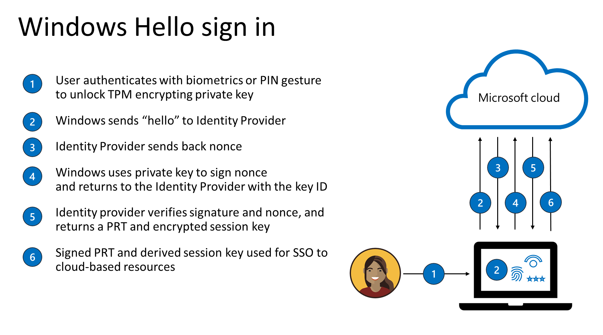
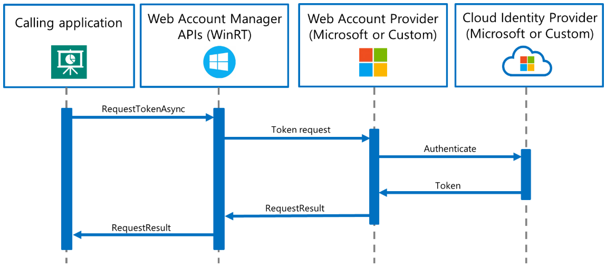
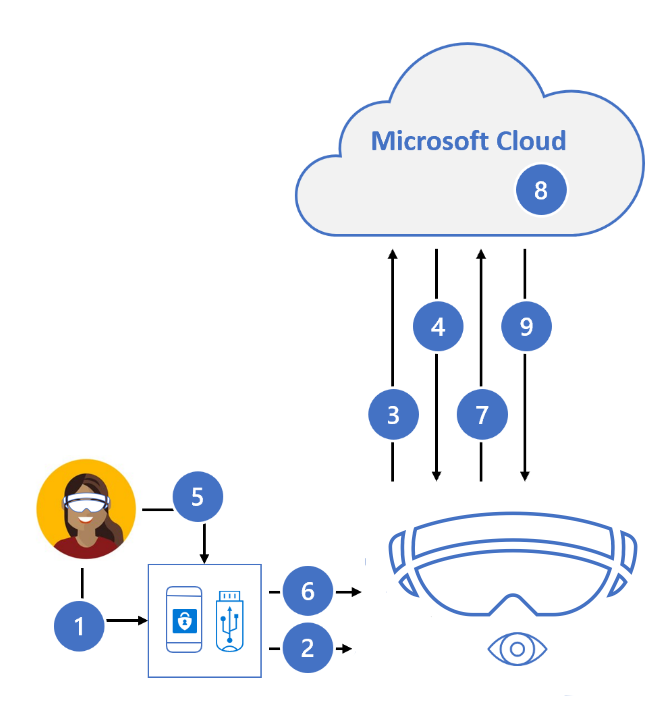

# Limiting password use

Most computer systems today utilize user credentials as the basis for security making them dependent on reusable, user-created passwords. This has resulted in passwords also becoming the most common cause of account compromise and data breaches. As an example of this, passwords can be intercepted in transmission or stolen from a server (by phishing or password spray attacks) and compromised to gain access to a user account.

To improve security and account protection, HoloLens 2 has the capability to enable strong, hardware-backed “password-less” credentials (including Windows Hello) for device sign in, offering seamless access to the Microsoft cloud.

## Signing in from another device

HoloLens 2 offers remote device sign-in options for Azure Active Directory work accounts during initial device setup and user sign-in to reduce the need to type complex passwords and minimize the need for passwords as credentials. Users and organizations who use smartcards to authenticate have difficulty using those credentials on devices such as HoloLens 2, and often organizations develop complicated systems and costly processes to work around the problem. To solve this problem, Azure AD offers two options for password-less sign-in on HoloLens 2.

The first authentication method relies on new capabilities in the Microsoft Authenticator app to provide key-based authentication that enables a user credential tied to a device. Once enabled on a tenant by the administrator, users will be shown a message during HoloLens device setup telling them to tap a number on their app. They must then match the number on their authenticator app, choose Approve, provide their PIN or a biometric and complete authentication for their HoloLens setup to proceed. This is described in greater detail in [passwordless sign-in](/azure/active-directory/authentication/howto-authentication-passwordless-phone).

The second is a device code flow that is intuitive to users and does not require any additional infrastructure.  This remote sign-in behavior relies on another trusted device that supports the organization’s preferred authentication mechanism and when complete, tokens are issued back to the HoloLens to complete sign-in or device setup. The steps in this flow are:

  1. A user going through the initial device setup or sign-in flows on OOBE is presented with a “Sign in from another device” link and taps on it. This initiates a remote sign in session.
  1. The user is then shown a polling page, which contains a short URI ([https://microsoft.com/devicelogin](https://microsoft.com/devicelogin)) that points to the device authentication endpoint of the Azure AD Secure Token Service (STS). The user is also presented with a one-time code that is securely generated in the cloud and has a maximum lifetime of 15 minutes. Along with code generation, Azure AD also creates an encrypted session upon initiation of the remote sign in request in the previous step and together, the URI and code are used to approve the remote sign-in request.
  1. The user then navigates to the URI from another device and is prompted to enter the code displayed on their HoloLens 2 device.
  1. Once the user enters the code, Azure AD STS displays a page indicating the user’s HoloLens 2 device that triggered the remote sign in request and requested generation of the code. The user is then prompted for confirmation to prevent any phishing attacks.
  1. If the user chooses to continue signing in to the displayed ‘application’, Azure AD STS prompts the user for their credentials. On successful authentication, Azure AD STS updates the cached remote session as 'approved' along with an authorization code.
  1. Finally, the polling page on the user’s HoloLens 2 device receives an 'Authorized' response from Azure AD and proceeds to validate the user code, its associated stored authorization code and generates OAuth tokens as requested to complete device setup. The authentication token created is valid for 1 hour and the refresh token has a lifetime of 90 days.

The code generation and encryption algorithms used in this flow are both FIPS compliant. HoloLens 2 devices utilize the TPM to secure device keys and encrypt tokens generated after user authentication using hardware-protected keys. More information on token security on HoloLens 2 is shared in [What is a Primary Refresh Token (PRT)](/azure/active-directory/devices/concept-primary-refresh-token).

## Device sign-in with Windows Hello

[Windows Hello](/windows/security/identity-protection/hello-for-business/hello-identity-verification) offers password-free options built directly into the operating system permitting users to sign into the device using Iris or PIN. PIN is always available as a credential and is required for device setup, whereas Iris is optional and may be skipped. Users can sign-in to HoloLens devices using their personal Microsoft account or [Azure Active Directory work account *without* entering a password](/azure/active-directory/authentication/concept-authentication-passwordless). Options such as these offer users rapid, secured access to their full Windows experience, apps, data, websites, and services. Microsoft’s strategy towards passwordless experiences is detailed here.

When a Windows Hello credential is created, it establishes a trusted relationship with an identity provider and creates an asymmetric key-pair for authentication. A Windows Hello gesture (such as iris or PIN) provides entropy to decrypt a private key backed by the device’s Trusted Platform Module (TPM) chip. This private key is then used to sign requests sent to an authenticating server and upon successful authentication, the user is granted access to their mail, pictures, and other account settings.

For more information, see the following infographic:

  
  
In the graphic presented above, note that nonce is stands for “number once”, and is a random or semi-random generated number. 
Once the Windows Hello Biometric or PIN credential is set up, it never leaves the device on which it is provisioned. Even if the user’s Windows Hello PIN is stolen, such as through a phishing attack, it is [useless without the user’s physical device](/windows/security/identity-protection/hello-for-business/hello-why-pin-is-better-than-password).

For added security, Windows Hello credentials are protected by the Trusted Platform Module (TPM) to make the credentials tamper resistant and supplemented with anti-hammering protections against multiple incorrect entries, and malicious software protection to prevent exposure. For more information on Single Sign-On (SSO), read this [overview of SSO methods](/azure/active-directory/manage-apps/what-is-single-sign-on).

Iris authentication falls back to the PIN. In order to set up a new PIN (a strong authenticator) on the device, the user must have recently gone through [Multifactor Authentication (MFA)](/azure/active-directory/authentication/concept-mfa-howitworks) in order to complete the process.

## Single sign-on with Web Account Manager

Single sign-on (SSO) allows password-less users to sign into the device, utilizing the user’s personal account or their work or school account. The user is automatically authorized with SSO on all integrated apps and services via the [Web Account Manager APIs](/uwp/api/Windows.Security.Authentication.Web.Provider?view=winrt-19041&preserve-view=true).

Once an identity has been added through one application, it can, with user consent, become available to all apps and services using system-level integration. This reduces the app sign in burden significantly and provides users with a seamless identity experience.

For more information on implementing Web Account Manager APIs, go to [Implementing Web Account Manager APIs](/windows/uwp/security/web-account-manager).

  
  
For app suites with specialized authentication requirements, the Web Account Manager (WAM) framework is extensible to custom identity providers. Users can download the custom identity provider, packaged as a Universal Windows Platform (UWP) app from the Microsoft Store, to enable SSO on other apps integrated with that identity provider.

For more information on implementing custom WAM Identity providers, see [Custom WAM Identity Provider API reference](/uwp/api/Windows.Security.Authentication.Web.Provider?view=winrt-19041&preserve-view=true).

## Windows Hello and FIDO2 sign-in with WebAuthn

HoloLens 2 can employ password-less user credentials (such as Windows Hello or FIDO2 security keys) to securely sign in on the web via Microsoft Edge and to websites that support WebAuthn. FIDO2 enables user credentials to take advantage of standards-based devices to authenticate to online services.

> [!Note]
> The [WebAuthn](https://www.w3.org/TR/webauthn/) and FIDO2 [CTAP2](https://fidoalliance.org/specs/fido-v2.0-ps-20190130/fido-client-to-authenticator-protocol-v2.0-ps-20190130.html) specifications are implemented into services. The signed metadata specified by WebAuthn and FIDO2 provides information – such as whether the user was present - and verifies the authentication through the local gesture.

As with Windows Hello, when the user creates and registers a FIDO2 credential, the device (HoloLens 2 or the FIDO2 security key), generates a private and public key on the device. The private key is stored securely on the device, and it can only be used after it is unlocked using a local gesture such as a biometric or PIN. When the private key is stored, the public key is sent to the Microsoft account system in the cloud and registered with the associated user account.

After signing in with an MSA and Azure AD account, the system sends a generated number or data variable to the HoloLens 2 or FIDO2 device. The HoloLens 2 or device uses the private key to sign the identification. The signed identification and metadata are sent back to the Microsoft account system and verified using the public key.

Windows Hello and FIDO2 devices implement credentials based on the HoloLens device, specifically the built-in Trusted Platform Module secure enclave. The TPM enclave stores the private key and requires either a biometric or PIN to unlock it. Similarly, a FIDO2 security key is a small external device with a built-in secure enclave that stores the private key and requires a biometric or PIN to unlock it.

Both options offer two-factor authentication in one step, requiring both a registered device and a biometric or PIN to successfully sign in. For more information, see the strong authentication with FIDO2 security key graphic and process, which follows.

### Strong Authentication with FIDO2 security key

  

1. User plugs FIDO2 security key into HoloLens 2
1. Windows detects FIDO2 security key
1. HoloLens sends auth request
1. Azure AD sends back nonce
1. User completes gesture to unlock private key stores in security key's secure enclave
1. FIDO2 security key signs nonce with private key
1. PRT token request with signed nonce is sent to Azure AD
1. Azure AD verifies FIDO key
1. Azure AD returns PRT and TGT to enable access to resources

MSA and Azure AD are among the first relying parties to support password-less authentication by implementing WebAuthn.

For more information on using WebAuthn with applications and/or SDKs, go to [WebAuthn APIs for password-less authentication on Windows 10](/windows/security/identity-protection/hello-for-business/webauthnapis).

HoloLens 2 supports FIDO2 security devices that are implemented to spec and satisfy the requirements listed on [Azure Active Directory passwordless sign-in - FIDO2 security keys](/azure/active-directory/authentication/concept-authentication-passwordless#fido2-security-keys) should be supported.

## Local accounts

A single local account can be configured for offline mode deployments. Local accounts are not enabled by default and must be configured during device provisioning. They must sign in by using a password, and they do not support alternate authentication methods (such as [Windows Hello for Business](/windows/security/identity-protection/hello-for-business/hello-overview) or [Windows Hello](/windows-hardware/design/device-experiences/windows-hello)).

More details on HoloLens user accounts can be found on [HoloLens Identity](hololens-identity.md).

IT administrators adjust whether the user is allowed to use an MSA account for non-email related connection authentication and services through [AllowMicrosoftAccountConnection](/windows/client-management/mdm/policy-csp-accounts#accounts-allowmicrosoftaccountconnection). For password configuration policies, idling policies, and lock screen policies, see [Device Lock](/windows/client-management/mdm/policy-csp-devicelock).
