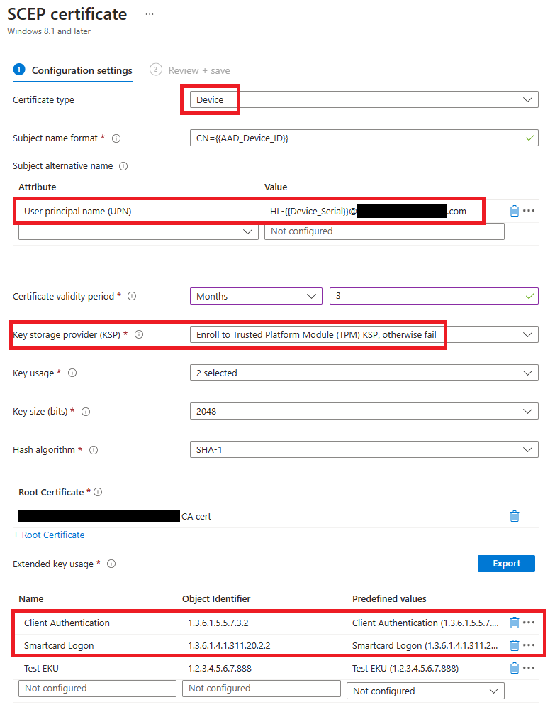
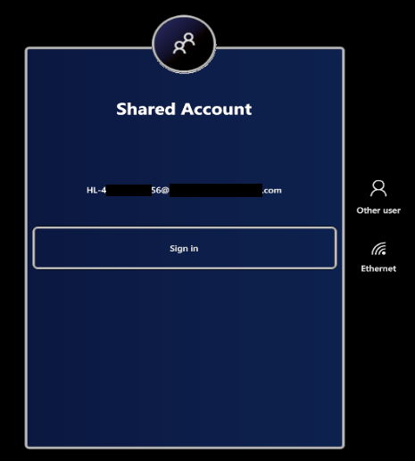
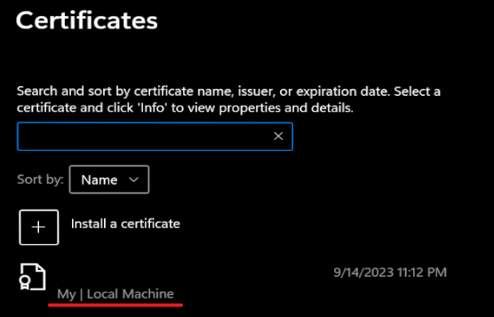
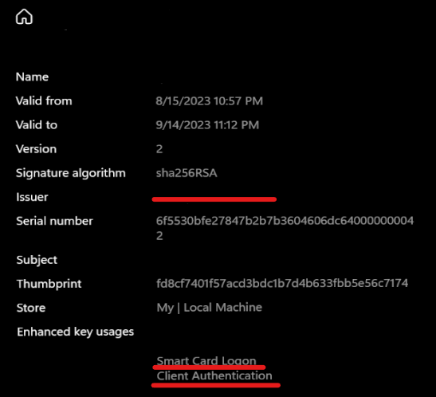

# Shared AAD accounts in HoloLens

 > [!VIDEO https://www.microsoft.com/videoplayer/embed/RW1aAzF]  

Shared Azure Active Directory (AAD) accounts on HoloLens are regular AAD user accounts that can sign-in to the HoloLens without requiring any credentials. This setup is ideal for scenarios where the following conditions are true:

- Multiple people share the same set of HoloLens devices
- Access to AAD resources, such as Dynamics 365 Guides content, is required
- Tracking who has used the device isn't required.

### Key benefits of using shared AAD accounts

- __Simplified deployment__. Previously, setting up AAD accounts shared between multiple people required setting up each device manually. Shared AAD accounts allows you to configure your environment once and automatically deploy to any of your devices as part of [Autopilot](/hololens/hololens2-autopilot).
- __Great user experience__. Users of shared AAD accounts will not have to enter any credentials to start using the device. Simply tap and go!
- __Access to AAD resources__. Users of shared AAD accounts will get easy access to AAD resources so that you can start a Remote Assist call or open a Guide without additional authentication.


> [!IMPORTANT]
> Since shared AAD accounts can be accessed on the HoloLens device without entering credentials, you should physically secure these HoloLens devices so that only authorized personnel have access. You may also want to lock down these accounts by applying conditional access policies, disabling self-service password reset, and configuring assigned access profiles to the devices where these accounts are used.

> [!NOTE]
>  Since these are shared accounts, users using these accounts are not shown the typical first sign-in setup screens, including PIN and iris enrollments, biometric data collection notice, and various consent screens. You should ensure that the appropriate defaults are configured for these accounts via policy (see [Set up users on HoloLens 2 quickly](/hololens2-new-user-optimize?tabs=firstBlank%2CsecondBlank#additional-policies)) and that your users are aware of these defaults.

Shared AAD accounts on HoloLens are implemented as regular AAD user accounts that are configured for [AAD certificate-based authentication (CBA)](/azure/active-directory/authentication/concept-certificate-based-authentication). 

At a high level, configuring shared AAD accounts comprises of the following steps:
1. (Recommended) Configure your target devices to join AAD and enroll into Intune using [Autopilot](/hololens/hololens2-autopilot).
1. [Configure your AAD tenant to enable AAD CBA](#configure-your-aad-tenant-to-enable-aad-cba) for a select group of accounts.
2. Configure Microsoft Intune to apply device configurations to a select group of devices that:
    1. [Deploy client certificates](#client-certificate-deployment-via-scep) used for AAD CBA onto the devices via Intune's SCEP certificate profiles.
    2. [Deploy CA certificate](#ca-certificate-deployment) so that the devices trust the issuer of the client certificates.
    3. [Deploy shared account configuration](#configuresharedaccount-policy) instructing the device which certificates are valid for AAD CBA.
3. [Prepares individual devices](#individual-device-configuration) for shared AAD accounts.

## Prerequisites

Shared AAD account support is available starting in [Insider preview for Microsoft HoloLens](/hololens/hololens-insider) build 10.0.22621.1217.

In addition to having the required operating system build on your HoloLens, you also need to satisfy the prerequisites for AAD CBA ([How to configure Azure AD certificate-based authentication](/azure/active-directory/authentication/how-to-certificate-based-authentication#prerequisites)).

Finally, you need access to Microsoft Intune in order to deploy device configurations and client certificates. For required infrastructure to deploy client certificates via Intune, see [Learn about the types of certificate that are supported by Microsoft Intune](/mem/intune/protect/certificates-configure#whats-required-to-use-certificates).

## Configure your AAD Tenant to enable AAD CBA

Your AAD tenant must be configured to enable AAD CBA for a select group of users.  

1.	Create an AAD group that contains the shared AAD accounts. As an example, we use the name "__SharedAccounts__" for this group.
2.	Create an AAD group that contains the shared HoloLens devices. As an example, we use the name "__SharedDevices__" for this group.
3.	Enable AAD certificate-based authentication (CBA) for the __SharedAccounts__ group. For a complete step-by-step guide, refer to [How to configure Azure AD certificate-based authentication](/azure/active-directory/authentication/how-to-certificate-based-authentication#prerequisites). The following high-level steps are needed to set this up:
    1.	Add your (Certificate Authority) CA certificate to AAD. AAD allows client certificates issued by this CA to perform CBA.
    2.	Enable CBA for the "__SharedAccounts__" group.
    3.	Configure CBA such that the certificate issued by your CA uses MFA. This is to ensure that users can access resources that require MFA without setting up another factor.
    4.	Enable certificate binding via UserPrincipalName.

## Intune configuration

Intune must be configured to deploy the certificates necessary for AAD CBA. Intune must also deploy a configuration to instruct the devices which certificates are valid for AAD CBA.

#### Client certificate deployment via SCEP
The devices must have the appropriate client certificate to perform AAD CBA. Create a SCEP configuration and assign it to "__SharedDevices__":

1. __Certificate type__: Device

2. Add a User principal name (UPN) __Subject alternative name (SAN)__ where the value is the UPN of the shared account assigned to the device. The UPN must contain the device serial number to associate it with a device. You can use the Intune variable __{{Device_Serial}}__ to refer to the device serial number. For example, enter a value of `HL-{{Device_Serial}}@contoso.com` if the shared accounts have a name format of `HL-123456789@contoso.com`.

3. __Key storage provider (KSP)__: Select "Require TPM, otherwise fail" to ensure that the certificate cannot be exported from the device to be used elsewhere.

4. Ensure that the certificate has at least the following __Extended key usages (EKUs)__:
    -	Smartcard Logon: 1.3.6.1.4.1.311.20.2.2     
    - Client Authentication: 1.3.6.1.5.5.7.3.2

   You may add other EKUs to this list to further restrict the certificates allowed for AAD CBA. You will need to add these EKUs to the XML for [ConfigureSharedAccount policy](#configuresharedaccount-policy).



Full documentation for configuring SCEP in Intune: [Use SCEP certificate profiles with Microsoft Intune](/mem/intune/protect/certificates-profile-scep).

#### CA certificate deployment
The devices must also trust the CA who issued its client certificate. Create a trusted certificate configuration and assign it to “SharedDevices” group. This assignment deploys your CA certificate to the devices. See documentation: [Create trusted certificate profiles in Microsoft Intune](/mem/intune/protect/certificates-trusted-root).

#### ConfigureSharedAccount policy
This policy tells the devices which certificates are valid to be used for AAD CBA. Create a custom device configuration policy and assign it to "__SharedDevices__":

| Policy | Data Type| 
| -------- | -------- |
| [./Vendor/MSFT/Policy/Config/MixedReality/ConfigureSharedAccount](/windows/client-management/mdm/policy-csp-mixedreality#configuresharedaccount) | String or String (XML file) |

Example configuration:
```xml
<SharedAccountConfiguration>
    <SharedAccount>
        <!--
          TODO: Replace the example value below with your issuer certificate's thumbprint.
          You may customize the restrictions for which certificates are displayed. See below.
        -->
        <IssuerThumbprint>77de0879f69314d867bd08fcf2e8e6616548b3c8</IssuerThumbprint>
    </SharedAccount>
</SharedAccountConfiguration>
```

You may customize the restrictions for which certificates are displayed for AAD CBA. The above example requires that the issuer’s certificate thumbprint matches the provided value. It’s also possible to apply the restriction based on the issuer’s name, or apply more restrictions based on Extended Key Usages (EKUs) on the certificate. See [ConfigureSharedAccount XML Examples](#configuresharedaccount-xml-examples) for examples on how to configure the XML. 

Before saving this device configuration, validate the XML against the schema specified in [ConfigureSharedAccount XML Schema](#configuresharedaccount-xml-schema) to ensure it’s well-formed.

## Individual device configuration

For each HoloLens device that you want to configure for shared AAD accounts, perform the following steps:

1. Create an AAD user in the format specified in step 2 of [Client certificate deployment via SCEP](#client-certificate-deployment-via-scep). For example: `HL-123456789@contoso.com`.
2. Add that user to the "__SharedAccounts__" group.
3. Ensure the device is added to the "__SharedDevices__" group. Note that you should configure your devices for Autopilot first so they're already present in AAD.

See [Example device setup script](#example-device-setup-script) for an example of a powershell script that can be used to automate this process.

## Testing your configuration

Once you’ve completed the above configuration, you’re ready to try out shared AAD accounts on HoloLens!

If your device is configured for Autopilot already, take the device through its normal Autopilot flow. The necessary device configurations are applied during Autopilot. Once the Autopilot flow is completed, you see the following screen:



Tap the “Sign in” button to start using the shared AAD account.

## Troubleshooting

**Problem: The shared AAD account isn’t showing on the sign-in screen!**

**Solution:** First, check that the device is receiving the correct certificates. Open the certificate manager ([Certificate Manager](/hololens/certificate-manager)) and make sure that both the client certificate and the CA certificates are successfully deployed to the device. 

For the client certificate, ensure that it's installed to the "My" store on "Local Machine."



If the certificate is not present, follow the [troubleshooting steps for Intune SCEP profiles](/troubleshoot/mem/intune/certificates/troubleshoot-scep-certificate-profiles).

If the certificate is present, ensure that the certificate is within the validity dates has the expected issuer and EKUs:



Next, ensure that the XML policy value you’ve applied to MixedReality/ConfigureSharedAccount is well-formed. You can use one of the many XML schema (XSD) validators online to check that your XML conforms to the schema described in [ConfigureSharedAccount XML Schema](#configuresharedaccount-xml-schema).

**Problem:  The sign in attempt fails!**

**Solution:**  Check that you’ve properly configured CBA following the instructions on [How to configure Azure AD certificate-based authentication](/azure/active-directory/authentication/how-to-certificate-based-authentication). Also, check out the [FAQ on Azure AD certificate-based authentication (CBA) FAQ](/azure/active-directory/authentication/certificate-based-authentication-faq). Sometimes it may be helpful to try these debug steps on a Windows desktop device first: [Windows smart card sign-in using Azure Active Directory certificate-based authentication](/azure/active-directory/authentication/concept-certificate-based-authentication-smartcard).

## References

### ConfigureSharedAccount XML Schema

```xml
<xsd:schema xmlns:xsd="http://www.w3.org/2001/XMLSchema">
  <xsd:element name="SharedAccountConfiguration">
    <xsd:complexType mixed="true">
      <xsd:sequence>
        <xsd:element minOccurs="1" maxOccurs="1" name="SharedAccount">
          <xsd:complexType>
            <xsd:sequence>
              <xsd:choice>
                <xsd:element name="IssuerThumbprint">
                  <xsd:simpleType>
                    <xsd:restriction base="xsd:string">
                      <xsd:maxLength value="40" />
                    </xsd:restriction>
                  </xsd:simpleType>
                </xsd:element>
                <xsd:element name="IssuerName">
                  <xsd:simpleType>
                    <xsd:restriction base="xsd:string">
                      <xsd:maxLength value="512" />
                    </xsd:restriction>
                  </xsd:simpleType>
                </xsd:element>
              </xsd:choice>
              <xsd:element minOccurs="0" maxOccurs="1" name="EkuOidRequirements">
                <xsd:complexType>
                  <xsd:sequence>
                    <xsd:element maxOccurs="5" name="Oid">
                      <xsd:simpleType>
                        <xsd:restriction base="xsd:string">
                          <xsd:maxLength value="100" />
                        </xsd:restriction>
                      </xsd:simpleType>
                    </xsd:element>
                  </xsd:sequence>
                </xsd:complexType>
              </xsd:element>
            </xsd:sequence>
          </xsd:complexType>
        </xsd:element>
      </xsd:sequence>
    </xsd:complexType>
  </xsd:element>
</xsd:schema>

```

### ConfigureSharedAccount XML Examples

Require that the issuer certificate has a subject of CN=yourCA, DC=Test:

```xml
<SharedAccountConfiguration>
    <SharedAccount>
        <IssuerName>CN=yourCA, DC=Test</IssuerName>
    </SharedAccount>
</SharedAccountConfiguration>
```
Require that the issuer certificate has a specified thumbprint:

```xml
<SharedAccountConfiguration>
    <SharedAccount>
        <IssuerThumbprint>77de0879f69314d867bd08fcf2e8e6616548b3c8</IssuerThumbprint>
    </SharedAccount>
</SharedAccountConfiguration>
```

Require that the issuer certificate has a specified thumbprint and that the client certificate has EKUs with OIDs 1.2.3.4.5.6 and 1.2.3.4.5.7:

```xml
<SharedAccountConfiguration>
    <SharedAccount>
        <IssuerThumbprint>77de0879f69314d867bd08fcf2e8e6616548b3c8</IssuerThumbprint>
        <EkuOidRequirements>
            <Oid>1.2.3.4.5.6</Oid>
            <Oid>1.2.3.4.5.7</Oid>
        </EkuOidRequirements>
    </SharedAccount>
</SharedAccountConfiguration>
```

EKUs 1.3.6.1.4.1.311.20.2.2 (Smartcard Logon) and 1.3.6.1.5.5.7.3.2 (Client Authentication) are always required regardless of whether they’re in this list.

### Example device setup script

```powershell
<#
.Synopsis
Configures a device for shared account

.Description
This script configures a device for shared account.

Note that you'll need to have the necessary permissions in your tenant to manage
user and device memberships and query Intune devices.

.Example
.\ConfigureSharedDevice.ps1 400064793157
#>


param (
    [Parameter(Mandatory = $true)]
    [string]
    # Serial number of the device. Typically a 12-digit numeric string.
    $DeviceSerialNumber,
    [string]
    # Group ID of the group that contains the shared accounts such as HL-123456789@contoso.com
    $SharedAccountGroupId,
    [string]
    # Group ID of the group that contains the shared devices
    $SharedDeviceGroupId
)

function Install-Dependencies {
    Write-Host -Foreground Cyan "Installing Dependencies..."

    if (!(Get-InstalledModule Microsoft.Graph -ErrorAction SilentlyContinue)) {
        Write-Host -Foreground Cyan "Installing Microsoft.Graph"
        Install-Module Microsoft.Graph -Scope CurrentUser -Repository 'PSGallery'
    }

    Write-Host -Foreground Cyan "Installing Dependencies... Done"
}

function New-PasswordString {
    $alphabet = 'abcdefghijklmnopqrstuvwxyzABCDEFGHIJKLMNOPQRSTUVWXYZ0123456789!@#$%^&*()_-=+[]{}|;:,.<>/?'
    $length = 40
    $password = ""
    for ($i = 0; $i -lt $length; $i++) {
        $password += $alphabet[(Get-Random -Minimum 0 -Maximum $alphabet.Length)]
    }

    return $password
}

function New-SharedUser {
    param (
        $UserName,
        $DisplayName
    )

    # Does user already exist?
    $searchResult = Get-MgUser -Count 1 -ConsistencyLevel eventual -Search "`"UserPrincipalName:$UserName`""

    if ($searchResult.Count -gt 0) {
        Write-Host -Foreground Cyan "$UserName exists, using existing user."
        return $searchResult
    }

    $mailNickName = $UserName.Split('@')[0];

    Write-Host -Foreground Cyan "Creating $UserName"

    $passwordProfile = @{
        Password = New-PasswordString
    }

    return New-MgUser -AccountEnabled -DisplayName $DisplayName -Country US -UsageLocation US -MailNickname $mailNickName -UserPrincipalName $UserName -PasswordProfile $passwordProfile
}

function New-SharedUserForDevice {
    param (
        $DeviceSerialNumber
    )

    $userName = "HL-$DeviceSerialNumber@analogfre.onmicrosoft.com"
    $displayName = "Shared HoloLens"

    return New-SharedUser -UserName $userName -DisplayName $displayName
}

function Add-UserToGroup {
    param (
        $UserId,
        $GroupId
    )

    $groupResult = Get-MgGroup -GroupId $GroupId
    if ($groupResult.Count -eq 0) {
        throw "Failed to find user group"
    }

    Write-Host -Foreground Cyan "Adding user ($UserId) to group"
    New-MgGroupMember -GroupId $GroupId -DirectoryObjectId $UserId
}

function Get-DeviceAADId {
    param (
        $DeviceSerialNumber
    )

    $deviceResult = Get-MgDeviceManagementManagedDevice | Where-Object { $_.SerialNumber -eq $DeviceSerialNumber }

    if ($deviceResult.Count -eq 0) {
        throw "Cannot find device with serial number $DeviceSerialNumber in Intune"
    }

    $result = ($deviceResult | Select-Object -First 1).AzureAdDeviceId

    Write-Host "Found AAD device: $result"

    return $result
}

function Add-DeviceToGroup {
    param (
        $DeviceAADId,
        $GroupId
    )

    $groupResult = Get-MgGroup -GroupId $GroupId
    if ($groupResult.Count -eq 0) {
        throw "Failed to find device group"
    }

    $deviceResult = Get-MgDevice -Count 1 -ConsistencyLevel eventual -Search "`"DeviceId:$DeviceAAdId`""
    if ($deviceResult.Count -eq 0) {
        throw "Failed to find device $DeviceAAdId"
    }

    Write-Host -Foreground Cyan "Adding device $($deviceResult.Id) to group"
    
    New-MgGroupMember -GroupId $GroupId -DirectoryObjectId $deviceResult.Id
}

function Register-SharedDevice {
    param (
        $DeviceSerialNumber
    )

    Install-Dependencies

    Connect-MgGraph -Scopes "User.ReadWrite.All", "Group.Read.All", "GroupMember.ReadWrite.All", "DeviceManagementManagedDevices.Read.All", "Device.ReadWrite.All"

    $deviceAADId = Get-DeviceAADId $DeviceSerialNumber
    Add-DeviceToGroup $deviceAADId $SharedDeviceGroupId

    $user = New-SharedUserForDevice $DeviceSerialNumber
    Add-UserToGroup $user.Id $SharedAccountGroupId
}

Register-SharedDevice $DeviceSerialNumber

```

